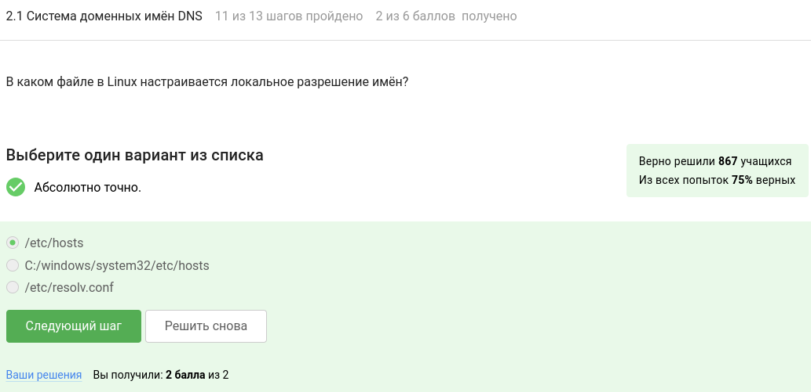
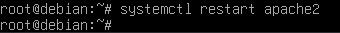

---
## Front matter
title: "Отчёт по прохождению 1 раздела внешнего курса на stepik"
subtitle: "Организация администрирования компьютерных сетей"
author: "Верниковская Екатерина Андреевна"

## Generic otions
lang: ru-RU
toc-title: "Содержание"

## Bibliography
bibliography: bib/cite.bib
csl: pandoc/csl/gost-r-7-0-5-2008-numeric.csl

## Pdf output format
toc: true # Table of contents
toc-depth: 2
lof: true # List of figures
lot: true # List of tables
fontsize: 12pt
linestretch: 1.5
papersize: a4
documentclass: scrreprt
## I18n polyglossia
polyglossia-lang:
  name: russian
  options:
	- spelling=modern
	- babelshorthands=true
polyglossia-otherlangs:
  name: english
## I18n babel
babel-lang: russian
babel-otherlangs: english
## Fonts
mainfont: PT Serif
romanfont: PT Serif
sansfont: PT Sans
monofont: PT Mono
mainfontoptions: Ligatures=TeX
romanfontoptions: Ligatures=TeX
sansfontoptions: Ligatures=TeX,Scale=MatchLowercase
monofontoptions: Scale=MatchLowercase,Scale=0.9
## Biblatex
biblatex: true
biblio-style: "gost-numeric"
biblatexoptions:
  - parentracker=true
  - backend=biber
  - hyperref=auto
  - language=auto
  - autolang=other*
  - citestyle=gost-numeric
## Pandoc-crossref LaTeX customization
figureTitle: "Рис."
tableTitle: "Таблица"
listingTitle: "Листинг"
lofTitle: "Список иллюстраций"
lotTitle: "Список таблиц"
lolTitle: "Листинги"
## Misc options
indent: true
header-includes:
  - \usepackage{indentfirst}
  - \usepackage{float} # keep figures where there are in the text
  - \floatplacement{figure}{H} # keep figures where there are in the text
---

# Цель работы

Ознакомиться с организацией администрирования компьютерных сетей. 

# Задание

Прочитать много информации и на основе полученного материала пройти тестовые задания и сделать практические работы.

# Выполнение 1 раздела внешнего курса на stepik

## Введение

Задание №1: лайфхак при работе в консоли Linux, который я знаю: в консоли Linux для того, чтобы повторить предыдущую команду, можно использовать команду "!!" (рис. [-@fig:001])

{#fig:001 width=70%}

## Сервисы сетевой инфраструктуры

Задание №2: прочитав информацию на странице "Механизмы разрешения имён", я отметила, что в Linux локальное разрешение имён настраивается в файле */etc/hosts* (рис. [-@fig:002])

{#fig:002 width=70%}

Задание №3: прочитав информацию на странице "Типы запросов к DNS", я отметила, что сушествуют типы запросов DNS такие как *нерекурсивный обратный* и *рекурсивный прямой*  (рис. [-@fig:003])

{#fig:003 width=70%}

Задание №4: прочитав информацию на странице "Режимы работы DNS сервера (на примере BIND)", я отметила, что сервер DNS в корпоративной сети может работать в таких режимах как *авторитетный первичный*, *кэширующий*, *авторитетный вторичный* и *перенаправляющий* (рис. [-@fig:004])

{#fig:004 width=70%}

Задание №5: прочитав информацию на странице "Параметры, получаемые по DHCP", я отметила, что сетевое устройство получает по DHCP все параметры из списка (рис. [-@fig:005])

{#fig:005 width=70%}

Задание №6: все перечисленные устройства поддерживают DHCP (рис. [-@fig:006])

{#fig:006 width=70%}

Задание №7 (практическая работа): Необходимо создать вирутальную машину (ВМ) локально в VirtualBox. Для этого надо скачать образ Debian 12 и импортировать в VirtualBox. Для входа в локальную систему VirtualBox используем учётные данные *username: root* и *password: P@ssw0rd*. После импорта сделать снапшот с именем Clean (рис. [-@fig:007]), (рис. [-@fig:008]), (рис. [-@fig:009]), (рис. [-@fig:010]), (рис. [-@fig:011]), (рис. [-@fig:012])

{#fig:007 width=70%}

{#fig:008 width=70%}

{#fig:009 width=70%}

{#fig:010 width=70%}

{#fig:011 width=70%}

{#fig:012 width=70%}

Далее, для выполнения практической работы сначала необходимо настроить нектороые вещи. Сначала обновляем систему  и устанавливаем панельный файловый менеджер и редактор mc, используя команды *apt -y update && apt -y dist-upgrade* и *apt -y install syslog-ng mc net-tools man*. Далее устанавливаем сервер DNS: *apt -y install bind9 bind9-host dnsutils*.

Далее после всех установок добавляем описание зон в конфигурацию /etc/bind/named.conf.default-zones. В файл конфигурации /etc/bind/named.conf.default-zones прописываем новые зоны со ссылками на новые файлы зон /etc/bind/db.server и /etc/bind/db.10 (которые создадим далее) (рис. [-@fig:013]) 

Для этого добавляем строки: 

```
zone "server.com" {
       type master;
       file "/etc/bind/db.server";
};

zone "2.0.10.in-addr.arpa" {
       type master;
       file "/etc/bind/db.10";
};
```

{#fig:013 width=70%}

Далее создаём прямую зону для домена server.com, на основе прямой локальной зоны /etc/bind/db.local. Для этого сначала копируем /etc/bind/db.local в /etc/bind/db.server командой: *cp db.local db.server*. Затем приводим файл db.server к следующему виду: (рис. [-@fig:014]) 

```
$TTL    604800
@       IN      SOA     server.com. root.server.com. (
                             2         ; Serial
                        604800         ; Refresh
                         86400         ; Retry
                       2419200         ; Expire
                        604800 )       ; Negative Cache TTL
;
@        IN     NS      server.com.
@        IN     A       10.0.2.15
local    IN     A       10.0.2.15
www      IN     CNAME   server.com.
sites    IN     CNAME   www.server.com.
```

{#fig:014 width=70%}

Далее создаём обратнуб зону для подсети 10.0.2.0/24, на основе обратной локальной зоны /etc/bind/db.127. Для этого сначала копируем  /etc/bind/db.127 в /etc/bind/db.10 командой: *cp db.127 db.10*. Затем приводим файл db.10 к следующему виду: (рис. [-@fig:015]) 

```
$TTL    604800
@       IN      SOA     server.com. root.server.com. (
                             2         ; Serial
                        604800         ; Refresh
                         86400         ; Retry
                       2419200         ; Expire
                        604800 )       ; Negative Cache TTL
;
@       IN      NS      server.com.
15      IN      PTR     server.com.
```

{#fig:015 width=70%}

Далее прописывем пересылку запросов, оторые не входят в порписанные зоны, на внешний DNS-сервер 8.8.8.8. Для этого отредактируем файл /etc/bind/named.conf.options. Параметр forwarders приводим к виду: (рис. [-@fig:016]) 

```
forwarders {
         8.8.8.8;
};
```

{#fig:016 width=70%}

Далее протестируем корректность конфигурации и перезапустим сервис bind (*systemctl restart bind9*) (рис. [-@fig:017])

{#fig:017 width=70%}

Далее выполним саму практическую работу. Для этого нужно выполнить следуюущие команды: 

1. *systemctl status bind9* (рис. [-@fig:018])
2. *host server.com localhost* (рис. [-@fig:019])
3. *host sites.server.com localhost* (рис. [-@fig:020])
4. *host 10.0.2.15 localhost* (рис. [-@fig:021])
5. *host yandex.ru localhost* (рис. [-@fig:022])
6. *host 10.0.2.15* (рис. [-@fig:023])

(рис. [-@fig:024]), (рис. [-@fig:025])

{#fig:018 width=70%}

{#fig:019 width=70%}

{#fig:020 width=70%}

{#fig:021 width=70%}

{#fig:022 width=70%}

{#fig:023 width=70%}

{#fig:024 width=70%}

{#fig:025 width=70%}

## Веб-службы

Задание №8: во время изучения темы никаких вопросов не возникло (рис. [-@fig:026])

{#fig:026 width=70%}

Задание №9: прочитав информацию на странице "Протокол HTTP", я отметила, что веб-сервер с клиентом взаимодействует по протоколу *HTTP* (рис. [-@fig:027])

{#fig:027 width=70%}

Задание №10: на скрине всё видно (рис. [-@fig:028])

{#fig:028 width=70%}

Задание №11: на скрине всё видно (рис. [-@fig:029])

{#fig:029 width=70%}

Задание №12: на скрине всё видно (рис. [-@fig:030])

{#fig:030 width=70%}

Задание №13: прочитав информацию на странице "Версии протокола HTTP", я отметила, что самая распространённая версия протокола HTTP это *HTTP/1.1 (1999 год)* (рис. [-@fig:031])

{#fig:031 width=70%}

Задание №14: на скрине всё видно (рис. [-@fig:032])

{#fig:032 width=70%}

Задание №15: прочитав информацию на странице "Подробнее о кодах состояний", я выполнила задание (рис. [-@fig:033])

{#fig:033 width=70%}

Задание №16: на скрине всё видно (рис. [-@fig:034])

{#fig:034 width=70%}

Задание №17: прочитав информацию на странице "Реализация Web-серверов", я выполнила задание (рис. [-@fig:035])

{#fig:035 width=70%}

Задание №18: прочитав информацию на странице "Интерпретаторы, скриптовые языки и программные платформы для создания веб-приложений", я выполнила задание (рис. [-@fig:036])

{#fig:036 width=70%}

Задание №19: прочитав информацию на странице "CMS-системы", я отметила, что наиболее популярная в настоящее вемя система управления содержимым контентом (CMS-система) это Wordpress (рис. [-@fig:037])

{#fig:037 width=70%}

Задание №20 (практическая работа): для выполнения этой практической работы сначала необходимо установить и настроиьь некоторые компоненты. Первым делом устанавливаем web-сервер с помощью команды *apt -y install apache2* (рис. [-@fig:038])

{#fig:038 width=70%}

Далее установим CMS Wordpress: *apt -y install wordpress* (рис. [-@fig:039])

{#fig:039 width=70%}

Далее настроим виртуальный хост web-сервера. Для этого скопируем пример настройки сайта из документации wordpress в системный каталог конфигурации web-сервера командой: *cp /usr/share/doc/wordpress/examples/apache.conf /etc/apache2/sites-available/001-example.conf* (рис. [-@fig:040])

{#fig:040 width=70%}

После отредактируем файл /etc/apache2/sites-available/001-example.conf, убрав из него лишнее и оставив в нём только настройку виртуального хоста (рис. [-@fig:041]), (рис. [-@fig:042])

```
## A defined virtual host
NameVitrualHost *:80
<VirtualHost *:80>
ServerName blog.example.com
……
</VirtualHost>
``` 

{#fig:041 width=70%}

{#fig:042 width=70%}

Далее включаем обязательные для сайта модули web-сервера для перенаправления запросов командами: *a2enmod rewrite* и *a2enmod vhost_alias* (рис. [-@fig:043])

{#fig:043 width=70%}

Теперь выключаем хост по-умолчанию и включаем виртуальный хост для сайта командами: *a2dissite 000-default* и *a2ensite 001-example* (рис. [-@fig:044])

{#fig:044 width=70%}

Перезапускаем сервис web-сервера: *systemctl restart apache2* (рис. [-@fig:045])

{#fig:045 width=70%}

Далее проверяем статус web-сервер: *systemctl status apache2* (рис. [-@fig:046])

{#fig:046 width=70%}

После создаём базу данных для сайта. Для этого сначала устанавливаем СУБД MariaDB: *apt -y install mariadb-server* (рис. [-@fig:047])

{#fig:047 width=70%}

Подключаемся к СУБД с пустым паролем: *mysql -u root -p* (рис. [-@fig:048])

{#fig:048 width=70%} 

Далее выполняем sql команды: *create database wordpress;*, *create user wordpress@localhost identified BY 'password';*, *create user wordpress@localhost identified BY 'password';*, *flush privileges;* и *quit* (рис. [-@fig:049])

{#fig:049 width=70%}

Далее создаём файл для подключения сайта к базе данных: *mcedit /etc/wordpress/config-default.php* (рис. [-@fig:050])

{#fig:050 width=70%}

Далее пишем в файл следующие строчки: 

```
<?php
define('DB_PASSWORD', 'password');
define('WP_CONTENT_DIR', '/var/lib/wordpress/wp-content');
define('FS_METHOD','direct');
``` (рис. [-@fig:051])

{#fig:051 width=70%}

В запущенной VitualBox переходим в Устройства>Сеть>Настроить сеть, кнопка Дополнительно, Проброс портов. Нажимаем +, Порт хоста - 8080, Порт гостя - 80 (рис. [-@fig:052])

{#fig:052 width=70%}

Со своего компьютера через браузер заходим на адрес *http://localhost:8080* (рис. [-@fig:053])

{#fig:053 width=70%}

Далее производим установку сайта, заполнив следующие поля:

- Название сайта (Site Title): Тестовый сайт
- Имя пользователя (Username): admin
- Password: (будет сгенерирован, его нужно сохранить)
- Your Email: (указать вашу почту)

После нажимаем кнопку *Установить WordPress* (рис. [-@fig:054])

{#fig:054 width=70%}

Далее заходим на сайт (рис. [-@fig:055])

{#fig:055 width=70%}

Следующим шагом удаляем запись «Hello World» (рис. [-@fig:056]), (рис. [-@fig:057])

{#fig:056 width=70%}

{#fig:057 width=70%}

Потом добавляем новую запись «Первая новость» в рубрику «Новости» новую запись «График работы» в рубрику «Приказы». И всё это опубликовываем (рис. [-@fig:058])

{#fig:058 width=70%}

И наконец выполняем саму практическую работу. Для этого нужно выполнить следующие комады: 

1. *systemctl status apache2* (рис. [-@fig:059])
2. *systemctl status mysql* (рис. [-@fig:060])
3. *mysql -e "SELECT table_name FROM information_schema.tables WHERE table_schema = 'wordpress';"* (рис. [-@fig:061])

{#fig:059 width=70%}

{#fig:060 width=70%}

{#fig:061 width=70%}

Также необходимо прикрепить скриншот сайта (рис. [-@fig:062]) 

{#fig:062 width=70%}

(рис. [-@fig:063]), (рис. [-@fig:064]) 

{#fig:063 width=70%}

{#fig:064 width=70%}

# Выводы

В ходе выполнения 1 раздела внешнего курса на stepik я освоила сервер Debian12 в виртуальной машине VirtualBox, выполнила практические работы *Создание сервера для практических работ*, *Практическая работа 1. DNS* и *Практическая работа 2. Веб-сервер*, а также узнала много информации о веб-серверах и DNS.

# Список литературы

1. Курс на stepik. Организация администрирования компьютерных сетей [Электронный ресурс] URL: https://stepik.org/course/83555/syllabus
