---
## Front matter
title: "Отчёт по прохождению 2 раздела внешнего курса на stepik"
subtitle: "Организация администрирования компьютерных сетей"
author: "Верниковская Екатерина Андреевна"

## Generic otions
lang: ru-RU
toc-title: "Содержание"

## Bibliography
bibliography: bib/cite.bib
csl: pandoc/csl/gost-r-7-0-5-2008-numeric.csl

## Pdf output format
toc: true # Table of contents
toc-depth: 2
lof: true # List of figures
lot: true # List of tables
fontsize: 12pt
linestretch: 1.5
papersize: a4
documentclass: scrreprt
## I18n polyglossia
polyglossia-lang:
  name: russian
  options:
	- spelling=modern
	- babelshorthands=true
polyglossia-otherlangs:
  name: english
## I18n babel
babel-lang: russian
babel-otherlangs: english
## Fonts
mainfont: PT Serif
romanfont: PT Serif
sansfont: PT Sans
monofont: PT Mono
mainfontoptions: Ligatures=TeX
romanfontoptions: Ligatures=TeX
sansfontoptions: Ligatures=TeX,Scale=MatchLowercase
monofontoptions: Scale=MatchLowercase,Scale=0.9
## Biblatex
biblatex: true
biblio-style: "gost-numeric"
biblatexoptions:
  - parentracker=true
  - backend=biber
  - hyperref=auto
  - language=auto
  - autolang=other*
  - citestyle=gost-numeric
## Pandoc-crossref LaTeX customization
figureTitle: "Рис."
tableTitle: "Таблица"
listingTitle: "Листинг"
lofTitle: "Список иллюстраций"
lotTitle: "Список таблиц"
lolTitle: "Листинги"
## Misc options
indent: true
header-includes:
  - \usepackage{indentfirst}
  - \usepackage{float} # keep figures where there are in the text
  - \floatplacement{figure}{H} # keep figures where there are in the text
---

# Цель работы

Ознакомиться с организацией администрирования компьютерных сетей. 

# Задание

Прочитать много информации и на основе полученного материала пройти тестовые задания и сделать практические работы.

# Выполнение 2 раздела внешнего курса на stepik

## Централизованная авторизация в сети

Задание №1: во время изучения темы никаких вопросов не возникло (рис. [-@fig:001])

{#fig:001 width=70%}

Задание №2: на скрине всё видно (рис. [-@fig:002])

{#fig:002 width=70%}

Задание №3: на скрине всё видно (рис. [-@fig:003])

{#fig:003 width=70%}

Задание №4: прочитав информацию на странице "Сетевой каталог LDAP", я отметила, что преимущества сетевых каталогов LDAP это *хорошая масштабируемость* и *быстрое чтение данных* (рис. [-@fig:004])

{#fig:004 width=70%}

Задание №5: прочитав информацию на странице "Сетевой каталог LDAP", я отметила, что в сетевом каталоге LDAP хранятся такие типы объеутов, как *CN (Common Name)*, *UID (User ID)* и *OU (Organizational Unit)* (рис. [-@fig:005])

{#fig:005 width=70%}

Задание №6: прочитав информацию на странице "Сетевой каталог LDAP", я отметила, что (DN, distinguished name) в каталоге LDAP означает полный путь к записи от корня (рис. [-@fig:006])

{#fig:006 width=70%}

Задание №7: на скрине всё видно (рис. [-@fig:007])

{#fig:007 width=70%}

Задание №8: прочитав информацию на странице "Логическая структура Active Directory", я отметила, что логическая структура Active Directory состоит из таких компонентов как *Домен*, *Лес* и *Дерево* (рис. [-@fig:008])

{#fig:008 width=70%}

Задание №9: прочитав информацию на странице "Групповые политики Group Policy", я ответила на вопрос, о том, что позволяют настраивать групповые политики Active Directory (рис. [-@fig:009])

{#fig:009 width=70%}

Задание №10: прочитав информацию на странице "Сквозная авторизация Kerberos", я ответила на вопрос (рис. [-@fig:010])

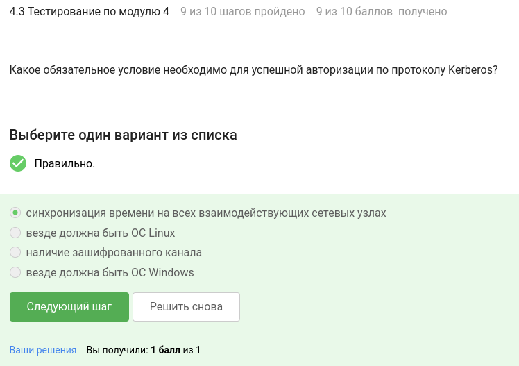{#fig:010 width=70%}

Задание №11: прочитав информацию на странице "Сквозная авторизация. Принцип работы", я ответила на вопрос (рис. [-@fig:011])

{#fig:011 width=70%}

Задание №12 (практическая работа): Необходимо настроить Windows-домен, создать орг.единицу, пользователей, групповую политику, внести в домен клиентский компьютер. Для этого надо скачать образ Windows 10 и Debian 12 (уже был импортирован в предыдущей практической работе) и импортировать в VirtualBox. Для входа в локальную систему VirtualBox используем учётные данные *username: root* и *password: P@ssw0rd*. После импорта сделать снапшот с именем Clean (рис. [-@fig:012]), (рис. [-@fig:013]), (рис. [-@fig:014])

{#fig:012 width=70%}

{#fig:013 width=70%}

{#fig:014 width=70%}

Затем настраиваем сеть, создаём сеть OrgNat-10-0-2 с настройками: подсеть 10.0.2.0/24 и отключенный dhcp. В настройках сети импортированных ВМ установить сеть NAT: OrgNat-10-0-2. Это можно сделать, выполнив скрипт: 

1. *vboxmanage natnetwork add --netname "OrgNat-10-0-2" --network 10.0.2.0/24 --enable --dhcp off --ipv6 off*
2. *vboxmanage modifyvm "Debian 12" --nic1 natnetwork --nat-network1 "OrgNat-10-0-2"*
3. *vboxmanage modifyvm "Windows 10 (Орг. администрирования)" --nic1 natnetwork --nat-network1 "OrgNat-10-0-2"*
4. *vboxmanage modifyvm "Debian 12" --nic2 none*
5. *vboxmanage modifyvm "Windows 10 (Орг. администрирования)" --nic2 none* (рис. [-@fig:015])

{#fig:015 width=70%}

Далее устанваливаем статический IP-адрес в Debian. Для этого отключаем интерфейс командой *ifdown enp0s3* и редактируем файл /etc/network/interfaces (рис. [-@fig:016]), (рис. [-@fig:017]), (рис. [-@fig:018])  

Вместо "allow-hotplug enp0s3..." прописываем:

```
auto enp0s3
iface enp0s3 inet static
 address 10.0.2.3/24
 gateway 10.0.2.1
```

{#fig:016 width=70%}

{#fig:017 width=70%}

{#fig:018 width=70%}

Далее поднимаем интерфейс и настраиваем разрешение имён командами *ifup enp0s3* и *echo "nameserver 10.0.2.1" > /etc/resolv.conf* (рис. [-@fig:019])

{#fig:019 width=70%}

Протестируем выход в интернет: *ping ya.ru* (рис. [-@fig:020])

{#fig:020 width=70%}

После устанавлваем имя сервера Debian командами *echo dc1.example.com > /etc/hostname*, *hostname dc1.example.com* и *echo "10.0.2.3 dc1 dc1.example.com" >> /etc/hosts* (рис. [-@fig:021])

{#fig:021 width=70%} 

После обновляем систему и устанавливаем необходимые пакеты (рис. [-@fig:022]), (рис. [-@fig:023])

{#fig:022 width=70%} 

{#fig:023 width=70%} 

Далее устанавливаем пакет samba4 для контроллера домена в Debian: *apt -y install samba winbind krb5-config krb5-user bind9-dnsutils bind9 isc-dhcp-server*. При установке на вопрос об области по умолчанию для kerberos просто нажимаем ENTER (рис. [-@fig:024])

{#fig:024 width=70%} 

Потом останавливаем службы samba4 командами: 

1. *systemctl stop smbd*
2. *systemctl disable smbd*
3. *systemctl stop nmbd*
4. *systemctl disable nmbd*
5. *systemctl stop winbind*
6. *systemctl disable winbind* (рис. [-@fig:025])

{#fig:025 width=70%} 

Далее переименовываем конфигурацию samba4 командой *mv /etc/samba/smb.conf /etc/samba/smb.conf.zap* и разворачиваем домен командой *samba-tool domain provision --use-rfc2307 --dns-backend=BIND9_DLZ --realm=EXAMPLE.COM --domain=EXAMPLE --adminpass=P@ssw0rd* (рис. [-@fig:026])

{#fig:026 width=70%}

Следующим шагом надо настроить DNS в Debian. Для этого сначала в файл /etc/bind/named.conf добавляем строчку *include "/var/lib/samba/bind-dns/named.conf";* (рис. [-@fig:027]), (рис. [-@fig:028])

{#fig:027 width=70%}

{#fig:028 width=70%}

Далее редактируем файл /etc/bind/named.conf.options, добавив в секцию options *tkey-gssapi-keytab "/var/lib/samba/bind-dns/dns.keytab";* (рис. [-@fig:029]), (рис. [-@fig:030])

{#fig:029 width=70%}

{#fig:030 width=70%}

Далее перезапускаем и проверяем сервис bind9 (рис. [-@fig:031])

{#fig:031 width=70%}

После настраиваем DHCP в Debian. Для этого сначала в файле /etc/default/isc-dhcp-server прописываем *INTERFACESv4="enp0s3"* (рис. [-@fig:032]), (рис. [-@fig:033])

{#fig:032 width=70%}

{#fig:033 width=70%}

После в файл /etc/dhcp/dhcpd.conf добавляем следующие настройки:

```
subnet 10.0.2.0 netmask 255.255.255.0 {
 range 10.0.2.100 10.0.2.150;
 option routers 10.0.2.1;
 option domain-name "example.com";
 option domain-name-servers 10.0.2.3;
}
```

(рис. [-@fig:034]), (рис. [-@fig:035])

{#fig:034 width=70%}

{#fig:035 width=70%}

Перезапускаем и проверяем сервис DHCP (рис. [-@fig:036])

{#fig:036 width=70%}

Запускаем контроллер домена на Debian. Для этого сначала устанавливаем разрешение имён на локальный сервер (рис. [-@fig:037])

{#fig:037 width=70%} 

После запускаем и проверяем сервис домена (рис. [-@fig:038]), (рис. [-@fig:039])

{#fig:038 width=70%} 

{#fig:039 width=70%} 

Далее настраиваем локальную сквозную авторизацию Kerberos командами *mv /etc/krb5.conf /etc/krb5.conf.zap* и *cp /var/lib/samba/private/krb5.conf /etc/krb5.conf* (рис. [-@fig:040])

{#fig:040 width=70%}

Проверим сквозную авторизацию. Для этого набираем команду *kinit Administrator* и пароль администратора P@ssw0rd (рис. [-@fig:041])

{#fig:041 width=70%}

Команда *klist* должна выводить информацию о полученном билете Kerberos (рис. [-@fig:042])

{#fig:042 width=70%}

Отредактируем DNS в Debian (рис. [-@fig:043])

{#fig:043 width=70%}

Далее добавим организации, группы и пользователей в контроллер домена Debian командами:

1. *samba-tool ou create "ou=ZTI,dc=example,dc=com"*
2. *samba-tool group add Group1 --groupou=ou=ZTI*
3. *samba-tool group add Group2 --groupou=ou=ZTI*
4. *samba-tool user create --userou=ou=ZTI student1 P@ssw0rd1*
5. *samba-tool user create --userou=ou=ZTI student2 P@ssw0rd2*
6. *samba-tool user create --userou=ou=ZTI student3 P@ssw0rd3*
7. *samba-tool group addmembers Group1 student1,student2*
8. *samba-tool group addmembers Group2 student3* (рис. [-@fig:044])

{#fig:044 width=70%}

Далее создадим групповую политику в Debian командой *samba-tool gpo create ZTI -U Administrator --password=P@ssw0rd* (рис. [-@fig:045])

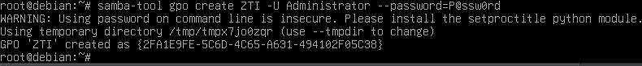{#fig:045 width=70%}

Подключаем групповую политику к ZTI по ранее созданному идентификатору (из вывода предыдущей команды): *samba-tool gpo setlink ou=ZTI,dc=example,dc=com -U Administrator --password=P@ssw0rd {идентификатор из предыдущей команды}* (рис. [-@fig:046])

{#fig:046 width=70%}

Протестируем созданную политику в списке групповых политик командами:

1. *samba-tool gpo list student1* (рис. [-@fig:047])
2. *samba-tool gpo listall* (рис. [-@fig:048])

{#fig:047 width=70%}

{#fig:048 width=70%}

Далее работаем на Windows 10. Сначала перименовываем ПК в *K29* и перезагружаем (рис. [-@fig:049])

{#fig:049 width=70%}

Проверяем получение IP-адреса (Пуск, cmd, ipconfig) по DHCP с контроллера домена (адрес должен быть 10.0.2….) (рис. [-@fig:050])

{#fig:050 width=70%}

Далее Центр управления сетями и общим доступом, Подключение по локальной сети (рис. [-@fig:051])

{#fig:051 width=70%}

Далее вводим компьютер в домен *example.com* (рис. [-@fig:052]), (рис. [-@fig:053]), (рис. [-@fig:054])

{#fig:052 width=70%}

{#fig:053 width=70%}

{#fig:054 width=70%}

После устанавливаем RSAT и редактируем GPO из Windows 10. Сначала входим в Windows 10 с учётными данными Administrator@example и паролем P@ssw0rd (рис. [-@fig:055])

{#fig:055 width=70%}

Для поиска команды установки RSAT запускаем браузер Internet Explorer, открываем сайт samba.org, забиваем в поиске RSAT и нажимаем на первую ссылку из поиска, в тексте находим указанную ниже строку установки и копируем её в командную строку:

*Выполнить, cmd (по правой кнопке мыши - от Администратора), dism /online /add-capability /CapabilityName:Rsat.GroupPolicy.Management.Tools~~~~0.0.1.0 /CapabilityName:Rsat.Dns.Tools~~~~0.0.1.0 /CapabilityName:Rsat.ActiveDirectory.DS-LDS.Tools~~~~0.0.1.0* (рис. [-@fig:056])

{#fig:056 width=70%}

После установки в меню появляются средства управления доменом, запускаем Group Policy, подключаемся к серверу dc1, находим в домене example.com организационную единицу ZTI и открываем групповую политику ZTI на редактирование (рис. [-@fig:057])

{#fig:057 width=70%}

Далее в редакторе групповой политики переходим в User Configuration, Policies, Administrative Templates, Windows Components, Internet Explorer. Там устанавливаем начальную страницу. Для этого отредактируем Disable changing home page settings, установим Enabled и http://yandex.ru (рис. [-@fig:058])

{#fig:058 width=70%} 

Также уберём надоедливый мастер настройки. Для этого отредактируем Prevent running First Run wizard, установим Enabled и Start page (рис. [-@fig:059])

{#fig:059 width=70%} 

Далее выполним саму практическую работу. Для этого сначала зайдём в учётную запись student1 (рис. [-@fig:060])

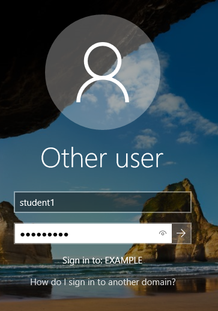{#fig:060 width=70%}

Далее нужно выполнить следующие команды:

1. *ipconfig /all* (рис. [-@fig:061])
2. *gpresult /r* (рис. [-@fig:062])

{#fig:061 width=70%}

{#fig:062 width=70%}

Также предоставляем результат запуска браузера (рис. [-@fig:063])

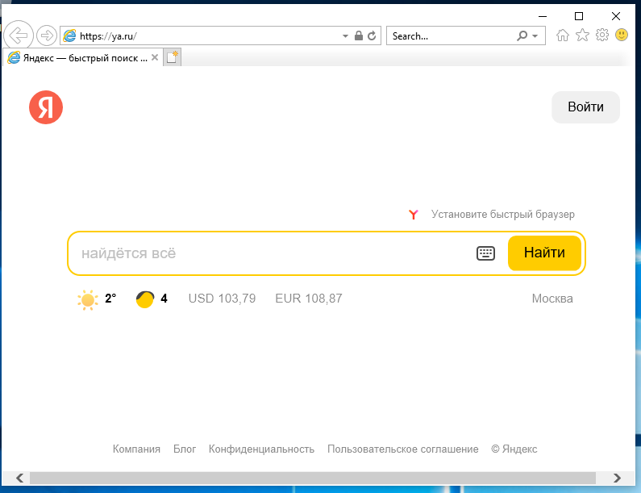{#fig:063 width=70%}

На Debian выполняем следующие команды: 

1. *samba-tool computer list* (рис. [-@fig:064])
2. *dhcp-lease-list* (рис. [-@fig:065])
3. *samba-tool gpo list student1* (рис. [-@fig:066])

(рис. [-@fig:067]), (рис. [-@fig:068])

{#fig:064 width=70%}

{#fig:065 width=70%}

{#fig:066 width=70%}

{#fig:067 width=70%}

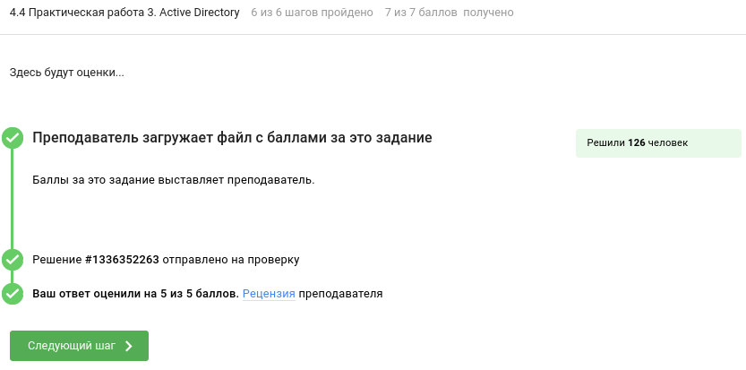{#fig:068 width=70%}

## Маршрутизаця в локальных сетях

Задание №13: прочитав информацию на странице "Виды маршрутизации", я отметила, что вид маршрутизации, при котором маршруты указываются вручную называется *статической маршрутизацией* (рис. [-@fig:069])

{#fig:069 width=70%}

Задание №14: прочитав информацию на странице "Виды маршрутизации", я отметила, что к протоколам динамической маршрутизации относятся *RIP*, *OSPF* и *EIGRP*  (рис. [-@fig:070])

{#fig:070 width=70%}

Задание №15: прочитав информацию на странице "Протоколы динамической маршрутизации", я выполнила задание (рис. [-@fig:071])

{#fig:071 width=70%}

Задание №16: прочитав информацию на странице "Протоколы динамической маршрутизации", я выполнила задание (рис. [-@fig:072])

{#fig:072 width=70%}

Задание №17: прочитав информацию на странице "Таблица маршрутизации RIP", я отметила, что в таблице маршрутизации присутствуют такие параметры, как *адрес ближайшего маршрутизатора*, *метрика маршрута* и *адрес назначения*  (рис. [-@fig:073])

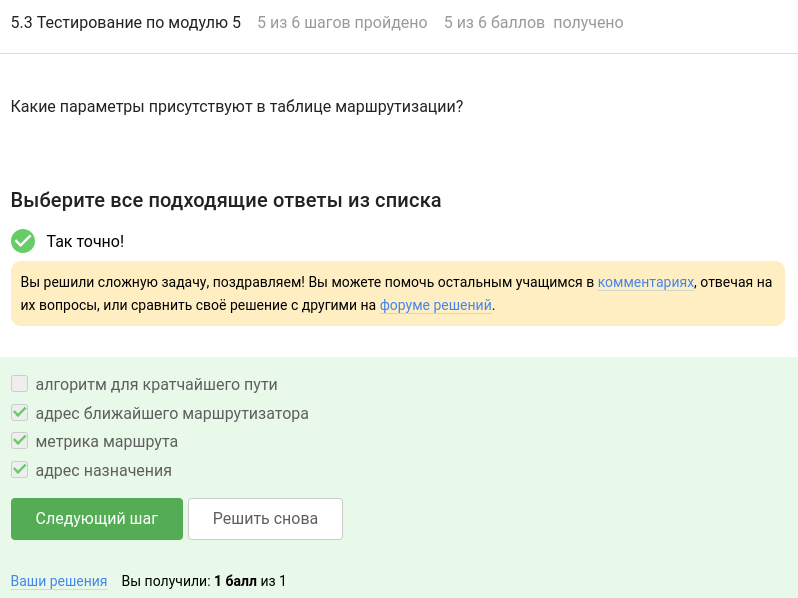{#fig:073 width=70%}

Задание №18: на скрине всё видно (рис. [-@fig:074])

{#fig:074 width=70%}

Задание №19 (практическая работа): Необходимо сбросить состояние в исходное, создать сервер "GW" (копия "Debian 12"), настроить сетевые соединения между виртуальными машинами, для этого выполняем команды: 

1. *vboxmanage snapshot "Windows 10 (Орг. администрирования)" restore Clean*
2. *vboxmanage snapshot "Debian 12" restore Clean*
3. *vboxmanage clonevm "Debian 12" --name "GW" --register*
4. *vboxmanage snapshot "GW" take Clean*
5. *vboxmanage natnetwork add --netname OrgNat-192-168-1 --network 192.168.1.0/24 --enable --dhcp off --ipv6 off*
6. *vboxmanage natnetwork add --netname OrgNat-10-0-1 --network 10.0.1.0/24 --enable --dhcp off --ipv6 off*
7. *vboxmanage natnetwork add --netname OrgNat-172-16-1 --network 172.16.1.0/24 --enable --dhcp off --ipv6 off*
8. *vboxmanage modifyvm "Debian 12" --nic1 natnetwork --nat-network1 OrgNat-192-168-1*
9. *vboxmanage modifyvm "Debian 12" --nic2 none*
10. *vboxmanage modifyvm "GW" --nic1 natnetwork --nat-network1 OrgNat-192-168-1*
11. *vboxmanage modifyvm "GW" --nic2 natnetwork --nat-network2 OrgNat-10-0-1*
12. *vboxmanage modifyvm "Windows 10 (Орг. администрирования)" --nic1 natnetwork --nat-network1 OrgNat-172-16-1*
13. *vboxmanage modifyvm "Windows 10 (Орг. администрирования)" --nic2 none* (рис. [-@fig:075])

{#fig:075 width=70%}

Работаем на виртуальной машине «GW». Посмотреть, какие у нас есть сетевые интерфейсы: *ip a*. Должно быть два интерфейса (enp0s3 и enp0s8) (рис. [-@fig:076])

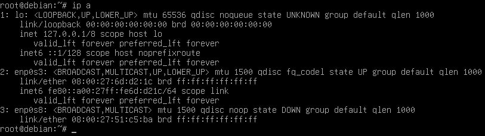{#fig:076 width=70%}

Настроим на сетевых интерфейсах IP-адреса. Для этого добавим в файл /etc/network/interfaces настройку сетевых интерфейсов enp0s3 enp0s8:

```
auto enp0s3 enp0s8
iface enp0s3 inet static
address 192.168.1.254/24
gateway 192.168.1.1
iface enp0s8 inet static
address 10.0.1.100/8
```

(рис. [-@fig:077]), (рис. [-@fig:078])

{#fig:077 width=70%}

{#fig:078 width=70%}

Далее включим сетевые интерфейсы командами *ifdown enp0s3*, *ifup enp0s3* и *ifup enp0s8* (рис. [-@fig:079])

{#fig:079 width=70%}

Проверим успешную настройку: *ip a* (рис. [-@fig:080])

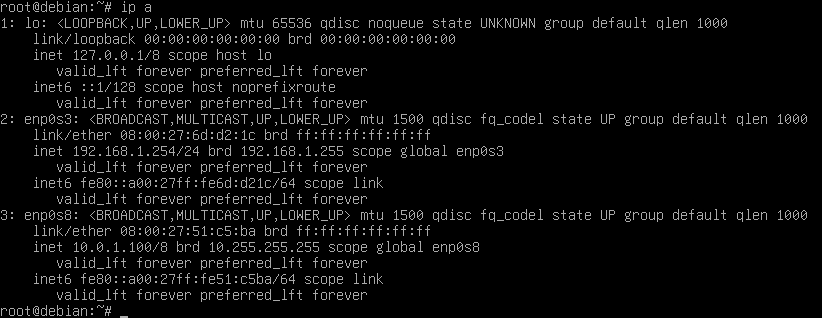{#fig:080 width=70%} 

Настроим разрешение имён DNS. В файле /etc/resolv.conf должна быть строчка *nameserver 192.168.1.1* (рис. [-@fig:081]), (рис. [-@fig:082])

{#fig:081 width=70%}

{#fig:082 width=70%}

Установим имя сервера — gw: *hostname gw* и *echo gw > /etc/hostname* (рис. [-@fig:083])

{#fig:083 width=70%} 

В файле /etc/hostname должна быть только одна строка: *gw* (рис. [-@fig:084]), (рис. [-@fig:085])

{#fig:084 width=70%}

{#fig:085 width=70%}

Далее установим демон маршрутизации frr. Для этого установим маршрутизацию frr: *apt -y install frr* (рис. [-@fig:086])

{#fig:086 width=70%}

Далее настроим демон маршрутизации. Отредактируем файл конфигурации frr /etc/frr/frr.conf и добавим конфигурацию для rip:

```
log syslog informational
hostname gw
password zebra
router rip
network 192.168.1.0/24
network 10.0.1.0/8
```

(рис. [-@fig:087]), (рис. [-@fig:088])

{#fig:087 width=70%}

{#fig:088 width=70%}

В файле /etc/frr/daemons включаем демон маршрутизации протокола RIP: *ripd=yes* (рис. [-@fig:089]), (рис. [-@fig:090])

{#fig:089 width=70%}

{#fig:090 width=70%}

Включим параметр ядра Linux для IP-forward (ретрансляция пакетов между интерфейсами). Для этого в файле /etc/sysctl.conf надо раскоментировать строчку *net.ipv4.ip_forward=1* (рис. [-@fig:091]), (рис. [-@fig:092])

{#fig:091 width=70%}

{#fig:092 width=70%}

Далее выполним команду *sysctl -p /etc/sysctl.conf* (рис. [-@fig:093])

{#fig:093 width=70%}

Перезагрузим демон (сервис) маршрутизации: *systemctl restart frr* (рис. [-@fig:094])

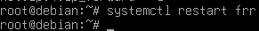{#fig:094 width=70%}

Посмотрим статус сервиса: *systemctl status frr* (рис. [-@fig:095])

{#fig:095 width=70%}

Работаем на виртуальной машине «Debian 12». Посмотреть, какие у нас есть сетевые интерфейсы: *ip a* (рис. [-@fig:096])

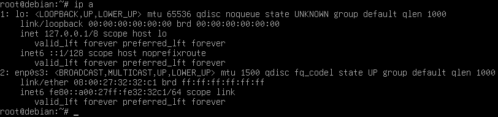{#fig:096 width=70%}

Настроить на сетевом интерфейсе IP-адрес. ля этого в файл /etc/network/interfaces добавим настройку для сетевого интерфейса enp0s3:

```
auto enp0s3
iface enp0s3 inet static
address 192.168.1.100/24
gateway 192.168.1.254
```

(рис. [-@fig:097]), (рис. [-@fig:098])

{#fig:097 width=70%}

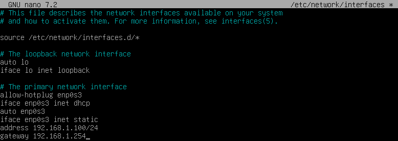{#fig:098 width=70%}

Включим сетевой интерфейс командами *ifdown enp0s3* и *ifup enp0s3* (рис. [-@fig:099])

{#fig:099 width=70%}

Проверим успешную настройку: *ip a* (рис. [-@fig:100])

{#fig:100 width=70%} 

ПРоверим пинг до шлюза и пинг до второго интерфейса шлюза командами *ping 192.168.1.254* и *ping 10.0.1.100* (рис. [-@fig:101])

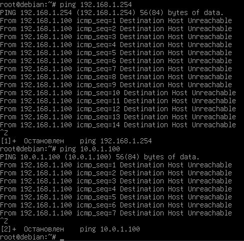{#fig:101 width=70%} 

Работаем на виртуальной машине «Windows 10 (Орг. администрирования)». Настроим сетевые интерфейсы и сетевую конфигурацию. Для этого перейдём в Параметры, Сеть и Интернет, Состояние, Настройка параметров адаптера. В свойствах адаптера Ethernet убираем протокол IPv6 (рис. [-@fig:102])

{#fig:102 width=70%} 

Переходим в Протокол IPv4, Свойства. Устанавливаем:

1. IP-адрес: 172.16.1.100
2. Маску подсети: 255.255.0.0
3. Основной шлюз: 172.16.1.254 (рис. [-@fig:103])

{#fig:103 width=70%}

Диагностика настройки интерфейса и связи до шлюза. Заходим в cmd и выполняем команды *ipconfig* и *ping 172.16.1.254* (рис. [-@fig:104]), (рис. [-@fig:105])

{#fig:104 width=70%}

{#fig:105 width=70%}

Для проверки связи с Windows машинами посредством команды ping необходимо разрешить в брандмауэрах Windows эхо-ответы. Для Windows 10 ставим галочку Enabled в двух местах: 

1. Windows System, Control Panel, Брандмауэр Защитника Windows, Дополнительные параметры, Inbound Rules, Общий доступ к файлам и принтерам (эхо-запрос - входящий трафик ICMPv4) (рис. [-@fig:106])
2. Windows System, Control Panel, Брандмауэр Защитника Windows, Дополнительные параметры, Inbound Rules, Наблюдение за виртуальной машиной (эхо-запрос - ICMPv4 - входящий трафик) (рис. [-@fig:107])

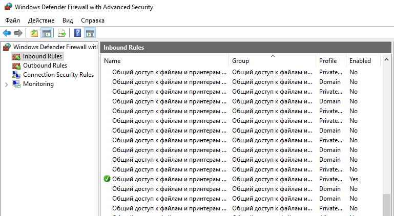{#fig:106 width=70%}

{#fig:107 width=70%}

Далее выполним саму практическую работу. Для этого выполняем следующие команды:  

1. tracert 192.168.1.100 (рис. [-@fig:108])
2. ping 192.168.1.100 (рис. [-@fig:109])

(рис. [-@fig:110])

{#fig:108 width=70%}

{#fig:109 width=70%}

{#fig:110 width=70%}

## Сервисы электронной почты

Задание №20: прочитав информацию на странице "Условная схема использования протоколов передачи данных при доставке электронного письма от одного адресата до другого", я отметила, что для отправки почты клиентом используется протокол *SMTP* (рис. [-@fig:111])

{#fig:111 width=70%}

Задание №21: прочитав информацию на странице "Условная схема использования протоколов передачи данных при доставке электронного письма от одного адресата до другого", я отметила, что для получения почты клиентом используется протокол *POP3* (рис. [-@fig:112])

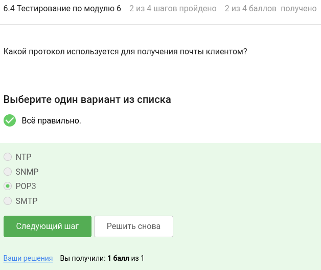{#fig:112 width=70%}

Задание №22: прочитав информацию на странице "Условная схема использования протоколов передачи данных при доставке электронного письма от одного адресата до другого", я отметила, что для пересылки почтовых сообщений между почтовыми серверами MTA используется протокол *SMTP* (рис. [-@fig:113])

{#fig:113 width=70%}

Задание №23: прочитав информацию на странице "Протокол POP3 (Post Office Protocol Version 3)" и "Протокол IMAP ( Internet Message Access Protocol)", я отметила отличительные особенности протоколов IMAP и POP3 (рис. [-@fig:114])

{#fig:114 width=70%}

Задание №24 (практическая работа): Необходимо установить и настроить серверы MTA postfix и MDA сyrus, авторизацию SASL, а также протестировать работу со своей клиентской машины через MUA Thunderbird. Сначала установим имя машины adm.org командой *hostname adm.org* (рис. [-@fig:115])

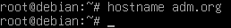{#fig:115 width=70%}

Далее в файле /etc/hostname напишем: adm.org (рис. [-@fig:116]), (рис. [-@fig:117])

{#fig:116 width=70%}

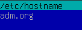{#fig:117 width=70%}

В файле /etc/hosts пропишем соответствие IP-адреса машины и сетевого имени: ip-адрес adm.org. Вот так *10.0.2.15 adm adm.org* (рис. [-@fig:118]), (рис. [-@fig:119])

{#fig:118 width=70%}

{#fig:119 width=70%}

Установим и настроим MTA postfix: *apt -y install postfix*. При установке указываем тип почтовой настройки - Интернет-сайт, а системное почтовое имя - adm.org (рис. [-@fig:120]), (рис. [-@fig:121]), (рис. [-@fig:122])

{#fig:120 width=70%}

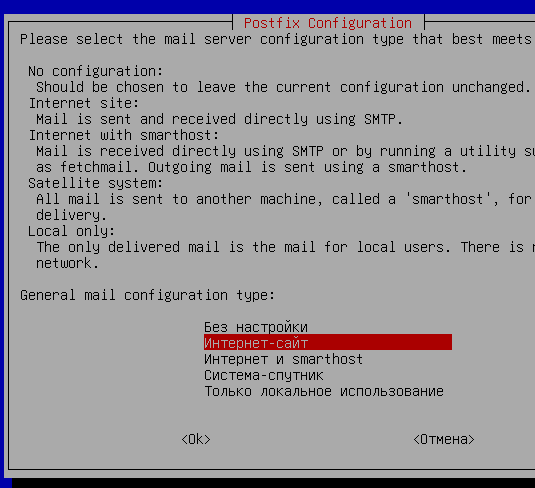{#fig:121 width=70%}

{#fig:122 width=70%}

После установки в файле конфигурации /etc/postfix/main.cf устанавливаем имя хоcта (находим параметр myhostname и меняем): *myhostname = adm.org* (рис. [-@fig:123]), (рис. [-@fig:124])

{#fig:123 width=70%}

{#fig:124 width=70%}

Проверим корректность настроек сервера: *postconf -n* (рис. [-@fig:125])

{#fig:125 width=70%}

Перезапустим сервис postfix и проверим его статус: *systemctl restart postfix* и *systemctl status postfix* (рис. [-@fig:126])

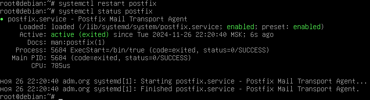{#fig:126 width=70%}

Установим и настроим MDA cyrus: *apt -y install cyrus-imapd cyrus-pop3d cyrus-admin* (рис. [-@fig:127])

{#fig:127 width=70%}

После установки в файле конфигурации Cyrus /etc/cyrus.conf закомментируем строки, начинающиеся с nntp и http, строка с lmtpunix должна быть раскомментирована (рис. [-@fig:128]), (рис. [-@fig:129])

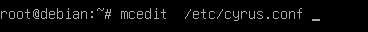{#fig:128 width=70%}

{#fig:129 width=70%}

В файл настройки IMAP /etc/imapd.conf добавляем строки для автоматического создания ящиков и папок «Отправленные» и «Удаленные» при получении письма:

```
autocreate_post: 1
autocreate_inbox_folders: Trash | Sent
autocreate_subscribe_folders: Trash | Sent
```

(рис. [-@fig:130]), (рис. [-@fig:131])

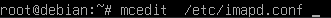{#fig:130 width=70%}

{#fig:131 width=70%}

Перезапустим сервис cyrus и проверим его статус: *systemctl restart cyrus-imapd* и *systemctl status cyrus-imapd* (рис. [-@fig:132])

{#fig:132 width=70%}

В файле конфигурации /etc/postfix/main.cf добавим параметр для связи с MDA cyrus по протоколу LMTP через сокет: *mailbox_transport = lmtp:unix:/run/cyrus/socket/lmtp* (рис. [-@fig:133]), (рис. [-@fig:134])

{#fig:133 width=70%}

{#fig:134 width=70%}

Далее разрешим модулю LMTP работать не в закрытой файловой среде, чтобы получать доступ к сокету, для этого в файле конфигурации /etc/postfix/master.cf приводим строку к виду (убираем запуск в chroot): *lmtp      unix      -        -         n        -           -         lmtp* (рис. [-@fig:135]), (рис. [-@fig:136])

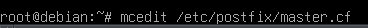{#fig:135 width=70%}

{#fig:136 width=70%}

В том же файле раскомментируем строки для передачи писем в MDA cyrus:

```
cyrus      unix        -       n       n        -        -          pipe
user=cyrus argv=/cyrus/bin/deliver -e -r #{sender} -m extension{user}
```

(рис. [-@fig:137])

{#fig:137 width=70%}

Выполним для получения доступа postfix к сокету LMTP: *usermod -aG mail postfix* (рис. [-@fig:138])

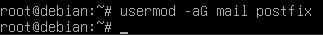{#fig:138 width=70%}

Проверим настройки и перезапустим сервис postfix: *systemctl restart postfix* и *systemctl status postfix* (рис. [-@fig:139])

{#fig:139 width=70%}

Далее установим простую систему авторизации SASL (Simple Authentication and Security Layer): *apt -y install sasl2-bin*  (рис. [-@fig:140])

{#fig:140 width=70%}

Настроим MTA postfix для работы с SASL, для этого добавим в файл конфигурации /etc/postfix/main.cf строку: *smtpd_sasl_auth_enable = yes* (рис. [-@fig:141]), (рис. [-@fig:142])

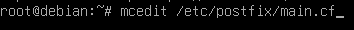{#fig:141 width=70%}

{#fig:142 width=70%}

После дадим доступ базе данных пользователей /etc/sasldb2, для этого выполним: *usermod -aG sasl postfix* (рис. [-@fig:143])

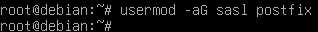{#fig:143 width=70%} 

Разрешим модулю SMTP работать не в закрытой файловой среде, чтобы получать доступ к базе данных пользователей /etc/sasldb2, для этого в файле конфигурации /etc/postfix/master.cf приведём строку к виду (убираем запуск в chroot): *smtp         inet          n         -         n        -           -          smtpd* (рис. [-@fig:144]), (рис. [-@fig:145])

{#fig:144 width=70%}

{#fig:145 width=70%}

Создадим пользователя student: *saslpasswd2 -c student@adm.org*. На запрос паролей наберём: P@ssw0rd (рис. [-@fig:146])

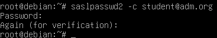{#fig:146 width=70%}

Проверим успешность создания пользователя, для этого выполним: *sasldblistusers2*. Результатом должна быть строка: student@adm.org: userPassword (рис. [-@fig:147])

{#fig:147 width=70%}

Добавим пользователя student в список postfix, в файл /etc/aliases добавим строку: *student: student* (рис. [-@fig:148]), (рис. [-@fig:149])

{#fig:148 width=70%}

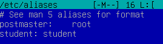{#fig:149 width=70%}

Далее выполняем: *postalias /etc/aliases* (рис. [-@fig:150])

{#fig:150 width=70%}

Перезапустим postfix: *systemctl restart postfix* (рис. [-@fig:151])

{#fig:151 width=70%}

Протестируем работу почтовых сервисов на самом сервере (рис. [-@fig:152])

{#fig:152 width=70%}

Далее необходимо открыть/пробросить порты IMAP и SMTP. Для этого на запущенной ВМ переходим в: Устройства->Сеть->Настроить сеть, кнопка Дополнительно, Проброс портов. Нажимаем +, порт хоста - 1143, порт гостя - 143. Снова нажимаем +, порт хоста - 1025, порт гостя - 25 (рис. [-@fig:153])

{#fig:153 width=70%}

Запускаем со своего компьютера почтового клиента Thunderbird и тестируем работу почтового сервера. Нажимаем *Выберите, что нужно настроить, Электронная почта* (рис. [-@fig:154])

{#fig:154 width=70%}

Дальше ввожим данные:

1. Ваше полное имя: student
2. Адрес электронной почты: student@adm.org
3. Пароль: P@ssw0rd

(рис. [-@fig:155])

{#fig:155 width=70%}

Нажимаем ссылку «Настроить вручную». Там выставляем:

1. Входящая IMAP: Имя сервера localhost, Порт 1143
2. Исходящая SMTP: Имя сервера localhost, Порт 1025
3. Защита соединения Нет
4. Метод аутентификации обычный пароль
5. Имя пользователя student

После нажимаем кнопки «Перетестировать» и «Готово» (рис. [-@fig:156])

{#fig:156 width=70%}

ПЕреходим на созданную учётную запись, нажимаем на правую кнопку мыши на учётной записи и выбираем «Подписаться..», выбираем галочками папки Sent и Trash (рис. [-@fig:157])

{#fig:157 width=70%}

При нажатии на Входящие должны получить ранее отправленное письмо с темой «Test» и содержанием «Hello» (рис. [-@fig:158])

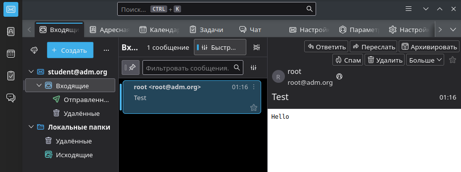{#fig:158 width=70%}

Необходимо протестировать отправку писем по SMTP. Для этого нажимаем Ответить на письмо, отправляем в свой адрес student@adm.org и получаем с сервера этот ответ (рис. [-@fig:159])

{#fig:159 width=70%} 

После этого практическая работа считается выполненной (рис. [-@fig:160]), (рис. [-@fig:161])

{#fig:160 width=70%} 

{#fig:161 width=70%} 

## Итоговая анкета

Задание №25: на скрине всё видно (рис. [-@fig:162])

{#fig:162 width=70%} 

Задание №26: на скрине всё видно (рис. [-@fig:163])

{#fig:163 width=70%} 

Задание №27: на скрине всё видно (рис. [-@fig:164])

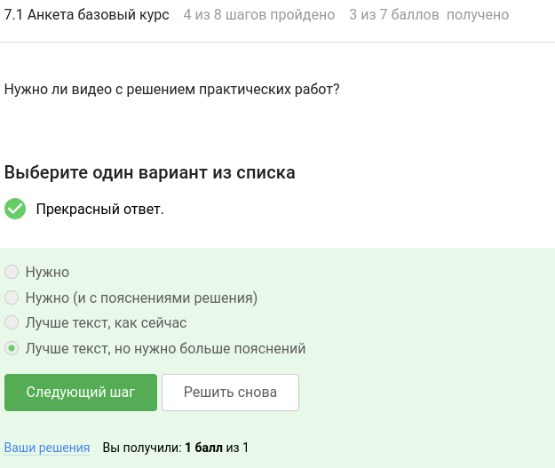{#fig:164 width=70%} 

Задание №28: на скрине всё видно (рис. [-@fig:165])

{#fig:165 width=70%} 

Задание №29: на скрине всё видно (рис. [-@fig:166])

{#fig:166 width=70%} 

Задание №30: на скрине всё видно (рис. [-@fig:167])

{#fig:167 width=70%} 

Задание №31: на скрине всё видно (рис. [-@fig:168])

{#fig:168 width=70%} 

# Выводы

В ходе выполнения 2 раздела внешнего курса на stepik я освоила сервер Active Directory на Debian 12 и Windows 10 в виртуальной машине VirtualBox, работу с почтовым сервером, а также выполнила практические работы *Практическая работа 3. Active Directory*, *Практическая работа 4. Маршрутизация в локальных сетях* и *Практическая работа 5. Почтовый сервер*. 

# Список литературы

1. Курс на stepik. Организация администрирования компьютерных сетей [Электронный ресурс] URL: https://stepik.org/course/83555/syllabus
