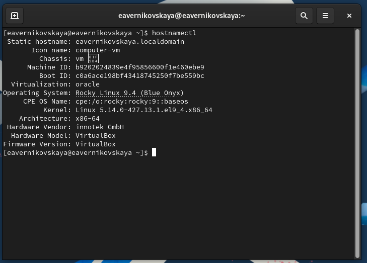

---
## Front matter
lang: ru-RU
title: Лабораторная работа №1
subtitle: Основы администрирования операционных систем
author:
  - Верниковская Е. А., НПИбд-01-23
institute:
  - Российский университет дружбы народов, Москва, Россия
date: 5 сентября 2024

## i18n babel
babel-lang: russian
babel-otherlangs: english

## Formatting pdf
toc: false
toc-title: Содержание
slide_level: 2
aspectratio: 169
section-titles: true
theme: metropolis
header-includes:
 - \metroset{progressbar=frametitle,sectionpage=progressbar,numbering=fraction}
 - '\makeatletter'
 - '\beamer@ignorenonframefalse'
 - '\makeatother'
 
## Fonts
mainfont: PT Serif
romanfont: PT Serif
sansfont: PT Sans
monofont: PT Mono
mainfontoptions: Ligatures=TeX
romanfontoptions: Ligatures=TeX
sansfontoptions: Ligatures=TeX,Scale=MatchLowercase
monofontoptions: Scale=MatchLowercase,Scale=0.9
---

# Вводная часть

## Цель работы

Целью данной работы является приобретение практических навыков установки операционной системы на виртуальную машину, настройки минимально необходимых для дальнейшей работы сервисов.

## Задание

1. Скачать Rocky Linux.
2. Создать виртуальную машину.
3. Настроить виртуальную машину.

# Выполнение лабораторной работы

## Создание виртуальной машины

Скачиваем Rocky Linux (рис. 1), (рис. 2)

## Создание виртуальной машины

{#fig:001 width=70%}

## Создание виртуальной машины

{#fig:002 width=70%}

## Создание виртуальной машины

Открываем VirtualBox и создаём новую виртуальную машину 

Указываем имя виртуальной машины, определяем тип операционной системы и указываем путь к iso-образу (рис. 3)

## Создание виртуальной машины

{#fig:003 width=70%}

## Создание виртуальной машины

Далее указываем размер оперативной памяти иртуальной машины - 2048 МБ и число процессоров - 2 (рис. 4)

## Создание виртуальной машины

{#fig:004 width=70%}

## Создание виртуальной машины

Задаём размер виртуального жёсткого диска - 40 ГБ (рис. 5)

## Создание виртуальной машины

{#fig:005 width=70%}

## Создание виртуальной машины

Далее запускаем виртуальнцю машину (рис. 6)

## Создание виртуальной машины

{#fig:006 width=50%}

## Установка операционной системы

После запуска устанавливаем английский язык интерфейса (рис. 7)

## Установка операционной системы

{#fig:007 width=70%}

## Установка операционной системы

Далее отключаем KDUMP, а место установки ОС оставляем без изменения (рис. 8), (рис. 9), (рис. 10)

## Установка операционной системы

{#fig:008 width=70%}

## Установка операционной системы

{#fig:009 width=70%}

## Установка операционной системы

{#fig:010 width=70%}

## Установка операционной системы

Включаем сетевое соединение и в качестве имени узла указываем user.localdomain, где вместо user имя нашего пользователя в соответствии с соглашением об именовании (рис. 11)

## Установка операционной системы

{#fig:011 width=70%}

## Установка операционной системы

Устанавливаем пароль для root, разрешение на ввод пароля для root при использовании SSH (рис. 12)

## Установка операционной системы

{#fig:012 width=70%}

## Установка операционной системы

Затем задаём локального пользователя с правами администратора и пароль для него (рис. 13) 

## Установка операционной системы

{#fig:013 width=70%}

## Установка операционной системы

Начинаем установку операционной системы (рис. 14), (рис. 15)

## Установка операционной системы

{#fig:014 width=70%}

## Установка операционной системы

{#fig:015 width=70%}

## После установки

После установки ОС и перезапуска ВМ входим в ОС под заданной нами при установке учётной записью (рис. 16), (рис. 17)

## После установки

{#fig:016 width=50%}

## После установки

{#fig:017 width=70%}

## После установки

Далее через терминал подключаем образ диска дополнений гостевой ОС: (рис. 18)

- заходим в пользователя root, с помощью *sudo -i*

- переходим в каталог /run/media/имя_пользователя/VBox_GAs_версия/

- запускаем VBoxLinuxAdditions.run 

## После установки

{#fig:018 width=50%}

## Установка имени пользователя и названия хоста

При установке виртуальной машины мы задали имя пользователя и имя хоста, удовлетворяющее соглашению об именовании. Поэтому нам не надо ничего исправлять. Я просто посмотрю им хоста с помощью *hostnamectl* (рис. 19)

{#fig:019 width=40%}

# Домашнее задание

## Выполнение домашнего задания

В окне терминала проанализируем последовательность загрузки системы, выполнив команду *dmesg* (рис. 20)

{#fig:020 width=70%}

## Выполнение домашнего задания

Далее посмотрим вывод этой команды с помошью *dmesg | less* (рис. 21), (рис. 22)

{#fig:021 width=70%}

## Выполнение домашнего задания

{#fig:022 width=50%}

## Выполнение домашнего задания

Далее получаем следующую информацию:

1. Версия ядра Linux (Linux version) (рис. 23)
2. Частота процессора (Detected Mhz processor) (рис. 24)
3. Модель процессора (CPU0) (рис. 25)
4. Объем доступной оперативной памяти (Memory available) (рис. 26)
5. Тип обнаруженного гипервизора (Hypervisor detected) (рис. 27)
6. Тип файловой системы корневого раздела (рис. 28)
7. Последовательность монтирования файловых систем (рис. 29])

## Выполнение домашнего задания

{#fig:023 width=70%}

## Выполнение домашнего задания

{#fig:024 width=70%}

## Выполнение домашнего задания

{#fig:025 width=70%}

## Выполнение домашнего задания

{#fig:026 width=70%}

## Выполнение домашнего задания

{#fig:027 width=70%}

## Выполнение домашнего задания

{#fig:028 width=70%}

## Выполнение домашнего задания

{#fig:029 width=70%}

# Подведение итогов

## Выводы

В ходе выполнения лабораторной работы мы приобрели практические навыки установки операционной системы на виртуальную машину, настройки минимально необходимых для дальнейшей работы сервисов.

## Список литературы

1. Лаборатораня работа №1 [Электронный ресурс] URL: https://esystem.rudn.ru/pluginfile.php/2400671/mod_resource/content/7/002-os_install-Rocky9.pdf
2. VirtualBox [Электронный ресурс] URL: https://www.virtualbox.org/wiki/Linux_Downloads
3. Rocky Linux [Электронный ресурс] URL: https://rockylinux.org/ru/download
