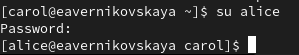

---
## Front matter
lang: ru-RU
title: Лабораторная работа №2
subtitle: Основы администрирования операционных систем
author:
  - Верниковская Е. А., НПИбд-01-23
institute:
  - Российский университет дружбы народов, Москва, Россия
date: 10 сентября 2024

## i18n babel
babel-lang: russian
babel-otherlangs: english

## Formatting pdf
toc: false
toc-title: Содержание
slide_level: 2
aspectratio: 169
section-titles: true
theme: metropolis
header-includes:
 - \metroset{progressbar=frametitle,sectionpage=progressbar,numbering=fraction}
 - '\makeatletter'
 - '\beamer@ignorenonframefalse'
 - '\makeatother'
 
## Fonts
mainfont: PT Serif
romanfont: PT Serif
sansfont: PT Sans
monofont: PT Mono
mainfontoptions: Ligatures=TeX
romanfontoptions: Ligatures=TeX
sansfontoptions: Ligatures=TeX,Scale=MatchLowercase
monofontoptions: Scale=MatchLowercase,Scale=0.9
---

# Вводная часть

## Цель работы

Получить представление о работе с учётными записями пользователей и группами пользователей в операционной системе типа Linux.

## Задание

1. Прочитать справочное описание man по нескольким командам.
2. Выполнить действия по переключению между учётными записями пользователей, по управлению учётными записями пользователей.
3. Выполнить действия по созданию пользователей и управлению их учётными записями.
4. Выполнить действия по работе с группами пользователей.

# Выполнение лабораторной работы

## Справочное описание команд

Открываем терминал и читаем справочное описание man по командам ls, whoami, id, groups, su, sudo,
passwd, vi, visudo, useradd, usermod, userdel, groupadd, groupdel (рис. 1)

{#fig:001 width=40%}

## Переключение учётных записей пользователей

Входим в систему как обычный пользователь и открываем терминал. Определяем, какую учётную запись пользователя мы используем, введя команду *whoami* (рис. 2)

{#fig:002 width=70%}

## Переключение учётных записей пользователей

Выводим на экран более подробную информацию, используя команду *id*. Пояснение: UID – id пользователя равный 1000; GID – id группы равный 1000 (рис. 3)

{#fig:003 width=70%}

## Переключение учётных записей пользователей

Используем команду *su* для переключения к учётной записи root. При запросе пароля вводим пароль пользователя root (рис. 4)

{#fig:004 width=70%}

## Переключение учётных записей пользователей

Снова выводим на экран более подробную информацию командой *id*. Пояснение: UID – id пользователя равный 0; GID – id группы равный 0 (рис. 5)

{#fig:05 width=70%}

## Переключение учётных записей пользователей

Возвращаемся к учётной записи нашего пользователя *su имя_пользователя* (рис. 6)

{#fig:006 width=70%}

## Переключение учётных записей пользователей

Смотрим в безопасном режиме файл /etc/sudoers, используя *sudo -i visudo* (рис. 7), (рис. 8)
 
{#fig:007 width=70%}

## Переключение учётных записей пользователей

{#fig:008 width=50%}

## Переключение учётных записей пользователей

Пояснение: неправильный синтаксис файла /etc/sudoers может нарушить работу системы и сделать невозможным получение повышенного уровня привилегий, и поэтому очень важно использовать для его редактирования команду visudo. Команда visudo открывает текстовый редактор обычным образом, но проверяет синтаксис файла при его сохранении. Это не даст ошибкам конфигурации возможности блокировать операции sudo, что может быть единственным способом получить привилегии root

## Переключение учётных записей пользователей

В открытом файле /etc/sudoers проверяем присутствует ли строчка "%wheel ALL=(ALL) ALL". Пояснение: ALL означает, что пользователь root может запускать команды от лица всех пользователей. Группа wheel нужна для того чтобы пользователь мог пользоваться sudo(рис. 9)

{#fig:009 width=70%}

## Переключение учётных записей пользователей

Далее создаём пользователя alice, входящего в группу wheel (рис. 10)

{#fig:010 width=70%}

## Переключение учётных записей пользователей

Проверяем что  пользователь alice добавлен в группу wheel, введя *id alice* (рис. 11)

{#fig:011 width=70%}

## Переключение учётных записей пользователей

Задаём пароль для пользователя alice, набрав *sudo -i passwd alice* (рис. 12)

{#fig:012 width=70%}

## Переключение учётных записей пользователей

Далее переключаемся на учётную запись пользователя alice (рис. 13)

{#fig:013 width=70%}

## Переключение учётных записей пользователей

Создаём пользователя bob (рис. 14)

{#fig:014 width=70%}

## Переключение учётных записей пользователей

Задаём пароль для пользователя bob (рис. 15)

{#fig:015 width=70%}

## Переключение учётных записей пользователей

Посмотрим, в какие группы входит пользователь bob (рис. 16)

{#fig:016 width=70%}

## Создание учётных записей пользователей

Переключаемся в терминале на учётную запись пользователя root (рис. 17)

{#fig:017 width=70%}

## Создание учётных записей пользователей

Далее открываем файл конфигурации /etc/login.defs для редактирования, используя vim (рис. 18), (рис. 19)

{#fig:018 width=70%}

## Создание учётных записей пользователей

{#fig:019 width=60%}

## Создание учётных записей пользователей

Находим параметр CREATE_HOME и проверяем, что он установлен  в значение yes (рис. 20)

{#fig:020 width=70%}

## Создание учётных записей пользователей

Устанавливаем параметр USERGROUPS_ENAB в значение no (рис. 21)

{#fig:021 width=70%}

## Создание учётных записей пользователей

Переходим в каталог /etc/skel (рис. 22)

{#fig:022 width=70%}

## Создание учётных записей пользователей

Создаём каталоги Pictures и Documents (рис. 23)

{#fig:023 width=70%}

## Создание учётных записей пользователей

Открываем файл .bashrc (рис. 24), (рис. 25)

{#fig:024 width=70%}

## Создание учётных записей пользователей

{#fig:025 width=50%}

## Создание учётных записей пользователей

Добавляем в него строку export EDITOR=/usr/bin/vim. Эта запись означает, что текстовый редактор vim будет установлен по умолчанию для инструментов, которые нуждаются в изменении текстовых файлов (рис. 26)

## Создание учётных записей пользователей

{#fig:026 width=50%}

## Создание учётных записей пользователей

Переключаемся в терминале на учётную запись пользователя alice (рис. 27)

{#fig:027 width=70%}

## Создание учётных записей пользователей

Используя утилиту *useradd*, создаём пользователя carol (рис. 28)

{#fig:028 width=70%}

## Создание учётных записей пользователей

Далее устанавливаем пароль для пользователя carol (рис. 29)

{#fig:029 width=70%}

## Создание учётных записей пользователей

Далее смотрим информацию о пользователе carol:

- с помощью команды *id* выясняем что пользователь carol входит в группу users
- далее переходим в домашний каталог с помощью *cd* и смотрим командой *ls -Al*, что каталоги и Pictures и Documents были созданы в домашнем каталоге пользователя carol (рис. 30)

{#fig:030 width=60%}

## Создание учётных записей пользователей

Переключаемся в терминале на учётную запись пользователя alice (рис. 31)

{#fig:031 width=70%}

## Создание учётных записей пользователей

Вводим команду *sudo cat /etc/shadow | grep caro*, чтобы увидеть запись о пароле пользователя carol в файле /etc/shadow (рис. 32)

{#fig:032 width=70%}

## Создание учётных записей пользователей

Пояснение: в этой строке 

1. Имя пользователя
2. Зашифрованный пароль — это поле содержит пароль пользователя.
3. Количество дней с 1 января 1970 года, когда пароль был изменён в последний раз
4. Количество дней до того, как пароль может быть изменён. Это поле позволяет системным администраторам использовать более строгую политику паролей, когда невозможно сразу вернуться к исходному паролю при его изменении. Обычно это поле устанавливается в значение 0 
5. Количество дней, после которых необходимо изменить пароль. Это поле содержит максимальный срок действия пароля. По умолчанию установлено 99999 (около 273 лет)

## Создание учётных записей пользователей

6. За сколько дней до истечения срока действия пароля пользователь получает предупреждение. Это поле используется для предупреждения пользователя о сроке, когда происходит принудительное изменение пароля. По умолчанию установлено значение 7
7. Через сколько дней после истечения срока действия пароля учётная запись будет отключена. После истечения срока действия пароля пользователи больше не смогут входить в систему
8. Количество дней с 1 января 1970 года, когда эта учётная запись была отключена. Администратор может установить это поле для отключения учёной записи. Обычно это лучший подход, чем удаление учёной записи, так как все связанные с ней свойства и файлы учётной записи будут сохранены
9. Зарезервированное поле, которое добавлено для будущего использования

## Создание учётных записей пользователей

Изменяем свойства пароля пользователя carol следующим образом *sudo passwd -n 30 -w 3 -x 90 carol* (рис. 33)

{#fig:033 width=70%}

## Создание учётных записей пользователей

Проверяем изменения в строке с данными о пароле пользователя carol в файле /etc/shadow (рис. 34)

{#fig:034 width=70%}

## Создание учётных записей пользователей

Проверяем, что идентификатор alice существует во всех трёх файлах (рис. 35)

{#fig:035 width=70%}

## Создание учётных записей пользователей

Проверяем, что идентификатор carol существует НЕ во всех трёх файлах (рис. 36)

{#fig:036 width=70%}

## Работа с группами

Заходим в учётную запись пользователя alice и создаём группы main и third, введя *sudo groupadd main* и *sudo groupadd third* (рис. 37)

{#fig:037 width=70%}

## Работа с группами

Создаём пользователей dan, dave и david. Также задаём им пароли (рис. 38)

{#fig:038 width=40%}

## Работа с группами

Используем usermod для добавления пользователей alice и bob в группу main, а carol, dan, dave и david — в группу third (рис. 39)

{#fig:039 width=70%}

## Работа с группами

Командой *id carol* проверяем что пользователь carol правильно добавлен в группу third. Пользователю carol должна быть назначена основная группа с идентификатором gid = 100 (users) (рис. 40)

{#fig:040 width=70%}

## Работа с группами

Определяем, участниками каких групп являются другие созданные вами пользователи (alice и bob входят в группу main. dan, dave,david в группу third) (рис. 41)

{#fig:041 width=70%}

# Подведение итогов

## Выводы

В ходе выполнения лабораторной работы мы получили представление о работе с учётными записями пользователей и группами пользователей в операционной системе типа Linux.

## Список литературы

1. Лаборатораня работа №1 [Электронный ресурс] URL: https://esystem.rudn.ru/pluginfile.php/2400677/mod_resource/content/4/003-user_management.pdf
