---
## Front matter
title: "Отчёт по лабораторной работе №2"
subtitle: "Дисциплина: Основы администрирования операционных систем"
author: "Верниковская Екатерина Андреевна"

## Generic otions
lang: ru-RU
toc-title: "Содержание"

## Bibliography
bibliography: bib/cite.bib
csl: pandoc/csl/gost-r-7-0-5-2008-numeric.csl

## Pdf output format
toc: true # Table of contents
toc-depth: 2
lof: true # List of figures
lot: true # List of tables
fontsize: 12pt
linestretch: 1.5
papersize: a4
documentclass: scrreprt
## I18n polyglossia
polyglossia-lang:
  name: russian
  options:
	- spelling=modern
	- babelshorthands=true
polyglossia-otherlangs:
  name: english
## I18n babel
babel-lang: russian
babel-otherlangs: english
## Fonts
mainfont: PT Serif
romanfont: PT Serif
sansfont: PT Sans
monofont: PT Mono
mainfontoptions: Ligatures=TeX
romanfontoptions: Ligatures=TeX
sansfontoptions: Ligatures=TeX,Scale=MatchLowercase
monofontoptions: Scale=MatchLowercase,Scale=0.9
## Biblatex
biblatex: true
biblio-style: "gost-numeric"
biblatexoptions:
  - parentracker=true
  - backend=biber
  - hyperref=auto
  - language=auto
  - autolang=other*
  - citestyle=gost-numeric
## Pandoc-crossref LaTeX customization
figureTitle: "Рис."
tableTitle: "Таблица"
listingTitle: "Листинг"
lofTitle: "Список иллюстраций"
lotTitle: "Список таблиц"
lolTitle: "Листинги"
## Misc options
indent: true
header-includes:
  - \usepackage{indentfirst}
  - \usepackage{float} # keep figures where there are in the text
  - \floatplacement{figure}{H} # keep figures where there are in the text
---

# Цель работы

Получить представление о работе с учётными записями пользователей и группами пользователей в операционной системе типа Linux.

# Задание

1. Прочитать справочное описание man по нескольким командам.
2. Выполнить действия по переключению между учётными записями пользователей, по управлению учётными записями пользователей.
3. Выполнить действия по созданию пользователей и управлению их учётными записями.
4. Выполнить действия по работе с группами пользователей.

# Выполнение лабораторной работы

## Справочное описание команд

Открываем терминал и читаем справочное описание man по командам ls, whoami, id, groups, su, sudo,
passwd, vi, visudo, useradd, usermod, userdel, groupadd, groupdel (рис. [-@fig:001]), (рис. [-@fig:002]), (рис. [-@fig:003]), (рис. [-@fig:004]), (рис. [-@fig:005]), (рис. [-@fig:006]), (рис. [-@fig:007]), (рис. [-@fig:008]), (рис. [-@fig:009]), (рис. [-@fig:010]), (рис. [-@fig:011]), (рис. [-@fig:012]), (рис. [-@fig:013]), (рис. [-@fig:014]), (рис. [-@fig:015])

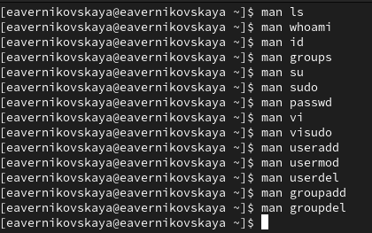{#fig:001 width=70%}

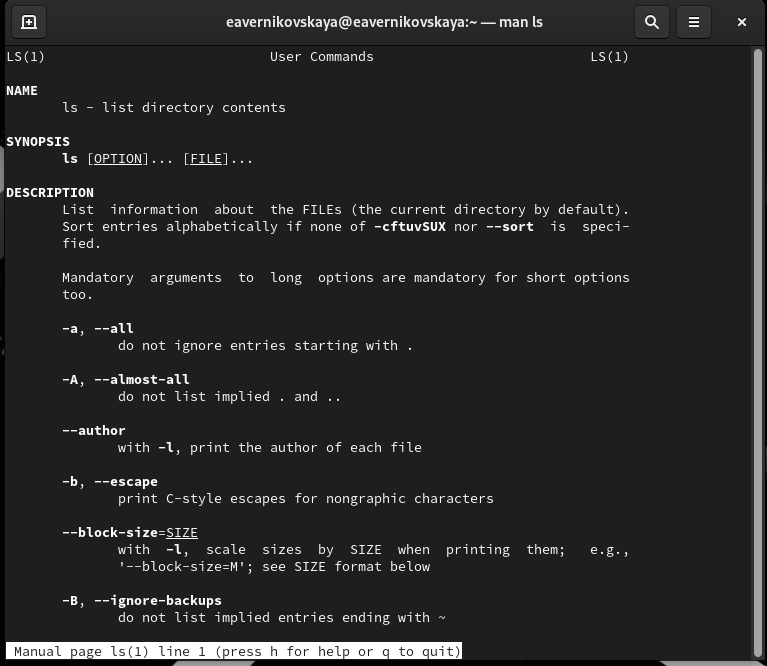{#fig:002 width=70%}

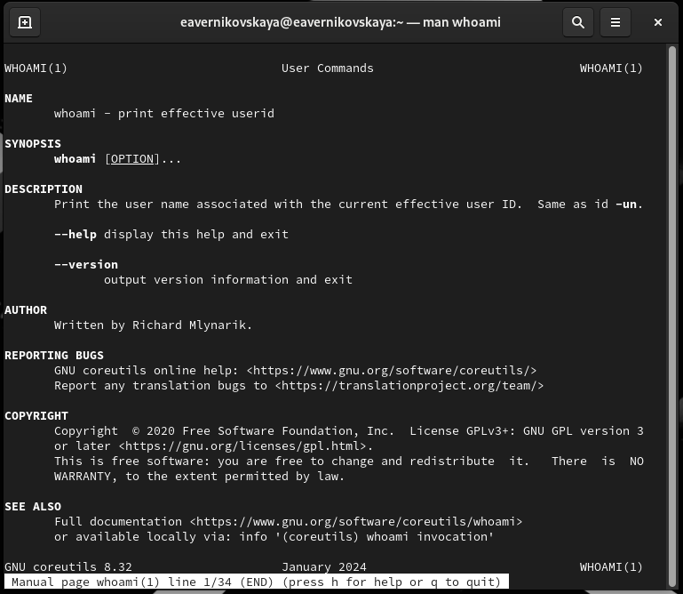{#fig:003 width=70%}

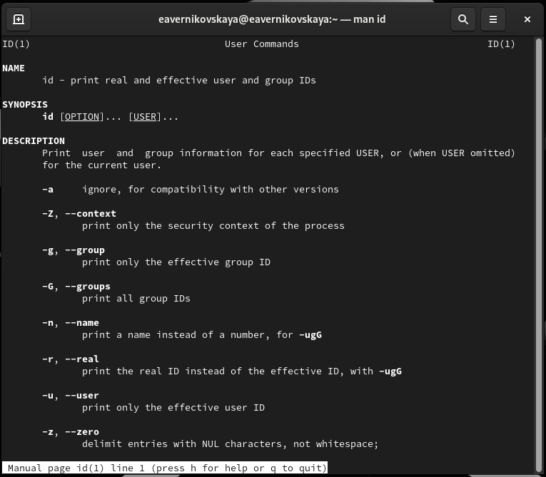{#fig:004 width=70%}

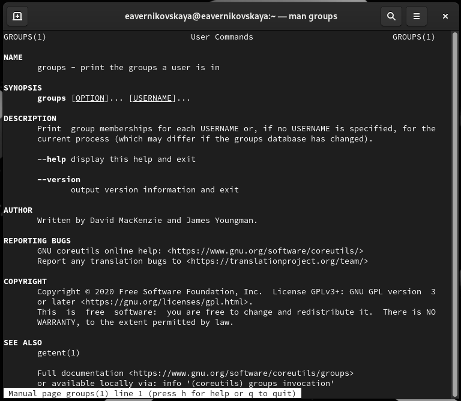{#fig:005 width=70%}

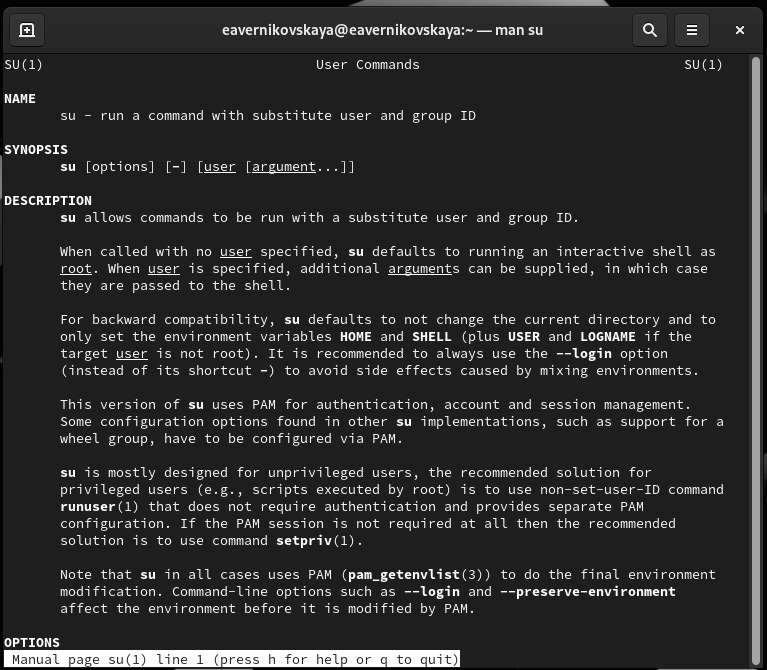{#fig:006 width=70%}

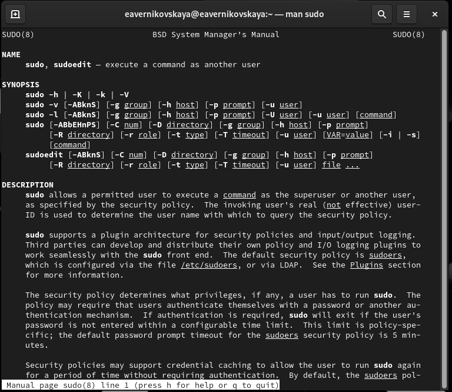{#fig:007 width=70%}

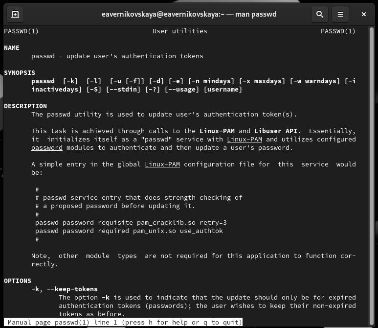{#fig:008 width=70%}

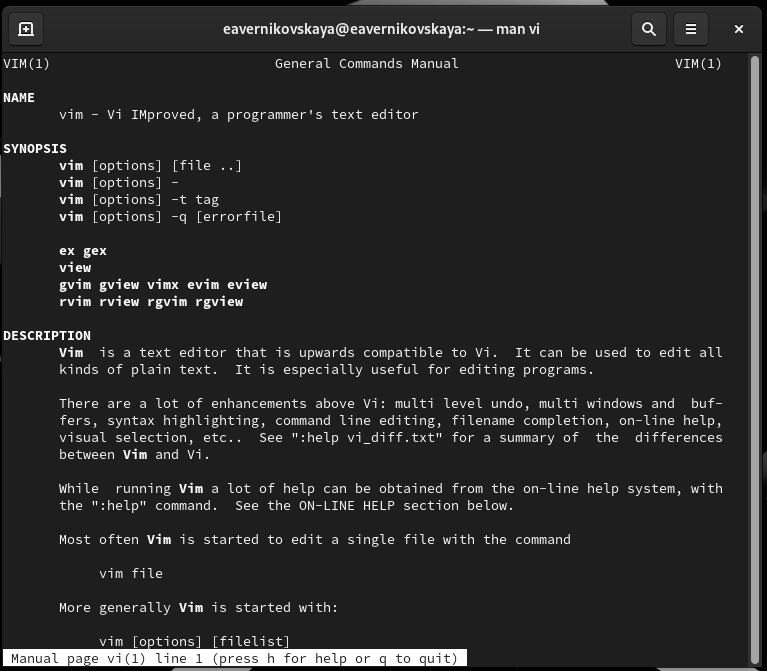{#fig:009 width=70%}

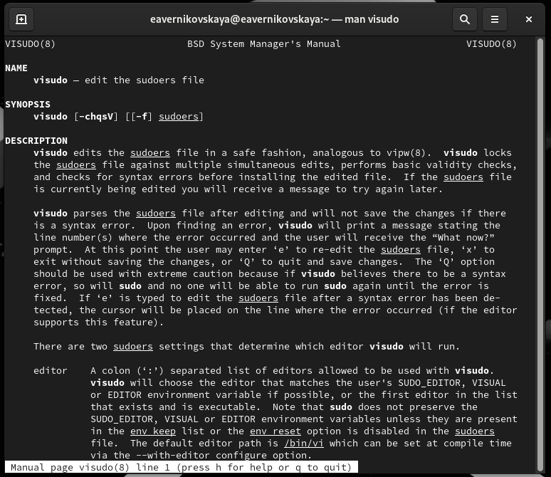{#fig:010 width=70%}

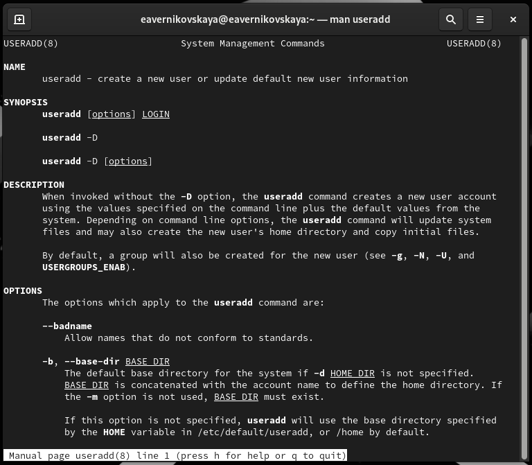{#fig:011 width=70%}

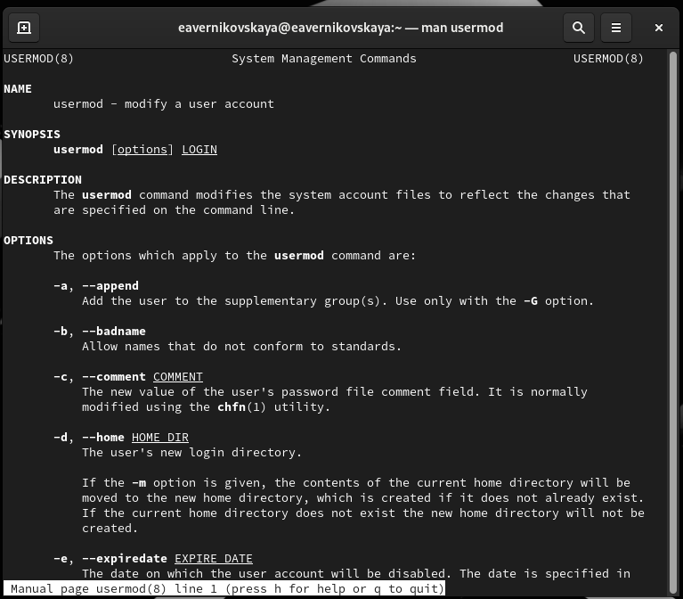{#fig:012 width=70%}

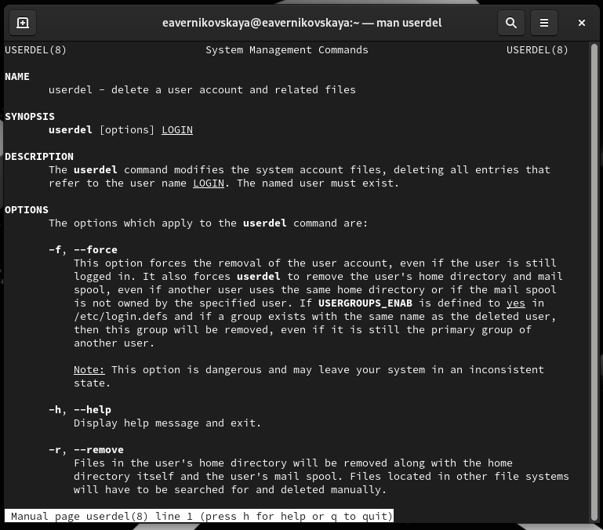{#fig:013 width=70%}

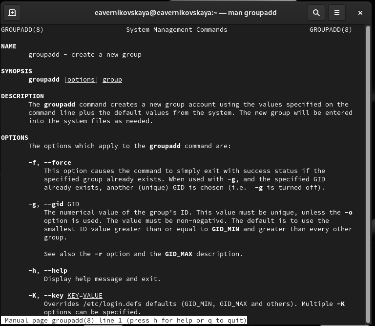{#fig:014 width=70%}

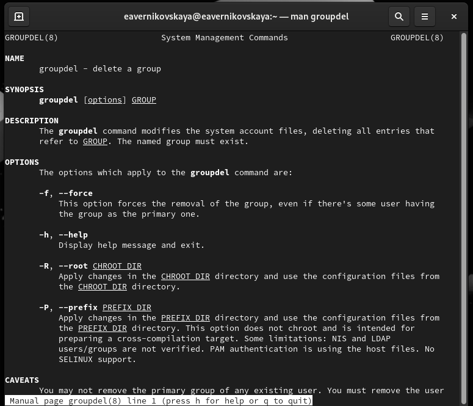{#fig:015 width=70%}

## Переключение учётных записей пользователей

Входим в систему как обычный пользователь и открываем терминал. Определяем, какую учётную запись пользователя мы используем, введя команду *whoami* (рис. [-@fig:016])

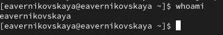{#fig:016 width=70%}

Выводим на экран более подробную информацию, используя команду *id* (рис. [-@fig:017])

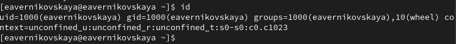{#fig:017 width=70%}

Пояснение: UID – id пользователя равный 1000; GID – id группы равный 1000

Используем команду *su* для переключения к учётной записи root. При запросе пароля вводим пароль пользователя root (рис. [-@fig:018])

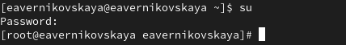{#fig:018 width=70%}

Снова выводим на экран более подробную информацию командой *id* (рис. [-@fig:019])

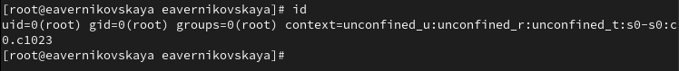{#fig:019 width=70%}

Пояснение: UID – id пользователя равный 0; GID – id группы равный 0

Возвращаемся к учётной записи нашего пользователя *su имя_пользователя* (рис. [-@fig:020])

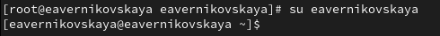{#fig:020 width=70%}

Смотрим в безопасном режиме файл /etc/sudoers, используя *sudo -i visudo* (рис. [-@fig:021]),
 (рис. [-@fig:022])
 
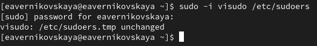{#fig:021 width=70%}

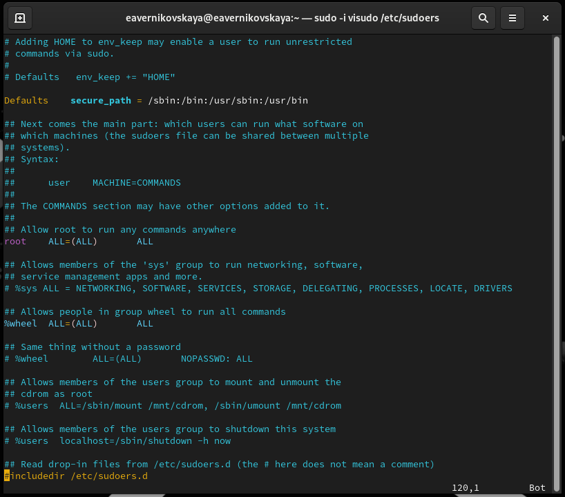{#fig:022 width=70%}

Пояснение: неправильный синтаксис файла /etc/sudoers может нарушить работу системы и сделать невозможным получение повышенного уровня привилегий, и поэтому очень важно использовать для его редактирования команду visudo. Команда visudo открывает текстовый редактор обычным образом, но проверяет синтаксис файла при его сохранении. Это не даст ошибкам конфигурации возможности блокировать операции sudo, что может быть единственным способом получить привилегии root

В открытом файле /etc/sudoers проверяем присутствует ли строчка "%wheel ALL=(ALL) ALL" (рис. [-@fig:023])

{#fig:023 width=70%}

Пояснение: ALL означает, что пользователь root может запускать команды от лица всех пользователей. Группа wheel нужна для того чтобы пользователь мог пользоваться sudo

Далее создаём пользователя alice, входящего в группу wheel (рис. [-@fig:024])

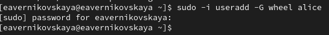{#fig:024 width=70%}

Проверяем что  пользователь alice добавлен в группу wheel, введя *id alice* (рис. [-@fig:025])

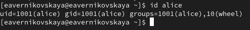{#fig:025 width=70%}

Задаём пароль для пользователя alice, набрав *sudo -i passwd alice* (рис. [-@fig:026])

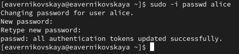{#fig:026 width=70%}

Далее переключаемся на учётную запись пользователя alice (рис. [-@fig:027])

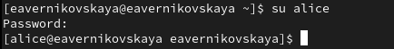{#fig:027 width=70%}

Создаём пользователя bob (рис. [-@fig:028])

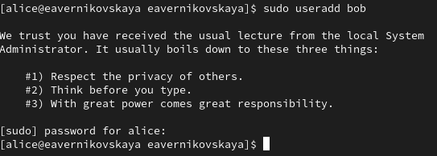{#fig:028 width=70%}

Задаём пароль для пользователя bob (рис. [-@fig:029])

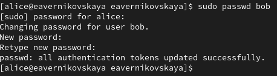{#fig:029 width=70%}

Посмотрим, в какие группы входит пользователь bob (рис. [-@fig:030])

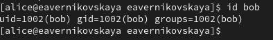{#fig:030 width=70%}

## Создание учётных записей пользователей

Переключаемся в терминале на учётную запись пользователя root (рис. [-@fig:031])

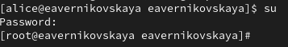{#fig:031 width=70%}

Далее открываем файл конфигурации /etc/login.defs для редактирования, используя vim (рис. [-@fig:032]), (рис. [-@fig:033])

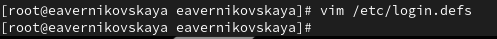{#fig:032 width=70%}

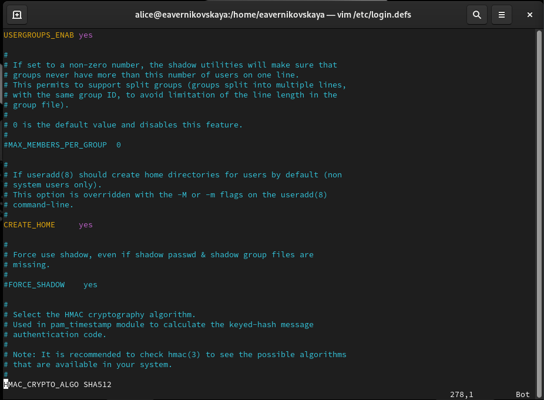{#fig:033 width=70%}

Находим параметр CREATE_HOME и проверяем, что он установлен  в значение yes (рис. [-@fig:034])

{#fig:034 width=70%}

Устанавливаем параметр USERGROUPS_ENAB в значение no (рис. [-@fig:035])

{#fig:035 width=70%}

Переходим в каталог /etc/skel (рис. [-@fig:036])

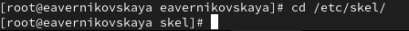{#fig:036 width=70%}

Создаём каталоги Pictures и Documents (рис. [-@fig:037])

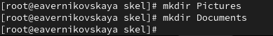{#fig:037 width=70%}

Открываем файл .bashrc (рис. [-@fig:038]), (рис. [-@fig:039])

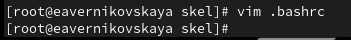{#fig:038 width=70%}

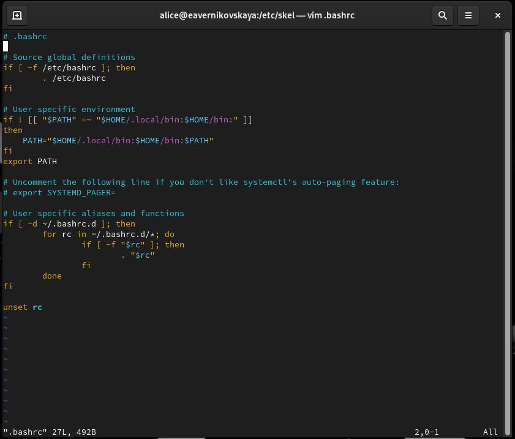{#fig:039 width=70%}

Добавляем в него строку export EDITOR=/usr/bin/vim. Эта запись означает, что текстовый редактор vim будет установлен по умолчанию для инструментов, которые нуждаются в изменении текстовых файлов (рис. [-@fig:040])

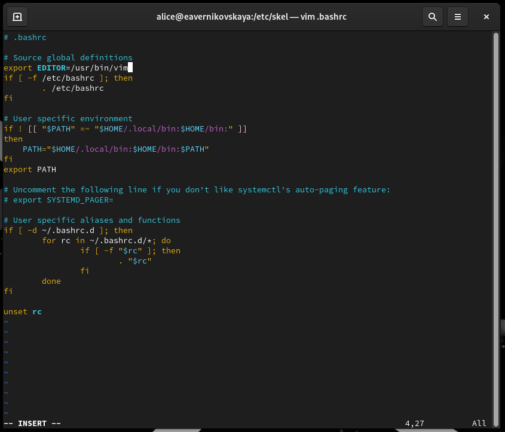{#fig:040 width=70%}

Переключаемся в терминале на учётную запись пользователя alice (рис. [-@fig:041])

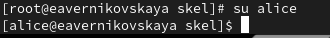{#fig:041 width=70%}

Используя утилиту *useradd*, создаём пользователя carol (рис. [-@fig:042])

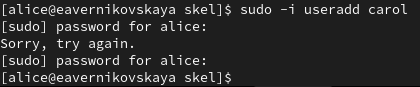{#fig:042 width=70%}

Далее устанавливаем пароль для пользователя carol (рис. [-@fig:043])

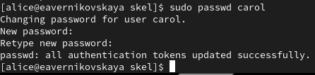{#fig:043 width=70%}

Далее смотрим информацию о пользователе carol:

- с помощью команды *id* выясняем что пользователь carol входит в группу users
- далее переходим в домашний каталог с помощью *cd* и смотрим командой *ls -Al*, что каталоги и Pictures и Documents были созданы в домашнем каталоге пользователя carol (рис. [-@fig:044])

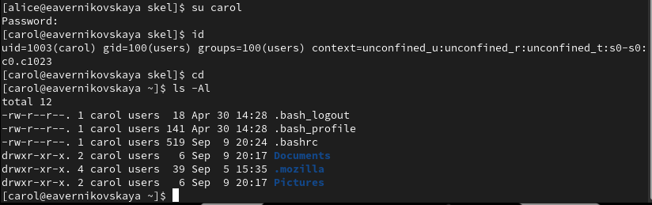{#fig:044 width=70%}

Переключаемся в терминале на учётную запись пользователя alice (рис. [-@fig:045])

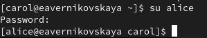{#fig:045 width=70%}

Вводим команду *sudo cat /etc/shadow | grep caro*, чтобы увидеть запись о пароле пользователя carol в файле /etc/shadow (рис. [-@fig:046])

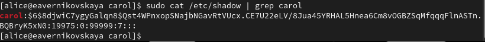{#fig:046 width=70%}

Пояснение: в этой строке 

1. Имя пользователя
2. Зашифрованный пароль — это поле содержит пароль пользователя.
3. Количество дней с 1 января 1970 года, когда пароль был изменён в последний раз
4. Количество дней до того, как пароль может быть изменён. Это поле позволяет системным администраторам использовать более строгую политику паролей, когда невозможно сразу вернуться к исходному паролю при его изменении. Обычно это поле устанавливается в значение 0 
5. Количество дней, после которых необходимо изменить пароль. Это поле содержит максимальный срок действия пароля. По умолчанию установлено 99999 (около 273 лет)
6. За сколько дней до истечения срока действия пароля пользователь получает предупреждение. Это поле используется для предупреждения пользователя о сроке, когда происходит принудительное изменение пароля. По умолчанию установлено значение 7
7. Через сколько дней после истечения срока действия пароля учётная запись будет отключена. После истечения срока действия пароля пользователи больше не смогут входить в систему
8. Количество дней с 1 января 1970 года, когда эта учётная запись была отключена. Администратор может установить это поле для отключения учёной записи. Обычно это лучший подход, чем удаление учёной записи, так как все связанные с ней свойства и файлы учётной записи будут сохранены
9. Зарезервированное поле, которое добавлено для будущего использования

Изменяем свойства пароля пользователя carol следующим образом *sudo passwd -n 30 -w 3 -x 90 carol* (рис. [-@fig:047])

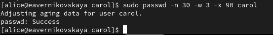{#fig:047 width=70%}

Проверяем изменения в строке с данными о пароле пользователя carol в файле /etc/shadow (рис. [-@fig:048])

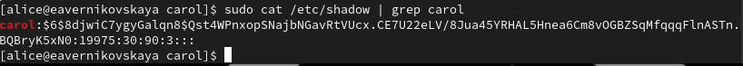{#fig:048 width=70%}

Проверяем, что идентификатор alice существует во всех трёх файлах (рис. [-@fig:049])

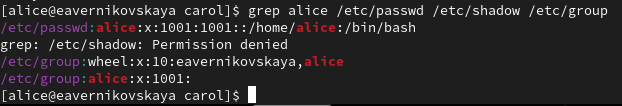{#fig:049 width=70%}

Проверяем, что идентификатор carol существует НЕ во всех трёх файлах (рис. [-@fig:050])

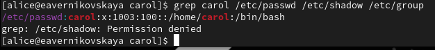{#fig:050 width=70%}

## Работа с группами

Заходим в учётную запись пользователя alice и создаём группы main и third, введя *sudo groupadd main* и *sudo groupadd third* (рис. [-@fig:051])

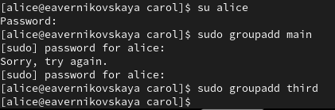{#fig:051 width=70%}

Создаём пользователей dan, dave и david. Также задаём им пароли (рис. [-@fig:052])

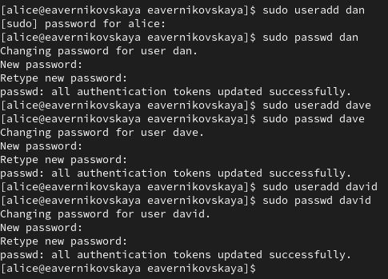{#fig:052 width=70%}

Используем usermod для добавления пользователей alice и bob в группу main, а carol, dan, dave и david — в группу third (рис. [-@fig:053])

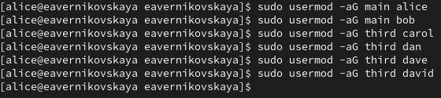{#fig:053 width=70%}

Командой *id carol* проверяем что пользователь carol правильно добавлен в группу third. Пользователю carol должна быть назначена основная группа с идентификатором gid = 100 (users) (рис. [-@fig:054])

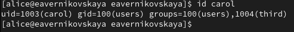{#fig:054 width=70%}

Определяем, участниками каких групп являются другие созданные вами пользователи (alice и bob входят в группу main. dan, dave,david в группу third) (рис. [-@fig:055])

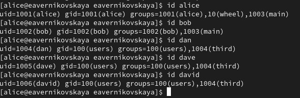{#fig:055 width=70%}

# Контрольные вопросы + ответы

1. При помощи каких команд можно получить информацию о номере (идентификаторе), назначенном пользователю Linux, о группах, в которые включён пользователь?

id

2. Какой UID имеет пользователь root? При помощи какой команды можно узнать UID пользователя? Приведите примеры.

UID=0. Тоже команда id

3. В чём состоит различие между командами su и sudo?

Основное различие между ними заключается в пароле, который им требуется: в то время как "sudo" требует пароля текущего пользователя, "su" требует ввода пароля пользователя root

4. В каком конфигурационном файле определяются параметры sudo?

/etc/sudoers

5. Какую команду следует использовать для безопасного изменения конфигурации sudo?

visudo

6. Если вы хотите предоставить пользователю доступ ко всем командам администрирования системы через sudo, членом какой группы он должен быть?

admin

7. Какие файлы/каталоги можно использовать для определения параметров, которые будут использоваться при создании учётных записей пользователей? Приведите примеры настроек.

/etc/login.defs и /etc/default/useradd 

8. Где хранится информация о первичной и дополнительных группах пользователей ОС типа Linux? В отчёте приведите пояснение таких записей для пользователя alice.

/etc/passwd

9. Какие команды вы можете использовать для изменения информации о пароле пользователя (например о сроке действия пароля)?

passwd и gpasswd

10. Какую команду следует использовать для прямого изменения информации в файле /etc/group и почему?

Для прямого изменения информации в файле /etc/group лучше всего использовать команду vigr или vipw, так как они обеспечивают безопас редактирование системных файлов 

# Выводы

В ходе выполнения лабораторной работы мы получили представление о работе с учётными записями пользователей и группами пользователей в операционной системе типа Linux.

# Список литературы

1. Лаборатораня работа №1 [Электронный ресурс] URL: https://esystem.rudn.ru/pluginfile.php/2400677/mod_resource/content/4/003-user_management.pdf
