---
## Front matter
lang: ru-RU
title: Лабораторная работа №3
subtitle: Основы администрирования операционных систем
author:
  - Верниковская Е. А., НПИбд-01-23
institute:
  - Российский университет дружбы народов, Москва, Россия
date: 16 сентября 2024

## i18n babel
babel-lang: russian
babel-otherlangs: english

## Formatting pdf
toc: false
toc-title: Содержание
slide_level: 2
aspectratio: 169
section-titles: true
theme: metropolis
header-includes:
 - \metroset{progressbar=frametitle,sectionpage=progressbar,numbering=fraction}
 - '\makeatletter'
 - '\beamer@ignorenonframefalse'
 - '\makeatother'
 
## Fonts
mainfont: PT Serif
romanfont: PT Serif
sansfont: PT Sans
monofont: PT Mono
mainfontoptions: Ligatures=TeX
romanfontoptions: Ligatures=TeX
sansfontoptions: Ligatures=TeX,Scale=MatchLowercase
monofontoptions: Scale=MatchLowercase,Scale=0.9
---

# Вводная часть

## Цель работы

Получение навыков настройки базовых и специальных прав доступа для групп пользователей в операционной системе типа Linux.

## Задание

1. Прочитать справочное описание man по нескольким командам.
2. Выполнить действия по управлению базовыми разрешениями для групп пользователей.
3. Выполнить действия по управлению специальными разрешениями для групп пользователей.
4. Выполнить действия по управлению расширенными разрешениями с использованием списков ACL для групп пользователей.

# Выполнение лабораторной работы

## Справочное описание команд

Открываем терминал и читаем справочное описание man по командам chgrp, chmod, getfacl и setfacl (рис. 1)

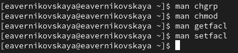{#fig:001 width=40%}

## Управление базовыми разрешениями

Открываем терминал с учётной записью root: *su -* (рис. 2)

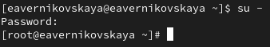{#fig:002 width=70%}

## Управление базовыми разрешениями

В корневом каталоге создаём каталоги /data/main и /data/third (рис. 3)

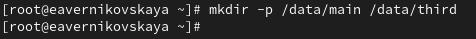{#fig:003 width=70%}

## Управление базовыми разрешениями

Смотрим, кто является владельцем этих каталогов. Владельцем каталогов является суперпользователь root (рис. 4)

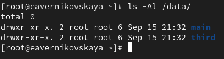{#fig:004 width=70%}

## Управление базовыми разрешениями

Далее меняем владельцев этих каталогов с root на main и third соответственно, с помощью команды *chgrp*  (рис. 5)

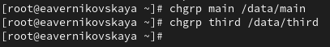{#fig:005 width=70%}

## Управление базовыми разрешениями

Проверяем, кто теперь является владельцем этих каталогов.  (рис. 6)

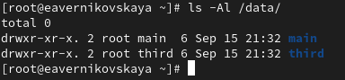{#fig:006 width=70%}

## Управление базовыми разрешениями

Установливаем разрешения, позволяющие владельцам каталогов записывать файлы в эти каталоги и запрещающие доступ к содержимому каталогов всем другим пользователям и группам (рис. 7)
 
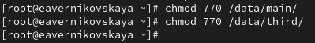{#fig:007 width=70%}

## Управление базовыми разрешениями

Далее проверяем установленные права доступа (рис. 8)

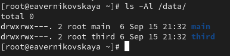{#fig:008 width=70%}

## Управление базовыми разрешениями

В другом терминале переходим под учётную запись пользователя bob: *su - bob* (рис. 9)

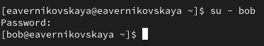{#fig:009 width=70%}

## Управление базовыми разрешениями

Под пользователем bob пробуем перейти в каталог /data/main и создать файл emptyfile в этом каталоге. Так как пользователь bob является владельцем каталога main, нам удалось перейти в
этот каталог и создать в нём новый файл (рис. 10)

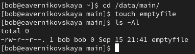{#fig:010 width=70%}

## Управление базовыми разрешениями

Под пользователем bob пробуем перейти в каталог /data/third и создать файл emptyfile в этом каталоге. Так как пользователь bob не является владельцем каталога third, нам не удалось перейти в этот каталог и создать в нём новый файл (рис. 11)

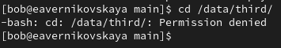{#fig:011 width=70%}

## Управление специальными разрешениями

Открываем новый терминал под пользователем alice (рис. 12)

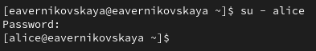{#fig:012 width=70%}

## Управление специальными разрешениями

Переходим в каталог /data/main и создаём два файла, владельцем которых является alice (рис. 13), (рис. 14)

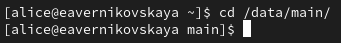{#fig:013 width=70%}

## Управление специальными разрешениями

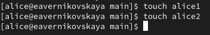{#fig:014 width=70%}

## Управление специальными разрешениями

В другом терминале переходим под учётную запись пользователя bob (пользователь bob является членом группы main, как и alice). Далее переходим в каталог /data/main  и видим там два файла, созданные пользователем alice  (рис. 15)

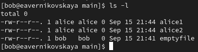{#fig:015 width=70%}

## Управление специальными разрешениями

Попробуем удалить файлы, принадлежащие пользователю alice. Файлы успешно удалены (рис. 16)

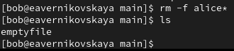{#fig:016 width=70%}

## Управление специальными разрешениями

Создаём два файла, которые принадлежат пользователю bob (рис. 17)

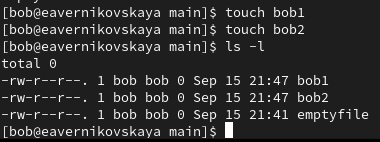{#fig:017 width=70%}

## Управление специальными разрешениями

В терминале под пользователем root устанавливаем для каталога /data/main бит идентификатора группы, а также stiky-бит для разделяемого (общего) каталога группы *chmod g+s,o+t /data/main* (рис. 18)

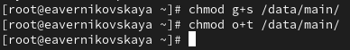{#fig:018 width=70%}

## Управление специальными разрешениями

В терминале под пользователем alice создаём в каталоге /data/main файлы alice3 и alice4. Теперь мы  видим, что два созданных нами файла принадлежат группе main, которая является группой-владельцем каталога /data/main (рис. 19)

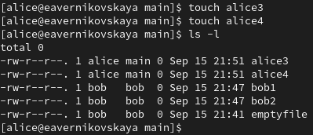{#fig:019 width=70%}

## Управление специальными разрешениями

В терминале под пользователем alice пробуем удалить файлы, принадлежащие пользователю bob. Sticky-bit предотвратит удаление этих файлов пользователем alice, поскольку этот пользователь не является владельцем этих файлов (operation not permitted)(рис. 20)

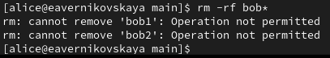{#fig:020 width=70%}

## Управление расширенными разрешениями с использованием списков ACL

Открываем терминал с учётной записью root и устанавливаем права на чтение и выполнение в каталоге /data/main для группы third и права на чтение и выполнение для группы main в каталоге /data/third, используя *setfacl -m* (рис. 21)

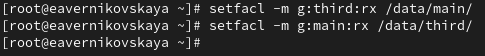{#fig:021 width=70%}

## Управление расширенными разрешениями с использованием списков ACL

Используем команду *getfacl*, чтобы убедиться в правильности установки разрешений (рис. 22),  (рис. 23)

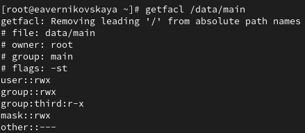{#fig:022 width=70%}

## Управление расширенными разрешениями с использованием списков ACL

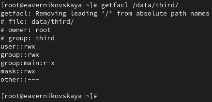{#fig:023 width=70%}

## Управление расширенными разрешениями с использованием списков ACL

Создаём новый файл с именем newfile1 в каталоге /data/main (рис. 24)

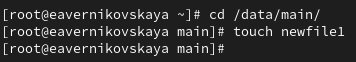{#fig:024 width=70%}

## Управление расширенными разрешениями с использованием списков ACL

Используем *getfacl /data/main/newfile1* для проверки текущих назначений полномочий. У пользователя только чтение и запись, у группы и других только чтение. Работать с этим файлом пользователи не могут, потому что мы устанавливали права на чтение и выполнение именно для каталогов, а не для созданных в нём файлов  (рис. 25)

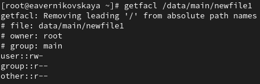{#fig:025 width=70%}

## Управление расширенными разрешениями с использованием списков ACL

Выполняем аналогичные дейтвия для каталога /data/third. Пояснения те же самые что и к прошлому пункту (рис. 26)

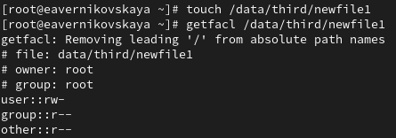{#fig:026 width=70%}

## Управление расширенными разрешениями с использованием списков ACL

Устанавливаем ACL по умолчанию для каталога /data/main, с помощью *setfacl -m d:g:third:rwx* (рис. 27)

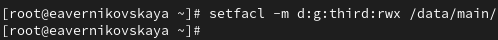{#fig:027 width=70%}

## Управление расширенными разрешениями с использованием списков ACL

Устанавливаем ACL по умолчанию для каталога /data/third (рис. 28)

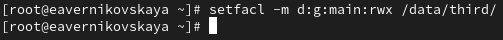{#fig:028 width=70%}

## Управление расширенными разрешениями с использованием списков ACL

Добавляем новый файл newfile2 в каталог /data/main и проверяем, что настройки ACL работают (рис. 29), (рис. 30)

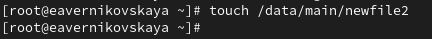{#fig:029 width=70%}

## Управление расширенными разрешениями с использованием списков ACL

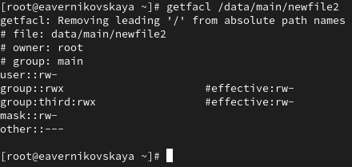{#fig:030 width=70%}

## Управление расширенными разрешениями с использованием списков ACL

Выполняем аналогичные действия для каталога /data/third (рис. 31), (рис. 32)

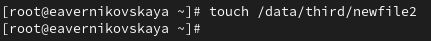{#fig:031 width=70%}

## Управление расширенными разрешениями с использованием списков ACL

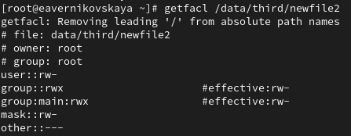{#fig:032 width=70%}

Для созданных файлов группы main возможны действия от пользователей группы third и наоборот

## Управление расширенными разрешениями с использованием списков ACL

Далее заходим в другом терминале под учётной записью члена группы third - это carol (рис. 33)

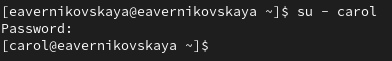{#fig:033 width=70%}

## Управление расширенными разрешениями с использованием списков ACL

Далее проверяем операции с файлами newfile1 и newfile2. Пытаемся их удалить. Система не даёт нам этого сделать, так как удаление файлов это действие с каталогом, а к каталогу main у группы third нет полномочий (рис. 34)

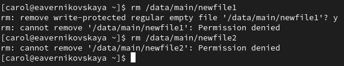{#fig:034 width=70%}

## Управление расширенными разрешениями с использованием списков ACL

Далее пытаемся осуществить запись в файлы. Система не даёт осуществить запись в newfile1, но разрешает сделать это в файле newfile2, так как ранее мы установили определённые разрешения (рис. 35)

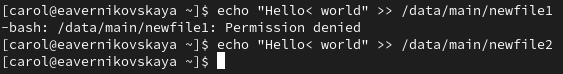{#fig:035 width=70%}

# Подведение итогов

## Выводы

В ходе выполнения лабораторной работы мы получили навыки настройки базовых и специальных прав доступа для групп пользователей в операционной системе типа Linux.

## Список литературы

1. Лаборатораня работа №3 [Электронный ресурс] URL: https://esystem.rudn.ru/pluginfile.php/2400684/mod_resource/content/4/004-permissions.pdf
