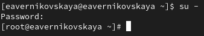

---
## Front matter
title: "Отчёт по лабораторной работе №3"
subtitle: "Дисциплина: Основы администрирования операционных систем"
author: "Верниковская Екатерина Андреевна"

## Generic otions
lang: ru-RU
toc-title: "Содержание"

## Bibliography
bibliography: bib/cite.bib
csl: pandoc/csl/gost-r-7-0-5-2008-numeric.csl

## Pdf output format
toc: true # Table of contents
toc-depth: 2
lof: true # List of figures
lot: true # List of tables
fontsize: 12pt
linestretch: 1.5
papersize: a4
documentclass: scrreprt
## I18n polyglossia
polyglossia-lang:
  name: russian
  options:
	- spelling=modern
	- babelshorthands=true
polyglossia-otherlangs:
  name: english
## I18n babel
babel-lang: russian
babel-otherlangs: english
## Fonts
mainfont: PT Serif
romanfont: PT Serif
sansfont: PT Sans
monofont: PT Mono
mainfontoptions: Ligatures=TeX
romanfontoptions: Ligatures=TeX
sansfontoptions: Ligatures=TeX,Scale=MatchLowercase
monofontoptions: Scale=MatchLowercase,Scale=0.9
## Biblatex
biblatex: true
biblio-style: "gost-numeric"
biblatexoptions:
  - parentracker=true
  - backend=biber
  - hyperref=auto
  - language=auto
  - autolang=other*
  - citestyle=gost-numeric
## Pandoc-crossref LaTeX customization
figureTitle: "Рис."
tableTitle: "Таблица"
listingTitle: "Листинг"
lofTitle: "Список иллюстраций"
lotTitle: "Список таблиц"
lolTitle: "Листинги"
## Misc options
indent: true
header-includes:
  - \usepackage{indentfirst}
  - \usepackage{float} # keep figures where there are in the text
  - \floatplacement{figure}{H} # keep figures where there are in the text
---

# Цель работы

Получение навыков настройки базовых и специальных прав доступа для групп пользователей в операционной системе типа Linux.

# Задание

1. Прочитать справочное описание man по нескольким командам.
2. Выполнить действия по управлению базовыми разрешениями для групп пользователей.
3. Выполнить действия по управлению специальными разрешениями для групп пользователей.
4. Выполнить действия по управлению расширенными разрешениями с использованием списков ACL для групп пользователей.

# Выполнение лабораторной работы

## Справочное описание команд

Открываем терминал и читаем справочное описание man по командам ls, whoami, id, groups, su, sudo,
passwd, vi, visudo, useradd, usermod, userdel, groupadd, groupdel (рис. [-@fig:001]), (рис. [-@fig:002]), (рис. [-@fig:003]), (рис. [-@fig:004]), (рис. [-@fig:005])

{#fig:001 width=70%}

{#fig:002 width=70%}

{#fig:003 width=70%}

{#fig:004 width=70%}

{#fig:005 width=70%}

## Управление базовыми разрешениями

Открываем терминал с учётной записью root: *su -* (рис. [-@fig:006])

{#fig:006 width=70%}

В корневом каталоге создаём каталоги /data/main и /data/third (рис. [-@fig:007])

{#fig:007 width=70%}

Смотрим, кто является владельцем этих каталогов. Владельцем каталогов является суперпользователь root (рис. [-@fig:008])

{#fig:008 width=70%}

Далее меняем владельцев этих каталогов с root на main и third соответственно, с помощью команды *chgrp*  (рис. [-@fig:009])

{#fig:009 width=70%}

Проверяем, кто теперь является владельцем этих каталогов.  (рис. [-@fig:010])

{#fig:010 width=70%}

Установливаем разрешения, позволяющие владельцам каталогов записывать файлы в эти каталоги и запрещающие доступ к содержимому каталогов всем другим пользователям и группам (рис. [-@fig:011])
 
{#fig:011 width=70%}

Далее проверяем установленные права доступа (рис. [-@fig:012])

{#fig:012 width=70%}

В другом терминале переходим под учётную запись пользователя bob: *su - bob* (рис. [-@fig:013])

{#fig:013 width=70%}

Под пользователем bob пробуем перейти в каталог /data/main и создать файл emptyfile в этом каталоге. Так как пользователь bob является владельцем каталога main, нам удалось перейти в
этот каталог и создать в нём новый файл (рис. [-@fig:014])

{#fig:014 width=70%}

Под пользователем bob пробуем перейти в каталог /data/third и создать файл emptyfile в этом каталоге. Так как пользователь bob не является владельцем каталога third, нам не удалось перейти в этот каталог и создать в нём новый файл (рис. [-@fig:015])

{#fig:015 width=70%}

## Управление специальными разрешениями

Открываем новый терминал под пользователем alice (рис. [-@fig:016])

{#fig:016 width=70%}

Переходим в каталог /data/main и создаём два файла, владельцем которых является alice (рис. [-@fig:017]), (рис. [-@fig:018])

{#fig:017 width=70%}

{#fig:018 width=70%}

В другом терминале переходим под учётную запись пользователя bob (пользователь bob является членом группы main, как и alice). Далее переходим в каталог /data/main  и видим там два файла, созданные пользователем alice  (рис. [-@fig:019])

{#fig:019 width=70%}

Попробуем удалить файлы, принадлежащие пользователю alice. Файлы успешно удалены (рис. [-@fig:020])

{#fig:020 width=70%}

Создаём два файла, которые принадлежат пользователю bob (рис. [-@fig:021])

{#fig:021 width=70%}

В терминале под пользователем root устанавливаем для каталога /data/main бит идентификатора группы, а также stiky-бит для разделяемого (общего) каталога группы *chmod g+s,o+t /data/main* (рис. [-@fig:022])

{#fig:022 width=70%}

В терминале под пользователем alice создаём в каталоге /data/main файлы alice3 и alice4. Теперь мы  видим, что два созданных нами файла принадлежат группе main, которая является группой-владельцем каталога /data/main (рис. [-@fig:023])

{#fig:023 width=70%}

В терминале под пользователем alice пробуем удалить файлы, принадлежащие пользователю bob. Sticky-bit предотвратит удаление этих файлов пользователем alice, поскольку этот пользователь не является владельцем этих файлов (operation not permitted)(рис. [-@fig:024])

{#fig:024 width=70%}

## Управление расширенными разрешениями с использованием списков ACL

Открываем терминал с учётной записью root и устанавливаем права на чтение и выполнение в каталоге /data/main для группы third и права на чтение и выполнение для группы main в каталоге /data/third, используя *setfacl -m* (рис. [-@fig:025])

{#fig:025 width=70%}

Используем команду *getfacl*, чтобы убедиться в правильности установки разрешений (рис. [-@fig:026]),  (рис. [-@fig:027])

{#fig:026 width=70%}

{#fig:027 width=70%}

Создаём новый файл с именем newfile1 в каталоге /data/main (рис. [-@fig:028])

{#fig:028 width=70%}

Используем *getfacl /data/main/newfile1* для проверки текущих назначений полномочий. У пользователя только чтение и запись, у группы и других только чтение. Работать с этим файлом пользователи не могут, потому что мы устанавливали права на чтение и выполнение именно для каталогов, а не для созданных в нём файлов  (рис. [-@fig:029])

{#fig:029 width=70%}

Выполняем аналогичные дейтвия для каталога /data/third. Пояснения те же самые что и к прошлому пункту (рис. [-@fig:030])

{#fig:030 width=70%}

Устанавливаем ACL по умолчанию для каталога /data/main, с помощью *setfacl -m d:g:third:rwx* (рис. [-@fig:031])

{#fig:031 width=70%}

Устанавливаем ACL по умолчанию для каталога /data/third (рис. [-@fig:032])

{#fig:032 width=70%}

Добавляем новый файл newfile2 в каталог /data/main и проверяем, что настройки ACL работают (рис. [-@fig:033]), (рис. [-@fig:034])

{#fig:033 width=70%}

{#fig:034 width=70%}

Выполняем аналогичные действия для каталога /data/third (рис. [-@fig:035]), (рис. [-@fig:036])

{#fig:035 width=70%}

{#fig:036 width=70%}

Для созданных файлов группы main возможны действия от пользователей группы third и наоборот

Далее заходим в другом терминале под учётной записью члена группы third - это carol (рис. [-@fig:037])

{#fig:037 width=70%}

Далее проверяем операции с файлами newfile1 и newfile2. Пытаемся их удалить. Система не даёт нам этого сделать, так как удаление файлов это действие с каталогом, а к каталогу main у группы third нет полномочий (рис. [-@fig:038])

{#fig:038 width=70%}

Далее пытаемся осуществить запись в файлы. Система не даёт осуществить запись в newfile1, но разрешает сделать это в файле newfile2, так как ранее мы установили определённые разрешения (рис. [-@fig:039])

{#fig:039 width=70%}

# Контрольные вопросы + ответы

1. Как следует использовать команду chown, чтобы установить владельца группы для файла? Приведите пример.

chown bob:main /data/third/newfile

2. С помощью какой команды можно найти все файлы, принадлежащие конкретному пользователю? Приведите пример.

find ~ -user bob -print.

3. Как применить разрешения на чтение, запись и выполнение для всех файлов в каталоге /data для пользователей и владельцев групп, не устанавливая никаких прав для других? Приведите пример.

chmod 770 /data (скриншот есть в лабораторной работе).

4. Какая команда позволяет добавить разрешение на выполнение для файла, который необходимо сделать исполняемым?

chmod +x file.

5. Какая команда позволяет убедиться, что групповые разрешения для всех новых файлов, создаваемых в каталоге, будут присвоены владельцу группы этого каталога? Приведите пример.

getfacl “имя каталога” (скриншот есть в лабораторной работе).

6. Необходимо, чтобы пользователи могли удалять только те файлы, владельцами которых они являются, или которые находятся в каталоге, владельцами которого они являются. С помощью какой команды можно это сделать? Приведите пример.

chmod g+s,o+t /data/main (скриншот есть в лабораторной работе).

7. Какая команда добавляет ACL, который предоставляет членам группы права доступа на чтение для всех существующих файлов в текущем каталоге?

setfacl -m g:group:r <file/dir> (скриншот есть в лабораторной работе).

8. Что нужно сделать для гарантии того, что члены группы получат разрешения на чтение для всех файлов в текущем каталоге и во всех его подкаталогах, а также для всех файлов, которые будут созданы в этом каталоге в будущем? Приведите пример.

setfacl -dm g:group:r /dir.

9. Какое значение umask нужно установить, чтобы «другие» пользователи не получали какие-либо разрешения на новые файлы? Приведите пример.

007

10. Какая команда гарантирует, что никто не сможет удалить файл myfile случайно?

sudo chattr +i myfile.

# Выводы

В ходе выполнения лабораторной работы мы получили навыки настройки базовых и специальных прав доступа для групп пользователей в операционной системе типа Linux.

# Список литературы

1. Лаборатораня работа №3 [Электронный ресурс] URL: https://esystem.rudn.ru/pluginfile.php/2400684/mod_resource/content/4/004-permissions.pdf
