---
## Front matter
lang: ru-RU
title: Лабораторная работа №4
subtitle: Основы администрирования операционных систем
author:
  - Верниковская Е. А., НПИбд-01-23
institute:
  - Российский университет дружбы народов, Москва, Россия
date: 21 сентября 2024

## i18n babel
babel-lang: russian
babel-otherlangs: english

## Formatting pdf
toc: false
toc-title: Содержание
slide_level: 2
aspectratio: 169
section-titles: true
theme: metropolis
header-includes:
 - \metroset{progressbar=frametitle,sectionpage=progressbar,numbering=fraction}
 - '\makeatletter'
 - '\beamer@ignorenonframefalse'
 - '\makeatother'
 
## Fonts
mainfont: PT Serif
romanfont: PT Serif
sansfont: PT Sans
monofont: PT Mono
mainfontoptions: Ligatures=TeX
romanfontoptions: Ligatures=TeX
sansfontoptions: Ligatures=TeX,Scale=MatchLowercase
monofontoptions: Scale=MatchLowercase,Scale=0.9
---

# Вводная часть

## Цель работы

Получить навыки работы с репозиториями и менеджерами пакетов.ы

## Задание

1. Изучить, как и в каких файлах подключаются репозитории для установки программного обеспечения; изучить основные возможности (поиск, установка, обновление, удаление пакета, работа с историей действий) команды dnf.
2. Изучить и повторить процесс установки/удаления определённого пакета с использованием возможностей dnf.
3. Изучить и повторить процесс установки/удаления определённого пакета с использованием возможностей rpm.

# Выполнение лабораторной работы

##  Работа с репозиториями

В консоли переходим в режим работы суперпользователя, используя *su -* (рис. 1)

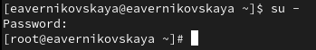{#fig:001 width=70%}

##  Работа с репозиториями

Переходим в каталог /etc/yum.repos.d и смотрим содержание каталога (рис. 2)

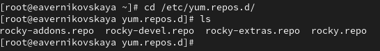{#fig:002 width=70%}

##  Работа с репозиториями

Далее изучаем содержание файлов в этом каталоге, введя *cat название_репозитория.repo*  (рис. 3), (рис. 4), (рис. 5), (рис. 6)

##  Работа с репозиториями

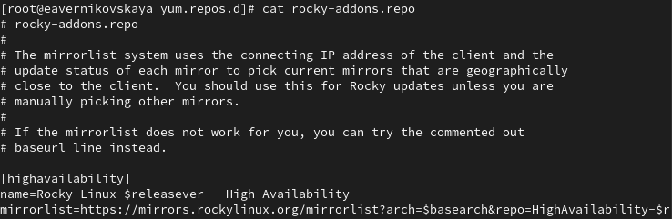{#fig:003 width=70%}

##  Работа с репозиториями

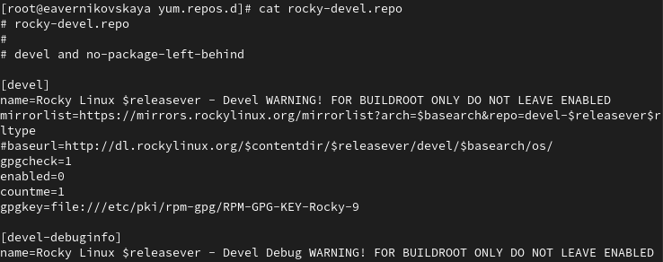{#fig:004 width=70%}

##  Работа с репозиториями

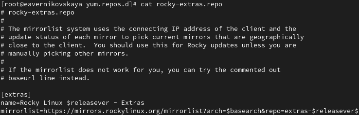{#fig:005 width=70%}

##  Работа с репозиториями

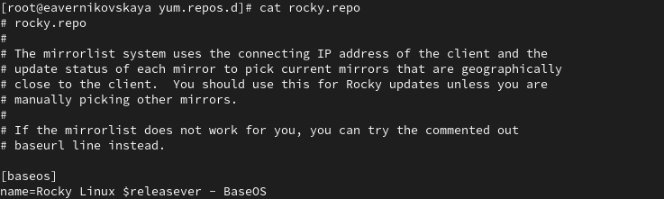{#fig:006 width=70%}

##  Работа с репозиториями

Выводим на экран список репозиториев: *dnf repolist*. Слева - id репозиториев, а справа - их названия (рис. 7)

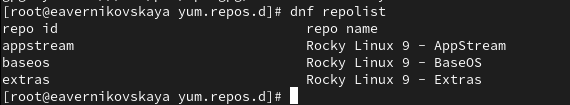{#fig:007 width=70%}

##  Работа с репозиториями

Выодим на экран список пакетов, в названии или описании которых есть слово user: dnf search user (рис. 8)

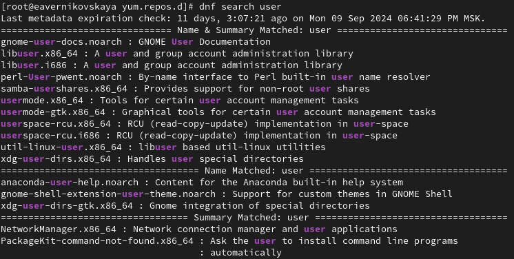{#fig:008 width=70%}

##  Работа с репозиториями

Далее устанавливаем nmap, предварительно изучив информацию по имеющимся пакетам: *dnf search nmap*
*dnf info nmap* (рис. 9), (рис. 10)

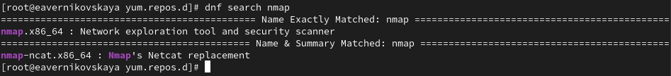{#fig:009 width=70%}

##  Работа с репозиториями

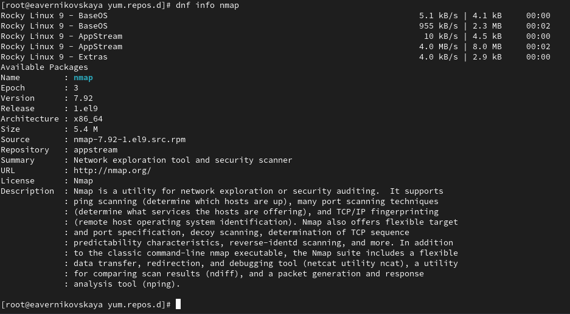{#fig:010 width=70%}

##  Работа с репозиториями

Устанавливаем nmap: *dnf install nmap* и dnf install nmap\*. Первая команда устанавливает устанавливает только пакет с именем "nmap", а вторая устанавливает все пакеты, чьи имена начинаются с "nmap" (рис. 11), (рис. 12)

##  Работа с репозиториями

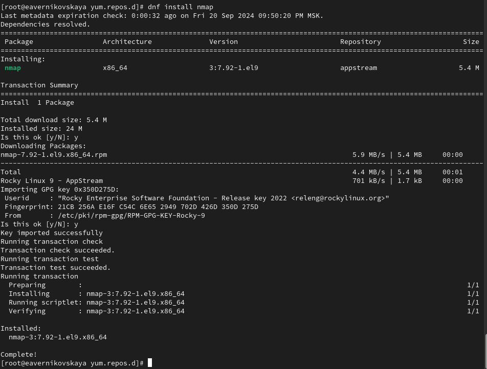{#fig:011 width=60%}

##  Работа с репозиториями

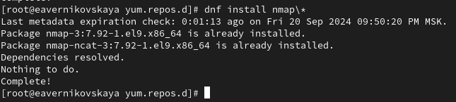{#fig:012 width=70%}

##  Работа с репозиториями

Далее удаляем nmap (рис. 13), (рис. 14)

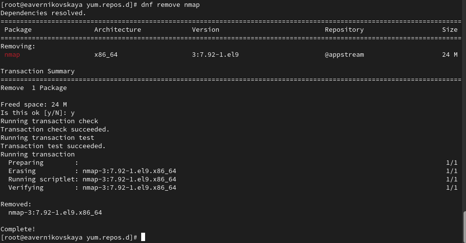{#fig:013 width=70%}

##  Работа с репозиториями

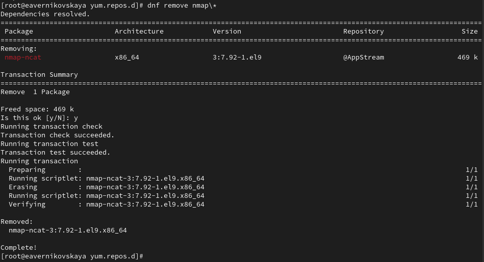{#fig:014 width=70%}

##  Работа с репозиториями

Далее получаем список имеющихся групп пакетов: *dnf groups list* и *LANG=C dnf groups list*. Вторая команда переводит вывод команды на английский язык независимо от установленного языка системы (рис. 15), (рис. 16)

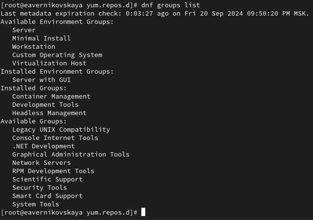{#fig:015 width=50%}

##  Работа с репозиториями

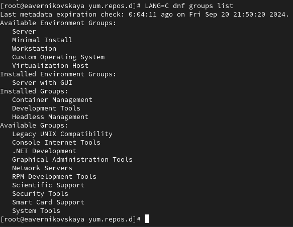{#fig:016 width=50%}

##  Работа с репозиториями

Далее выводим информацио о группе пакетов RPM Development Tools: *dnf groups info "RPM Development Tools"* (рис. 17)

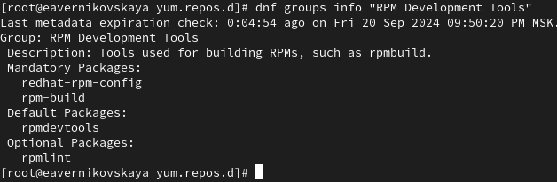{#fig:017 width=70%}

##  Работа с репозиториями

Устанавливаем эту группу пакетов: *dnf groupinstall "RPM Development Tools"* (рис. 18)

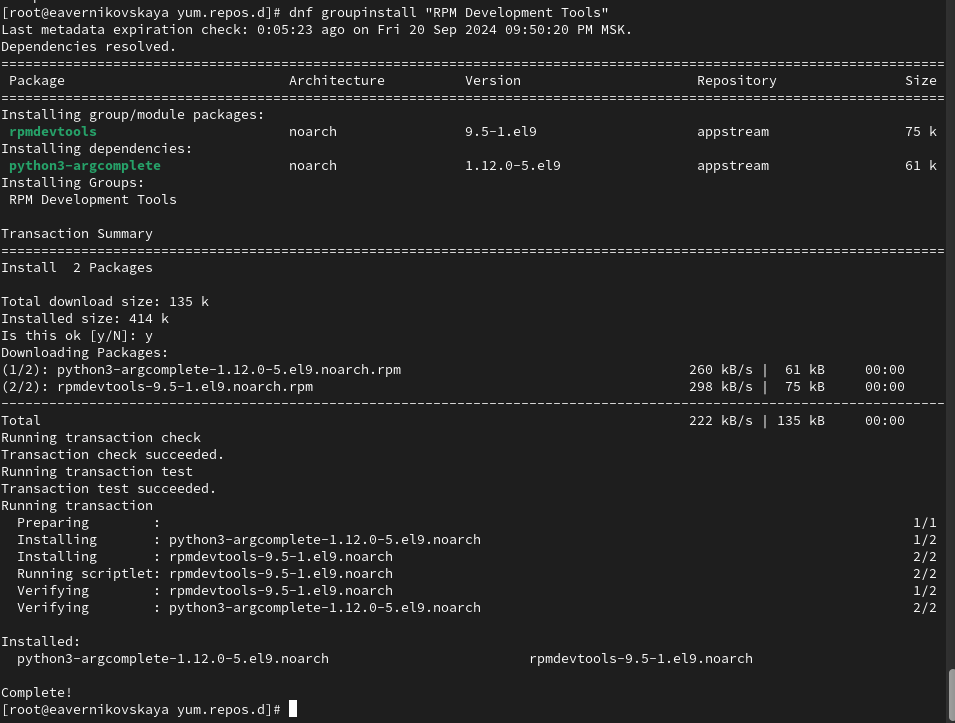{#fig:018 width=50%}

##  Работа с репозиториями

Далее удаляем RPM Development Tools с помощью *dnf groupremove "RPM Development Tools"* (рис. 19)

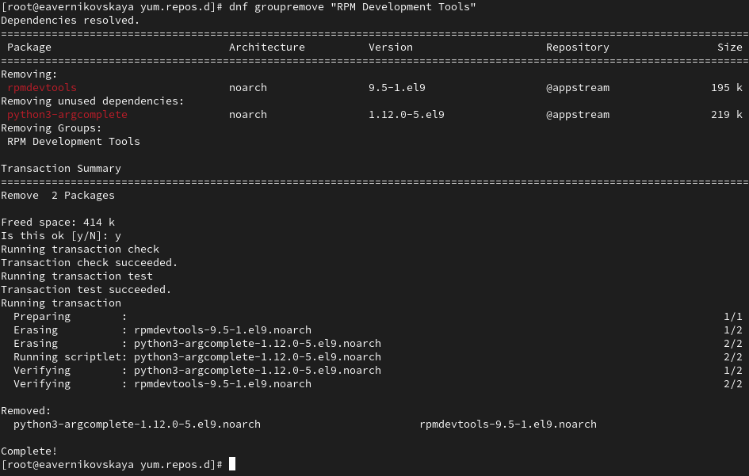{#fig:019 width=50%}

##  Работа с репозиториями

Смотрим историю использования команды dnf: *dnf history* (рис. 20)

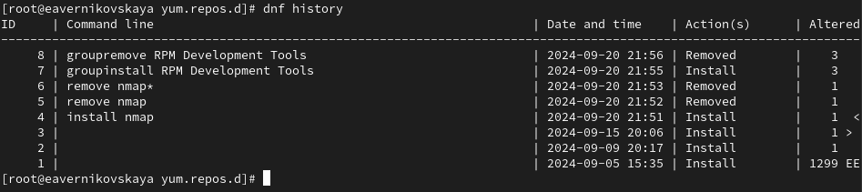{#fig:020 width=70%}

##  Работа с репозиториями

Отменяем последнее, например шестое по счёту, действие: *dnf history undo 6* (рис. 21)

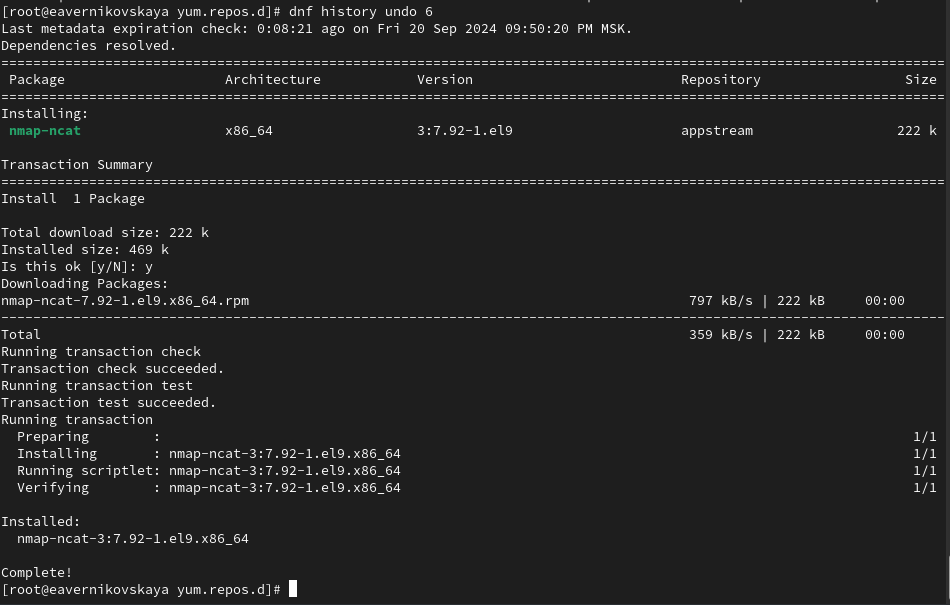{#fig:021 width=50%}

## Использование rpm

СКачиваем rpm-пакет lynx: *dnf install lynx --downloadonly*, перерд этим посмотрев список пакетов lynx: *dnf list lynx* (рис. 22), (рис. 23)

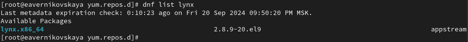{#fig:022 width=70%}

## Использование rpm

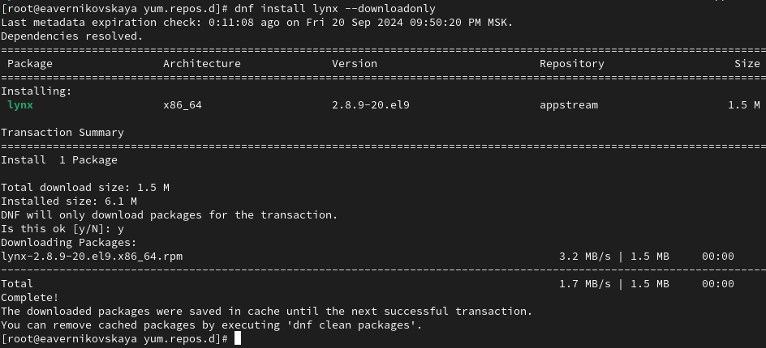{#fig:023 width=70%}

## Использование rpm

Находим каталог, в который был помещён пакет после загрузки (рис. 24)

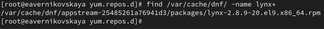{#fig:024 width=70%}

## Использование rpm

Далее переходим в этот каталог и затем установите rpm-пакет: *rpm -Uhv lynx-<версия>.rpm* (рис. 25), (рис. 26)

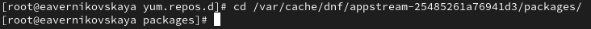{#fig:025 width=70%}

## Использование rpm

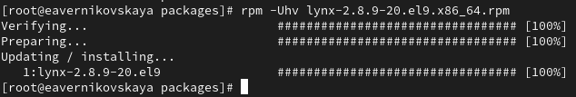{#fig:026 width=70%}

## Использование rpm

Определяем расположение исполняемого файла: *which lynx* (рис. 27)

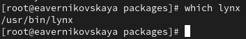{#fig:027 width=70%}

## Использование rpm

Используя rpm, определяем по имени файла, к какому пакету принадлежит lynx: *rpm -qf $(which lynx)* (рис. 28)

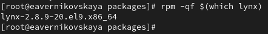{#fig:028 width=70%}

## Использование rpm

Получем дополнительную информацию о содержимом пакета, введя: *rpm -qi lynx* (рис. 29)

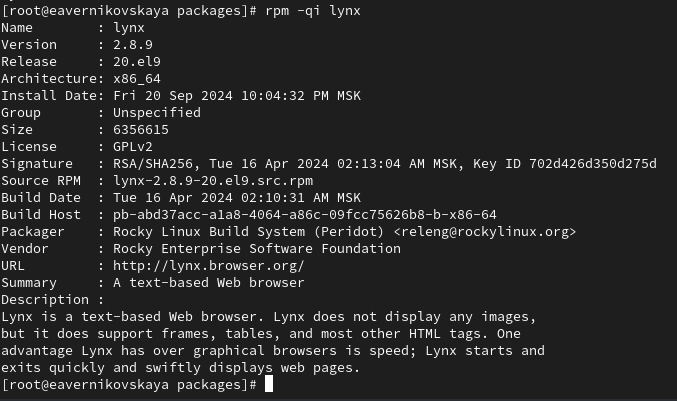{#fig:029 width=50%}

## Использование rpm

Получаем список всех файлов в пакете, используя: *rpm -ql lynx* (рис. 30)

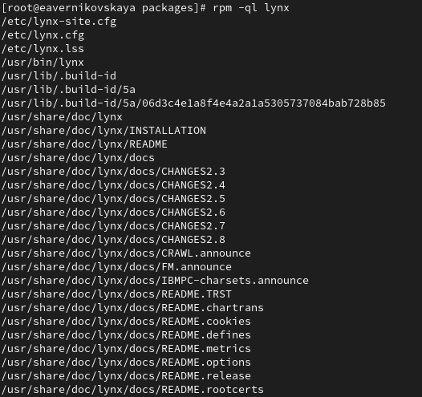{#fig:030 width=40%}

## Использование rpm

Также выводим перечень файлов с документацией пакета, введя: *rpm -qd lynx* (рис. 31)

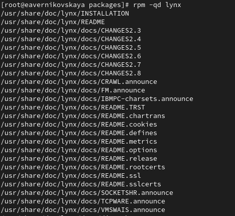{#fig:031 width=40%}

## Использование rpm

Смотрим файлы документации, применив команду *man lynx* (рис. 32)

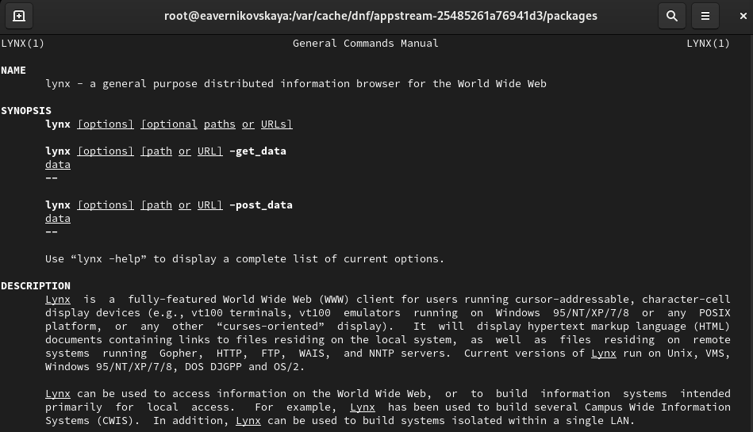{#fig:032 width=70%}

## Использование rpm

Выодим на экран перечень и месторасположение конфигурационных файлов пакета: *rpm -qc lynx* (рис. 33)

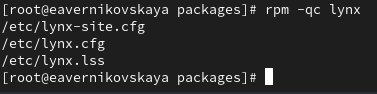{#fig:033 width=70%}

## Использование rpm

Выводим на экран расположение и содержание скриптов, выполняемых при установке пакета: *rpm -q --scripts lynx*. Скриптов не было (рис. 34)

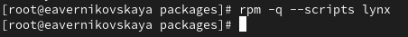{#fig:034 width=70%}

## Использование rpm

В отдельном терминале под своей учётной записью запустите текстовый браузер lynx, чтобы проверить корректность установки пакета (рис. 35), (рис. 36)

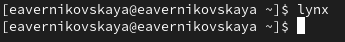{#fig:035 width=70%}

## Использование rpm

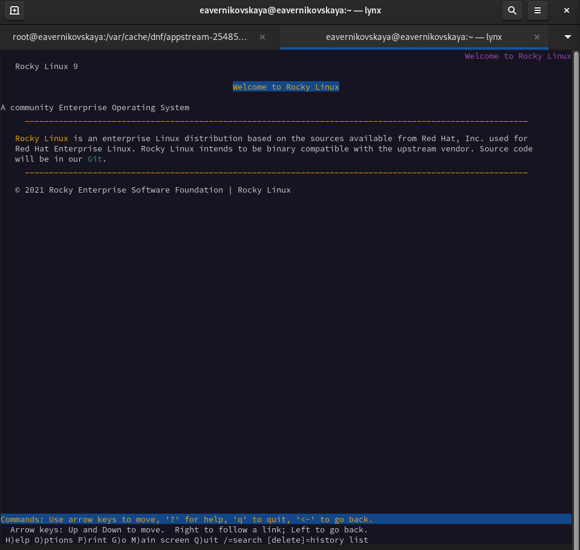{#fig:036 width=50%}

## Использование rpm

Возвращаемся в терминал с учётной записью root и удаляем пакет: *rpm -e lynx* (рис. 37)

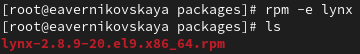{#fig:037 width=70%}

## Использование rpm

Смотрим список пакетов dnsmasq: *dnf list dnsmasq*, а затем устанавливаем: *dnf install dnsmasq* (рис. 38), (рис. 39)

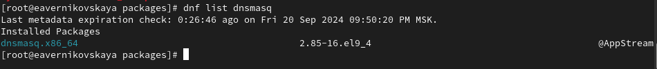{#fig:038 width=70%}

## Использование rpm

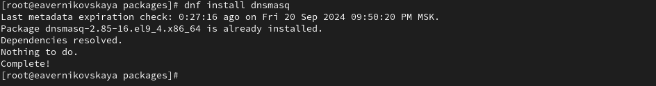{#fig:039 width=70%}

## Использование rpm

Далее проделываем те же действия, что и с lynx. Определяем расположение исполняемого файла (рис. 40)

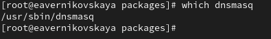{#fig:040 width=70%}

## Использование rpm

Определяем по имени файла, к какому пакету принадлежит dnsmasq (рис. 41)

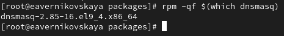{#fig:041 width=70%}

## Использование rpm

Получем дополнительную информацию о содержимом пакета (рис. 42)

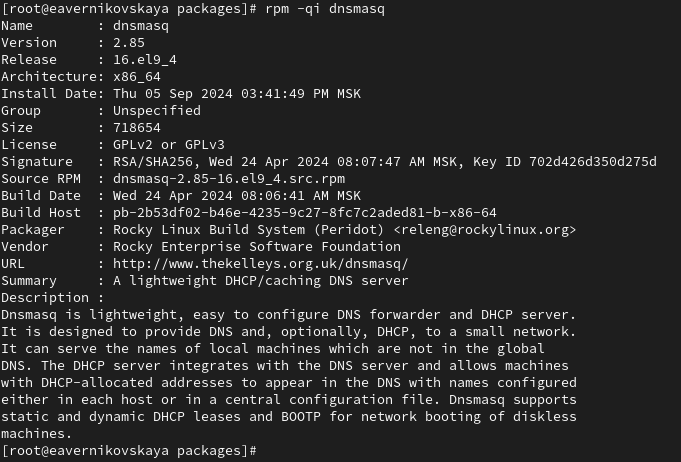{#fig:042 width=50%}

## Использование rpm

Получаем список всех файлов в пакете (рис. 43)

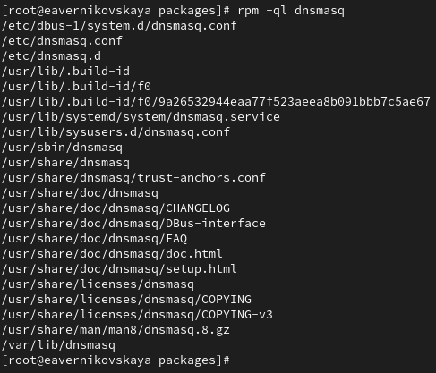{#fig:043 width=50%}

## Использование rpm

Также выводим перечень файлов с документацией пакета (рис. 44)

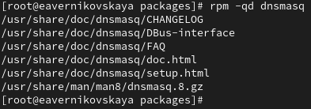{#fig:044 width=70%}

## Использование rpm

Смотрим файлы документации, применив команду *man dnsmasq* (рис. 45)

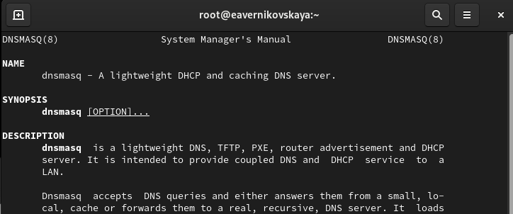{#fig:045 width=70%}

## Использование rpm

Выодим на экран перечень и месторасположение конфигурационных файлов пакета (рис. 46)

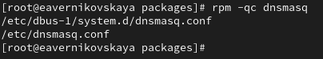{#fig:046 width=70%}

## Использование rpm

Выводим на экран расположение и содержание скриптов, выполняемых при установке пакета. На этот раз мы увидели скрипты, которые были выполнены при установке пакета. (рис. 47)

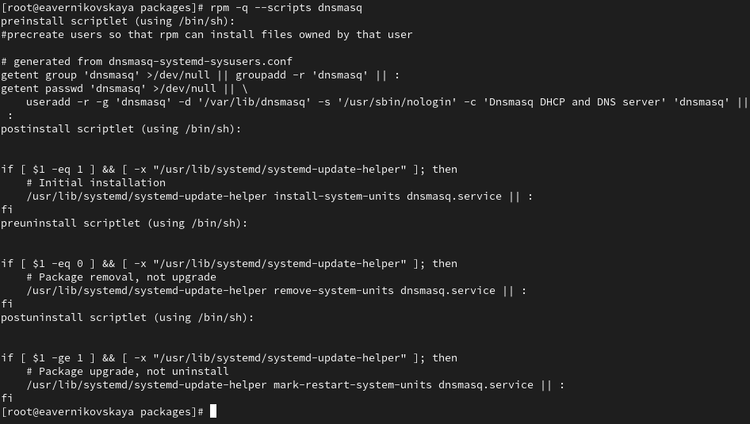{#fig:047 width=50%}

## Использование rpm

* Пре-установка (preinstall): Эти скрипты выполняются перед установкой пакета. Они могут использоваться для:
  + Подготовки системы к установке, например, создания каталогов или файлов конфигурации.
  + Проверки зависимостей или условий установки.
* Пост-установка (postinstall): Эти скрипты выполняются после завершения установки пакета. Они могут использоваться для:
  + Запуска сервиса, связанного с пакетом.
  + Обновления конфигурационных файлов.
  + Сообщения пользователю о завершении установки.
  
## Использование rpm
  
* Пре-удаление (preuninstall): Эти скрипты выполняются перед удалением пакета. Они могут использоваться для:
  + Остановки сервиса, связанного с пакетом.
  + Очистки временных файлов или каталогов.
* Пост-удаление (postuninstall): Эти скрипты выполняются после удаления пакета. Они могут использоваться для:
  + Удаления конфигурационных файлов или каталогов.
  + Удаления записей из системы.

## Использование rpm

Удаляем пакет (рис. 48)

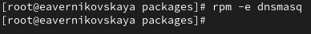{#fig:048 width=70%}

# Подведение итогов

## Выводы

В ходе выполнения лабораторной работы мы получили навыки работы с репозиториями и менеджерами пакетов.

## Список литературы

1. Лаборатораня работа №4 [Электронный ресурс] URL: https://esystem.rudn.ru/pluginfile.php/2400691/mod_resource/content/4/005-dnf.pdf
