---
## Front matter
title: "Отчёт по лабораторной работе №4"
subtitle: "Дисциплина: Основы администрирования операционных систем"
author: "Верниковская Екатерина Андреевна"

## Generic otions
lang: ru-RU
toc-title: "Содержание"

## Bibliography
bibliography: bib/cite.bib
csl: pandoc/csl/gost-r-7-0-5-2008-numeric.csl

## Pdf output format
toc: true # Table of contents
toc-depth: 2
lof: true # List of figures
lot: true # List of tables
fontsize: 12pt
linestretch: 1.5
papersize: a4
documentclass: scrreprt
## I18n polyglossia
polyglossia-lang:
  name: russian
  options:
	- spelling=modern
	- babelshorthands=true
polyglossia-otherlangs:
  name: english
## I18n babel
babel-lang: russian
babel-otherlangs: english
## Fonts
mainfont: PT Serif
romanfont: PT Serif
sansfont: PT Sans
monofont: PT Mono
mainfontoptions: Ligatures=TeX
romanfontoptions: Ligatures=TeX
sansfontoptions: Ligatures=TeX,Scale=MatchLowercase
monofontoptions: Scale=MatchLowercase,Scale=0.9
## Biblatex
biblatex: true
biblio-style: "gost-numeric"
biblatexoptions:
  - parentracker=true
  - backend=biber
  - hyperref=auto
  - language=auto
  - autolang=other*
  - citestyle=gost-numeric
## Pandoc-crossref LaTeX customization
figureTitle: "Рис."
tableTitle: "Таблица"
listingTitle: "Листинг"
lofTitle: "Список иллюстраций"
lotTitle: "Список таблиц"
lolTitle: "Листинги"
## Misc options
indent: true
header-includes:
  - \usepackage{indentfirst}
  - \usepackage{float} # keep figures where there are in the text
  - \floatplacement{figure}{H} # keep figures where there are in the text
---

# Цель работы

Получить навыки работы с репозиториями и менеджерами пакетов.

# Задание

1. Изучить, как и в каких файлах подключаются репозитории для установки программного обеспечения; изучить основные возможности (поиск, установка, обновление, удаление пакета, работа с историей действий) команды dnf.
2. Изучить и повторить процесс установки/удаления определённого пакета с использованием возможностей dnf.
3. Изучить и повторить процесс установки/удаления определённого пакета с использованием возможностей rpm.

# Выполнение лабораторной работы

##  Работа с репозиториями

В консоли переходим в режим работы суперпользователя, используя *su -* (рис. [-@fig:001])

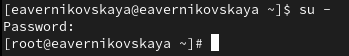{#fig:001 width=70%}

Переходим в каталог /etc/yum.repos.d и смотрим содержание каталога (рис. [-@fig:002])

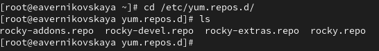{#fig:002 width=70%}

Далее изучаем содержание файлов в этом каталоге, введя *cat название_репозитория.repo*  (рис. [-@fig:003]), (рис. [-@fig:004]), (рис. [-@fig:005]), (рис. [-@fig:006])

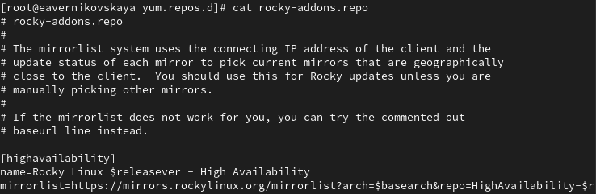{#fig:003 width=70%}

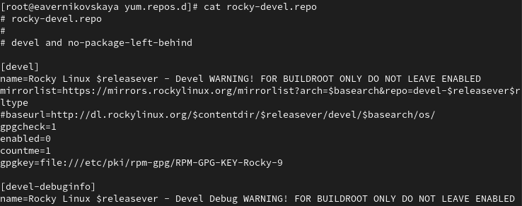{#fig:004 width=70%}

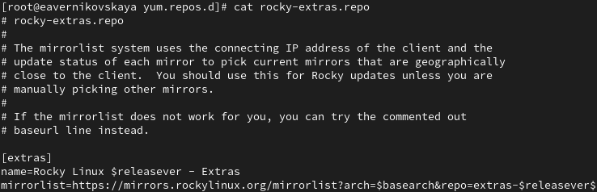{#fig:005 width=70%}

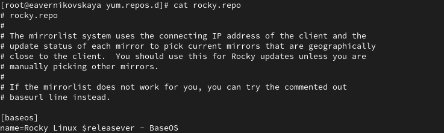{#fig:006 width=70%}

Выводим на экран список репозиториев: *dnf repolist*. Слева - id репозиториев, а справа - их названия (рис. [-@fig:007])

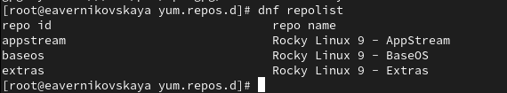{#fig:007 width=70%}

Выодим на экран список пакетов, в названии или описании которых есть слово user: dnf search user (рис. [-@fig:008])

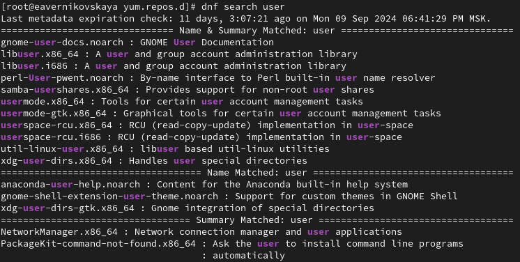{#fig:008 width=70%}

Далее устанавливаем nmap, предварительно изучив информацию по имеющимся пакетам: *dnf search nmap*
*dnf info nmap* (рис. [-@fig:009]), (рис. [-@fig:010])

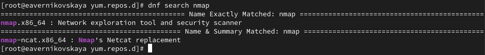{#fig:009 width=70%}

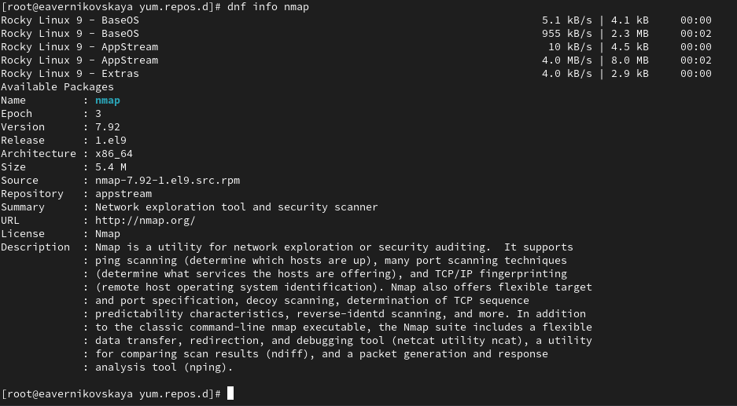{#fig:010 width=70%}

Устанавливаем nmap: *dnf install nmap* и dnf install nmap\*. Первая команда устанавливает устанавливает только пакет с именем "nmap", а вторая устанавливает все пакеты, чьи имена начинаются с "nmap" (рис. [-@fig:011]), (рис. [-@fig:012])

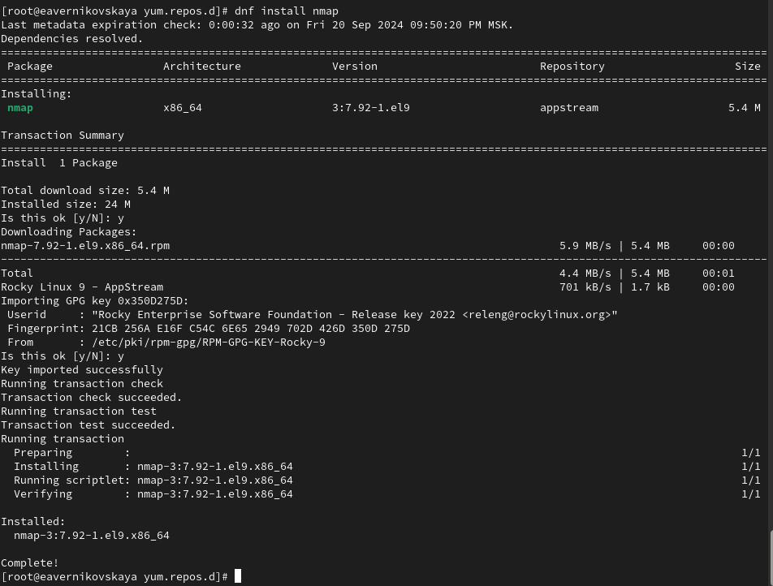{#fig:011 width=70%}

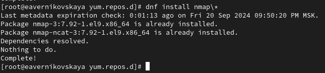{#fig:012 width=70%}

Далее удаляем nmap (рис. [-@fig:013]), (рис. [-@fig:014])

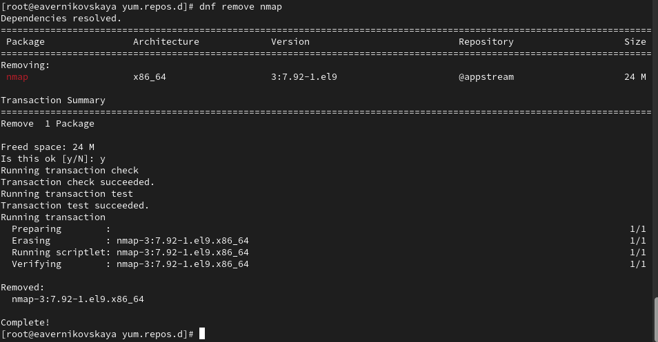{#fig:013 width=70%}

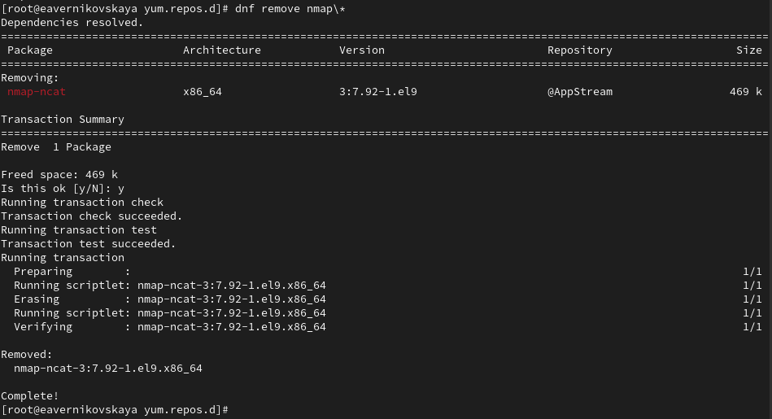{#fig:014 width=70%}

Далее получаем список имеющихся групп пакетов: *dnf groups list* и *LANG=C dnf groups list*. Вторая команда переводит вывод команды на английский язык независимо от установленного языка системы (рис. [-@fig:015]), (рис. [-@fig:016])

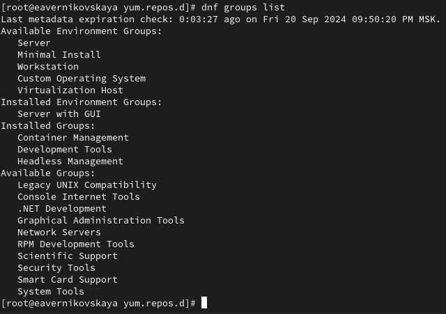{#fig:015 width=70%}

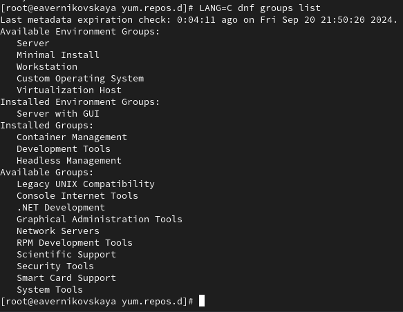{#fig:016 width=70%}

Далее выводим информацио о группе пакетов RPM Development Tools: *dnf groups info "RPM Development Tools"* (рис. [-@fig:017])

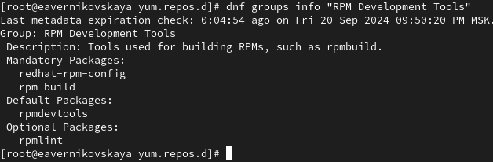{#fig:017 width=70%}

Устанавливаем эту группу пакетов: *dnf groupinstall "RPM Development Tools"* (рис. [-@fig:018])

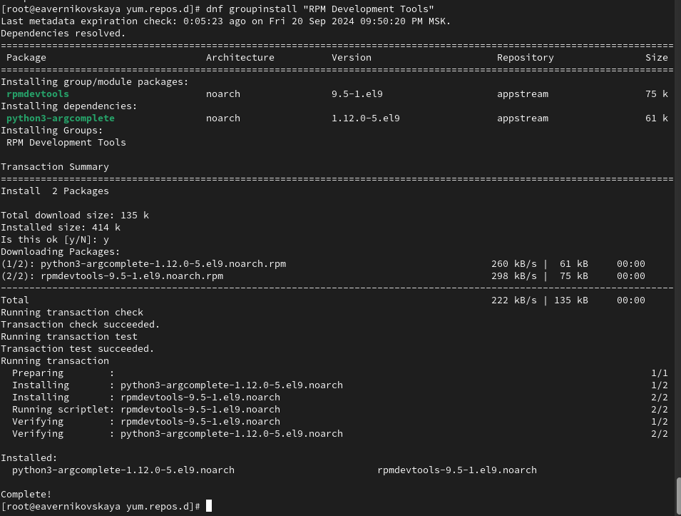{#fig:018 width=70%}

Далее удаляем RPM Development Tools с помощью *dnf groupremove "RPM Development Tools"* (рис. [-@fig:019])

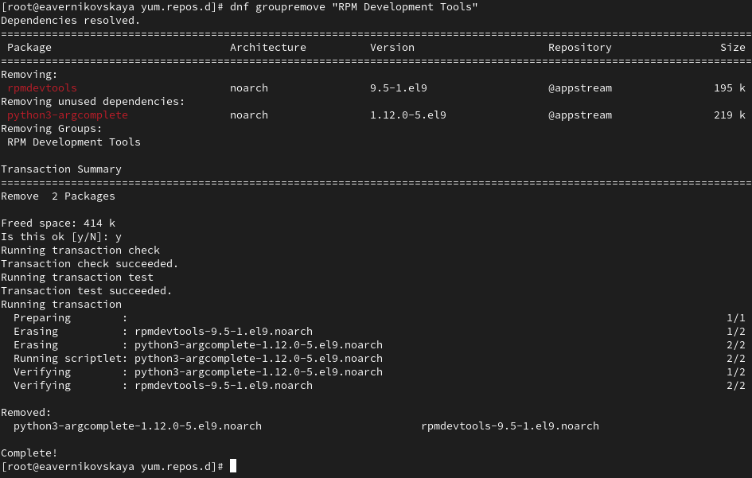{#fig:019 width=70%}

Смотрим историю использования команды dnf: *dnf history* (рис. [-@fig:020])

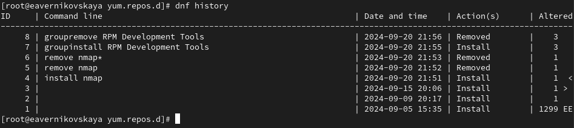{#fig:020 width=70%}

Отменяем последнее, например шестое по счёту, действие: *dnf history undo 6* (рис. [-@fig:021])

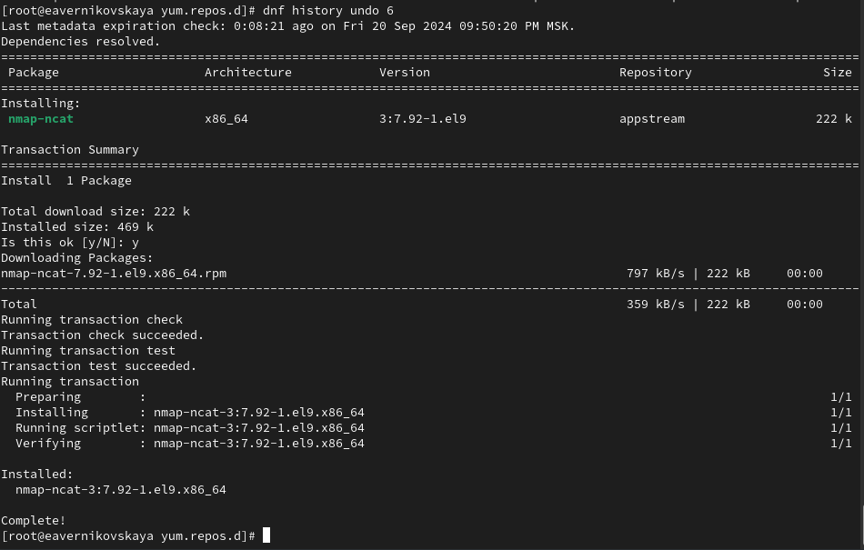{#fig:021 width=70%}

## Использование rpm

СКачиваем rpm-пакет lynx: *dnf install lynx --downloadonly*, перерд этим посмотрев список пакетов lynx: *dnf list lynx* (рис. [-@fig:022]), (рис. [-@fig:023])

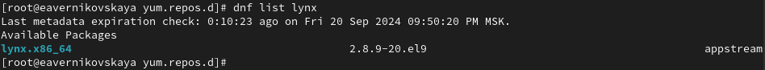{#fig:022 width=70%}

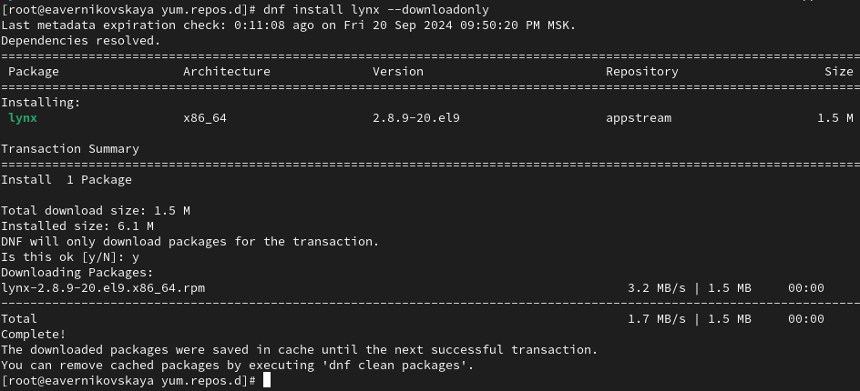{#fig:023 width=70%}

Находим каталог, в который был помещён пакет после загрузки (рис. [-@fig:024])

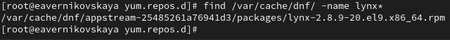{#fig:024 width=70%}

Далее переходим в этот каталог и затем установите rpm-пакет: *rpm -Uhv lynx-<версия>.rpm* (рис. [-@fig:025]), (рис. [-@fig:026])

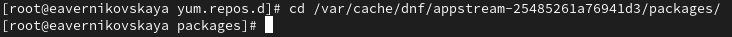{#fig:025 width=70%}

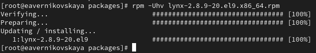{#fig:026 width=70%}

Определяем расположение исполняемого файла: *which lynx* (рис. [-@fig:027])

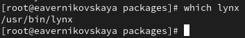{#fig:027 width=70%}

Используя rpm, определяем по имени файла, к какому пакету принадлежит lynx: *rpm -qf $(which lynx)* (рис. [-@fig:028])

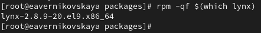{#fig:028 width=70%}

Получем дополнительную информацию о содержимом пакета, введя: *rpm -qi lynx* (рис. [-@fig:029])

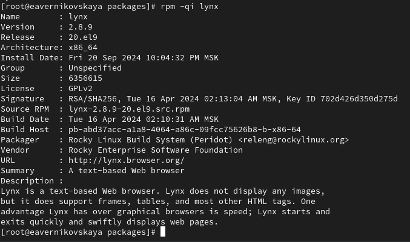{#fig:029 width=70%}

Получаем список всех файлов в пакете, используя: *rpm -ql lynx* (рис. [-@fig:030])

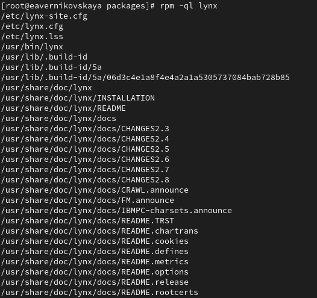{#fig:030 width=70%}

Также выводим перечень файлов с документацией пакета, введя: *rpm -qd lynx* (рис. [-@fig:031])

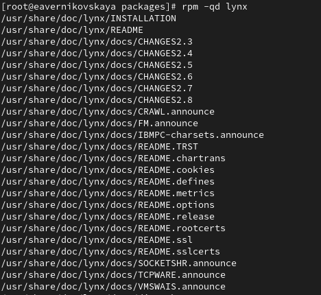{#fig:031 width=70%}

Смотрим файлы документации, применив команду *man lynx* (рис. [-@fig:032])

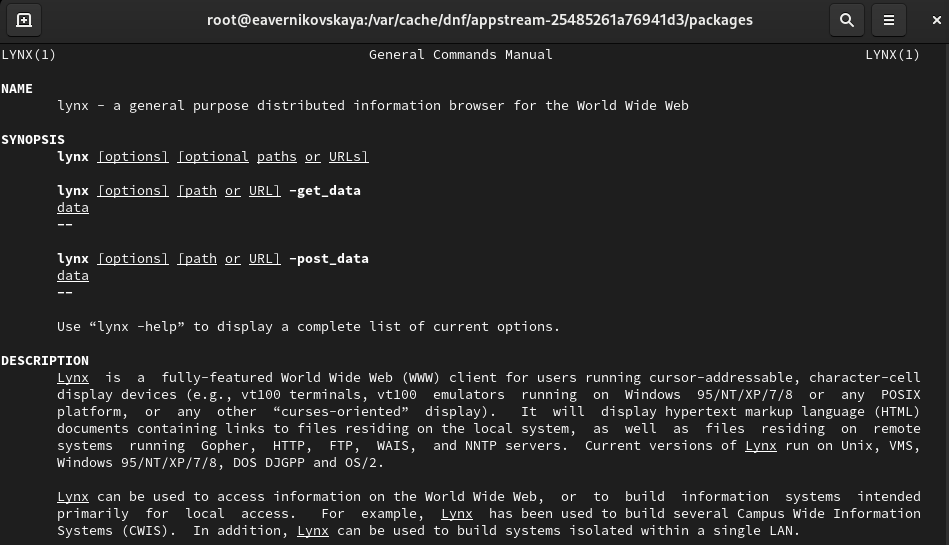{#fig:032 width=70%}

Выодим на экран перечень и месторасположение конфигурационных файлов пакета: *rpm -qc lynx* (рис. [-@fig:033])

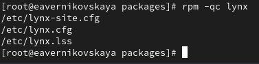{#fig:033 width=70%}

Выводим на экран расположение и содержание скриптов, выполняемых при установке пакета: *rpm -q --scripts lynx*. Скриптов не было (рис. [-@fig:034])

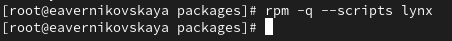{#fig:034 width=70%}

В отдельном терминале под своей учётной записью запустите текстовый браузер lynx, чтобы проверить корректность установки пакета (рис. [-@fig:035]), (рис. [-@fig:036])

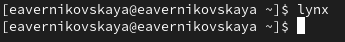{#fig:035 width=70%}

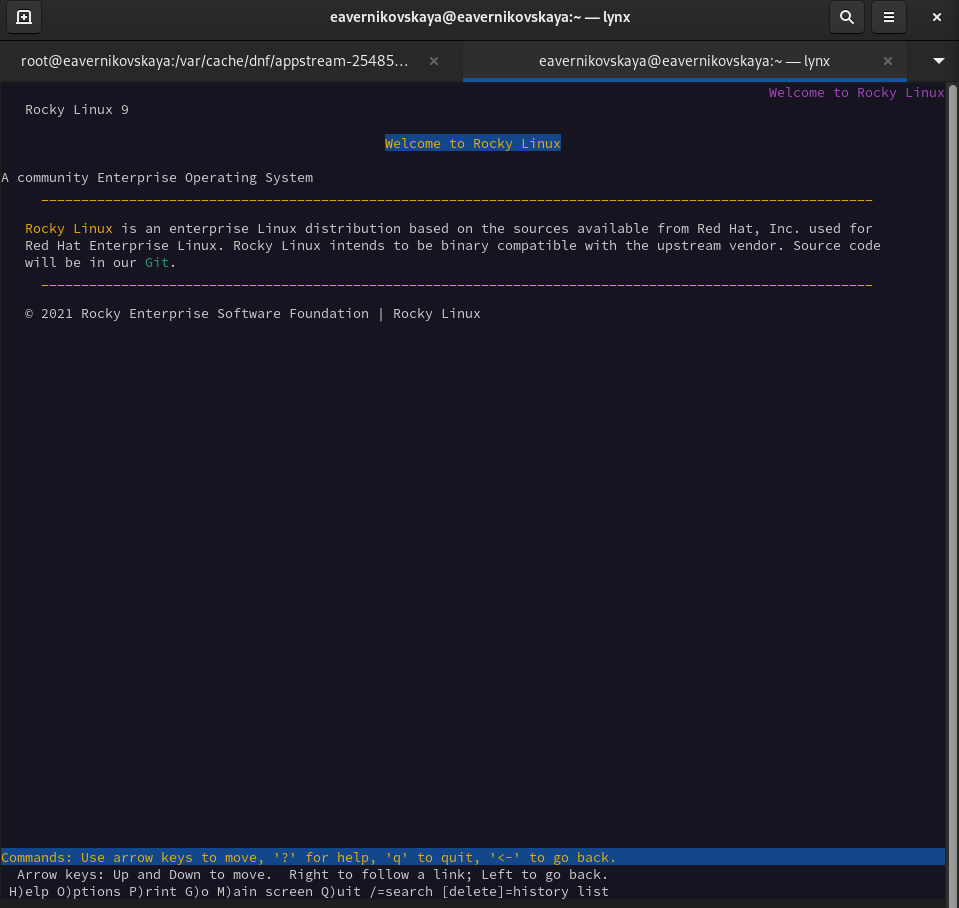{#fig:036 width=70%}

Возвращаемся в терминал с учётной записью root и удаляем пакет: *rpm -e lynx* (рис. [-@fig:037])

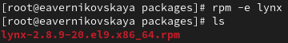{#fig:037 width=70%}

Смотрим список пакетов dnsmasq: *dnf list dnsmasq*, а затем устанавливаем: *dnf install dnsmasq* (рис. [-@fig:038]), (рис. [-@fig:039])

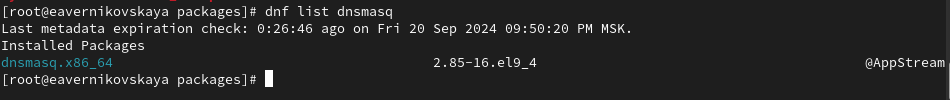{#fig:038 width=70%}

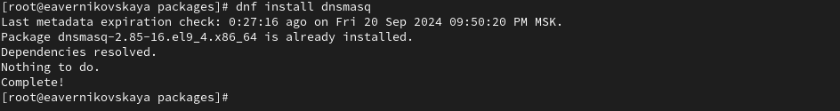{#fig:039 width=70%}

Далее проделываем те же действия, что и с lynx. Определяем расположение исполняемого файла (рис. [-@fig:040])

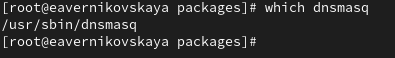{#fig:040 width=70%}

Определяем по имени файла, к какому пакету принадлежит dnsmasq (рис. [-@fig:041])

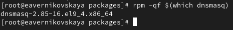{#fig:041 width=70%}

Получем дополнительную информацию о содержимом пакета (рис. [-@fig:042])

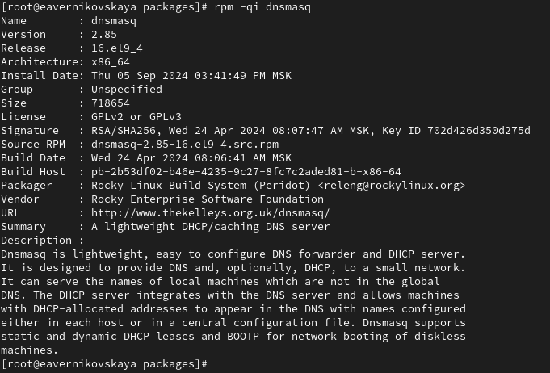{#fig:042 width=70%}

Получаем список всех файлов в пакете (рис. [-@fig:043])

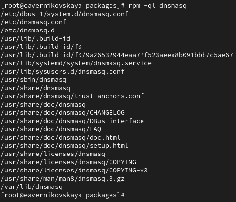{#fig:043 width=70%}

Также выводим перечень файлов с документацией пакета (рис. [-@fig:044])

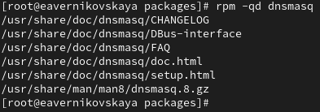{#fig:044 width=70%}

Смотрим файлы документации, применив команду *man dnsmasq* (рис. [-@fig:045])

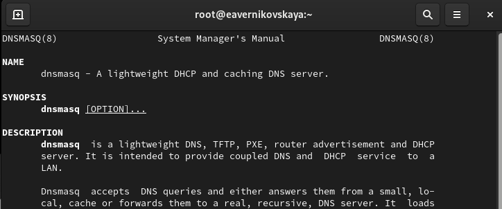{#fig:045 width=70%}

Выодим на экран перечень и месторасположение конфигурационных файлов пакета (рис. [-@fig:046])

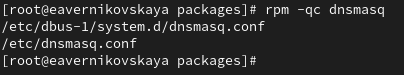{#fig:046 width=70%}

Выводим на экран расположение и содержание скриптов, выполняемых при установке пакета. На этот раз мы увидели скрипты, которые были выполнены при установке пакета. (рис. [-@fig:047])

* Пре-установка (preinstall): Эти скрипты выполняются перед установкой пакета. Они могут использоваться для:
  + Подготовки системы к установке, например, создания каталогов или файлов конфигурации.
  + Проверки зависимостей или условий установки.
* Пост-установка (postinstall): Эти скрипты выполняются после завершения установки пакета. Они могут использоваться для:
  + Запуска сервиса, связанного с пакетом.
  + Обновления конфигурационных файлов.
  + Сообщения пользователю о завершении установки.
* Пре-удаление (preuninstall): Эти скрипты выполняются перед удалением пакета. Они могут использоваться для:
  + Остановки сервиса, связанного с пакетом.
  + Очистки временных файлов или каталогов.
* Пост-удаление (postuninstall): Эти скрипты выполняются после удаления пакета. Они могут использоваться для:
  + Удаления конфигурационных файлов или каталогов.
  + Удаления записей из системы.  

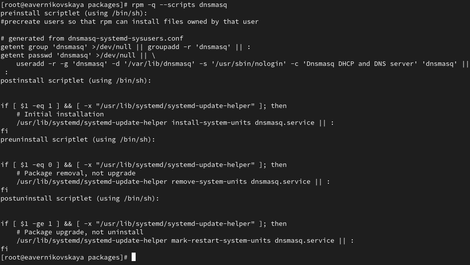{#fig:047 width=70%}

Удаляем пакет (рис. [-@fig:048])

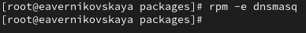{#fig:048 width=70%}

# Контрольные вопросы + ответы

1. Какая команда позволяет вам искать пакет rpm, содержащий файл useradd?

yum search useradd

2. Какие команды вам нужно использовать, чтобы показать имя группы dnf, которая содержит инструменты безопасности и показывает, что находится в этой группе?

yum info gcl 

3. Какая команда позволяет вам установить rpm, который вы загрузили из Интернета и который не находится в репозиториях?

yum install

4. Вы хотите убедиться, что пакет rpm, который вы загрузили, не содержит никакого опасного кода сценария. Какая команда позволяет это сделать?

rpm -q --scripts

5. Какая команда показывает всю документацию в rpm?

rpm -qd

6. Какая команда показывает, какому пакету rpm принадлежит файл?

rpm -qf $(which)

# Выводы

В ходе выполнения лабораторной работы мы получили навыки работы с репозиториями и менеджерами пакетов.

# Список литературы

1. Лаборатораня работа №4 [Электронный ресурс] URL: https://esystem.rudn.ru/pluginfile.php/2400691/mod_resource/content/4/005-dnf.pdf
