---
## Front matter
lang: ru-RU
title: Лабораторная работа №5
subtitle: Основы администрирования операционных систем
author:
  - Верниковская Е. А., НПИбд-01-23
institute:
  - Российский университет дружбы народов, Москва, Россия
date: 28 сентября 2024

## i18n babel
babel-lang: russian
babel-otherlangs: english

## Formatting pdf
toc: false
toc-title: Содержание
slide_level: 2
aspectratio: 169
section-titles: true
theme: metropolis
header-includes:
 - \metroset{progressbar=frametitle,sectionpage=progressbar,numbering=fraction}
 - '\makeatletter'
 - '\beamer@ignorenonframefalse'
 - '\makeatother'
 
## Fonts
mainfont: PT Serif
romanfont: PT Serif
sansfont: PT Sans
monofont: PT Mono
mainfontoptions: Ligatures=TeX
romanfontoptions: Ligatures=TeX
sansfontoptions: Ligatures=TeX,Scale=MatchLowercase
monofontoptions: Scale=MatchLowercase,Scale=0.9
---

# Вводная часть

## Цель работы

Получить навыки управления системными службами операционной системы посредством systemd.

## Задание

1. Выполнить основные операции по запуску (останову), определению статуса, добавлению (удалению) в автозапуск и пр. службы Very Secure FTP.
2. Продемонстрировать навыки по разрешению конфликтов юнитов для служб firewalld и iptables.
3. Продемонстрировать навыки работы с изолированными целями.

# Выполнение лабораторной работы

## Управление сервисами

В консоли переходим в режим работы суперпользователя, используя *su -* (рис. 1)

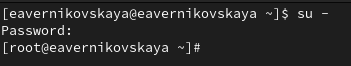{#fig:001 width=70%}

## Управление сервисами

Проверяем статус службы Very Secure FTP: *systemctl status vsftpd*. Вывод команды показывает, что сервис в настоящее время отключён, так как служба Very Secure FTP не установлена (рис. 2)

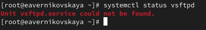{#fig:002 width=70%}

## Управление сервисами

Устанавливаем службу Very Secure FTP: *dnf -y install vsftpd* (рис. 3)

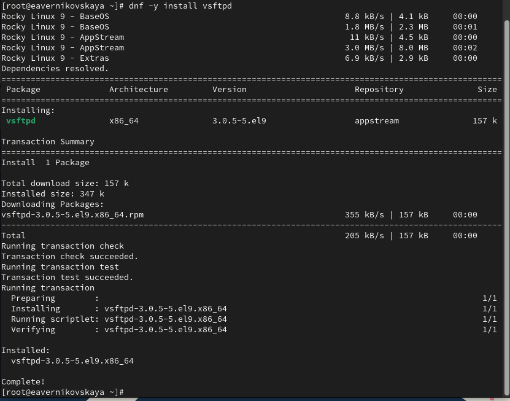{#fig:003 width=50%}

## Управление сервисами

Запускаем службу Very Secure FTP:: *systemctl start vsftpd* (рис. 4)

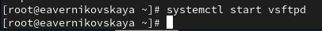{#fig:004 width=70%}

## Управление сервисами

Снова проверяем статус службы Very Secure FTP. Вывод команды показывает, что служба в настоящее время работает, но не будет активирована при перезапуске операционной системы (рис. 5)

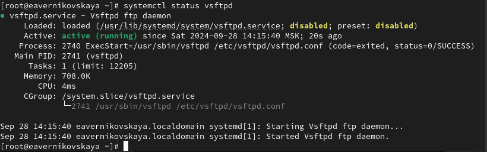{#fig:005 width=70%}

## Управление сервисами

Добавляем службу Very Secure FTP в автозапуск при загрузке операционной системы, используя команду *systemctl enable vsftpd* (рис. 6)

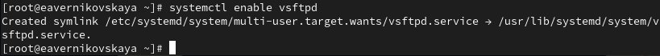{#fig:006 width=70%}

## Управление сервисами

Проверяем статус службы Very Secure FTP (рис. 7)

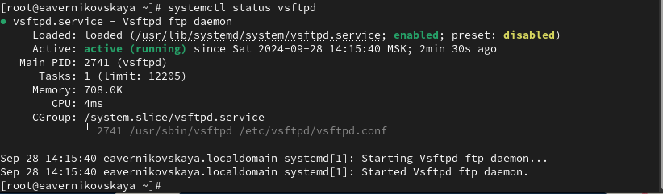{#fig:007 width=70%}

## Управление сервисами

Удаляем службу из автозапуска, используя команду *systemctl disable vsftpd*, и снова проверяем её статус (рис. 8), (рис. 9)

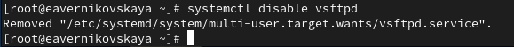{#fig:008 width=70%}

## Управление сервисами

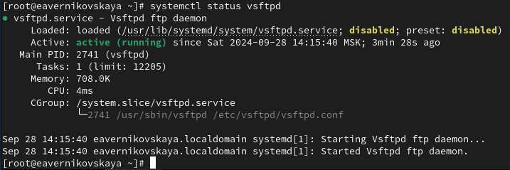{#fig:009 width=70%}

## Управление сервисами

Выводим на экран символические ссылки, ответственные за запуск различных сервисов: *ls /etc/systemd/system/multi-user.target.wants*. После ввода этой команды отображается, что ссылки на vsftpd.service не существует (рис. 10)

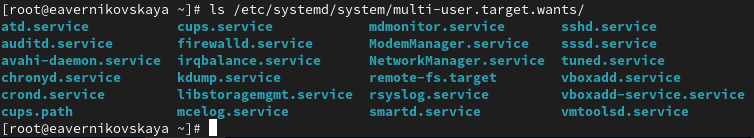{#fig:010 width=70%}

## Управление сервисами

Снова добавляем службу Very Secure FTP в автозапуск и опять выводим на экран символические ссылки, ответственные за запуск различных сервисов. На этот раз вывод команды показывает, что создана символическая ссылка для файла /usr/lib/systemd/system/vsftpd.service в каталоге /etc/systemd/system/multi-user.target.wants (рис. 11), (рис. 12)

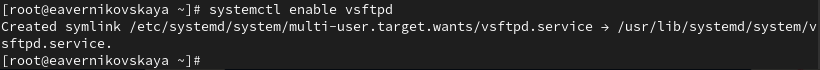{#fig:011 width=70%}

## Управление сервисами

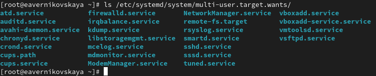{#fig:012 width=70%}

## Управление сервисами

Опять проверяем статус службы Very Secure FTP. Теперь мы видим, что для файла юнита состояние изменено с disabled на enabled (рис. 13)

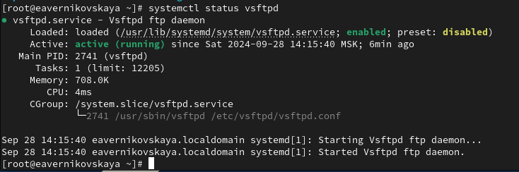{#fig:013 width=70%} 

## Управление сервисами

Выводим на экран список зависимостей юнита: *systemctl list-dependencies vsftpd* (рис. 14)

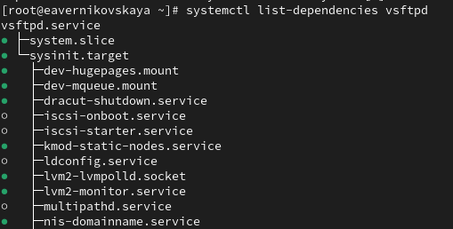{#fig:014 width=70%}

## Управление сервисами

Выводим на экран список юнитов, которые зависят от данного юнита: *systemctl list-dependencies vsftpd --reverse* (рис. 15)

{#fig:015 width=70%}

## Конфликты юнитов

Устанавливаем iptables: dnf -y install iptables\* (рис. 16)

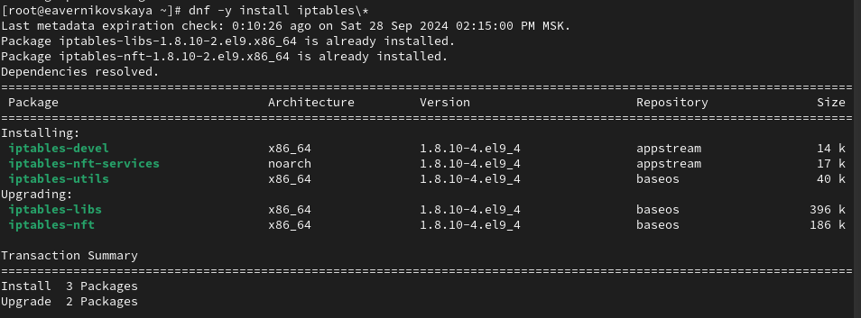{#fig:016 width=70%}

## Конфликты юнитов

Далее проверяем статус firewalld и iptables (рис. 17), (рис. 18)

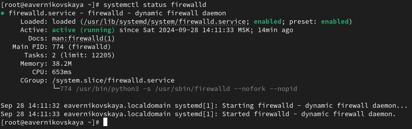{#fig:017 width=70%}

## Конфликты юнитов

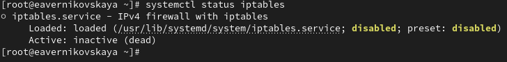{#fig:018 width=70%}

## Конфликты юнитов

Далее пробуем запустить firewalld и iptables. При запуске одной службы мы видим, что вторая дезактивируется или не запускается (рис. 19)

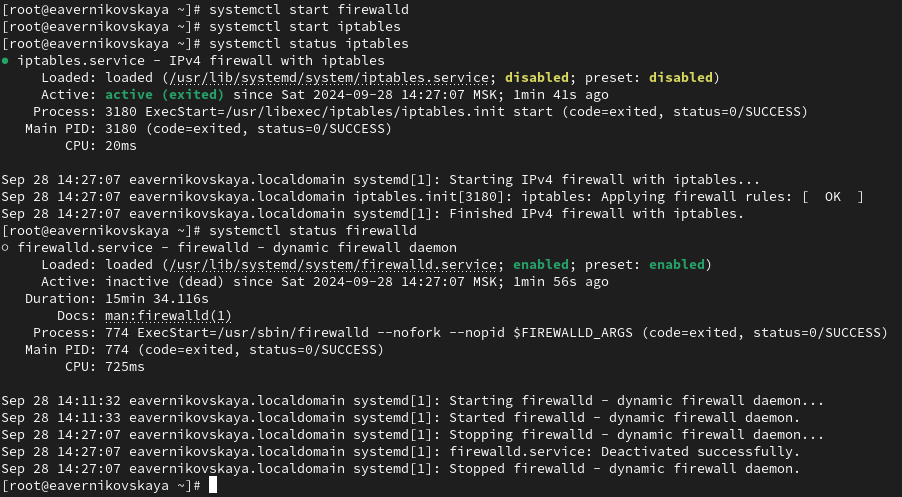{#fig:019 width=70%}

## Конфликты юнитов

Вводим *cat /usr/lib/systemd/system/firewalld.service* (рис. 20)

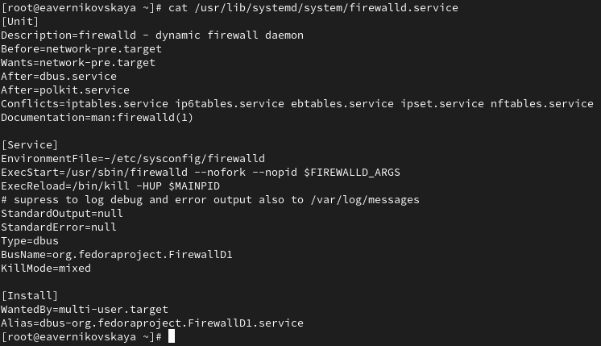{#fig:020 width=70%}

## Конфликты юнитов

Вводим *cat /usr/lib/systemd/system/iptables.service* (рис. 21)

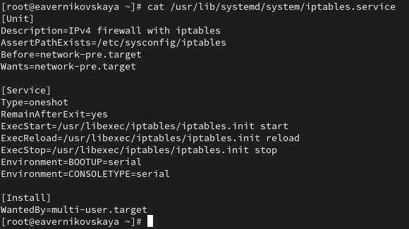{#fig:021 width=70%}

## Конфликты юнитов

Выгружаем службу iptables (на всякий случай, чтобы убедиться, что данная служба не загружена в систему): *systemctl stop iptables*. После загружаем службу firewalld (рис. 22)

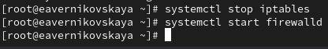{#fig:022 width=70%}

## Конфликты юнитов

Далее блокируем запуск iptables, введя: *systemctl mask iptables*. При этом будет создана символическая ссылка. Это сделает невозможным случайный запуск сервиса iptables (рис. 23)

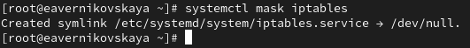{#fig:023 width=70%}

## Конфликты юнитов

Пробуем запустить iptables. При попытке запустить iptables появляется сообщение об ошибке, указывающее, что служба замаскирована и по этой причине не может быть запущена (рис. 24)

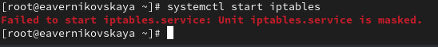{#fig:024 width=70%}

## Конфликты юнитов

Далее пробуем добавить iptables в автозапуск. Сервис будет неактивен, а статус загрузки отобразится как замаскированный (рис. 25) (рис. 26)

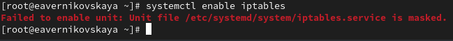{#fig:025 width=70%}

## Конфликты юнитов

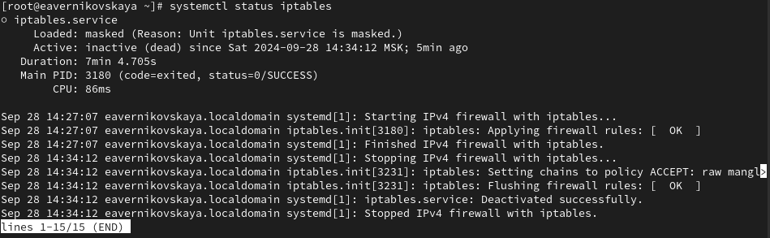{#fig:026 width=70%}

## Изолируемые цели

Получем список всех активных загруженных целей: *systemctl --type=target*, а затем список всех целей: *systemctl --type=target --all* (рис. 27), (рис. 28)

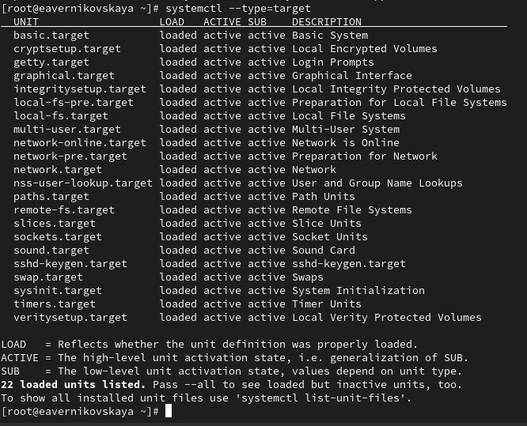{#fig:027 width=40%}

## Изолируемые цели

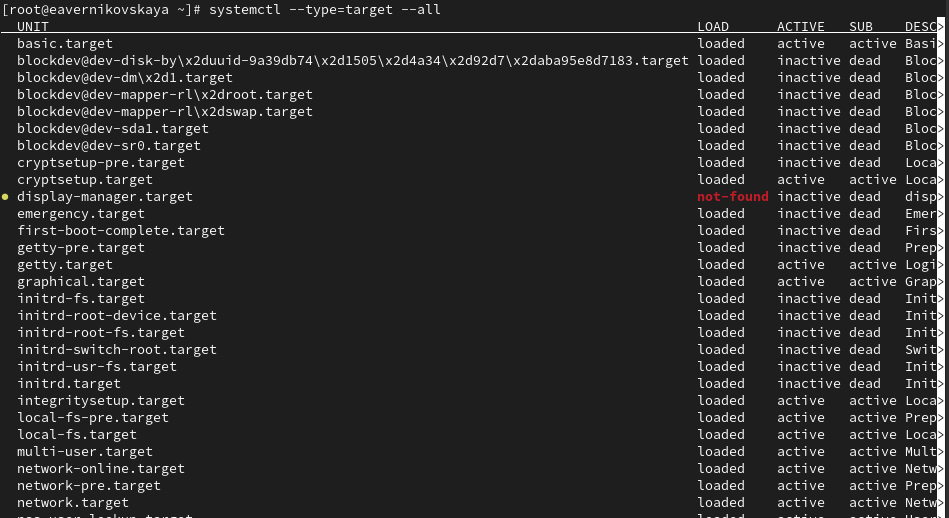{#fig:028 width=70%}

## Изолируемые цели

Переходим в каталог systemd и находим список всех целей, которые можно изолировать:

- *cd /usr/lib/systemd/system*
- *grep Isolate *.target* (рис. 29)

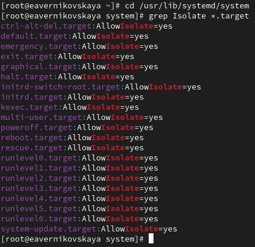{#fig:029 width=30%}

## Изолируемые цели

Далее переключаем операционную систему в режим восстановления: *systemctl isolate rescue.target* (рис. 30), (рис. 31) 

{#fig:030 width=70%}

## Изолируемые цели

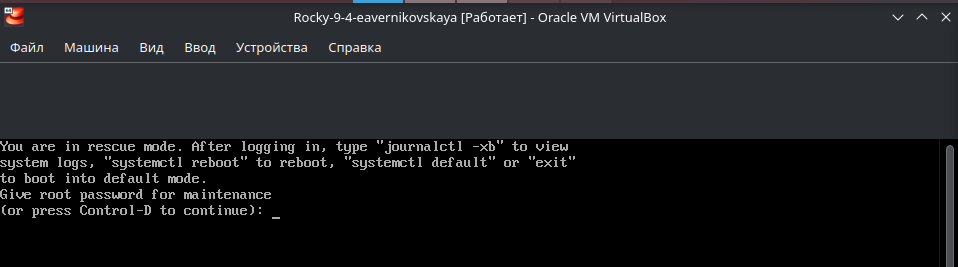{#fig:031 width=70%}

## Изолируемые цели

Переходим в режим root и перезапускаем операционную систему: *systemctl isolate reboot.target* (рис. 32), (рис. 33) 

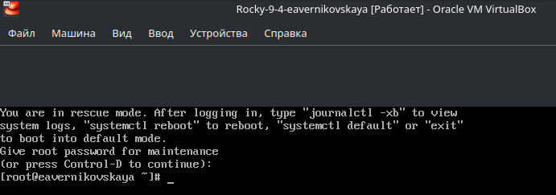{#fig:032 width=70%}

## Изолируемые цели

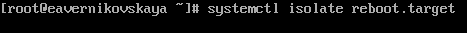{#fig:033 width=70%}

## Цель по умолчанию

ПОлучаем права администратора. Далее выводим на экран цель, установленную по умолчанию: *systemctl get-default*. Сейчас графический режим (рис. 34)

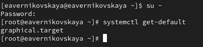{#fig:034 width=70%}

## Цель по умолчанию

Запускаем по умолчанию текстовый режим введя команду *systemctl set-default multi-user.target* и перезагружаем систему командой *reboot* (рис. 35), (рис. 36)

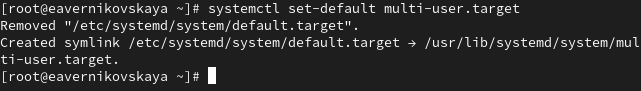{#fig:035 width=70%}

## Цель по умолчанию

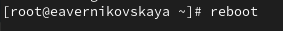{#fig:036 width=70%}

## Цель по умолчанию

Система загрузилась в текстовом режиме. Далее получаем полномочия пользователя root и запускаем по умолчанию графический режим введя команду *systemctl set-default graphical.target*. После снова перезагружаем систему командой *reboot* (рис. 37), (рис. 38), (рис. 39), (рис. 40)

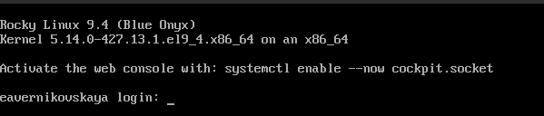{#fig:037 width=70%}

## Цель по умолчанию

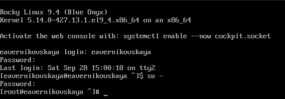{#fig:038 width=70%}

## Цель по умолчанию

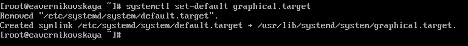{#fig:039 width=70%}

## Цель по умолчанию

{#fig:040 width=70%}

## Цель по умолчанию

Система загрузилась в графическом режиме. Всё хорошо! (рис. 41)

{#fig:041 width=30%}

# Подведение итогов

## Выводы

В ходе выполнения лабораторной работы мы получили навыки управления системными службами операционной системы посредством systemd.

## Список литературы

1. Лаборатораня работа №5 [Электронный ресурс] URL: https://esystem.rudn.ru/pluginfile.php/2400698/mod_resource/content/4/006-service.pdf
