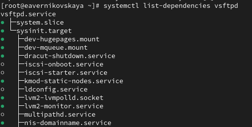

---
## Front matter
title: "Отчёт по лабораторной работе №5"
subtitle: "Дисциплина: Основы администрирования операционных систем"
author: "Верниковская Екатерина Андреевна"

## Generic otions
lang: ru-RU
toc-title: "Содержание"

## Bibliography
bibliography: bib/cite.bib
csl: pandoc/csl/gost-r-7-0-5-2008-numeric.csl

## Pdf output format
toc: true # Table of contents
toc-depth: 2
lof: true # List of figures
lot: true # List of tables
fontsize: 12pt
linestretch: 1.5
papersize: a4
documentclass: scrreprt
## I18n polyglossia
polyglossia-lang:
  name: russian
  options:
	- spelling=modern
	- babelshorthands=true
polyglossia-otherlangs:
  name: english
## I18n babel
babel-lang: russian
babel-otherlangs: english
## Fonts
mainfont: PT Serif
romanfont: PT Serif
sansfont: PT Sans
monofont: PT Mono
mainfontoptions: Ligatures=TeX
romanfontoptions: Ligatures=TeX
sansfontoptions: Ligatures=TeX,Scale=MatchLowercase
monofontoptions: Scale=MatchLowercase,Scale=0.9
## Biblatex
biblatex: true
biblio-style: "gost-numeric"
biblatexoptions:
  - parentracker=true
  - backend=biber
  - hyperref=auto
  - language=auto
  - autolang=other*
  - citestyle=gost-numeric
## Pandoc-crossref LaTeX customization
figureTitle: "Рис."
tableTitle: "Таблица"
listingTitle: "Листинг"
lofTitle: "Список иллюстраций"
lotTitle: "Список таблиц"
lolTitle: "Листинги"
## Misc options
indent: true
header-includes:
  - \usepackage{indentfirst}
  - \usepackage{float} # keep figures where there are in the text
  - \floatplacement{figure}{H} # keep figures where there are in the text
---

# Цель работы

Получить навыки управления системными службами операционной системы посредством systemd.

# Задание

1. Выполнить основные операции по запуску (останову), определению статуса, добавлению (удалению) в автозапуск и пр. службы Very Secure FTP.
2. Продемонстрировать навыки по разрешению конфликтов юнитов для служб firewalld и iptables.
3. Продемонстрировать навыки работы с изолированными целями.

# Выполнение лабораторной работы

## Управление сервисами

В консоли переходим в режим работы суперпользователя, используя *su -* (рис. [-@fig:001])

{#fig:001 width=70%}

Проверяем статус службы Very Secure FTP: *systemctl status vsftpd*. Вывод команды показывает, что сервис в настоящее время отключён, так как служба Very Secure FTP не установлена (рис. [-@fig:002])

{#fig:002 width=70%}

Устанавливаем службу Very Secure FTP: *dnf -y install vsftpd* (рис. [-@fig:003])

{#fig:003 width=70%}

Запускаем службу Very Secure FTP:: *systemctl start vsftpd* (рис. [-@fig:004])

{#fig:004 width=70%}

Снова проверяем статус службы Very Secure FTP. Вывод команды показывает, что служба в настоящее время работает, но не будет активирована при перезапуске операционной системы (рис. [-@fig:005])

{#fig:005 width=70%}

Добавляем службу Very Secure FTP в автозапуск при загрузке операционной системы, используя команду *systemctl enable vsftpd* (рис. [-@fig:006])

{#fig:006 width=70%}

Проверяем статус службы Very Secure FTP (рис. [-@fig:007])

{#fig:007 width=70%}

Удаляем службу из автозапуска, используя команду *systemctl disable vsftpd*, и снова проверяем её статус (рис. [-@fig:008]), (рис. [-@fig:009])

{#fig:008 width=70%}

{#fig:009 width=70%}

Выводим на экран символические ссылки, ответственные за запуск различных сервисов: *ls /etc/systemd/system/multi-user.target.wants*. После ввода этой команды отображается, что ссылки на vsftpd.service не существует (рис. [-@fig:010])

{#fig:010 width=70%}

Снова добавляем службу Very Secure FTP в автозапуск и опять выводим на экран символические ссылки, ответственные за запуск различных сервисов. На этот раз вывод команды показывает, что создана символическая ссылка для файла /usr/lib/systemd/system/vsftpd.service в каталоге /etc/systemd/system/multi-user.target.wants (рис. [-@fig:011]), (рис. [-@fig:012])

{#fig:011 width=70%}

{#fig:012 width=70%}

Опять проверяем статус службы Very Secure FTP. Теперь мы видим, что для файла юнита состояние изменено с disabled на enabled (рис. [-@fig:013])

{#fig:013 width=70%} 

Выводим на экран список зависимостей юнита: *systemctl list-dependencies vsftpd* (рис. [-@fig:014])

{#fig:014 width=70%}

Выводим на экран список юнитов, которые зависят от данного юнита: *systemctl list-dependencies vsftpd --reverse* (рис. [-@fig:015])

{#fig:015 width=70%}

## Конфликты юнитов

Устанавливаем iptables: dnf -y install iptables\* (рис. [-@fig:016])

{#fig:016 width=70%}

Далее проверяем статус firewalld и iptables (рис. [-@fig:017]), (рис. [-@fig:018])

{#fig:017 width=70%}

{#fig:018 width=70%}

Далее пробуем запустить firewalld и iptables. При запуске одной службы мы видим, что вторая дезактивируется или не запускается (рис. [-@fig:019])

{#fig:019 width=70%}

Вводим *cat /usr/lib/systemd/system/firewalld.service*. Описание накстроек конфликтов: Conflicts=iptables.service ebtables.service ipset.service nftables.service. Этот параметр задает службы, которые конфликтуют с firewalld. Это означает, что одновременно с firewalld не могут быть запущены службы iptables.service, ebtables.service, ipset.service и nftables.service. (рис. [-@fig:020])

{#fig:020 width=70%}

Вводим *cat /usr/lib/systemd/system/iptables.service*. Описание накстроек конфликтов: в данном юните параметр Conflicts отсутствует, что означает, что конфликтов с другими службами не указано. Хотя в юните iptables не указаны конфликты, мы знаем из предыдущей конфигурации firewalld, что firewalld указывает iptables как конфликтующую службу. Это означает, что если firewalld работает, то iptables не должен быть запущен одновременно, так как это может привести к конфликтам в управлении firewalld. (рис. [-@fig:021])

{#fig:021 width=70%}

Выгружаем службу iptables (на всякий случай, чтобы убедиться, что данная служба не загружена в систему): *systemctl stop iptables*. После загружаем службу firewalld (рис. [-@fig:022])

{#fig:022 width=70%}

Далее блокируем запуск iptables, введя: *systemctl mask iptables*. При этом будет создана символическая ссылка на /dev/null для /etc/systemd/system/iptables.service. Поскольку юнитфайлы в /etc/systemd имеют приоритет над файлами в /usr/lib/systemd, то это сделает невозможным случайный запуск сервиса iptables (рис. [-@fig:023])

{#fig:023 width=70%}

Пробуем запустить iptables. При попытке запустить iptables появляется сообщение об ошибке, указывающее, что служба замаскирована и по этой причине не может быть запущена (рис. [-@fig:024])

{#fig:024 width=70%}

Далее пробуем добавить iptables в автозапуск. Сервис будет неактивен, а статус загрузки отобразится как замаскированный (рис. [-@fig:025]), (рис. [-@fig:026])

{#fig:025 width=70%}

{#fig:026 width=70%}

## Изолируемые цели

Получем список всех активных загруженных целей: *systemctl --type=target*, а затем список всех целей: *systemctl --type=target --all* (рис. [-@fig:027]), (рис. [-@fig:028])

{#fig:027 width=70%}

{#fig:028 width=70%}

Переходим в каталог systemd и находим список всех целей, которые можно изолировать:

- *cd /usr/lib/systemd/system*
- *grep Isolate *.target* (рис. [-@fig:029])

{#fig:029 width=70%}

Далее переключаем операционную систему в режим восстановления: *systemctl isolate rescue.target* (рис. [-@fig:030]), (рис. [-@fig:031]) 

{#fig:030 width=70%}

{#fig:031 width=70%}

Переходим в режим root и перезапускаем операционную систему: *systemctl isolate reboot.target* (рис. [-@fig:032]), (рис. [-@fig:033]) 

{#fig:032 width=70%}

{#fig:033 width=70%}

## Цель по умолчанию

ПОлучаем права администратора. Далее выводим на экран цель, установленную по умолчанию: *systemctl get-default*. Сейчас графический режим (рис. [-@fig:034])

{#fig:034 width=70%}

Для установки цели по умолчанию используется команда *systemctl set-default*. Запускаем по умолчанию текстовый режим введя команду *systemctl set-default multi-user.target* и перезагружаем систему командой *reboot* (рис. [-@fig:035]), (рис. [-@fig:036])

{#fig:035 width=70%}

{#fig:036 width=70%}

Система загрузилась в текстовом режиме. Далее получаем полномочия пользователя root и запускаем по умолчанию графический режим введя команду *systemctl set-default graphical.target*. После снова перезагружаем систему командой *reboot* (рис. [-@fig:037]), (рис. [-@fig:038]), (рис. [-@fig:039]), (рис. [-@fig:040])

{#fig:037 width=70%}

{#fig:038 width=70%}

{#fig:039 width=70%}

{#fig:040 width=70%}

Система загрузилась в графическом режиме. Всё хорошо! (рис. [-@fig:041])

{#fig:041 width=70%}

# Контрольные вопросы + ответы

1. Что такое юнит (unit)? Приведите примеры.

Юнит (или unit) в контексте систем управления, таких как systemd, — это абстрактное представление ресурса или сервиса, которым управляет система. Каждый юнит описывает один ресурс и содержит метаданные и инструкции о том, как управлять этим ресурсом.

Основные типы юнитов:

* Service Unit (.service):
  + Описывает службы или демоны, которые должны быть запущены в системе.
  + Пример: httpd.service для Apache HTTP Server.
* Socket Unit (.socket):
  + Управляет сокетами, которые могут активировать службы при получении соединений.
  + Пример: cups.socket для печатного сервиса CUPS.
* Target Unit (.target):
  + Группирует другие юниты и позволяет управлять целыми наборами.
  + Пример: multi-user.target, который аналогичен режиму "консоль" в других системах.
* Device Unit (.device):
  + Представляет физические или виртуальные устройства в системе.
  + Пример: dev-sda1.device для дискового раздела /dev/sda1.
* Mount Unit (.mount):
  + Описывает точки монтирования файловых систем..
  + Пример: mnt-data.mount для монтирования файловой системы в /mnt/data.
  
2. Какая команда позволяет вам убедиться, что цель больше не входит в список автоматического запуска при загрузке системы?

systemctl is-enabled “имя_юнита” (пример: systemctl is-enabled vsftpd.target) (рис. [-@fig:042])

{#fig:042 width=70%}

3. Какую команду вы должны использовать для отображения всех сервисных юнитов,
которые в настоящее время загружены?

systemctl list-units --type=srvice (рис. [-@fig:043])

{#fig:043 width=70%}

4. Как создать потребность (wants) в сервисе?

Нужно внести всю необходимую информацию в переменную “Wants”, которая находится в файле имя_сервиса.service

5. Как переключить текущее состояние на цель восстановления (rescue target)?

systemctl set-default rescue.target.

6. Поясните причину получения сообщения о том, что цель не может быть изолирована.

Изолируя цель, мы запускаем эту цель со всеми её зависимостями. Не все цели могут быть изолированы (в случае, если цель является неотъемлемой частью system)

7. Вы хотите отключить службу systemd, но, прежде чем сделать это, вы хотите узнать,
какие другие юниты зависят от этой службы. Какую команду вы бы использовали?

systemctl list-dependencies “имя_юнита” --reverse (пример: systemctl list-dependencies firewalld.service --reverse) (рис. [-@fig:044])

{#fig:044 width=70%}

# Выводы

В ходе выполнения лабораторной работы мы получили навыки управления системными службами операционной системы посредством systemd.

# Список литературы

1. Лаборатораня работа №5 [Электронный ресурс] URL: https://esystem.rudn.ru/pluginfile.php/2400698/mod_resource/content/4/006-service.pdf
