---
## Front matter
lang: ru-RU
title: Лабораторная работа №6
subtitle: Основы администрирования операционных систем
author:
  - Верниковская Е. А., НПИбд-01-23
institute:
  - Российский университет дружбы народов, Москва, Россия
date: 7 октября 2024

## i18n babel
babel-lang: russian
babel-otherlangs: english

## Formatting pdf
toc: false
toc-title: Содержание
slide_level: 2
aspectratio: 169
section-titles: true
theme: metropolis
header-includes:
 - \metroset{progressbar=frametitle,sectionpage=progressbar,numbering=fraction}
 - '\makeatletter'
 - '\beamer@ignorenonframefalse'
 - '\makeatother'
 
## Fonts
mainfont: PT Serif
romanfont: PT Serif
sansfont: PT Sans
monofont: PT Mono
mainfontoptions: Ligatures=TeX
romanfontoptions: Ligatures=TeX
sansfontoptions: Ligatures=TeX,Scale=MatchLowercase
monofontoptions: Scale=MatchLowercase,Scale=0.9
---

# Вводная часть

## Цель работы

Получить навыки управления процессами операционной системы.

## Задание

1. Продемонстрировать навыки управления заданиями операционной системы
2. Продемонстрировать навыки управления процессами операционной системы
3. Выполнить задания для самостоятельной работы

# Выполнение лабораторной работы

## Управление заданиями

В консоли переходим в режим работы суперпользователя, используя *su -* (рис. 1)

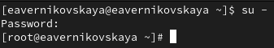{#fig:001 width=70%}

## Управление заданиями

Вводим следующие команды: *sleep 3600 &*, *dd if=/dev/zero of=/dev/null &*, *sleep 7200*    

Так как последнюю команду мы запустили без & (т.е не в фоновом режиме), то у нас есть 2 часа, прежде
чем мы снова получим контроль над оболочкой. Чтобы остановить процесс, мы вводим *ctrl+z* (рис. 2)

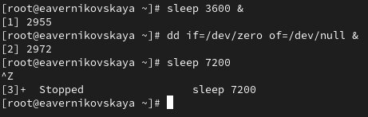{#fig:002 width=70%}

## Управление заданиями

Введя *jobs* мы увидим 3 задания, которые только что запустили. Первые два имеют состояние Running, а последнее задание в настоящее время находится в состоянии Stopped (так как до этого мы его остановили) (рис. 3)

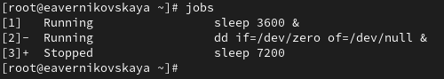{#fig:003 width=70%}

## Управление заданиями

Вводим команду *bg 3*, чтобы продолжить выполнение 3-его задания в фоновом режиме (рис. 4)

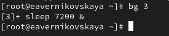{#fig:004 width=70%}

## Управление заданиями

С помощью команды *jobs* смотрим изменения в статусе заданий (рис. 5)

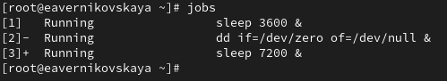{#fig:005 width=70%}

## Управление заданиями

Вводим команду *fg 1* для перемещения задания 1 на передний план. А после вводим *ctrl+c*, чтобы отменить 1-ое задание (рис. 6)

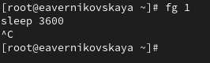{#fig:006 width=70%}

## Управление заданиями

Снова вводим команду *jobs*, чтобы посмотреть изменения в статусе заданий (рис. 7)

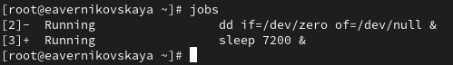{#fig:007 width=70%}

## Управление заданиями

Тоже самое делаем для отмены заданий 2 и 3. Сначала с помощью *fg* перемещаем задания на передний план, а далее отменяем их с помощью *ctrl+c* (рис. 8)

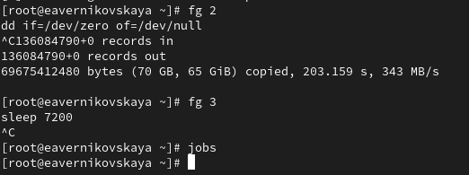{#fig:008 width=70%}

## Управление заданиями

Открываем второй терминал и под учётной записью своего пользователя вводим в нём: *dd if=/dev/zero of=/dev/null &*. Далее закрываем второй терминал (рис. 9), (рис. 10)

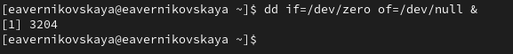{#fig:009 width=70%}

## Управление заданиями

{#fig:010 width=70%}

## Управление заданиями

Снова открываем второй терминал и вводим *top* (команда, которая позволяет пользователям отслеживать процессы и использование системных ресурсов в Linux). Мы увидим что задание dd всё ещё запущено (рис. 11), (рис. 12)

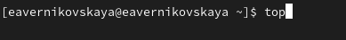{#fig:011 width=70%}

## Управление заданиями

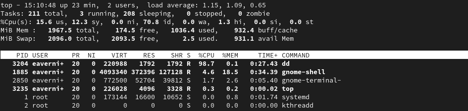{#fig:012 width=70%}

## Управление заданиями

Вводим *k*, чтобы убить задание dd (рис. 13), (рис. 14)

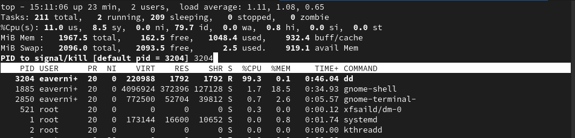{#fig:013 width=70%}

## Управление заданиями

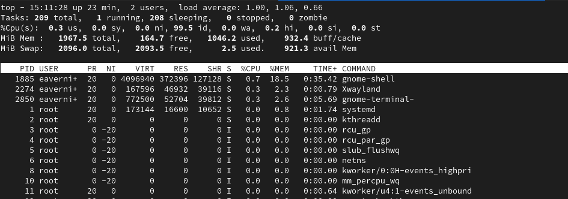{#fig:014 width=70%}

## Управление процессами

Снова получаем права пользователя root и вводим три раза команду *dd if=/dev/zero of=/dev/null &* (рис. 15)

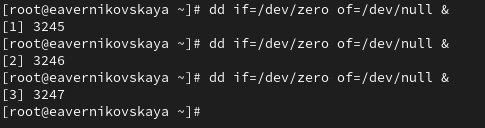{#fig:015 width=70%}

## Управление процессами

Далее вводим *ps aux | grep dd*. Эта команда показывает все строки, в которых есть буквы dd. Запущенные процессы dd идут последними (рис. 16)

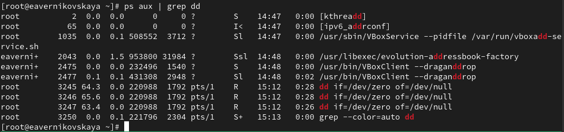{#fig:016 width=70%}

## Управление процессами

Далее используем <PID> (идентификатор процесса в системе) первого процесса dd, чтобы изменить приоритет. <PID> 1-ого процесса равен 3245. Для изменения приоритета используется команда *renice -n 5 <PID>* (рис. 17)

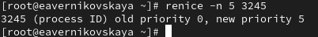{#fig:017 width=70%}

## Управление процессами

Далее вводим *ps fax | grep -B5 dd*. Параметр -B5 показывает соответствующие запросу строки, включая пять строк до этого. Поскольку ps fax показывает иерархию отношений между процессами, мы также можем  увидеть оболочку, из которой были запущены все процессы dd, и её PID (рис. 18)

## Управление процессами

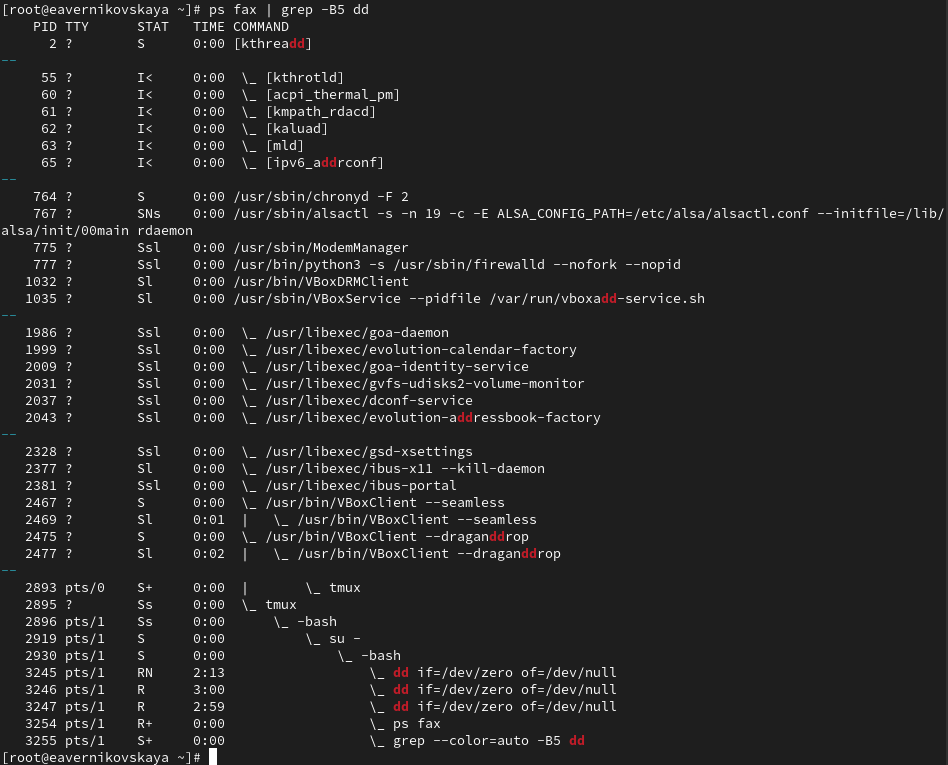{#fig:018 width=60%} 

## Управление процессами

Находим PID корневой оболочки, из которой были запущены процессы dd (это 2919), после вводим *kill -9 <PID>*, заменив в <PID> на значение PID оболочки (т.е на 2919). После ввода этой команды мы увидем, что наша корневая оболочка закрылась, а вместе с ней и все процессы dd. Остановка родительского процесса —
простой и удобный способ остановить все его дочерние процессы (рис. 19)

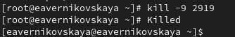{#fig:019 width=70%} 

# Самостоятельная работа

## Задание 1

Запускаем команду *dd if=/dev/zero of=/dev/null* трижды как фоновое задание (рис. 20)

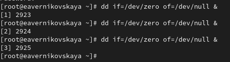{#fig:020 width=70%}

## Задание 1

Увеличиваем приоритет одной из этих команд (например 1-ой), используя значение приоритета −5. После изменяем значение приоритета того же процесса ещё раз, но используя на этот раз значение -15  (рис. 21)

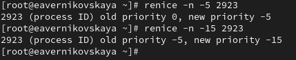{#fig:021 width=70%}

## Задание 1

Завершаем все процессы dd, которые мы запустили командой *killall dd* (рис. 22)

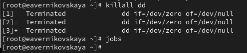{#fig:022 width=70%}

## Задание 2

Запускаем программу yes в фоновом режиме с подавлением потока вывода с помощью команды *yes > /dev/null &* (/dev/null отвечает за подавление потока вывода) (рис. 23)

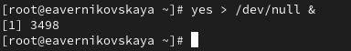{#fig:023 width=70%}

## Задание 2

Далее запускаем программу yes на переднем плане с подавлением потока вывода. После приостанавливаем выполнение программы с помощью *ctrl+z* (рис. 24)

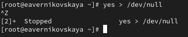{#fig:024 width=70%}

## Задание 2

Заново запускаем программу yes с теми же параметрами командой *fg 2*, затем завершаем её выполнение введя *ctrl+c* (рис. 25), (рис. 26)

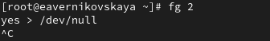{#fig:025 width=70%}

## Задание 2

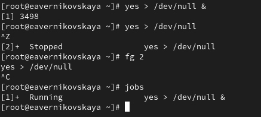{#fig:026 width=70%}

## Задание 2

Запускаем программу yes на переднем плане без подавления потока вывода с помощью команды просто *yes*. После приостанавливаем выполнение программы с помощью *ctrl+z* (рис. 27), (рис. 28]), (рис. 29)

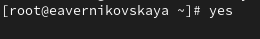{#fig:027 width=70%}

## Задание 2

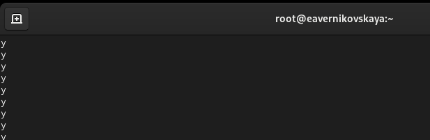{#fig:028 width=70%}

## Задание 2

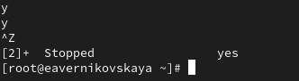{#fig:029 width=70%}

## Задание 2

Заново запускаем программу yes с теми же параметрами командой *fg 2*, затем завершаем её выполнение введя *ctrl+c* (рис. 30), (рис. 31)

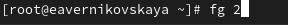{#fig:030 width=70%}

## Задание 2

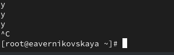{#fig:031 width=70%}

## Задание 2

Проверяем состояния заданий, воспользовавшись командой *jobs* (рис. 32)

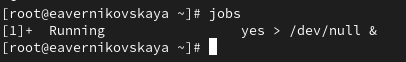{#fig:032 width=70%}

## Задание 2

Переводим процесс, который у нас выполняется в фоновом режиме, на передний план, и затем останавливаем его (комндой *fg1*, а затем  *ctrl+z*) (рис. 33)

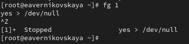{#fig:033 width=70%}

## Задание 2

Переводим любой наш процесс (он у нас один) с подавлением потока вывода в фоновый режим (командой *bg1*) (рис. 34)

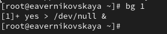{#fig:034 width=70%}

## Задание 2

Снова проверяем состояния заданий, воспользовавшись командой *jobs*. Процесс стал выполняющимся (Running) в фоновом режиме (рис. 35) 

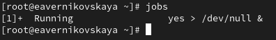{#fig:035 width=70%}

## Задание 2

Далее запускаем процесс в фоновом режиме таким образом, чтобы он продолжил свою работу даже после отключения от терминала. Это можно сделать с помощью команду *nohup*. После закрываем терминал (рис. 36)

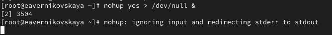{#fig:036 width=70%}

## Задание 2

Заново запускаем консоль и с помощью команды top убеждаемя, что процесс продолжил свою работу (рис. 37)

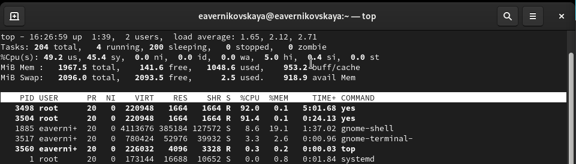{#fig:037 width=70%}

## Задание 2

После запускаем ещё три программы yes в фоновом режиме с подавлением потока вывода (рис. 38)

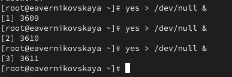{#fig:038 width=70%}

## Задание 2

Убиваем два процесса: для одного используем его PID (*kill -9 3609*), а для другого — его идентификатор конкретного задания (*fg2* + *ctrl+c*) (рис. 39)

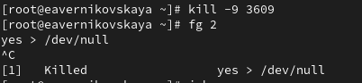{#fig:039 width=70%}

## Задание 2

Далее пробуем послать сигнал 1 (SIGHUP) процессу, запущенному с помощью nohup, и обычному процессу. В первой случае это команда *kill -1 3504*, т.к. PID процесса, запущенного с помощью nohup это 3504. Во втором это команда *kill -1 3611* (PID обычного процесса 3611) (рис. 40)

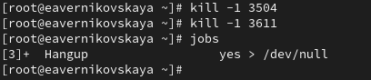{#fig:040 width=70%}

## Задание 2

Запускаем ещё несколько программ yes в фоновом режиме с подавлением потока вывода. После завершаем их работу одновременно, используя команду *killall yes* (рис. 41)

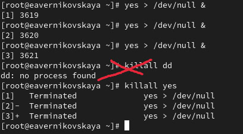{#fig:041 width=60%}

## Задание 2

Запускаем программу yes в фоновом режиме с подавлением потока вывода. Используя
утилиту nice, запускаем программу yes с теми же параметрами и с приоритетом, большим на 5 (рис. 42)

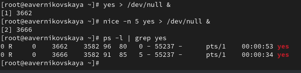{#fig:042 width=70%}

## Задание 2

Используя утилиту renice, меняем приоритет у одного из потоков yes таким образом, чтобы у обоих потоков приоритеты были равны. В нашем случае для этого понижаем приоритет процесса 1 (PID 3662) на 5 с помощью команды *renice -n 5 3662*. Теперь у обоих потоков приоритеты равны. Всё хорошо! (рис. 43)

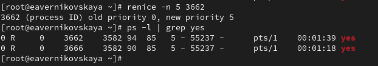{#fig:043 width=70%}

# Подведение итогов

## Выводы

В ходе выполнения лабораторной работы мы получили навыки управления процессами операционной системы

## Список литературы

1. Лаборатораня работа №6 [Электронный ресурс] URL: https://esystem.rudn.ru/pluginfile.php/2400704/mod_resource/content/4/007-process.pdf
