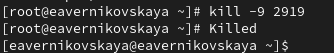
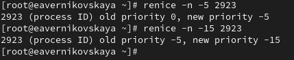

---
## Front matter
title: "Отчёт по лабораторной работе №6"
subtitle: "Дисциплина: Основы администрирования операционных систем"
author: "Верниковская Екатерина Андреевна"

## Generic otions
lang: ru-RU
toc-title: "Содержание"

## Bibliography
bibliography: bib/cite.bib
csl: pandoc/csl/gost-r-7-0-5-2008-numeric.csl

## Pdf output format
toc: true # Table of contents
toc-depth: 2
lof: true # List of figures
lot: true # List of tables
fontsize: 12pt
linestretch: 1.5
papersize: a4
documentclass: scrreprt
## I18n polyglossia
polyglossia-lang:
  name: russian
  options:
	- spelling=modern
	- babelshorthands=true
polyglossia-otherlangs:
  name: english
## I18n babel
babel-lang: russian
babel-otherlangs: english
## Fonts
mainfont: PT Serif
romanfont: PT Serif
sansfont: PT Sans
monofont: PT Mono
mainfontoptions: Ligatures=TeX
romanfontoptions: Ligatures=TeX
sansfontoptions: Ligatures=TeX,Scale=MatchLowercase
monofontoptions: Scale=MatchLowercase,Scale=0.9
## Biblatex
biblatex: true
biblio-style: "gost-numeric"
biblatexoptions:
  - parentracker=true
  - backend=biber
  - hyperref=auto
  - language=auto
  - autolang=other*
  - citestyle=gost-numeric
## Pandoc-crossref LaTeX customization
figureTitle: "Рис."
tableTitle: "Таблица"
listingTitle: "Листинг"
lofTitle: "Список иллюстраций"
lotTitle: "Список таблиц"
lolTitle: "Листинги"
## Misc options
indent: true
header-includes:
  - \usepackage{indentfirst}
  - \usepackage{float} # keep figures where there are in the text
  - \floatplacement{figure}{H} # keep figures where there are in the text
---

# Цель работы

Получить навыки управления процессами операционной системы.

# Задание

1. Продемонстрировать навыки управления заданиями операционной системы
2. Продемонстрировать навыки управления процессами операционной системы
3. Выполнить задания для самостоятельной работы

# Выполнение лабораторной работы

## Управление заданиями

В консоли переходим в режим работы суперпользователя, используя *su -* (рис. [-@fig:001])

{#fig:001 width=70%}

* Вводим следующие команды:
  + *sleep 3600 &*
  + *dd if=/dev/zero of=/dev/null &*
  + *sleep 7200*

Так как последнюю команду мы запустили без & (т.е не в фоновом режиме), то у нас есть 2 часа, прежде
чем мы снова получим контроль над оболочкой. Чтобы остановить процесс, мы вводим *ctrl+z* (рис. [-@fig:002])

{#fig:002 width=70%}

Введя *jobs* мы увидим 3 задания, которые только что запустили. Первые два имеют состояние Running, а последнее задание в настоящее время находится в состоянии Stopped (так как до этого мы его остановили) (рис. [-@fig:003])

{#fig:003 width=70%}

Вводим команду *bg 3*, чтобы продолжить выполнение 3-его задания в фоновом режиме (рис. [-@fig:004])

{#fig:004 width=70%}

С помощью команды *jobs* смотрим изменения в статусе заданий (рис. [-@fig:005])

{#fig:005 width=70%}

Вводим команду *fg 1* для перемещения задания 1 на передний план. А после вводим *ctrl+c*, чтобы отменить 1-ое задание (рис. [-@fig:006])

{#fig:006 width=70%}

Снова вводим команду *jobs*, чтобы посмотреть изменения в статусе заданий (рис. [-@fig:007])

{#fig:007 width=70%}

Тоже самое делаем для отмены заданий 2 и 3. Сначала с помощью *fg* перемещаем задания на передний план, а далее отменяем их с помощью *ctrl+c* (рис. [-@fig:008])

{#fig:008 width=70%}

ОТкрываем второй терминал и под учётной записью своего пользователя вводим в нём: *dd if=/dev/zero of=/dev/null &*. Далее закрываем второй терминал (рис. [-@fig:009]), (рис. [-@fig:010])

{#fig:009 width=70%}

{#fig:010 width=70%}

Снова открываем второй терминал и вводим *top* (команда, которая позволяет пользователям отслеживать процессы и использование системных ресурсов в Linux). Мы увидим что задание dd всё ещё запущено (рис. [-@fig:011]), (рис. [-@fig:012])

{#fig:011 width=70%}

{#fig:012 width=70%}

Вводим *k*, чтобы убить задание dd (рис. [-@fig:013]), (рис. [-@fig:014])

{#fig:013 width=70%}

{#fig:014 width=70%}

## Управление процессами

Снова получаем права пользователя root и вводим три раза команду *dd if=/dev/zero of=/dev/null &* (рис. [-@fig:015])

{#fig:015 width=70%}

Далее вводим *ps aux | grep dd*. Эта команда показывает все строки, в которых есть буквы dd. Запущенные процессы dd идут последними (рис. [-@fig:016])

{#fig:016 width=70%}

Далее используем <PID> (идентификатор процесса в системе) первого процесса dd, чтобы изменить приоритет. <PID> 1-ого процесса равен 3245. Для изменения приоритета используется команда *renice -n 5 <PID>* (рис. [-@fig:017])

{#fig:017 width=70%}

Далее вводим *ps fax | grep -B5 dd*. Параметр -B5 показывает соответствующие запросу строки, включая пять строк до этого. Поскольку ps fax показывает иерархию отношений между процессами, мы также можем  увидеть оболочку, из которой были запущены все процессы dd, и её PID (рис. [-@fig:018])

{#fig:018 width=70%} 

Находим PID корневой оболочки, из которой были запущены процессы dd (это 2919), после вводим *kill -9 <PID>*, заменив в <PID> на значение PID оболочки (т.е на 2919). После ввода этой команды мы увидем, что наша корневая оболочка закрылась, а вместе с ней и все процессы dd. Остановка родительского процесса —
простой и удобный способ остановить все его дочерние процессы (рис. [-@fig:019])

{#fig:019 width=70%} 

# Самостоятельная работа

## Задание 1

Запускаем команду *dd if=/dev/zero of=/dev/null* трижды как фоновое задание (рис. [-@fig:020])

{#fig:020 width=70%}

Увеличиваем приоритет одной из этих команд (например 1-ой), используя значение приоритета −5. После изменяем значение приоритета того же процесса ещё раз, но используя на этот раз значение -15.

Разница между -5 и -15:

- Приоритет -5: Увеличивает приоритет команды, делая ее более "важной" для системы. -5 запустит команду dd с более высоким приоритетом, чем обычный процесс, но не будет сильно влиять на другие приложения
- Приоритет -15: Значительно повышает приоритет, делая команду еще более "важной". -15 запустит dd с очень высоким приоритетом. Это может привести к замедлению других процессов, так как система будет отдавать большую часть ресурсов dd

Чем ниже значение приоритета (более отрицательное), тем выше приоритет процесса (рис. [-@fig:021])

{#fig:021 width=70%}

Завершаем все процессы dd, которые мы запустили командой *killall dd* (рис. [-@fig:022])

{#fig:022 width=70%}

## Задание 2

Запускаем программу yes в фоновом режиме с подавлением потока вывода с помощью команды *yes > /dev/null &* (/dev/null отвечает за подавление потока вывода) (рис. [-@fig:023])

{#fig:023 width=70%}

Далее запускаем программу yes на переднем плане с подавлением потока вывода. После приостанавливаем выполнение программы с помощью *ctrl+z* (рис. [-@fig:024])

{#fig:024 width=70%}

Заново запускаем программу yes с теми же параметрами командой *fg 2*, затем завершаем её выполнение введя *ctrl+c* (рис. [-@fig:025]), (рис. [-@fig:026])

{#fig:025 width=70%}

{#fig:026 width=70%}

Запускаем программу yes на переднем плане без подавления потока вывода с помощью команды просто *yes*. После приостанавливаем выполнение программы с помощью *ctrl+z* (рис. [-@fig:027]), (рис. [-@fig:028]), (рис. [-@fig:029])

{#fig:027 width=70%}

{#fig:028 width=70%}

{#fig:029 width=70%}

Заново запускаем программу yes с теми же параметрами командой *fg 2*, затем завершаем её выполнение введя *ctrl+c* (рис. [-@fig:030]), (рис. [-@fig:031])

{#fig:030 width=70%}

{#fig:031 width=70%}

Проверяем состояния заданий, воспользовавшись командой *jobs* (рис. [-@fig:032])

{#fig:032 width=70%}

Переводим процесс, который у нас выполняется в фоновом режиме, на передний план, и затем останавливаем его (комндой *fg1*, а затем  *ctrl+z*) (рис. [-@fig:033])

{#fig:033 width=70%}

Переводим любой наш процесс (он у нас один) с подавлением потока вывода в фоновый режим (командой *bg1*) (рис. [-@fig:034])

{#fig:034 width=70%}

Снова проверяем состояния заданий, воспользовавшись командой *jobs*. Процесс стал выполняющимся (Running) в фоновом режиме (рис. [-@fig:035]) 

{#fig:035 width=70%}

Далее запускаем процесс в фоновом режиме таким образом, чтобы он продолжил свою работу даже после отключения от терминала. Это можно сделать с помощью команду *nohup*. После закрываем терминал (рис. [-@fig:036])

{#fig:036 width=70%}

Заново запускаем консоль и с помощью команды top убеждаемя, что процесс продолжил свою работу (рис. [-@fig:037])

{#fig:037 width=70%}

После запускаем ещё три программы yes в фоновом режиме с подавлением потока вывода (рис. [-@fig:038])

{#fig:038 width=70%}

Убиваем два процесса: для одного используем его PID (*kill -9 3609*), а для другого — его идентификатор конкретного задания (*fg2* + *ctrl+c*) (рис. [-@fig:039])

{#fig:039 width=70%}

Далее пробуем послать сигнал 1 (SIGHUP) процессу, запущенному с помощью nohup, и обычному процессу. В первой случае это команда *kill -1 3504*, т.к. PID процесса, запущенного с помощью nohup это 3504. Во втором это команда *kill -1 3611* (PID обычного процесса 3611) (рис. [-@fig:040])

{#fig:040 width=70%}

Запускаем ещё несколько программ yes в фоновом режиме с подавлением потока вывода. После завершаем их работу одновременно, используя команду *killall yes* (рис. [-@fig:041])

{#fig:041 width=70%}

Запускаем программу yes в фоновом режиме с подавлением потока вывода. Используя
утилиту nice, запускаем программу yes с теми же параметрами и с приоритетом, большим на 5

Абсолютный приоритет определяется ядром операционной системы и показывает, с каким приоритетом выполняет процесс. Относительный приоритет является тем значением, которое может быть установленo пользователем для управления тем, как процесс будет приоритизироваться системой

Процесс 1 (PID 3662):

- Абсолютный приоритет: 80 
- Относительный приоритет: 0

Процесс 1 имеет более высокий абсолютный приоритет (80), чем процесс 2 (85)

Процесс 2 (PID 3666):

- Абсолютный приоритет: 85 
- Относительный приоритет: 5

Процесс 2 имеет более низкий приоритет, потому что он был понижен с помощью команды nice (рис. [-@fig:042])

{#fig:042 width=70%}

Используя утилиту renice, меняем приоритет у одного из потоков yes таким образом, чтобы у обоих потоков приоритеты были равны. В нашем случае для этого понижаем приоритет процесса 1 (PID 3662) на 5 с помощью команды *renice -n 5 3662* (рис. [-@fig:043])

{#fig:043 width=70%}

Теперь у обоих потоков приоритеты равны. Всё хорошо!

# Контрольные вопросы + ответы

1. Какая команда даёт обзор всех текущих заданий оболочки?

jobs

2. Как остановить текущее задание оболочки, чтобы продолжить его выполнение в фоновом режиме?

bg номер_задания

3. Какую комбинацию клавиш можно использовать для отмены текущего задания оболочки?

ctrl+c

4. Необходимо отменить одно из начатых заданий. Доступ к оболочке, в которой в данный момент работает пользователь, невозможен. Что можно сделать, чтобы отменить задание?

Внутри top использовать k, чтобы убить задание

5. Какая команда используется для отображения отношений между родительскими и дочерними процессами?

ps fax

6. Какая команда позволит изменить приоритет процесса с идентификатором 1234 на более высокий?

renice -n -приоритет_процесса 1234

7. В системе в настоящее время запущено 20 процессов dd. Как проще всего остановить их все сразу?

killall dd

8. Какая команда позволяет остановить команду с именем mycommand?

Сначала узнаем PID процесса mycommand -ps aux | grep mycommand. Далее останавливаем с помощью команды kill -9 <PID>.

9. Какая команда используется в top, чтобы убить процесс?

k

10. Как запустить команду с достаточно высоким приоритетом, не рискуя, что не хватит ресурсов для других процессов?

Запустить в фоновом режиме

# Выводы

В ходе выполнения лабораторной работы мы получили навыки управления процессами операционной системы

# Список литературы

1. Лаборатораня работа №6 [Электронный ресурс] URL: https://esystem.rudn.ru/pluginfile.php/2400704/mod_resource/content/4/007-process.pdf
