---
## Front matter
lang: ru-RU
title: Лабораторная работа №7
subtitle: Основы администрирования операционных систем
author:
  - Верниковская Е. А., НПИбд-01-23
institute:
  - Российский университет дружбы народов, Москва, Россия
date: 17 октября 2024

## i18n babel
babel-lang: russian
babel-otherlangs: english

## Formatting pdf
toc: false
toc-title: Содержание
slide_level: 2
aspectratio: 169
section-titles: true
theme: metropolis
header-includes:
 - \metroset{progressbar=frametitle,sectionpage=progressbar,numbering=fraction}
 - '\makeatletter'
 - '\beamer@ignorenonframefalse'
 - '\makeatother'
 
## Fonts
mainfont: PT Serif
romanfont: PT Serif
sansfont: PT Sans
monofont: PT Mono
mainfontoptions: Ligatures=TeX
romanfontoptions: Ligatures=TeX
sansfontoptions: Ligatures=TeX,Scale=MatchLowercase
monofontoptions: Scale=MatchLowercase,Scale=0.9
---

# Вводная часть

## Цель работы

Получить навыки работы с журналами мониторинга различных событий в системе.

## Задание

1. Продемонстрировать навыки работы с журналом мониторинга событий в реальном времени 
2. Продемонстрировать навыки создания и настройки отдельного файла конфигурации мониторинга отслеживания событий веб-службы 
3. Продемонстрировать навыки работы с journalctl
4. Продемонстрировать навыки работы с journald 

# Выполнение лабораторной работы

## Мониторинг журнала системных событий в реальном времени

Запускаем три вкладки терминала и в каждой из них получаем полномочия суперпользователя, используя *su -* (рис. 1)

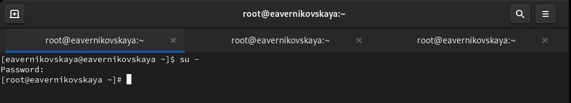{#fig:001 width=70%}

## Мониторинг журнала системных событий в реальном времени

На второй вкладке терминала запустите мониторинг системных событий в реальном времени, с помощью *tail -f /var/log/messages* (рис. 2)

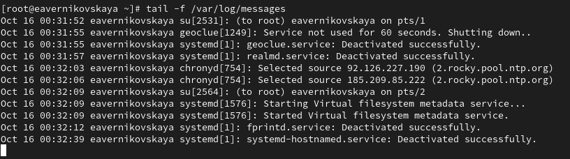{#fig:002 width=70%}

## Мониторинг журнала системных событий в реальном времени

В третьей вкладке терминала возвращаемся к учётной записи своего пользователя (для этого нажимаем ctrl+d) и пробуем получить полномочия администратора, но на этот раз вводим неправильный пароль (рис. 3)

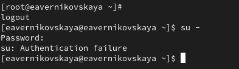{#fig:003 width=70%}

## Мониторинг журнала системных событий в реальном времени

Во второй вкладке терминала с мониторингом событий после неудачной попытки получить права администратора появится сообщение «FAILED SU (to root) username ...» (рис. 4)

{#fig:004 width=70%}

## Мониторинг журнала системных событий в реальном времениs

В третьей вкладке терминала из оболочки пользователя вводим *logger hello* (рис. 5])

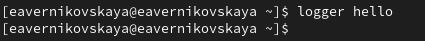{#fig:005 width=70%}

## Мониторинг журнала системных событий в реальном времени

Во второй вкладке терминала с мониторингом событий мы увидим сообщение, которое до этого написали с помощью *logger* (рис. 6)

{#fig:006 width=70%}

## Мониторинг журнала системных событий в реальном времени

Во второй вкладке терминала с мониторингом останавливаем трассировку файла сообщений мониторинга реального времени, используя ctrl+c, а затем запускаем мониторинг сообщений безопасности (последние 20 строк соответствующего файла логов), с помощью *tail -n 20 /var/log/secure*. Там мы увидим сообщения, которые ранее были зафиксированы во время ошибки авторизации при вводе команды su (рис. 7)

## Мониторинг журнала системных событий в реальном времени

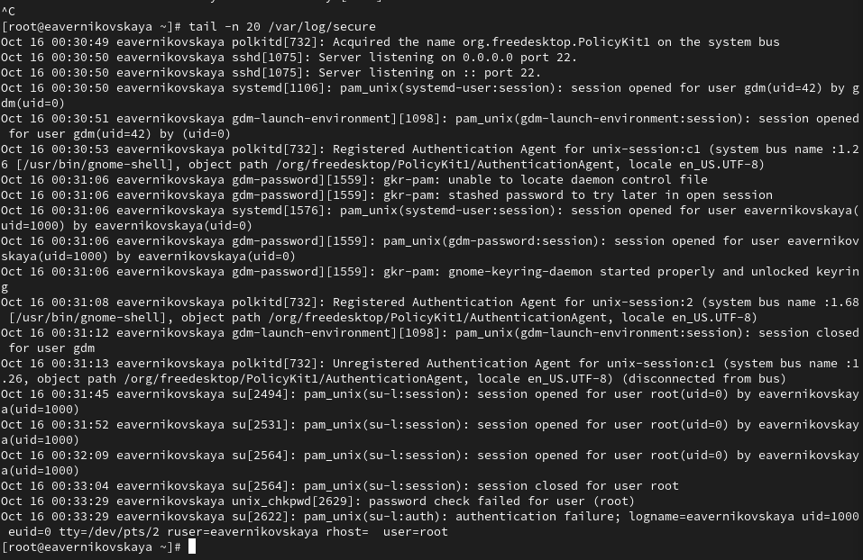{#fig:007 width=70%}

## Изменение правил rsyslog.conf

По умолчанию веб-служба не регистрирует свои сообщения через rsyslog, а пишет свой собственный журнал (в каталоге /var/log/httpd). Настроим регистрацию сообщений веб-службы через syslog, создав правило, регистрирующее отладочные сообщения в отдельном лог-файле.

## Изменение правил rsyslog.conf

В первой вкладке терминала установим Apache командой *dnf -y install httpd* (рис. 8)

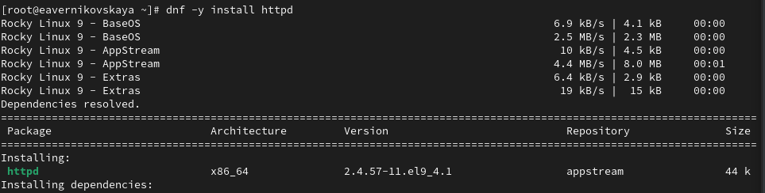{#fig:008 width=70%} 

## Изменение правил rsyslog.conf

После окончания процесса установки запускаем веб-служб командами *systemctl start httpd* и *systemctl enable httpd* (рис. 9)

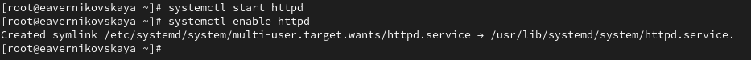{#fig:009 width=70%} 

## Изменение правил rsyslog.conf

Во второй вкладке терминала посмотрим журнал сообщений об ошибках веб-службы, с помощью *tail -f /var/log/httpd/error_log*. Для закрытия используем ctrl+c (рис. 10)

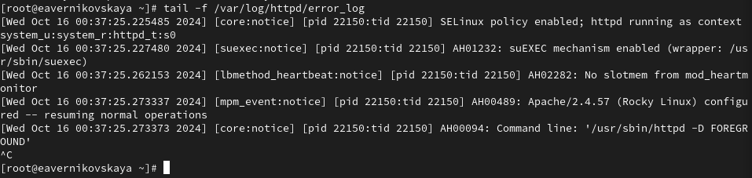{#fig:010 width=70%}

## Изменение правил rsyslog.conf

В третьей вкладке терминала получаем полномочия администратора и в файле конфигурации /etc/httpd/conf/httpd.conf в конце добавляем строку *ErrorLog syslog:local1*. Добавление этой строки в конец файла конфигурации изменит способ регистрации ошибок веб-сервера. Ошибки будут отправляться на систему журналирования через syslog в локальную категорию local1 (рис. 11), (рис. 12)

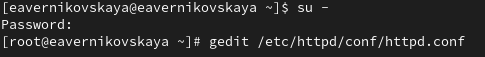{#fig:011 width=70%}

## Изменение правил rsyslog.conf

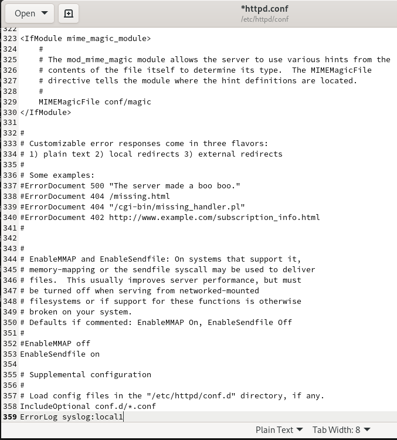{#fig:012 width=40%}

## Изменение правил rsyslog.conf

Далее в каталоге /etc/rsyslog.d создаём файл мониторинга событий веб-службы (рис. 13)

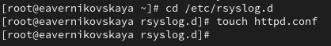{#fig:013 width=70%}

## Изменение правил rsyslog.conf

Открыв его на редактирование, прописываем в нём строку local1.* -/var/log/httpd-error.log. Эта строка позволит отправлять все сообщения, получаемые для объекта local1 (который теперь используется службой httpd), в файл /var/log/httpd-error.log (рис. 14), (рис. 15)

{#fig:014 width=70%}

## Изменение правил rsyslog.conf

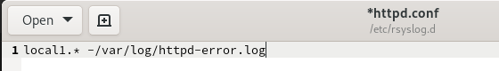{#fig:015 width=70%}

## Изменение правил rsyslog.conf

Переходим в первую вкладку терминала и перезагружаем конфигурацию rsyslogd и веб-службу команжой *systemctl restart*. Все сообщения об ошибках веб-службы теперь будут записаны в файл
/var/log/httpd-error.log, что можно наблюдать или в режиме реального времени, используя команду tail с соответствующими параметрами, или непосредственно просматривая указанный файл (рис. 16)

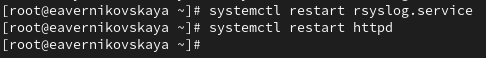{#fig:016 width=70%}

## Изменение правил rsyslog.conf

В третьей вкладке терминала создаём отдельный файл конфигурации для мониторинга отладочной информации (рис. 17)

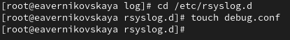{#fig:017 width=70%}

## Изменение правил rsyslog.conf

В этом же терминале пишем команду echo "*.debug /var/log/messages-debug" > /etc/rsyslog.d/debug.conf (рис. 18)

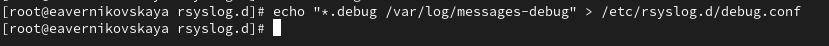{#fig:018 width=70%}

## Изменение правил rsyslog.conf

В первой вкладке терминала снова перезапускаем rsyslogd (рис. 19)

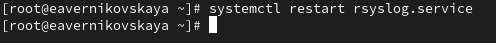{#fig:019 width=70%}

## Изменение правил rsyslog.conf

Во второй вкладке терминала запускаем мониторинг отладочной информации с помощью *tail -f /var/log/messages-debug* (рис. 20)

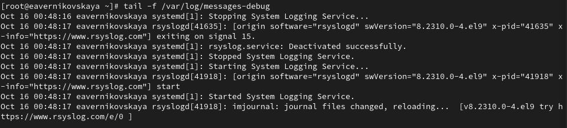{#fig:020 width=70%}

## Изменение правил rsyslog.conf

В третьей вкладке терминала вводим *logger -p daemon.debug "Daemon Debug Message"* (рис. 21)

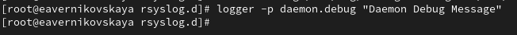{#fig:021 width=70%}

## Изменение правил rsyslog.conf
 
После этого мы увидим в терминале с мониторингом отладочной информации наше сообщение, которое мы создали с помощью *logger* (рис. 22)

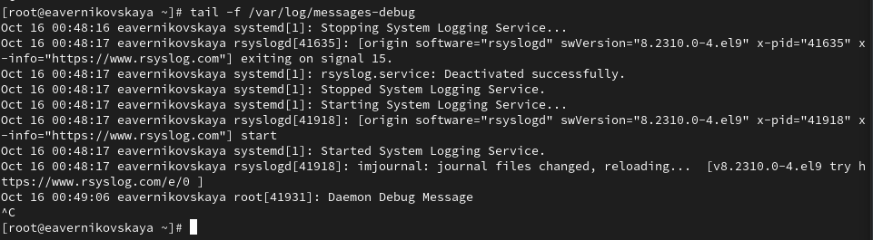{#fig:022 width=70%}

## Использование journalctl

Во второй вкладке терминала посмотрим содержимое журнала с событиями с момента последнего запуска системы  с помощью *journalctl* (рис. 23)

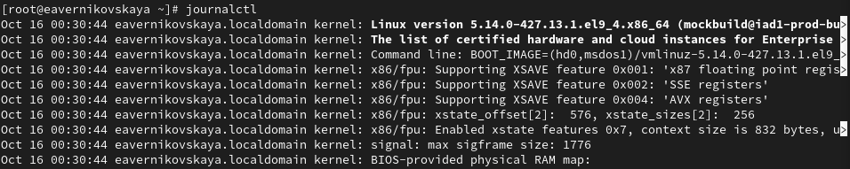{#fig:023 width=70%}

## Использование journalctl

Далее посмотрим содержимоге журнала без использования пейджера с помощью *journalctl --no-pager*. Это означает, что вывод соообщений будет отображатся сразу весь, без возможности прокручивания содержимого (рис. 24)

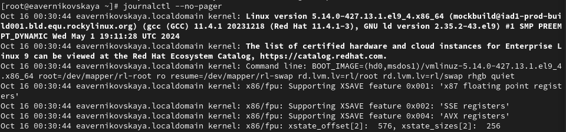{#fig:024 width=70%}

## Использование journalctl

Далее посмотрим журнал в реальном времени командой *journalctl -f*. Для прерывания просмотра используем также ctrl+c (рис. 25)

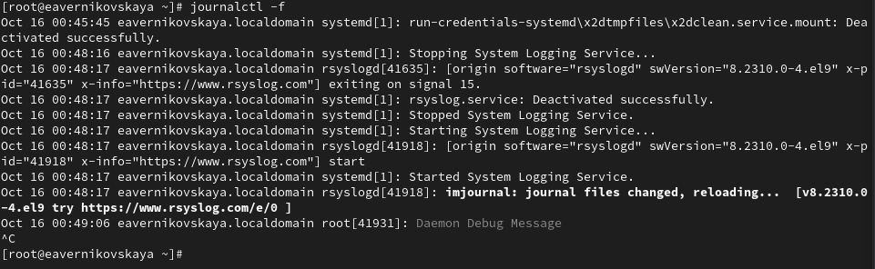{#fig:025 width=70%}

## Использование journalctl

Для использования фильтрации просмотра конкретных параметров журнала вводим *journalctl* и дважды нажимаем на клавишу *Tab* (рис. 26)

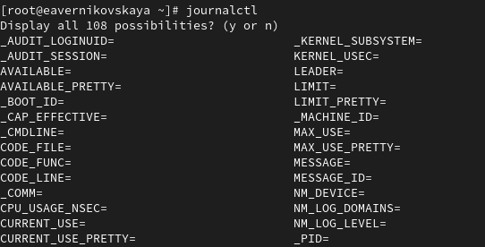{#fig:026 width=70%}

## Использование journalctl

Смотрим события UID0 командой *journalctl _UID=0* (рис. 27)

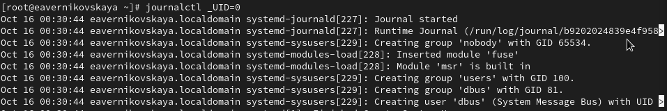{#fig:027 width=70%}

## Использование journalctl

Для отображения последних 20 строк журнала вводим команду *journalctl -n 20* (рис. 28)

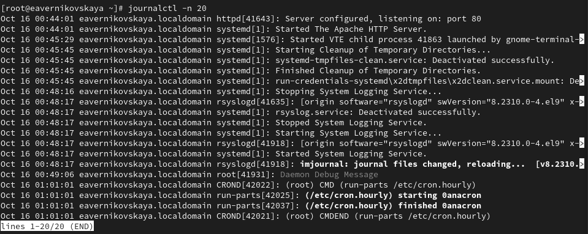{#fig:028 width=70%}

## Использование journalctl

Для просмотра только сообщений об ошибках вводим *journalctl -p err* (рис. 29)

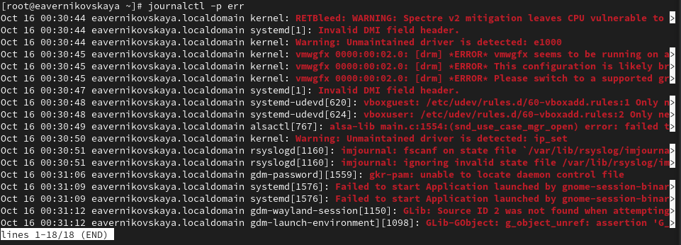{#fig:029 width=70%}

## Использование journalctl

Если мы хотим просмотреть сообщения журнала, записанные за определённый период времени, мы можем использовать параметры --since и --until. Обе опции принимают параметр времени в формате YYYY-MM-DD hh:mm:ss. Кроме того, мы можем использовать yesterday, today и tomorrow в качестве параметров.

## Использование journalctl

Для просмотра всех сообщений со вчерашнего дня вводим *journalctl --since yesterday* (рис. 30)

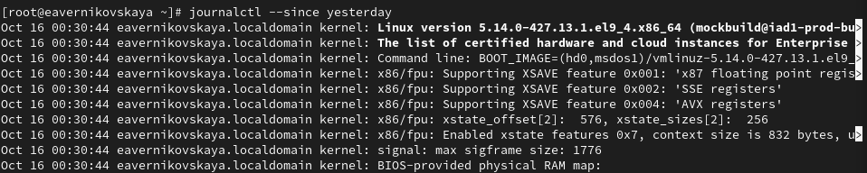{#fig:030 width=70%}

## Использование journalctl

Далее просматриваем все сообщения с ошибкой приоритета, которые были зафиксированы со вчерашнего дня. Для этого используем команду *journalctl --since yesterday -p err* (рис. 31)

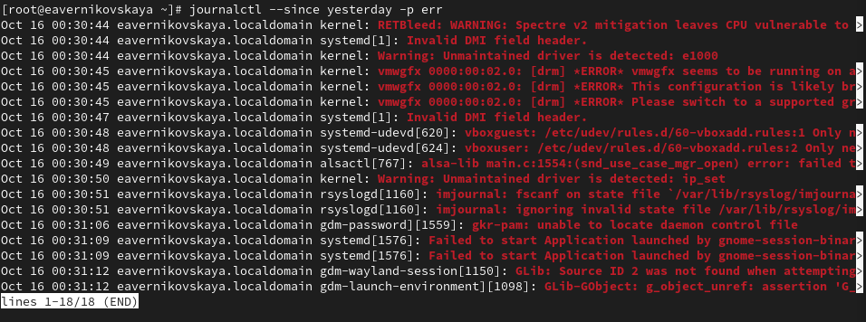{#fig:031 width=70%}

## Использование journalctl

Посмотрим детальную информацию с помощью *journalctl -o verbose* (рис. 32)

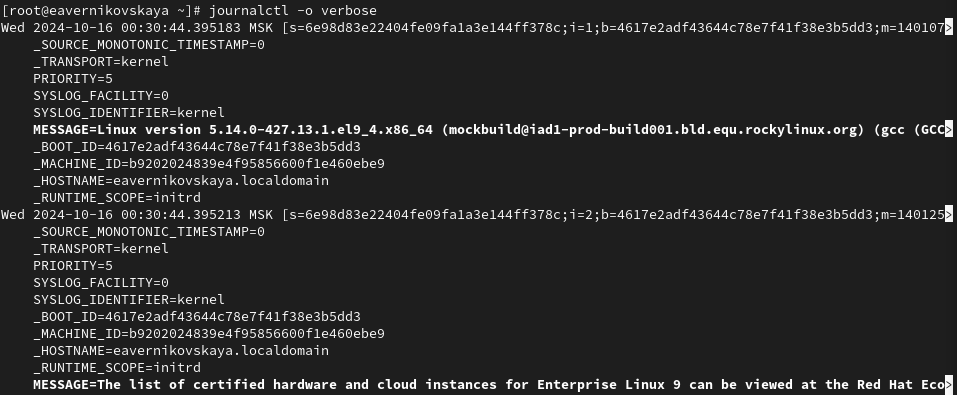{#fig:032 width=70%}

## Использование journalctl

Для просмотра дополнительной информации о модуле sshd вводим *journalctl _SYSTEMD_UNIT=sshd.service* (рис. 33)

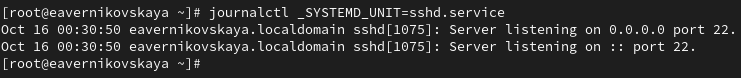{#fig:033 width=70%}

## Постоянный журнал journald

Запускаем терминал и получаем полномочия администратора (рис. 34)

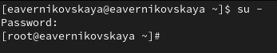{#fig:034 width=70%}

## Постоянный журнал journald

Создаём каталог для хранения записей журнала *mkdir -p /var/log/journal* (рис. 35)

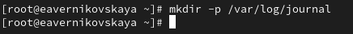{#fig:035 width=70%}

## Постоянный журнал journald

Скорректируем права доступа для каталога /var/log/journal, чтобы journald смог записывать в него информацию. Для этого введём команды *chown root:systemd-journal /var/log/journal* и *chmod 2755 /var/log/journal* (рис. 36)

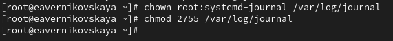{#fig:036 width=70%}

## Постоянный журнал journald

Для принятия изменений необходимо или перезагрузить систему (перезапустить
службу systemd-journald недостаточно), или использовать команду *killall -USR1 systemd-journald*, что мы и делаем (рис. 37)

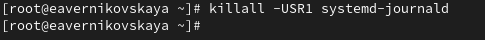{#fig:037 width=70%}

## Постоянный журнал journald

Журнал systemd теперь постоянный. Теперь посмотрим сообщения журнала с момента последней перезагрузки с помошью команды *journalctl -b*  (рис. 38)

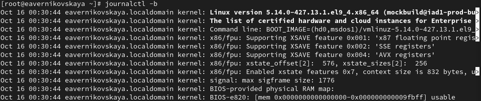{#fig:038 width=70%}

# Подведение итогов

## Выводы

В ходе выполнения лабораторной работы мы получили навыки работы с журналами мониторинга различных событий в системе.

## Список литературы

1. Лаборатораня работа №7 [Электронный ресурс] URL: https://esystem.rudn.ru/pluginfile.php/2400710/mod_resource/content/4/008-syslog.pdf
