---
## Front matter
lang: ru-RU
title: Лабораторная работа №8
subtitle: Основы администрирования операционных систем
author:
  - Верниковская Е. А., НПИбд-01-23
institute:
  - Российский университет дружбы народов, Москва, Россия
date: 25 октября 2024

## i18n babel
babel-lang: russian
babel-otherlangs: english

## Formatting pdf
toc: false
toc-title: Содержание
slide_level: 2
aspectratio: 169
section-titles: true
theme: metropolis
header-includes:
 - \metroset{progressbar=frametitle,sectionpage=progressbar,numbering=fraction}
 - '\makeatletter'
 - '\beamer@ignorenonframefalse'
 - '\makeatother'
 
## Fonts
mainfont: PT Serif
romanfont: PT Serif
sansfont: PT Sans
monofont: PT Mono
mainfontoptions: Ligatures=TeX
romanfontoptions: Ligatures=TeX
sansfontoptions: Ligatures=TeX,Scale=MatchLowercase
monofontoptions: Scale=MatchLowercase,Scale=0.9
---

# Вводная часть

## Цель работы

Получение навыков работы с планировщиками событий cron и at.

## Задание

1. Выполнить задания по планированию задач с помощью crond
2. Выполнить задания по планированию задач с помощью atd 

# Выполнение лабораторной работы

## Планирование задач с помощью cron

Запускаем терминала и получаем полномочия суперпользователя, используя *su -* (рис. 1)

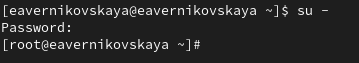{#fig:001 width=70%}

## Планирование задач с помощью cron

Смотрим статус демона crond с помощью *systemctl status crond -l* (рис. 2)

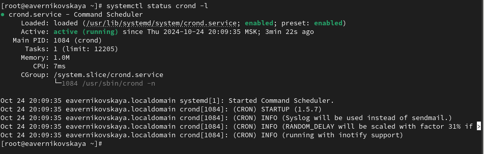{#fig:002 width=70%}

## Планирование задач с помощью cron

Далее смотрим содержимое файла конфигурации /etc/crontab (рис. 3)

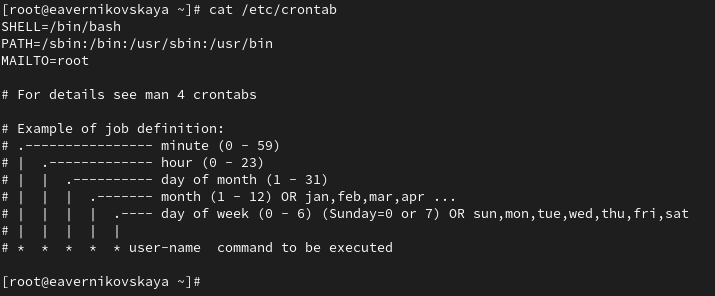{#fig:003 width=70%}

## Планирование задач с помощью cron

Далее смотрим список заданий в расписании: *crontab -l*. Ничего не отобразится, так как расписание ещё не задано (рис. 4)

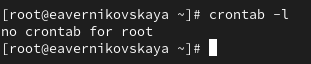{#fig:004 width=70%}

## Планирование задач с помощью cron

Открываем файл расписания на редактирование: *crontab -e* (рис. 5), (рис. 6)

{#fig:005 width=70%}

## Планирование задач с помощью cron

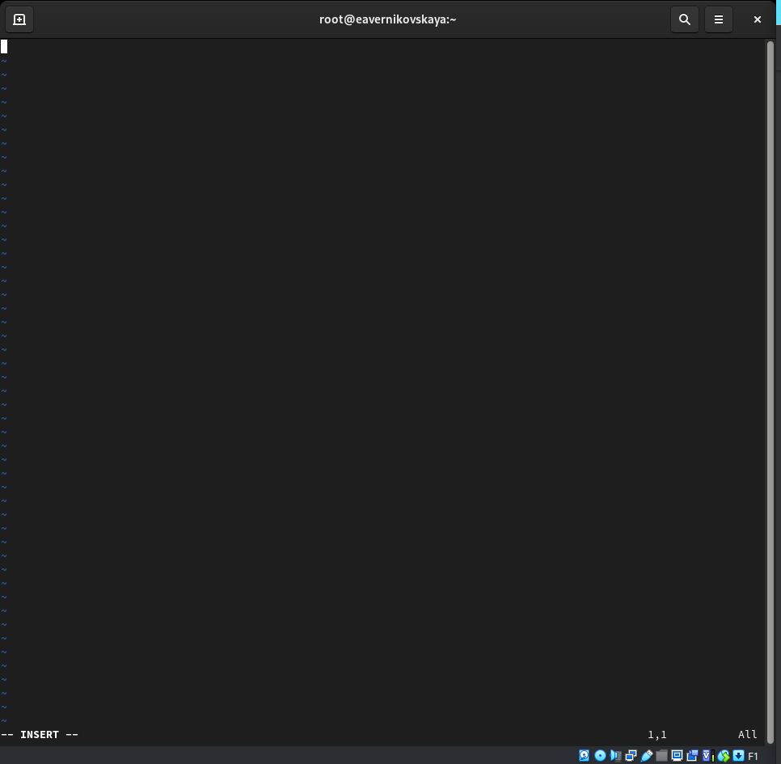{#fig:006 width=50%}

## Планирование задач с помощью cron

Команда *crontab -e* запустит интерфейс редактора (по умолчанию используется vi). Добавляем следующую строку в файл расписания (запись сообщения в системный журнал), используя клавишу Ins для перехода в vi в режим ввода: */1 * * * * logger This message is written from root cron (рис. 7)

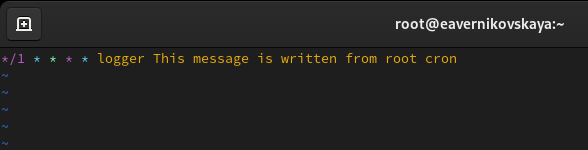{#fig:007 width=70%}

## Планирование задач с помощью cron

Закрываем сеанс редактирования vi и сохраняем изменения, используя команду vi: *Esc : w q* (рис. 8)

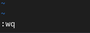{#fig:008 width=70%}

## Планирование задач с помощью cron

Пояснения к синтаксису записи в crontab:

1. */1: Это поле для минут. Значение */1 означает, что задача будет выполняться каждую минуту 
2. *: Поле для часов.  Значение * означает, что задача будет выполняться каждый час
3. *: Поле для дня месяца. * означает, что задача будет выполняться каждый день месяца
4. *: Поле для месяца. * означает, что задача будет выполняться каждый месяц
5. *: Поле для дня недели. * означает, что задача будет выполняться каждый день недели.
6. logger This message is written from root cron.:  Это команда, которую нужно выполнить.  logger  - стандартная команда в Unix/Linux системах, которая пишет сообщения в системный журнал

## Планирование задач с помощью cron

Посмотрим список заданий в расписании с помощью *crontab -*. В расписании появилась запись о запланированном событии (рис. 9)

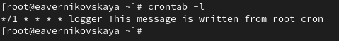{#fig:009 width=70%}

## Планирование задач с помощью cron

Не выключая систему, через некоторое время (2–3 минуты) посмотрим журнал системных событий: *grep written /var/log/messages*. Мы видим что каждую минуту выполнялась команда logger "This message is written from root cron.", которая каждую минуту записывала сообщение в системный журнал (рис. 10)

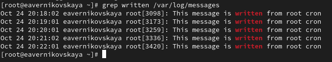{#fig:010 width=70%}

## Планирование задач с помощью cron

Далее меняем запись в расписании crontab на следующую: 0 */1 * * 1-5 logger This message is written from root cron (рис. 11)

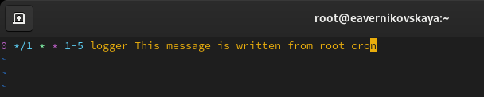{#fig:011 width=70%}

## Планирование задач с помощью cron

Пояснения к синтаксису записи в crontab:

1. 0: Это поле для минут.  Значение 0 означает, что задача будет выполняться в начале каждого часа (в 00 минут)
2. */1: Поле для часов. Значение */1 означает, что задача будет выполняться  каждый час
3. *: Поле для дня месяца.  Значение * означает, что задача будет выполняться каждый день месяца
4. *: Поле для месяца.  Значение * означает, что задача будет выполняться каждый месяц
5. 1-5: Поле для дня недели. 1-5 означает, что задача будет выполняться с понедельника по пятницу (1 - понедельник, 7 - воскресенье)
6. logger This message is written from root cron.:  Это команда, которую нужно выполнить

## Планирование задач с помощью cron

Снова посмотрим список заданий в расписании (рис. 12)

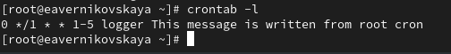{#fig:012 width=70%}

## Планирование задач с помощью cron

Преходим в каталог /etc/cron.hourly и создайте в нём файл сценария с именем eachhour (рис. 13)

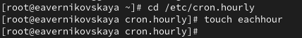{#fig:013 width=70%}

## Планирование задач с помощью cron

Открываем файл eachhour для редактирования и прописываем в нём следующий скрипт (запись сообщения в системный журнал): (рис. 14), (рис. 15), (рис. 16) 

```
#!/bin/sh
logger This message is written at $(date)
```

## Планирование задач с помощью cron

{#fig:014 width=70%}

## Планирование задач с помощью cron

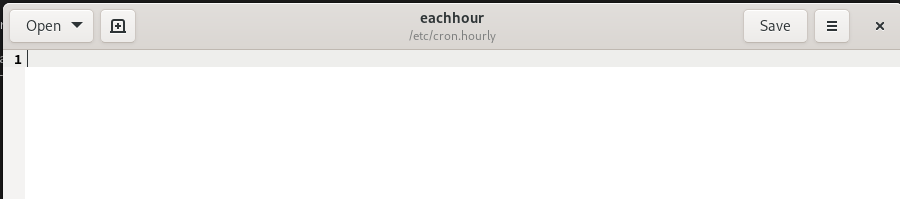{#fig:015 width=70%}

## Планирование задач с помощью cron

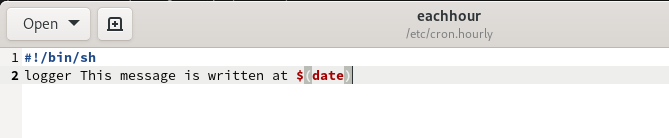{#fig:016 width=70%}

## Планирование задач с помощью cron

Делаем файл сценария eachhour исполняемым: *chmod +x eachhour* (рис. 17)

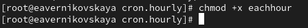{#fig:017 width=70%}

## Планирование задач с помощью cron

Теперь переходим в каталог /etc/crond.d и создаём в нём файл с расписанием eachhour (рис. 18)

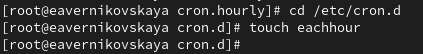{#fig:018 width=70%}

## Планирование задач с помощью cron

Открываем этот файл для редактирования и помещаем в него следующее содержимое: 11 * * * * root logger This message is written from /etc/cron.d (рис. 19), (рис. 20), (рис. 21)

{#fig:019 width=70%}

## Планирование задач с помощью cron

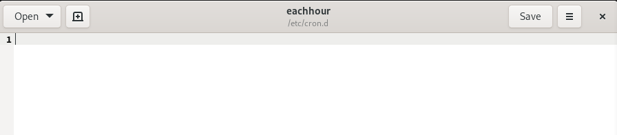{#fig:020 width=70%}

## Планирование задач с помощью cron

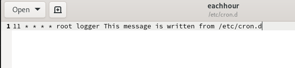{#fig:021 width=70%}

## Планирование задач с помощью cron

Пояснения к синтаксису записи:

1. 11:  Это поле для минут. Значение 11 означает, что задача будет выполняться в 11 минут каждого часа
2. *:  Поле для часов. Значение * означает, что задача будет выполняться каждый час
3. *:  Поле для дня месяца. Значение * означает, что задача будет выполняться каждый день месяца
4. *:  Поле для месяца. Значение * означает, что задача будет выполняться каждый месяц
5. *:  Поле для дня недели. Значение * означает, что задача будет выполняться каждый день недели
6. root:  Это поле для пользователя, от имени которого будет выполняться команда
7. logger This message is written from /etc/cron.d:  Это команда, которую нужно выполнить

## Планирование задач с помощью cron

Не выключая систему, через некоторое время (2–3 часа) посмотрим журнал системных событий. Мы видим что сообщение *This message is written from root cron* записывалось в журнал каждый час, а сообщение *This message is written from /etc/cron.d* записывалось в журнал каждую минуту с 11-ой по 12-ую каждого часа (рис. 22)

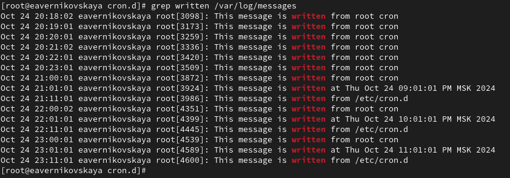{#fig:022 width=70%}

## Планирование заданий с помощью at

ПРоверяем, что служба atd загружена и включена:*systemctl status atd* (рис. 23)

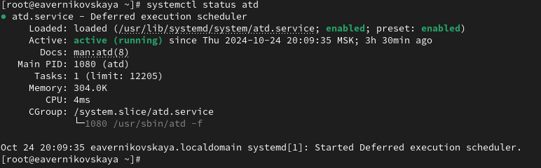{#fig:023 width=70%}

## Планирование заданий с помощью at

Задаём выполнение команды *logger message from at в 23:43*. Для этого вводим сначала *at 23:43*, а затем *logger message from at*. После нажимаем ctrl+d чтобы закрыть оболочку (рис. 24)

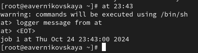{#fig:024 width=70%}

## Планирование заданий с помощью at

Убедимся, что задание действительно запланировано с помощью *atq* (рис. 25)

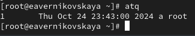{#fig:025 width=70%}

## Планирование заданий с помощью at

С помощью команды grep 'from at' /var/log/messages посмотрим, появилось ли соответствующее сообщение в лог-файле в указанное нами время (рис. 26)

{#fig:026 width=70%}

# Подведение итогов

## Выводы

В ходе выполнения лабораторной работы мы получили навыки работы с планировщиками событий cron и at.

## Список литературы

1. Лаборатораня работа №8 [Электронный ресурс] URL: https://esystem.rudn.ru/pluginfile.php/2400716/mod_resource/content/4/009-scheduling.pdf
