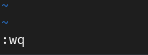

---
## Front matter
title: "Отчёт по лабораторной работе №8"
subtitle: "Дисциплина: Основы администрирования операционных систем"
author: "Верниковская Екатерина Андреевна"

## Generic otions
lang: ru-RU
toc-title: "Содержание"

## Bibliography
bibliography: bib/cite.bib
csl: pandoc/csl/gost-r-7-0-5-2008-numeric.csl

## Pdf output format
toc: true # Table of contents
toc-depth: 2
lof: true # List of figures
lot: true # List of tables
fontsize: 12pt
linestretch: 1.5
papersize: a4
documentclass: scrreprt
## I18n polyglossia
polyglossia-lang:
  name: russian
  options:
	- spelling=modern
	- babelshorthands=true
polyglossia-otherlangs:
  name: english
## I18n babel
babel-lang: russian
babel-otherlangs: english
## Fonts
mainfont: PT Serif
romanfont: PT Serif
sansfont: PT Sans
monofont: PT Mono
mainfontoptions: Ligatures=TeX
romanfontoptions: Ligatures=TeX
sansfontoptions: Ligatures=TeX,Scale=MatchLowercase
monofontoptions: Scale=MatchLowercase,Scale=0.9
## Biblatex
biblatex: true
biblio-style: "gost-numeric"
biblatexoptions:
  - parentracker=true
  - backend=biber
  - hyperref=auto
  - language=auto
  - autolang=other*
  - citestyle=gost-numeric
## Pandoc-crossref LaTeX customization
figureTitle: "Рис."
tableTitle: "Таблица"
listingTitle: "Листинг"
lofTitle: "Список иллюстраций"
lotTitle: "Список таблиц"
lolTitle: "Листинги"
## Misc options
indent: true
header-includes:
  - \usepackage{indentfirst}
  - \usepackage{float} # keep figures where there are in the text
  - \floatplacement{figure}{H} # keep figures where there are in the text
---

# Цель работы

Получение навыков работы с планировщиками событий cron и at.

# Задание

1. Выполнить задания по планированию задач с помощью crond
2. Выполнить задания по планированию задач с помощью atd 

# Выполнение лабораторной работы

## Планирование задач с помощью cron

Запускаем терминала и получаем полномочия суперпользователя, используя *su -* (рис. [-@fig:001])

{#fig:001 width=70%}

Смотрим статус демона crond с помощью *systemctl status crond -l* (рис. [-@fig:002])

{#fig:002 width=70%}

Далее смотрим содержимое файла конфигурации /etc/crontab (рис. [-@fig:003])

{#fig:003 width=70%}

Далее смотрим список заданий в расписании: *crontab -l*. Ничего не отобразится, так как расписание ещё не задано (рис. [-@fig:004])

{#fig:004 width=70%}

Открываем файл расписания на редактирование: *crontab -e* (рис. [-@fig:005]), (рис. [-@fig:006])

{#fig:005 width=70%}

{#fig:006 width=70%}

Команда *crontab -e* запустит интерфейс редактора (по умолчанию используется vi). Добавляем следующую строку в файл расписания (запись сообщения в системный журнал), используя клавишу Ins для перехода в vi в режим ввода: */1 * * * * logger This message is written from root cron (рис. [-@fig:007])

{#fig:007 width=70%}

Закрываем сеанс редактирования vi и сохраняем изменения, используя команду vi: *Esc : w q* (рис. [-@fig:008])

{#fig:008 width=70%}

Пояснения к синтаксису записи в crontab:

1. */1: Это поле для минут. Значение */1 означает, что задача будет выполняться каждую минуту 
2. *: Поле для часов.  Значение * означает, что задача будет выполняться каждый час
3. *: Поле для дня месяца. * означает, что задача будет выполняться каждый день месяца
4. *: Поле для месяца. * означает, что задача будет выполняться каждый месяц
5. *: Поле для дня недели. * означает, что задача будет выполняться каждый день недели.
6. logger This message is written from root cron.:  Это команда, которую нужно выполнить.  logger  - стандартная команда в Unix/Linux системах, которая пишет сообщения в системный журнал

В итоге эта запись crontab означает, что  каждую минуту будет выполняться команда logger "This message is written from root cron.", которая запишет сообщение в системный журнал

Посмотрим список заданий в расписании с помощью *crontab -*. В расписании появилась запись о запланированном событии (рис. [-@fig:009])

{#fig:009 width=70%}

Не выключая систему, через некоторое время (2–3 минуты) посмотрим журнал системных событий: *grep written /var/log/messages*. Мы видим что каждую минуту выполнялась команда logger "This message is written from root cron.", которая каждую минуту записывала сообщение в системный журнал (рис. [-@fig:010])

{#fig:010 width=70%}

Далее меняем запись в расписании crontab на следующую: 0 */1 * * 1-5 logger This message is written from root cron (рис. [-@fig:011])

{#fig:011 width=70%}

Пояснения к синтаксису записи в crontab:

1. 0: Это поле для минут.  Значение 0 означает, что задача будет выполняться в начале каждого часа (в 00 минут)
2. */1: Поле для часов. Значение */1 означает, что задача будет выполняться  каждый час
3. *: Поле для дня месяца.  Значение * означает, что задача будет выполняться каждый день месяца
4. *: Поле для месяца.  Значение * означает, что задача будет выполняться каждый месяц
5. 1-5: Поле для дня недели. 1-5 означает, что задача будет выполняться с понедельника по пятницу (1 - понедельник, 7 - воскресенье)
6. logger This message is written from root cron.:  Это команда, которую нужно выполнить.  logger  - стандартная команда в Unix/Linux системах, которая пишет сообщения в системный журнал

В итоге эта запись crontab означает, что  в начале каждого часа (00 минут) с понедельника по пятницу  будет выполняться команда logger "This message is written from root cron.", которая запишет сообщение  в системный журнал.

Снова посмотрим список заданий в расписании (рис. [-@fig:012])

{#fig:012 width=70%}

Преходим в каталог /etc/cron.hourly и создайте в нём файл сценария с именем eachhour (рис. [-@fig:013])

{#fig:013 width=70%}

Открываем файл eachhour для редактирования и прописываем в нём следующий скрипт (запись сообщения в системный журнал): (рис. [-@fig:014]), (рис. [-@fig:015]), (рис. [-@fig:016]) 

```
#!/bin/sh
logger This message is written at $(date)
```

{#fig:014 width=70%}

{#fig:015 width=70%}

{#fig:016 width=70%}

Делаем файл сценария eachhour исполняемым: *chmod +x eachhour* (рис. [-@fig:017])

{#fig:017 width=70%}

Теперь переходим в каталог /etc/crond.d и создаём в нём файл с расписанием eachhour (рис. [-@fig:018])

{#fig:018 width=70%}

Открываем этот файл для редактирования и помещаем в него следующее содержимое: 11 * * * * root logger This message is written from /etc/cron.d (рис. [-@fig:019]), (рис. [-@fig:020]), (рис. [-@fig:021])

{#fig:019 width=70%}

{#fig:020 width=70%}

{#fig:021 width=70%}

Пояснения к синтаксису записи:

1. 11:  Это поле для минут. Значение 11 означает, что задача будет выполняться в 11 минут каждого часа
2. *:  Поле для часов. Значение * означает, что задача будет выполняться каждый час
3. *:  Поле для дня месяца. Значение * означает, что задача будет выполняться каждый день месяца
4. *:  Поле для месяца. Значение * означает, что задача будет выполняться каждый месяц
5. *:  Поле для дня недели. Значение * означает, что задача будет выполняться каждый день недели
6. root:  Это поле для пользователя, от имени которого будет выполняться команда. В данном случае это суперпользователь root
7. logger This message is written from /etc/cron.d:  Это команда, которую нужно выполнить. logger - стандартная команда в Unix/Linux системах, которая пишет сообщения в системный журнал

В итоге эта запись crontab означает, что каждую минуту с 11-й по 12-ю минуту каждого часа будет выполняться команда logger "This message is written from /etc/cron.d" от имени суперпользователя root

Не выключая систему, через некоторое время (2–3 часа) посмотрим журнал системных событий. Мы видим что сообщение *This message is written from root cron* записывалось в журнал каждый час, а сообщение *This message is written from /etc/cron.d* записывалось в журнал каждую минуту с 11-ой по 12-ую каждого часа (рис. [-@fig:022])

{#fig:022 width=70%}

## Планирование заданий с помощью at

ПРоверяем, что служба atd загружена и включена:*systemctl status atd* (рис. [-@fig:023])

{#fig:023 width=70%}

Задаём выполнение команды *logger message from at в 23:43*. Для этого вводим сначала *at 23:43*, а затем *logger message from at*. После нажимаем ctrl+d чтобы закрыть оболочку (рис. [-@fig:024])

{#fig:024 width=70%}

Убедимся, что задание действительно запланировано с помощью *atq* (рис. [-@fig:025])

{#fig:025 width=70%}

С помощью команды grep 'from at' /var/log/messages посмотрим, появилось ли соответствующее сообщение в лог-файле в указанное нами время (рис. [-@fig:026])

{#fig:026 width=70%}

# Контрольные вопросы + ответы

1. Как настроить задание cron, чтобы оно выполнялось раз в 2 недели?

00 00 1,15 * * logger task

2. Как настроить задание cron, чтобы оно выполнялось 1-го и 15-го числа каждого месяца в 2 часа ночи?

00 02 1,15 * * logger task

3. Как настроить задание cron, чтобы оно выполнялось каждые 2 минуты каждый день?

*/2 * * * * logger task

4. Как настроить задание cron, чтобы оно выполнялось 19 сентября ежегодно? * * 19 9 logger task

5. Как настроить задание cron, чтобы оно выполнялось каждый четверг сентября ежегодно? * * * * 4 logger task

6. Какая команда позволяет вам назначить задание cron для пользователя alice? Приведите подтверждающий пример. * * * * alice logger task

7. Как указать, что пользователю bob никогда не разрешено назначать задания через cron? Приведите подтверждающий пример.

записать его в /etc/cron.deny

8. Вам нужно убедиться, что задание выполняется каждый день, даже если сервер во время выполнения временно недоступен. Как это сделать?

Найти задание в логах grep cron /var/log/messages

9. Какая команда позволяет узнать, запланированы ли какие-либо задания на выполнение планировщиком atd? 

atq

# Выводы

В ходе выполнения лабораторной работы мы получили навыки работы с планировщиками событий cron и at.

# Список литературы

1. Лаборатораня работа №8 [Электронный ресурс] URL: https://esystem.rudn.ru/pluginfile.php/2400716/mod_resource/content/4/009-scheduling.pdf
