---
## Front matter
lang: ru-RU
title: Лабораторная работа №9
subtitle: Основы администрирования операционных систем
author:
  - Верниковская Е. А., НПИбд-01-23
institute:
  - Российский университет дружбы народов, Москва, Россия
date: 1 ноября 2024

## i18n babel
babel-lang: russian
babel-otherlangs: english

## Formatting pdf
toc: false
toc-title: Содержание
slide_level: 2
aspectratio: 169
section-titles: true
theme: metropolis
header-includes:
 - \metroset{progressbar=frametitle,sectionpage=progressbar,numbering=fraction}
 - '\makeatletter'
 - '\beamer@ignorenonframefalse'
 - '\makeatother'
 
## Fonts
mainfont: PT Serif
romanfont: PT Serif
sansfont: PT Sans
monofont: PT Mono
mainfontoptions: Ligatures=TeX
romanfontoptions: Ligatures=TeX
sansfontoptions: Ligatures=TeX,Scale=MatchLowercase
monofontoptions: Scale=MatchLowercase,Scale=0.9
---

# Вводная часть

## Цель работы

Получить навыки работы с контекстом безопасности и политиками SELinux.

## Задание

1. Продемонстрировать навыки по управлению режимами SELinux.
2. Продемонстрировать навыки по восстановлению контекста безопасности SELinux.
3. Настроить контекст безопасности для нестандартного расположения файлов вебслужбы.
4. Продемонстрировать навыки работы с переключателями SELinux.

# Выполнение лабораторной работы

## Управление режимами SELinux

Запускаем терминала и получаем полномочия суперпользователя, используя *su -* (рис. 1)

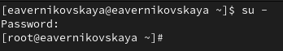{#fig:001 width=70%}

## Управление режимами SELinux

Посмотрим текущую информацию о состоянии SELinux, используя *sestatus -v* (рис. 2)

{#fig:002 width=60%}

## Управление режимами SELinux

Посмотрим, в каком режиме работает SELinux: *getenforce*. По умолчанию SELinux находится в режиме принудительного исполнения (Enforcing) (рис. 3)

{#fig:003 width=70%}

## Управление режимами SELinux

Изменим режим работы SELinux на разрешающий (Permissive): *setenforce 0* (рис. 4)

{#fig:004 width=70%}

## Управление режимами SELinux

После, снова вводим *getenforce* (рис. 5)

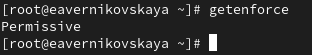{#fig:005 width=70%}

## Управление режимами SELinux

В файле /etc/sysconfig/selinux с помощью редактора устанавливаем параметр disabled: *SELINUX=disabled* (рис. 6), (рис. 7), (рис. 8)

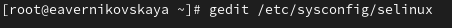{#fig:006 width=70%}

## Управление режимами SELinux

{#fig:007 width=70%}

## Управление режимами SELinux

{#fig:008 width=70%}

## Управление режимами SELinuxы

Далее перезапускаем систему (рис. 9)

{#fig:009 width=70%}

## Управление режимами SELinux

После перезагрузки запускаем терминал и получаем полномочия администратора. Далее смотрим статус SELinux. Мы увидем, что SELinux теперь отключён (рис. 10)

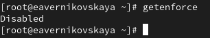{#fig:010 width=70%}

## Управление режимами SELinux

Попробуем переключить режим работы SELinux: *setenforce 1*. Мы не сможем этого сделать, так как SELinux отключён (рис. 11)

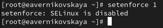{#fig:011 width=70%}

## Управление режимами SELinux

В файле /etc/sysconfig/selinux с помощью редактора устанавливаем параметр enforcing: *SELINUX=enforcing* (рис. 12), (рис. 13), (рис. 14)

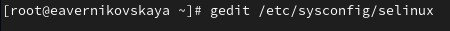{#fig:012 width=70%}

## Управление режимами SELinux

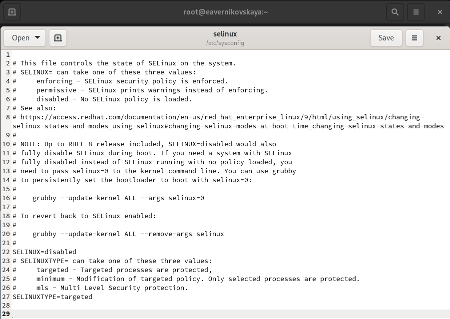{#fig:013 width=70%}

## Управление режимами SELinux

{#fig:014 width=70%}

## Управление режимами SELinux

Снова перезагружаем систему. Во время загрузки системы мы, получили предупреждающее сообщение
о необходимости восстановления меток SELinux (рис. 15)

{#fig:015 width=70%}

## Управление режимами SELinux

После перезагрузки в терминале с полномочиями администратора посмотрим текущую информацию о состоянии SELinux. Система работает в принудительном режиме (enforcing) использования SELinux (рис. 16)

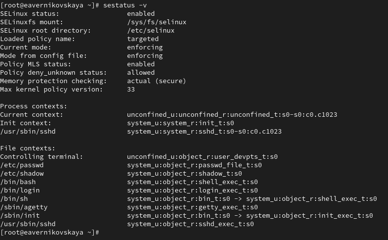{#fig:016 width=50%}

## Использование restorecon для восстановления контекста безопасности

Посмотрим контекст безопасности файла /etc/hosts: *ls -Z /etc/hosts*. Мы увидем, что у файла есть метка контекста net_conf_t (рис. 17)

{#fig:017 width=70%}

## Использование restorecon для восстановления контекста безопасности

Скопируем файл /etc/hosts в домашний каталог, с помощью *cp /etc/hosts ~/* (рис. 18)

{#fig:018 width=70%}

## Использование restorecon для восстановления контекста безопасности

Проверяем контекст файла ~/hosts: *ls -Z ~/hosts*. Поскольку копирование считается созданием нового файла, то параметр контекста в файле ~/hosts, расположенном в домашнем каталоге, станет admin_home_t (рис. 19)

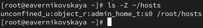{#fig:019 width=70%}

## Использование restorecon для восстановления контекста безопасности

Попытаемся перезаписать существующий файл hosts из домашнего каталога в каталог /etc: *mv ~/hosts /etc* (рис. 20)

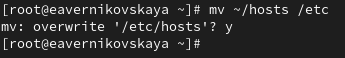{#fig:020 width=70%}

## Использование restorecon для восстановления контекста безопасности

Далее проверим, что тип контекста по-прежнему установлен на admin_home_t: *ls -Z /etc/hosts* (рис. 21)

{#fig:021 width=70%}

## Использование restorecon для восстановления контекста безопасности

Далее исправим контекст безопасности: *restorecon -v /etc/hosts* Опция -v покажет процесс изменения (рис. 22)

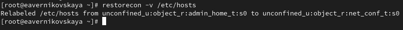{#fig:022 width=70%}

## Использование restorecon для восстановления контекста безопасности

Прверим, что тип контекста изменился (рис. 23)

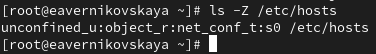{#fig:023 width=70%}

## Использование restorecon для восстановления контекста безопасности

Для массового исправления контекста безопасности на файловой системе вводим *touch /.autorelabel* (рис. 24)

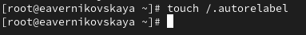{#fig:024 width=70%}

## Использование restorecon для восстановления контекста безопасности

После перезапускаем систему. Во время перезапуска нажимаем клавишу Esc, чтобы мы видели загрузочные сообщения. Мы увидим, что файловая система автоматически перемаркирована (рис. 25)

{#fig:025 width=30%}

## Настройка контекста безопасности для нестандартного расположения файлов веб-сервера

Устанавливаем необходимое программное обеспечение (рис. 26), (рис. 27)

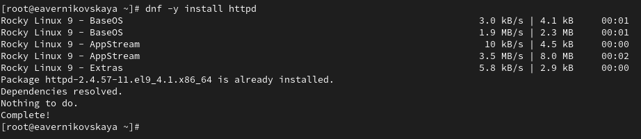{#fig:026 width=70%}

## Настройка контекста безопасности для нестандартного расположения файлов веб-сервера

{#fig:027 width=70%}

## Настройка контекста безопасности для нестандартного расположения файлов веб-сервера

Создаём новое хранилище для файлов web-сервера: *mkdir /web* (рис. 28)

{#fig:028 width=70%}

## Настройка контекста безопасности для нестандартного расположения файлов веб-сервера

Создаём файл index.html в каталоге с контентом веб-сервера (рис. 29)

{#fig:029 width=70%}

## Настройка контекста безопасности для нестандартного расположения файлов веб-сервера

Пишем в созданном файле index.html следующий текст: Welcome to my web-server (рис. 30), (рис. 31), (рис. 32)

{#fig:030 width=70%}

## Настройка контекста безопасности для нестандартного расположения файлов веб-сервера

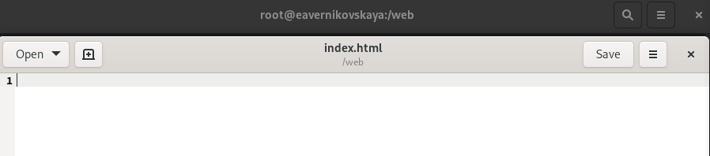{#fig:031 width=70%}

## Настройка контекста безопасности для нестандартного расположения файлов веб-сервера

{#fig:032 width=70%}

## Настройка контекста безопасности для нестандартного расположения файлов веб-сервера

В файле /etc/httpd/conf/httpd.conf закомментируем строку *DocumentRoot "/var/www/html"* и ниже добавим строку *DocumentRoot "/web"* (рис. 33), (рис. 34), (рис. 35)

{#fig:033 width=70%}

## Настройка контекста безопасности для нестандартного расположения файлов веб-сервера

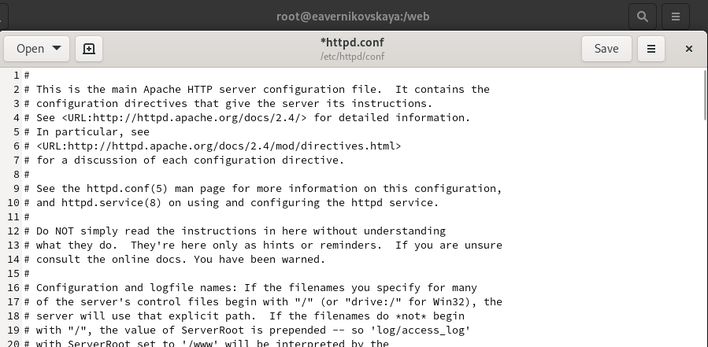{#fig:034 width=70%}

## Настройка контекста безопасности для нестандартного расположения файлов веб-сервера

{#fig:035 width=70%}

## Настройка контекста безопасности для нестандартного расположения файлов веб-сервера

Затем в этом же файле ниже закомментируем раздел

```
<Directory "/var/www">
  AllowOverride None
  Require all granted
</Directory>
```

и добавим следующий раздел, определяющий правила доступа: (рис. 36)

```
<Directory "/web">
  AllowOverride None
  Require all granted
</Directory>
```

## Настройка контекста безопасности для нестандартного расположения файлов веб-сервера

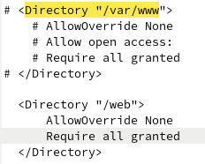{#fig:036 width=50%}

## Настройка контекста безопасности для нестандартного расположения файлов веб-сервера

Запускаем веб-сервер и службу httpd (рис. 37)

{#fig:037 width=70%}

## Настройка контекста безопасности для нестандартного расположения файлов веб-сервера

В терминале под учётной записью нашего пользователя обращаемся к веб-серверу в текстовом браузере lynx: *lynx http://localhost* (рис. 38)

{#fig:038 width=70%}

## Настройка контекста безопасности для нестандартного расположения файлов веб-сервера

После этого мы увидим веб-страницу Red Hat по умолчанию, а не содержимое только что созданного файла index.html (для выхода из lynx нажмается q) (рис. 39)

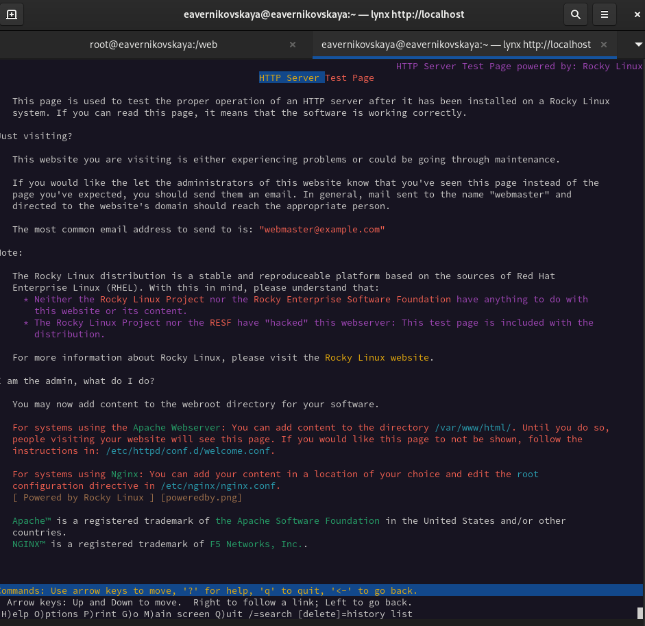{#fig:039 width=30%}

## Настройка контекста безопасности для нестандартного расположения файлов веб-сервера

В терминале с полномочиями администратора применяем новую метку контекста к /web: semanage fcontext -a -t httpd_sys_content_t "/web(/.*)?" (рис. 40)

{#fig:040 width=70%}

## Настройка контекста безопасности для нестандартного расположения файлов веб-сервера

Восстановим контекст безопасности: *restorecon -R -v /web* (рис. 41)

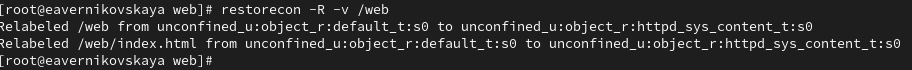{#fig:041 width=70%}

## Настройка контекста безопасности для нестандартного расположения файлов веб-сервера

В терминале под учётной записью нашего пользователя снова обращаемся к веб-серверу: *lynx http://localhost*. Теперь мы получили доступ к своей пользовательской веб-странице. На экране есть запись «Welcome to my web-server» (рис. 42), (рис. 43)

{#fig:042 width=70%}

## Настройка контекста безопасности для нестандартного расположения файлов веб-сервера

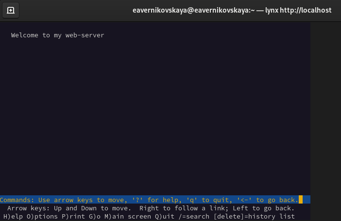{#fig:043 width=70%}

## Работа с переключателями SELinux

Посмотрим список переключателей SELinux для службы ftp: *getsebool -a | grep ftp*. Мы увидим переключатель ftpd_anon_write с текущим значением off (рис. 44)

{#fig:044 width=60%}

## Работа с переключателями SELinux

Для службы ftpd_anon посмотрим список переключателей с пояснением, за что отвечает каждый переключатель, включён он или выключен: *semanage boolean -l | grep ftpd anon* (рис. 45)

{#fig:045 width=70%}

## Работа с переключателями SELinux

Изменим текущее значение переключателя для службы ftpd_anon_write с off на on: *setsebool ftpd_anon_write on* (рис. 46)

{#fig:046 width=70%}

## Работа с переключателями SELinux

Повторно смотрим список переключателей SELinux для службы ftpd_anon_write: *getsebool ftpd_anon_write* (рис. 47)

{#fig:047 width=70%}

## Работа с переключателями SELinux

Псмотрим список переключателей с пояснением: *semanage boolean -l | grep ftpd_anon*. Мы видим, что настройка времени выполнения включена, но постоянная настройка по-прежнему отключена (рис. 48)

{#fig:048 width=70%}

## Работа с переключателями SELinux

Изменим постоянное значение переключателя для службы ftpd_anon_write с off на on: *setsebool -P ftpd_anon_write on* (рис. 49)

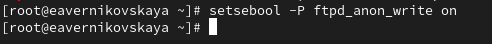{#fig:049 width=70%}

## Работа с переключателями SELinux

Снова посмотрим список переключателей: *semanage boolean -l | grep ftpd_anon*. Теперь постоянная
настройка включена (рис. 50)

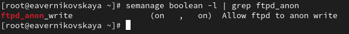{#fig:050 width=70%}

# Подведение итогов

## Выводы

В ходе выполнения лабораторной работы мы получили навыки и работы с контекстом безопасности и политиками SELinux

## Список литературы

1. Лаборатораня работа №9 [Электронный ресурс] URL: https://esystem.rudn.ru/pluginfile.php/2400723/mod_resource/content/4/010-selinux.pdf
