---
## Front matter
title: "Отчёт по лабораторной работе №9"
subtitle: "Дисциплина: Основы администрирования операционных систем"
author: "Верниковская Екатерина Андреевна"

## Generic otions
lang: ru-RU
toc-title: "Содержание"

## Bibliography
bibliography: bib/cite.bib
csl: pandoc/csl/gost-r-7-0-5-2008-numeric.csl

## Pdf output format
toc: true # Table of contents
toc-depth: 2
lof: true # List of figures
lot: true # List of tables
fontsize: 12pt
linestretch: 1.5
papersize: a4
documentclass: scrreprt
## I18n polyglossia
polyglossia-lang:
  name: russian
  options:
	- spelling=modern
	- babelshorthands=true
polyglossia-otherlangs:
  name: english
## I18n babel
babel-lang: russian
babel-otherlangs: english
## Fonts
mainfont: PT Serif
romanfont: PT Serif
sansfont: PT Sans
monofont: PT Mono
mainfontoptions: Ligatures=TeX
romanfontoptions: Ligatures=TeX
sansfontoptions: Ligatures=TeX,Scale=MatchLowercase
monofontoptions: Scale=MatchLowercase,Scale=0.9
## Biblatex
biblatex: true
biblio-style: "gost-numeric"
biblatexoptions:
  - parentracker=true
  - backend=biber
  - hyperref=auto
  - language=auto
  - autolang=other*
  - citestyle=gost-numeric
## Pandoc-crossref LaTeX customization
figureTitle: "Рис."
tableTitle: "Таблица"
listingTitle: "Листинг"
lofTitle: "Список иллюстраций"
lotTitle: "Список таблиц"
lolTitle: "Листинги"
## Misc options
indent: true
header-includes:
  - \usepackage{indentfirst}
  - \usepackage{float} # keep figures where there are in the text
  - \floatplacement{figure}{H} # keep figures where there are in the text
---

# Цель работы

Получить навыки работы с контекстом безопасности и политиками SELinux.

# Задание

1. Продемонстрировать навыки по управлению режимами SELinux.
2. Продемонстрировать навыки по восстановлению контекста безопасности SELinux.
3. Настроить контекст безопасности для нестандартного расположения файлов вебслужбы.
4. Продемонстрировать навыки работы с переключателями SELinux.

# Выполнение лабораторной работы

## Управление режимами SELinux

Запускаем терминала и получаем полномочия суперпользователя, используя *su -* (рис. [-@fig:001])

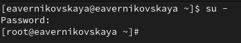{#fig:001 width=70%}

Посмотрим текущую информацию о состоянии SELinux, используя *sestatus -v* (рис. [-@fig:002])

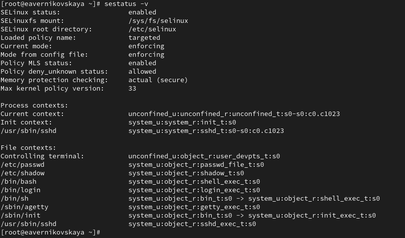{#fig:002 width=70%}

**Основная информация о статусе SELinux:**

- **SELinux status:** enabled — SELinux включен в системе
- **SELinuxfs mount:** /sys/fs/selinux — путь, где монтируется файловая система SELinux
- **SELinux root directory:** /etc/selinux — корневой каталог, в котором хранятся конфигурационные файлы SELinux 
- **Loaded policy name:** targeted — в системе загружена политика targeted, которая защищает определенные сервисы 
- **Current mode:** enforcing — SELinux работает в режиме enforcing, то есть все запрещенные действия блокируются 
- **Mode from config file:** enforcing — конфигурационный файл настроен на режим enforcing
- **Policy MLS status:** enabled — включена поддержка многоуровневой безопасности (MLS)
- **Policy deny_unknown status:** allowed — неизвестные действия разрешены, но это обычно не рекомендуется 
- **Memory protection checking:** actual (secure) — используется актуальная защита памяти
- **Max kernel policy version:** 33 — максимальная версия политики, поддерживаемая ядром 

**Контексты процессов:**

- **Current context:** unconfined_u:unconfined_r:unconfined_t:s0-s0:c0.c1023 — текущий контекст пользователя, использующего терминал, показывает, что пользователь не ограничен политиками SELinux 
- **Init context:** system_u:system_r:init_t:s0 — контекст процесса инициализации (init), который запускается от имени system_u 
- **/usr/sbin/sshd:** system_u:system_r:sshd_t:s0-s0:c0.c1023 — контекст для демона sshd (Secure Shell Daemon), запущенного от имени system_u, чтобы ограничить его права в системе 

**Контексты файлов:**

Каждая строка в этом разделе показывает файлы и процессы с их соответствующими SELinux-контекстами

- **Controlling terminal:** unconfined_u:object_r:user_devpts_t:s0 — терминал, к которому подключен пользователь, в контексте user_devpts_t
- **/etc/passwd и /etc/shadow:** находятся в контексте passwd_file_t и shadow_t, что ограничивает доступ к этим файлам для повышения безопасности
- **/bin/bash:** контекст shell_exec_t, указывающий, что это исполняемый файл командной оболочки
- **/usr/sbin/sshd:** контекст sshd_exec_t, что позволяет SELinux определять, что этот файл — исполняемый файл SSH

Посмотрим, в каком режиме работает SELinux: *getenforce*. По умолчанию SELinux находится в режиме принудительного исполнения (Enforcing) (рис. [-@fig:003])

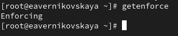{#fig:003 width=70%}

Изменим режим работы SELinux на разрешающий (Permissive): *setenforce 0* (рис. [-@fig:004])

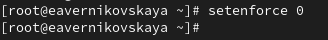{#fig:004 width=70%}

После, снова вводим *getenforce* (рис. [-@fig:005])

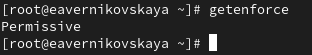{#fig:005 width=70%}

В файле /etc/sysconfig/selinux с помощью редактора устанавливаем параметр disabled: *SELINUX=disabled* (рис. [-@fig:006]), (рис. [-@fig:007]), (рис. [-@fig:008])

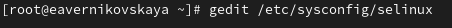{#fig:006 width=70%}

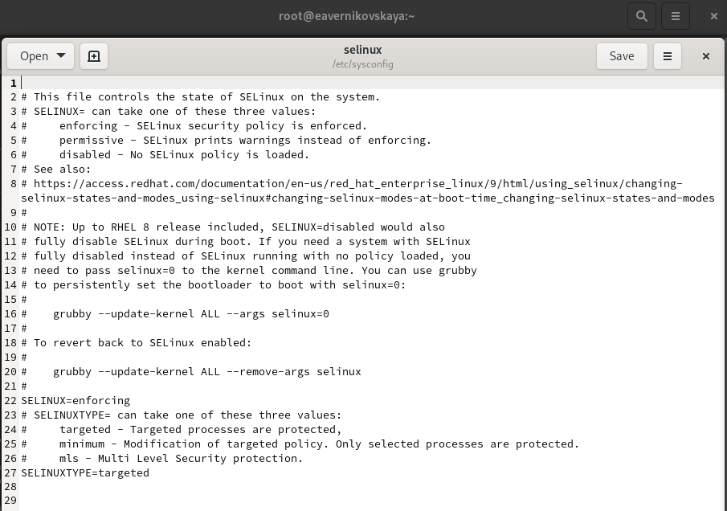{#fig:007 width=70%}

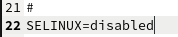{#fig:008 width=70%}

Далее перезапускаем систему (рис. [-@fig:009])

{#fig:009 width=70%}

После перезагрузки запускаем терминал и получаем полномочия администратора. Далее смотрим статус SELinux. Мы увидем, что SELinux теперь отключён (рис. [-@fig:010])

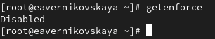{#fig:010 width=70%}

Попробуем переключить режим работы SELinux: *setenforce 1*. Мы не сможем этого сделать, так как SELinux отключён (рис. [-@fig:011])

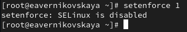{#fig:011 width=70%}

В файле /etc/sysconfig/selinux с помощью редактора устанавливаем параметр enforcing: *SELINUX=enforcing* (рис. [-@fig:012]), (рис. [-@fig:013]), (рис. [-@fig:014])

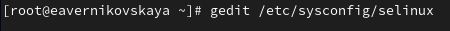{#fig:012 width=70%}

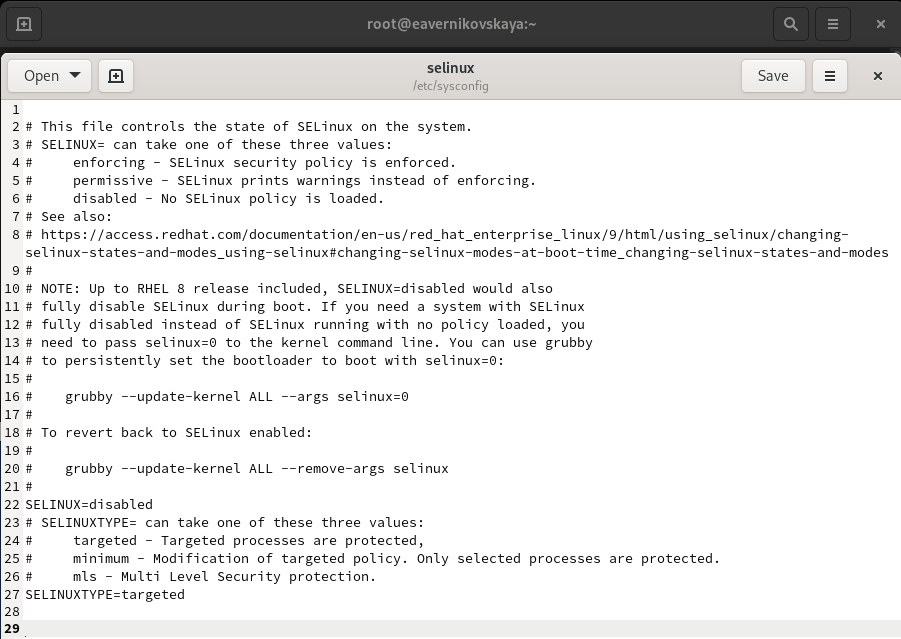{#fig:013 width=70%}

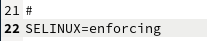{#fig:014 width=70%}

Снова перезагружаем систему. Во время загрузки системы мы, получили предупреждающее сообщение
о необходимости восстановления меток SELinux (рис. [-@fig:015])

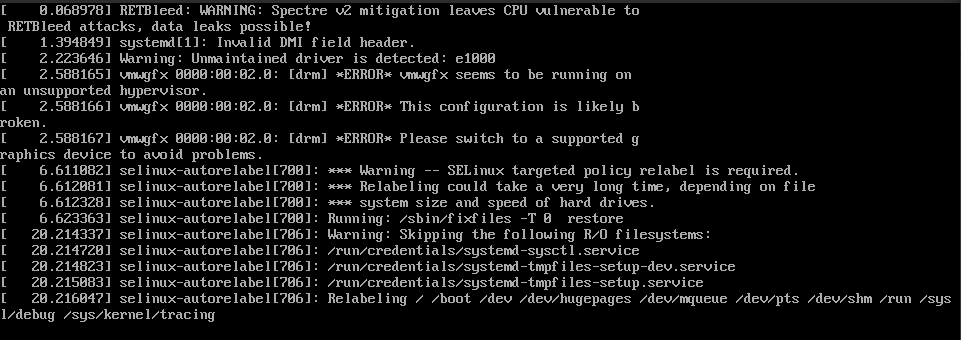{#fig:015 width=70%}

После перезагрузки в терминале с полномочиями администратора посмотрим текущую информацию о состоянии SELinux. Система работает в принудительном режиме (enforcing) использования SELinux (рис. [-@fig:016])

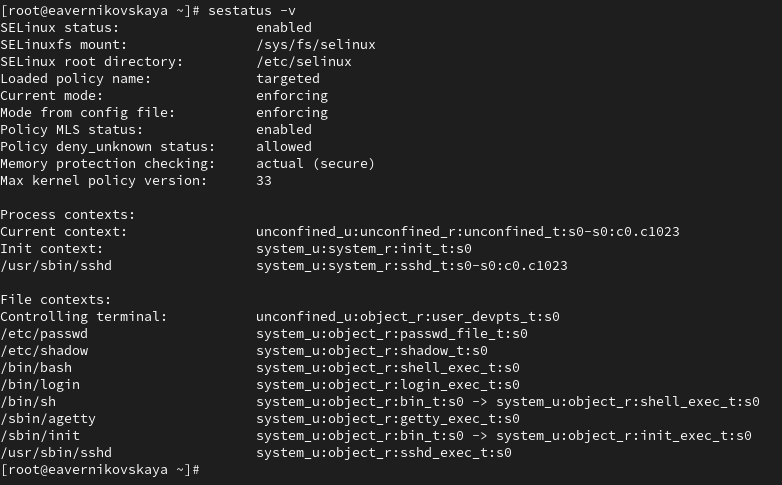{#fig:016 width=70%}

## Использование restorecon для восстановления контекста безопасности

Посмотрим контекст безопасности файла /etc/hosts: *ls -Z /etc/hosts*. Мы увидем, что у файла есть метка контекста net_conf_t (рис. [-@fig:017])

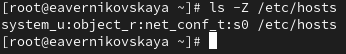{#fig:017 width=70%}

Скопируем файл /etc/hosts в домашний каталог, с помощью *cp /etc/hosts ~/* (рис. [-@fig:018])

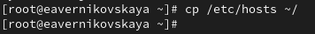{#fig:018 width=70%}

Проверяем контекст файла ~/hosts: *ls -Z ~/hosts*. Поскольку копирование считается созданием нового файла, то параметр контекста в файле ~/hosts, расположенном в домашнем каталоге, станет admin_home_t (рис. [-@fig:019])

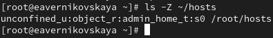{#fig:019 width=70%}

Попытаемся перезаписать существующий файл hosts из домашнего каталога в каталог /etc: *mv ~/hosts /etc* (рис. [-@fig:020])

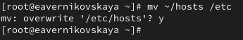{#fig:020 width=70%}

Далее проверим, что тип контекста по-прежнему установлен на admin_home_t: *ls -Z /etc/hosts* (рис. [-@fig:021])

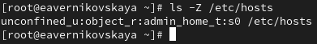{#fig:021 width=70%}

Далее исправим контекст безопасности: *restorecon -v /etc/hosts* Опция -v покажет процесс изменения (рис. [-@fig:022])

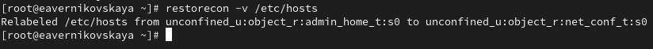{#fig:022 width=70%}

Прверим, что тип контекста изменился (рис. [-@fig:023])

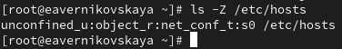{#fig:023 width=70%}

Для массового исправления контекста безопасности на файловой системе вводим *touch /.autorelabel* (рис. [-@fig:024])

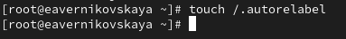{#fig:024 width=70%}

После перезапускаем систему. Во время перезапуска нажимаем клавишу Esc, чтобы мы видели загрузочные сообщения. Мы увидим, что файловая система автоматически перемаркирована (рис. [-@fig:025])

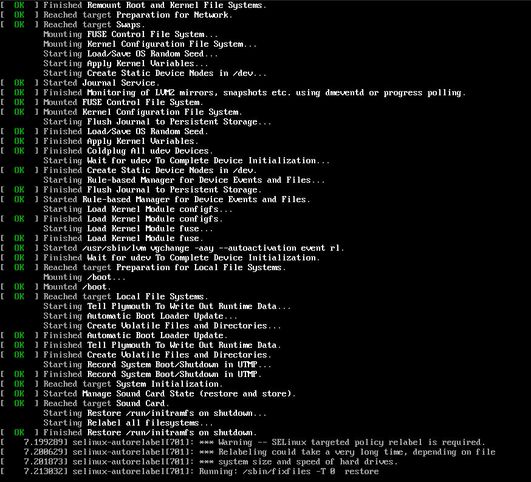{#fig:025 width=70%}

## Настройка контекста безопасности для нестандартного расположения файлов веб-сервера

Устанавливаем необходимое программное обеспечение (рис. [-@fig:026]), (рис. [-@fig:027])

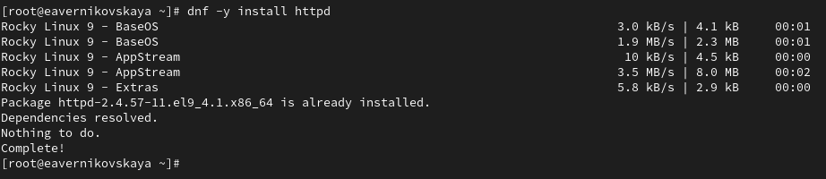{#fig:026 width=70%}

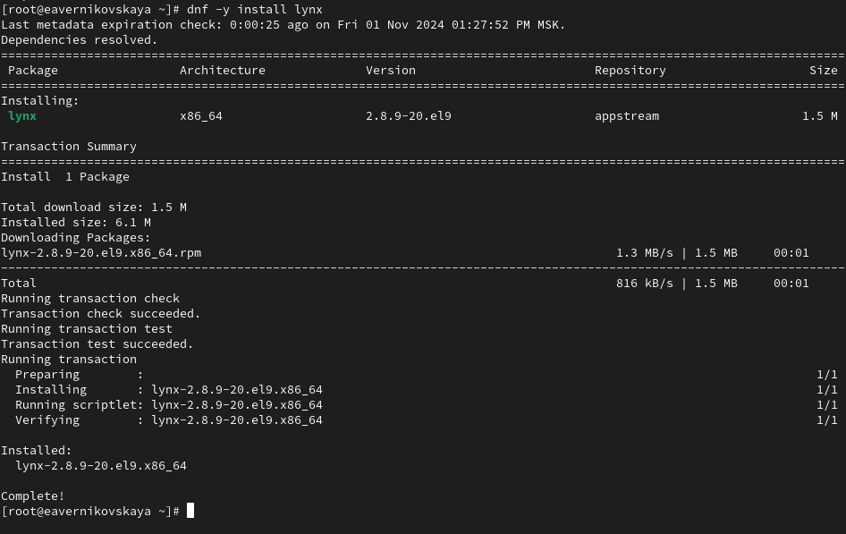{#fig:027 width=70%}

Создаём новое хранилище для файлов web-сервера: *mkdir /web* (рис. [-@fig:028])

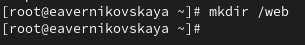{#fig:028 width=70%}

Создаём файл index.html в каталоге с контентом веб-сервера (рис. [-@fig:029])

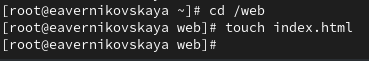{#fig:029 width=70%}

Пишем в созданном файле index.html следующий текст: Welcome to my web-server (рис. [-@fig:030]), (рис. [-@fig:031]), (рис. [-@fig:032])

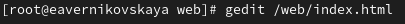{#fig:030 width=70%}

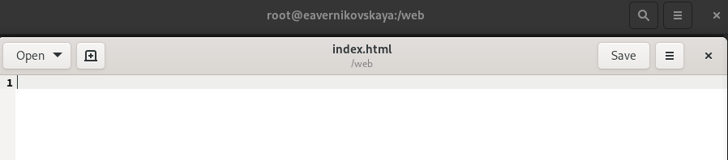{#fig:031 width=70%}

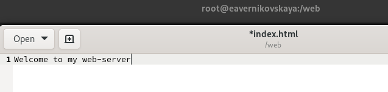{#fig:032 width=70%}

В файле /etc/httpd/conf/httpd.conf закомментируем строку *DocumentRoot "/var/www/html"* и ниже добавим строку *DocumentRoot "/web"* (рис. [-@fig:033]), (рис. [-@fig:034]), (рис. [-@fig:035])

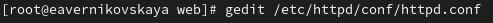{#fig:033 width=70%}

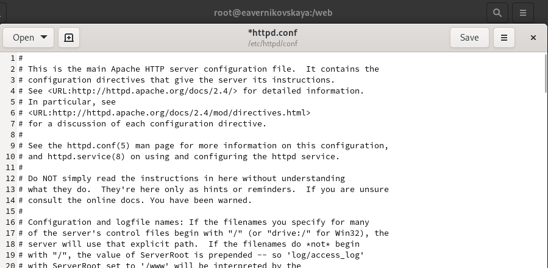{#fig:034 width=70%}

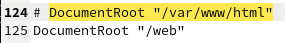{#fig:035 width=70%}

Затем в этом же файле ниже закомментируем раздел

```
<Directory "/var/www">
  AllowOverride None
  Require all granted
</Directory>
```

и добавим следующий раздел, определяющий правила доступа: (рис. [-@fig:036])

```
<Directory "/web">
  AllowOverride None
  Require all granted
</Directory>
```

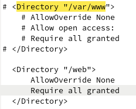{#fig:036 width=70%}

Запускаем веб-сервер и службу httpd (рис. [-@fig:037])

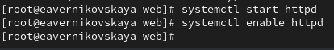{#fig:037 width=70%}

В терминале под учётной записью нашего пользователя обращаемся к веб-серверу в текстовом браузере lynx: *lynx http://localhost* (рис. [-@fig:038])

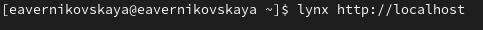{#fig:038 width=70%}

После этого мы увидим веб-страницу Red Hat по умолчанию, а не содержимое только что созданного файла index.html (для выхода из lynx нажмается q) (рис. [-@fig:039])

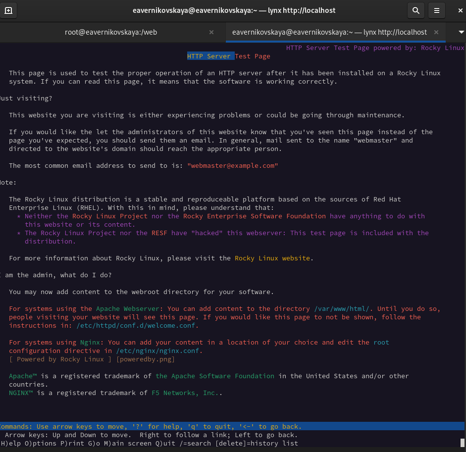{#fig:039 width=70%}

В терминале с полномочиями администратора применяем новую метку контекста к /web: semanage fcontext -a -t httpd_sys_content_t "/web(/.*)?" (рис. [-@fig:040])

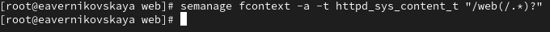{#fig:040 width=70%}

Восстановим контекст безопасности: *restorecon -R -v /web* (рис. [-@fig:041])

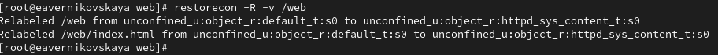{#fig:041 width=70%}

В терминале под учётной записью нашего пользователя снова обращаемся к веб-серверу: *lynx http://localhost*. Теперь мы получили доступ к своей пользовательской веб-странице. На экране есть запись «Welcome to my web-server» (рис. [-@fig:042]), (рис. [-@fig:043])

{#fig:042 width=70%}

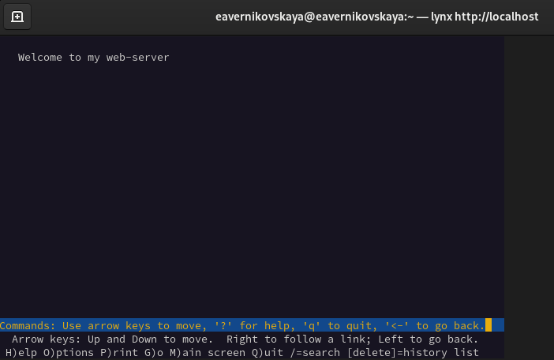{#fig:043 width=70%}

## Работа с переключателями SELinux

Посмотрим список переключателей SELinux для службы ftp: *getsebool -a | grep ftp*. Мы увидим переключатель ftpd_anon_write с текущим значением off (рис. [-@fig:044])

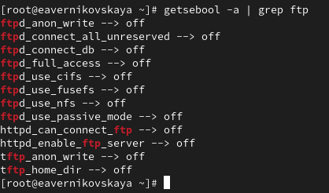{#fig:044 width=70%}

Для службы ftpd_anon посмотрим список переключателей с пояснением, за что отвечает каждый переключатель, включён он или выключен: *semanage boolean -l | grep ftpd anon* (рис. [-@fig:045])

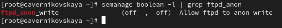{#fig:045 width=70%}

Изменим текущее значение переключателя для службы ftpd_anon_write с off на on: *setsebool ftpd_anon_write on* (рис. [-@fig:046])

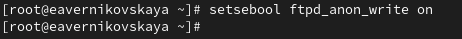{#fig:046 width=70%}

Повторно смотрим список переключателей SELinux для службы ftpd_anon_write: *getsebool ftpd_anon_write* (рис. [-@fig:047])

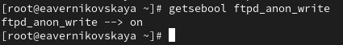{#fig:047 width=70%}

Псмотрим список переключателей с пояснением: *semanage boolean -l | grep ftpd_anon*. Мы видим, что настройка времени выполнения включена, но постоянная настройка по-прежнему отключена (рис. [-@fig:048])

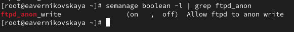{#fig:048 width=70%}

Изменим постоянное значение переключателя для службы ftpd_anon_write с off на on: *setsebool -P ftpd_anon_write on* (рис. [-@fig:049])

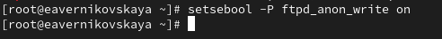{#fig:049 width=70%}

Снова посмотрим список переключателей: *semanage boolean -l | grep ftpd_anon*. Теперь постоянная
настройка включена (рис. [-@fig:050])

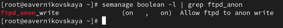{#fig:050 width=70%}

# Контрольные вопросы + ответы

1. Вы хотите временно поставить SELinux в разрешающем режиме. Какую команду вы используете?

setenforce 0 (рис. [-@fig:051])

{#fig:051 width=70%}

2. Вам нужен список всех доступных переключателей SELinux. Какую команду вы используете?

getsebool -a (рис. [-@fig:052])

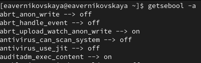{#fig:052 width=70%}

3. Каково имя пакета, который требуется установить для получения легко читаемых сообщений журнала SELinux в журнале аудита?

audit2allow

4. Какие команды вам нужно выполнить, чтобы применить тип контекста httpd_sys_content_t к каталогу /web?

semanage fcontext -a -t httpd_sys_content_t "/web(/.*)?"
restorecon -R -v /web (рис. [-@fig:053]), (рис. [-@fig:054])

{#fig:053 width=70%}

{#fig:054 width=70%}

5. Какой файл вам нужно изменить, если вы хотите полностью отключить SELinux?

/etc/sysconfig/selinux (рис. [-@fig:055]), (рис. [-@fig:056])

{#fig:055 width=70%}

{#fig:056 width=70%}

6. Где SELinux регистрирует все свои сообщения?

в /var/log/audit/audit.log (рис. [-@fig:057])

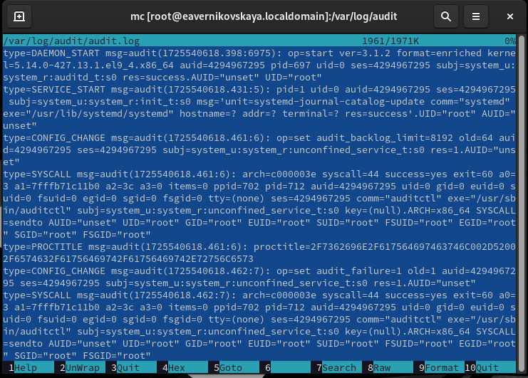{#fig:057 width=70%}

7. Вы не знаете, какие типы контекстов доступны для службы ftp. Какая команда позволяет получить более конкретную информацию?

getsebool -a | grep ftp (рис. [-@fig:058])

{#fig:058 width=70%}

8. Ваш сервис работает не так, как ожидалось, и вы хотите узнать, связано ли это с SELinux или чем-то ещё. Какой самый простой способ узнать?

Просмотреть контекст безопасности процессора ps -eZ или id -Z 

# Выводы

В ходе выполнения лабораторной работы мы получили навыки и работы с контекстом безопасности и политиками SELinux

# Список литературы

1. Лаборатораня работа №9 [Электронный ресурс] URL: https://esystem.rudn.ru/pluginfile.php/2400723/mod_resource/content/4/010-selinux.pdf
