---
## Front matter
lang: ru-RU
title: Лабораторная работа №10
subtitle: Основы администрирования операционных систем
author:
  - Верниковская Е. А., НПИбд-01-23
institute:
  - Российский университет дружбы народов, Москва, Россия
date: 9 ноября 2024

## i18n babel
babel-lang: russian
babel-otherlangs: english

## Formatting pdf
toc: false
toc-title: Содержание
slide_level: 2
aspectratio: 169
section-titles: true
theme: metropolis
header-includes:
 - \metroset{progressbar=frametitle,sectionpage=progressbar,numbering=fraction}
 - '\makeatletter'
 - '\beamer@ignorenonframefalse'
 - '\makeatother'
 
## Fonts
mainfont: PT Serif
romanfont: PT Serif
sansfont: PT Sans
monofont: PT Mono
mainfontoptions: Ligatures=TeX
romanfontoptions: Ligatures=TeX
sansfontoptions: Ligatures=TeX,Scale=MatchLowercase
monofontoptions: Scale=MatchLowercase,Scale=0.9
---

# Вводная часть

## Цель работы

Получить навыки работы с утилитами управления модулями ядра операционной системы.

## Задание

1. Продемонстрировать навыки работы по управлению модулями ядра
2. Продемонстрировать навыки работы по загрузке модулей ядра с параметрами

# Выполнение лабораторной работы

##  Управление модулями ядра из командной строки

Запускаем терминала и получаем полномочия суперпользователя, используя *su -* (рис. 1)

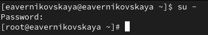{#fig:001 width=70%}

##  Управление модулями ядра из командной строки

Посмотрим, какие устройства имеются в нашей системе и какие модули ядра с ними связаны: *lspci -k* (рис. 2)

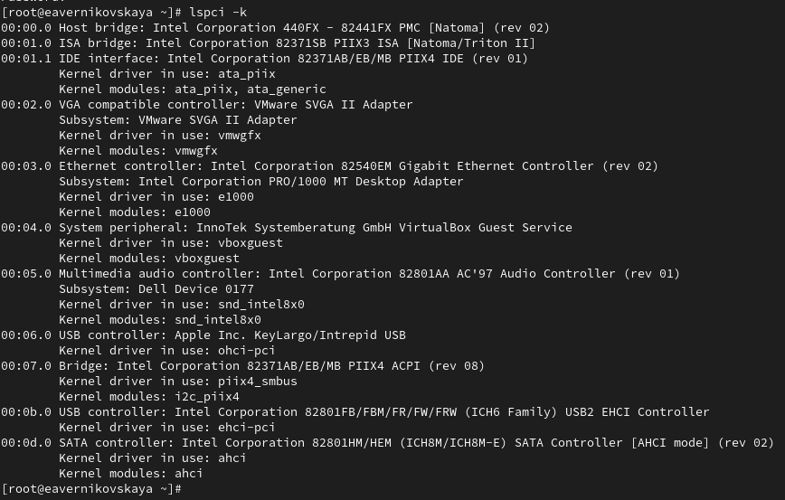{#fig:002 width=60%}

##  Управление модулями ядра из командной строки

Посмотрим, какие модули ядра загружены: *lsmod | sort* (рис. 3)

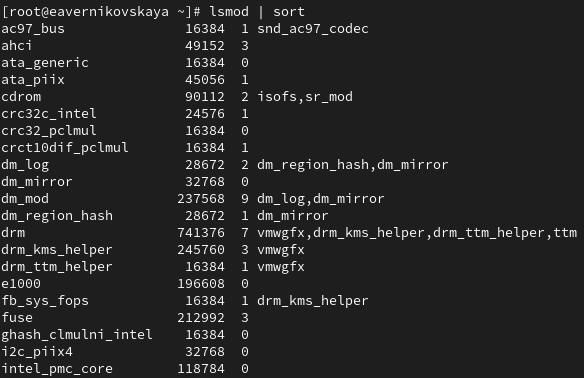{#fig:003 width=60%}

##  Управление модулями ядра из командной строки

Посмотрим, загружен ли модуль ext4: *lsmod | grep ext4*. Он не загружен (рис. 4)

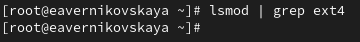{#fig:004 width=70%}

##  Управление модулями ядра из командной строки

Загрузим модуль ядра ext4 с помощью *modprobe ext4* (рис. 5)

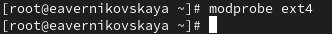{#fig:005 width=70%}

##  Управление модулями ядра из командной строки

Проверим, что модуль загружен, посмотрев список загруженных модулей: *lsmod | grep ext4* (рис. 6)

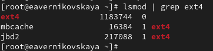{#fig:006 width=70%}

##  Управление модулями ядра из командной строки

Посмотрим информацию о модуле ядра ext4: *modinfo ext4* (рис. 7)

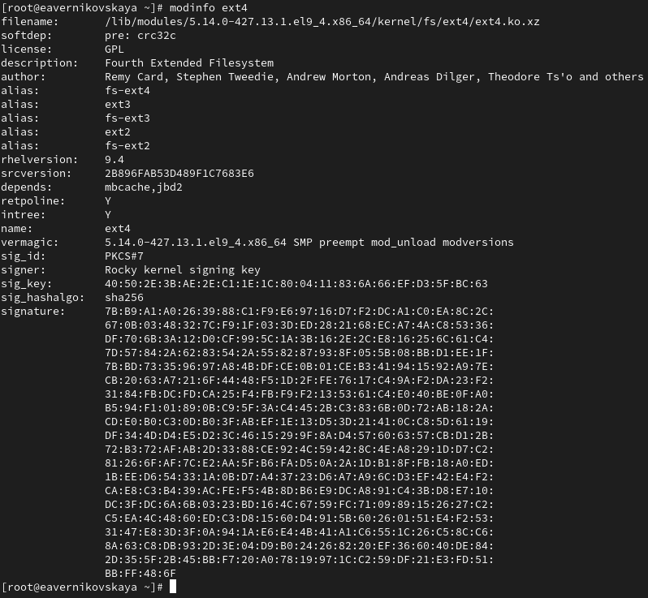{#fig:007 width=40%}

##  Управление модулями ядра из командной строки

Попробуем выгрузить модуль ядра ext4: *modprobe -r ext4*. Команду потребовалось ввести 2 раза. Ошибка, которая возникла при выполнении команды *modprobe -r ext4*, связана с тем, что модуль crc32c_intel, используемый внутри модуля ext4, был занят. Это значит, что какие-то процессы использовали этот модуль, и попытка его удалить вызвала ошибку (рис. 8)

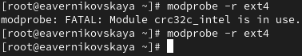{#fig:008 width=70%}

##  Управление модулями ядра из командной строки

Попробуем выгрузить модуль ядра xfs: *modprobe -r xfs*. Мы получили сообщение об ошибке, поскольку модуль ядра в данный момент используется (рис. 9)

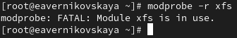{#fig:009 width=70%}

## Загрузка модулей ядра с параметрами

Посмотрим, загружен ли модуль bluetooth: *lsmod | grep bluetooth*. Он не загружен (рис. 10)

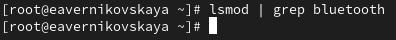{#fig:010 width=70%}

## Загрузка модулей ядра с параметрами

Загрузим модуль ядра bluetooth с помощью *modprobe bluetooth* (рис. 11)

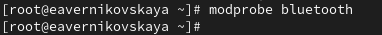{#fig:011 width=70%}

## Загрузка модулей ядра с параметрами

Посмотрим список модулей ядра, отвечающих за работу с Bluetooth: *lsmod | grep bluetooth* (рис. 12)

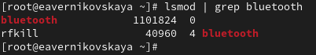{#fig:012 width=70%}

## Загрузка модулей ядра с параметрами

Посмотрим информацию о модуле bluetooth: *modinfo bluetooth* (рис. 13)

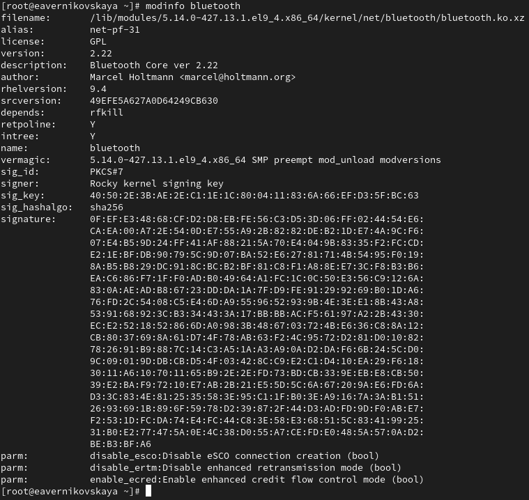{#fig:013 width=40%}

## Загрузка модулей ядра с параметрами

Выгрузим модуль ядра bluetooth: *modprobe -r bluetooth* (рис. 14)

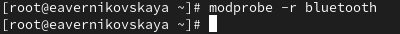{#fig:014 width=70%}

## Обновление ядра системы

Посмотрим версию ядра, используемую в операционной системе: *uname -r* (рис. 15)

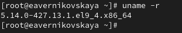{#fig:015 width=70%}

## Обновление ядра системы

Выведим на экран список пакетов, относящихся к ядру операционной системы: *dnf list kernel* (рис. 16)

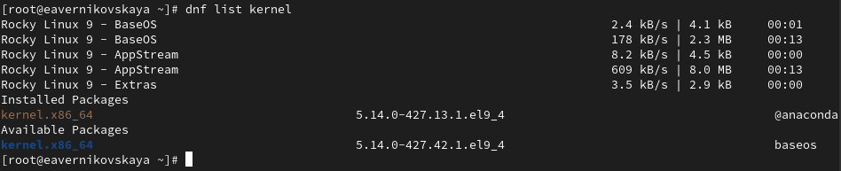{#fig:016 width=70%}

## Обновление ядра системы

Обновим систему, чтобы убедиться, что все существующие пакеты обновлены, так как это важно при установке/обновлении ядер Linux и избежания конфликтов: *dnf upgrade --refresh* (рис. 17)

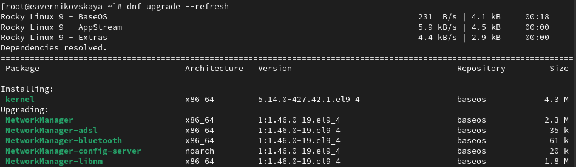{#fig:017 width=70%}

## Обновление ядра системы

Далее обновим ядро операционной системы, а затем саму операционную систему: *dnf update kernel*, *dnf update*,  и *dnf upgrade --refresh* (рис. 18), (рис. 19), (рис. 20)

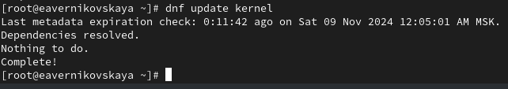{#fig:018 width=70%}

## Обновление ядра системы

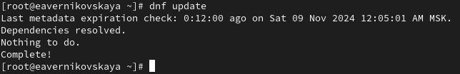{#fig:019 width=70%}

## Обновление ядра системы

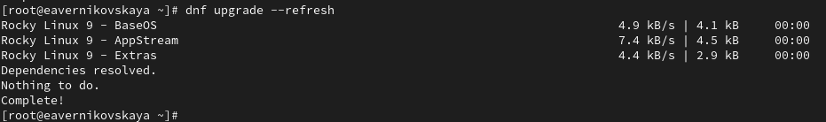{#fig:020 width=70%}

## Обновление ядра системы

После, перегрузим систему и при загрузке выберим новое ядро  (рис. 21), (рис. 22)

{#fig:021 width=70%}

## Обновление ядра системы

{#fig:022 width=70%}

## Обновление ядра системы

Теперь посмотрим версию ядра, используемую в операционной системе: *uname -r* и *hostnamectl*  Мы видим, название ядра изменилось (рис. 23), (рис. 24)

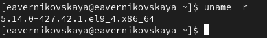{#fig:023 width=70%}

## Обновление ядра системы

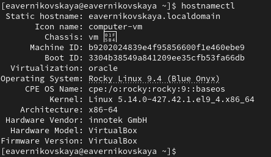{#fig:024 width=70%}

# Подведение итогов

## Выводы

В ходе выполнения лабораторной работы мы получили навыки работы с утилитами управления модулями ядра операционной системы

## Список литературы

1. Лаборатораня работа №10 [Электронный ресурс] URL: https://esystem.rudn.ru/pluginfile.php/2400729/mod_resource/content/4/011-kernel.pdf
