---
## Front matter
title: "Отчёт по лабораторной работе №10"
subtitle: "Дисциплина: Основы администрирования операционных систем"
author: "Верниковская Екатерина Андреевна"

## Generic otions
lang: ru-RU
toc-title: "Содержание"

## Bibliography
bibliography: bib/cite.bib
csl: pandoc/csl/gost-r-7-0-5-2008-numeric.csl

## Pdf output format
toc: true # Table of contents
toc-depth: 2
lof: true # List of figures
lot: true # List of tables
fontsize: 12pt
linestretch: 1.5
papersize: a4
documentclass: scrreprt
## I18n polyglossia
polyglossia-lang:
  name: russian
  options:
	- spelling=modern
	- babelshorthands=true
polyglossia-otherlangs:
  name: english
## I18n babel
babel-lang: russian
babel-otherlangs: english
## Fonts
mainfont: PT Serif
romanfont: PT Serif
sansfont: PT Sans
monofont: PT Mono
mainfontoptions: Ligatures=TeX
romanfontoptions: Ligatures=TeX
sansfontoptions: Ligatures=TeX,Scale=MatchLowercase
monofontoptions: Scale=MatchLowercase,Scale=0.9
## Biblatex
biblatex: true
biblio-style: "gost-numeric"
biblatexoptions:
  - parentracker=true
  - backend=biber
  - hyperref=auto
  - language=auto
  - autolang=other*
  - citestyle=gost-numeric
## Pandoc-crossref LaTeX customization
figureTitle: "Рис."
tableTitle: "Таблица"
listingTitle: "Листинг"
lofTitle: "Список иллюстраций"
lotTitle: "Список таблиц"
lolTitle: "Листинги"
## Misc options
indent: true
header-includes:
  - \usepackage{indentfirst}
  - \usepackage{float} # keep figures where there are in the text
  - \floatplacement{figure}{H} # keep figures where there are in the text
---

# Цель работы

Получить навыки работы с утилитами управления модулями ядра операционной системы.

# Задание

1. Продемонстрировать навыки работы по управлению модулями ядра
2. Продемонстрировать навыки работы по загрузке модулей ядра с параметрами

# Выполнение лабораторной работы

##  Управление модулями ядра из командной строки

Запускаем терминала и получаем полномочия суперпользователя, используя *su -* (рис. [-@fig:001])

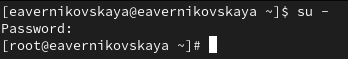{#fig:001 width=70%}

Посмотрим, какие устройства имеются в нашей системе и какие модули ядра с ними связаны: *lspci -k* (рис. [-@fig:002])

Пояснения.

1. Host bridge:

- Устройство: Intel Corporation 440FX - 82441FX PMC [Natoma] (rev 02)
- Это основной мост, который управляет связью между процессором и другими компонентами.
- Модуль ядра: отсутствует, так как это устройство не требует специального драйвера в Linux.

2. ISA bridge:

- Устройство: Intel Corporation 82371SB PIIX3 ISA [Natoma/Triton II]
- Обеспечивает поддержку шины ISA, которая используется для подключения старых устройств.
- Модуль ядра: отсутствует.

3. IDE interface:

- Устройство: Intel Corporation 82371AB/EB/MB PIIX4 IDE (rev 01)
- Это интерфейс для подключения IDE-устройств, таких как жёсткие диски.
- Модуль ядра: ata_piix, ata_generic, что означает, что система использует драйвер для управления IDE-устройствами.

4. VGA compatible controller:

- Устройство: VMware SVGA II Adapter
- Это видеокарта, предоставляемая средой виртуализации VMware.
- Модуль ядра: vmwgfx, используемый драйвер для поддержки графики в VMware.

5. Ethernet controller:

- Устройство: Intel Corporation 82540EM Gigabit Ethernet Controller (rev 02)
- Это сетевой адаптер, обеспечивающий подключение к сети.
- Модуль ядра: e1000, используемый драйвер для этого типа сетевых карт.

6. System peripheral:

- Устройство: InnoTek Systemberatung GmbH VirtualBox Guest Service
- Это системное устройство, предоставляемое VirtualBox для интеграции с гостевой операционной системой.
- Модуль ядра: vboxguest, который позволяет гостевой системе взаимодействовать с хостом.

7. Multimedia audio controller:

- Устройство: Intel Corporation 82801AA AC'97 Audio Controller (rev 01)
- Это аудиоконтроллер, обеспечивающий воспроизведение и запись звука.
- Модуль ядра: snd_intel8x0, драйвер для контроллеров AC'97.

8. USB controllers:

* Устройства:
  + Apple Inc. KeyLargo/Intrepid USB — контроллер USB.
  + Intel Corporation 82801FB/FBM/FR/FW/FRW (ICH6 Family) USB2 EHCI Controller
  + Intel Corporation 82801HM/HEM (ICH8M/ICH8M-E) SATA Controller [AHCI mode] (rev 02)
* Модули ядра: ohci-pci и ehci-pci для USB, ahci для SATA.

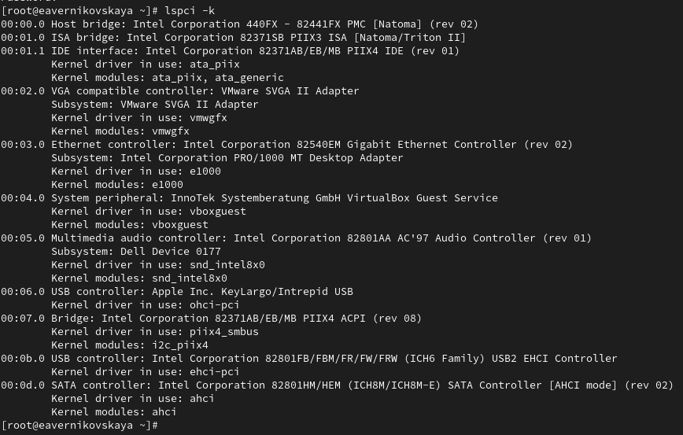{#fig:002 width=70%}

Посмотрим, какие модули ядра загружены: *lsmod | sort* (рис. [-@fig:003])

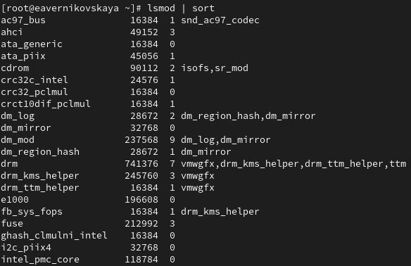{#fig:003 width=70%}

Посмотрим, загружен ли модуль ext4: *lsmod | grep ext4*. Он не загружен (рис. [-@fig:004])

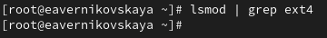{#fig:004 width=70%}

Загрузим модуль ядра ext4 с помощью *modprobe ext4* (рис. [-@fig:005])

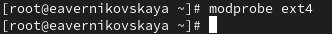{#fig:005 width=70%}

Проверим, что модуль загружен, посмотрев список загруженных модулей: *lsmod | grep ext4* (рис. [-@fig:006])

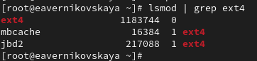{#fig:006 width=70%}

Посмотрим информацию о модуле ядра ext4: *modinfo ext4* (рис. [-@fig:007])

Пояснения. 

1. filename: /lib/modules/5.14.0-427.13.1.el9_4.x86_64/kernel/fs/ext4/ext4.ko.xz
   - Это путь к файлу модуля ext4 в системе. Он хранится сжатым (xz) в каталоге модулей ядра для версии ядра 5.14.0-427.13.1.el9_4.x86_64.

2. license: GPL
   - Лицензия модуля — GNU General Public License (GPL), что делает его свободным программным обеспечением.

3. description: Fourth Extended Filesystem
   - Описание модуля — файловая система четвёртого расширенного типа, также известная как Ext4.

4. author: Remy Card, Stephen Tweedie, Andrew Morton, Andreas Dilger, Theodore Ts'o and others
   - Список авторов, которые разработали и поддерживают модуль ext4.

5. alias: fs-ext4, ext3, fs-ext3, ext2, fs-ext2
   - Псевдонимы для модуля, указывающие на совместимость с файловыми системами ext3 и ext2. Это позволяет использовать модуль ext4 для работы с Ext2 и Ext3.

6. rhelversion: 9.4
   - Версия Red Hat Enterprise Linux (RHEL), с которой связан данный модуль, — 9.4.

7. srcversion: 2B896FAB53D489F1C7683E6
   - Уникальный идентификатор версии исходного кода модуля.

8. depends: mbcache, jbd2
   - Модуль зависит от других модулей ядра: mbcache (memory block cache) и jbd2 (журналирование).

9. retpoline: Y
   - Этот параметр указывает, что модуль поддерживает защиту от уязвимостей Spectre (Retpoline).

10. intree: Y
   - Показывает, что модуль является встроенным в ядро Linux и поддерживается на уровне официального исходного кода.

11. name: ext4
   - Имя модуля.

12. vermagic: 5.14.0-427.13.1.el9_4.x86_64 SMP preempt mod_unload modversions
   
* Информация о версии ядра, для которой скомпилирован этот модуль. Она включает:
  + Версию ядра (5.14.0-427.13.1.el9_4.x86_64)
  + Поддержку симметричной многопоточности (SMP)
  + Поддержку предвыборки задач (preempt)
  + Возможность выгрузки модуля (mod_unload)
  + Версионирование модулей (modversions).

13. sig_id, signer, sig_key, sig_hashalgo, signature:
   
* Информация о цифровой подписи модуля:
  + sig_id: Тип подписи, здесь используется PKCS#7.
  + signer: Подпись, используемая Rocky kernel signing key.
  + sig_key: Ключ, используемый для подписания модуля.
  + sig_hashalgo: Алгоритм хеширования, используемый для подписи (sha256).
  + signature: Цифровая подпись модуля, которая подтверждает его подлинность и целостность.

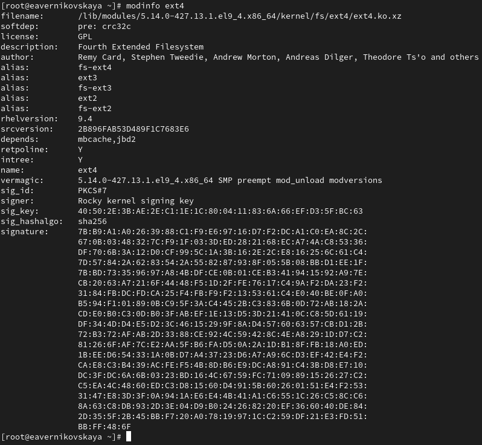{#fig:007 width=70%}

Попробуем выгрузить модуль ядра ext4: *modprobe -r ext4*. Команду потребовалось ввести 2 раза. Ошибка, которая возникла при выполнении команды *modprobe -r ext4*, связана с тем, что модуль crc32c_intel, используемый внутри модуля ext4, был занят. Это значит, что какие-то процессы использовали этот модуль, и попытка его удалить вызвала ошибку (рис. [-@fig:008])

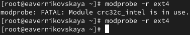{#fig:008 width=70%}

Попробуем выгрузить модуль ядра xfs: *modprobe -r xfs*. Мы получили сообщение об ошибке, поскольку модуль ядра в данный момент используется (рис. [-@fig:009])

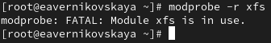{#fig:009 width=70%}

## Загрузка модулей ядра с параметрами

Посмотрим, загружен ли модуль bluetooth: *lsmod | grep bluetooth*. Он не загружен (рис. [-@fig:010])

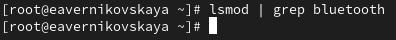{#fig:010 width=70%}

Загрузим модуль ядра bluetooth с помощью *modprobe bluetooth* (рис. [-@fig:011])

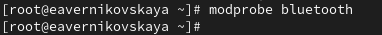{#fig:011 width=70%}

Посмотрим список модулей ядра, отвечающих за работу с Bluetooth: *lsmod | grep bluetooth* (рис. [-@fig:012])

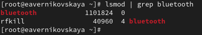{#fig:012 width=70%}

Посмотрим информацию о модуле bluetooth: *modinfo bluetooth* (рис. [-@fig:013])

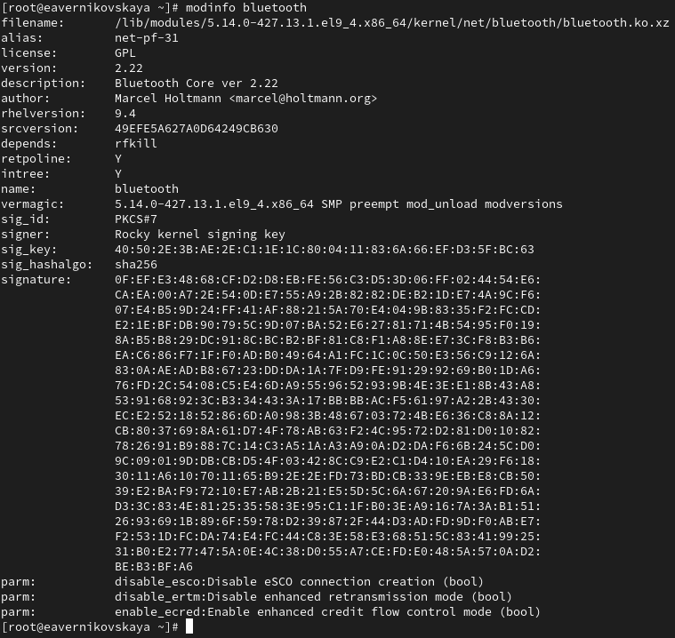{#fig:013 width=70%}

Выгрузим модуль ядра bluetooth: *modprobe -r bluetooth* (рис. [-@fig:014])

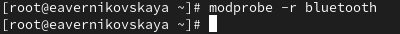{#fig:014 width=70%}

## Обновление ядра системы

Посмотрим версию ядра, используемую в операционной системе: *uname -r* (рис. [-@fig:015])

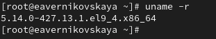{#fig:015 width=70%}

Выведим на экран список пакетов, относящихся к ядру операционной системы: *dnf list kernel* (рис. [-@fig:016])

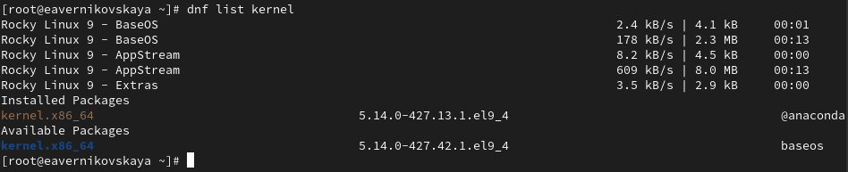{#fig:016 width=70%}

Обновим систему, чтобы убедиться, что все существующие пакеты обновлены, так как это важно при установке/обновлении ядер Linux и избежания конфликтов: *dnf upgrade --refresh* (рис. [-@fig:017])

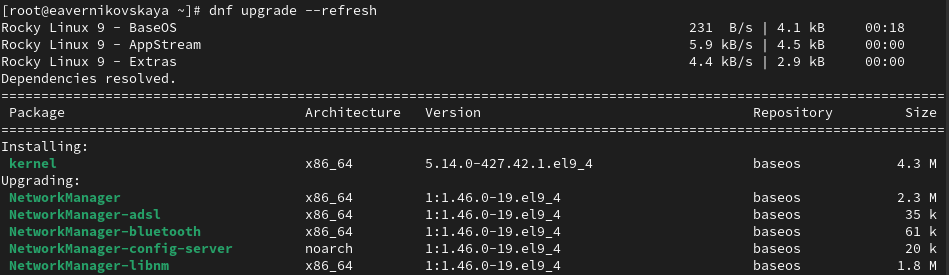{#fig:017 width=70%}

Далее обновим ядро операционной системы, а затем саму операционную систему: *dnf update kernel*, *dnf update*,  и *dnf upgrade --refresh* (рис. [-@fig:018]), (рис. [-@fig:019]), (рис. [-@fig:020])

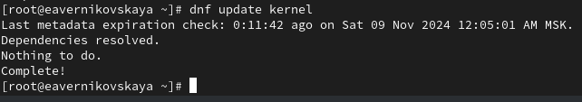{#fig:018 width=70%}

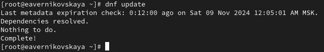{#fig:019 width=70%}

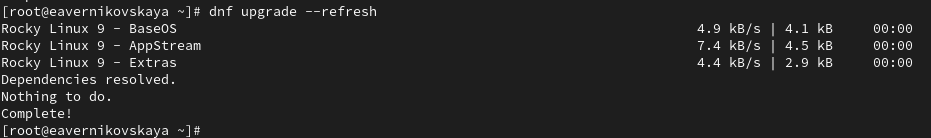{#fig:020 width=70%}

После, перегрузим систему и при загрузке выберим новое ядро  (рис. [-@fig:021]), (рис. [-@fig:022])

{#fig:021 width=70%}

{#fig:022 width=70%}

Теперь посмотрим версию ядра, используемую в операционной системе: *uname -r* и *hostnamectl*  Мы видим, название ядра изменилось (рис. [-@fig:023]), (рис. [-@fig:024])

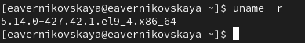{#fig:023 width=70%}

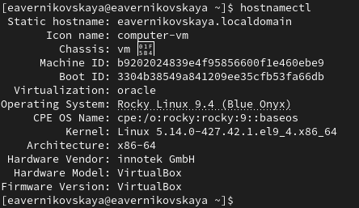{#fig:024 width=70%}

# Контрольные вопросы + ответы

1. Какая команда показывает текущую версию ядра, которая используется на вашей системе?

*uname -r* (рис. [-@fig:025])

{#fig:025 width=70%}

2. Как можно посмотреть более подробную информацию о текущей версии ядра операционной системы?

*hostnamectl* (рис. [-@fig:026])

{#fig:026 width=70%}ы

3. Какая команда показывает список загруженных модулей ядра?

*lsmod | sort* (рис. [-@fig:027])

{#fig:027 width=70%}

4. Какая команда позволяет вам определять параметры модуля ядра?

*modprobe имя модуля параметры = значение модуля*

5. Как выгрузить модуль ядра? 

*modprobe -r <модуль>* (рис. [-@fig:028])

{#fig:028 width=70%}

6. Что вы можете сделать, если получите сообщение об ошибке при попытке выгрузить модуль ядра?

Сначала выгружаем тот модуль, который занимает нужный нам модуль, а потом выгружаем первоначальный

7. Как определить, какие параметры модуля ядра поддерживаются?

*modinfo <модуль>* (рис. [-@fig:029])

{#fig:029 width=70%}

8. Как установить новую версию ядра?

Установка новой версии ядра: 

- Обновить систему, чтобы убедиться, что все существующие пакеты обновлены, так как это важно при установке/обновлении ядер Linux и избежания конфликтов: *dnf upgrade --refresh* (рис. [-@fig:030])

{#fig:030 width=70%}

- Обновить ядро операционной системы, а затем саму операционную систему: *dnf update kernel* и *dnf update dnf upgrade --refresh* (рис. [-@fig:031]), (рис. [-@fig:032])

{#fig:031 width=70%}

{#fig:032 width=70%}

- Перезагрузить систему. При загрузке выбрать новое ядро (рис. [-@fig:033]), (рис. [-@fig:034])

{#fig:033 width=70%}

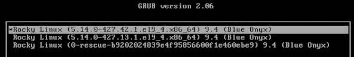{#fig:034 width=70%}

# Выводы

В ходе выполнения лабораторной работы мы получили навыки работы с утилитами управления модулями ядра операционной системы

# Список литературы

1. Лаборатораня работа №10 [Электронный ресурс] URL: https://esystem.rudn.ru/pluginfile.php/2400729/mod_resource/content/4/011-kernel.pdf
