---
## Front matter
title: "Отчёт по лабораторной работе №11"
subtitle: "Дисциплина: Основы администрирования операционных систем"
author: "Верниковская Екатерина Андреевна"

## Generic otions
lang: ru-RU
toc-title: "Содержание"

## Bibliography
bibliography: bib/cite.bib
csl: pandoc/csl/gost-r-7-0-5-2008-numeric.csl

## Pdf output format
toc: true # Table of contents
toc-depth: 2
lof: true # List of figures
lot: true # List of tables
fontsize: 12pt
linestretch: 1.5
papersize: a4
documentclass: scrreprt
## I18n polyglossia
polyglossia-lang:
  name: russian
  options:
	- spelling=modern
	- babelshorthands=true
polyglossia-otherlangs:
  name: english
## I18n babel
babel-lang: russian
babel-otherlangs: english
## Fonts
mainfont: PT Serif
romanfont: PT Serif
sansfont: PT Sans
monofont: PT Mono
mainfontoptions: Ligatures=TeX
romanfontoptions: Ligatures=TeX
sansfontoptions: Ligatures=TeX,Scale=MatchLowercase
monofontoptions: Scale=MatchLowercase,Scale=0.9
## Biblatex
biblatex: true
biblio-style: "gost-numeric"
biblatexoptions:
  - parentracker=true
  - backend=biber
  - hyperref=auto
  - language=auto
  - autolang=other*
  - citestyle=gost-numeric
## Pandoc-crossref LaTeX customization
figureTitle: "Рис."
tableTitle: "Таблица"
listingTitle: "Листинг"
lofTitle: "Список иллюстраций"
lotTitle: "Список таблиц"
lolTitle: "Листинги"
## Misc options
indent: true
header-includes:
  - \usepackage{indentfirst}
  - \usepackage{float} # keep figures where there are in the text
  - \floatplacement{figure}{H} # keep figures where there are in the text
---

# Цель работы

Получить навыки работы с загрузчиком системы GRUB2.

# Задание

1. Продемонстрировать навыки по изменению параметров GRUB и записи изменений в файл конфигурации
2. Продемонстрировать навыки устранения неполадок при работе с GRUB
3. Продемонстрировать навыки работы с GRUB без использования root

# Выполнение лабораторной работы

##  Модификация параметров GRUB2

Запускаем терминала и получаем полномочия суперпользователя, используя *su -* (рис. [-@fig:001])

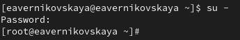{#fig:001 width=70%}

В файле /etc/default/grub устаавливаем параметр отображения меню загрузки в течение 10 секунд: *GRUB_TIMEOUT=10* (рис. [-@fig:002]), (рис. [-@fig:003]), (рис. [-@fig:004])

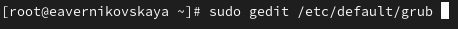{#fig:002 width=70%}

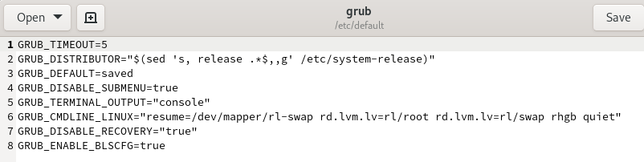{#fig:003 width=70%}

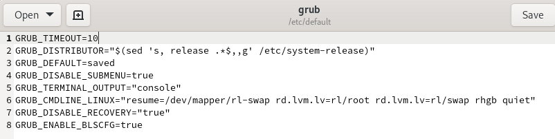{#fig:004 width=70%}
 
Запишим изменения в GRUB2, введя в командной строке *grub2-mkconfig > /boot/grub2/grub.cfg* (рис. [-@fig:005])

{#fig:005 width=70%}

После этого перезагружаем систему (рис. [-@fig:006])

{#fig:006 width=70%}

При загрузке системы мы увидим прокрутку загрузочных сообщений (рис. [-@fig:007])

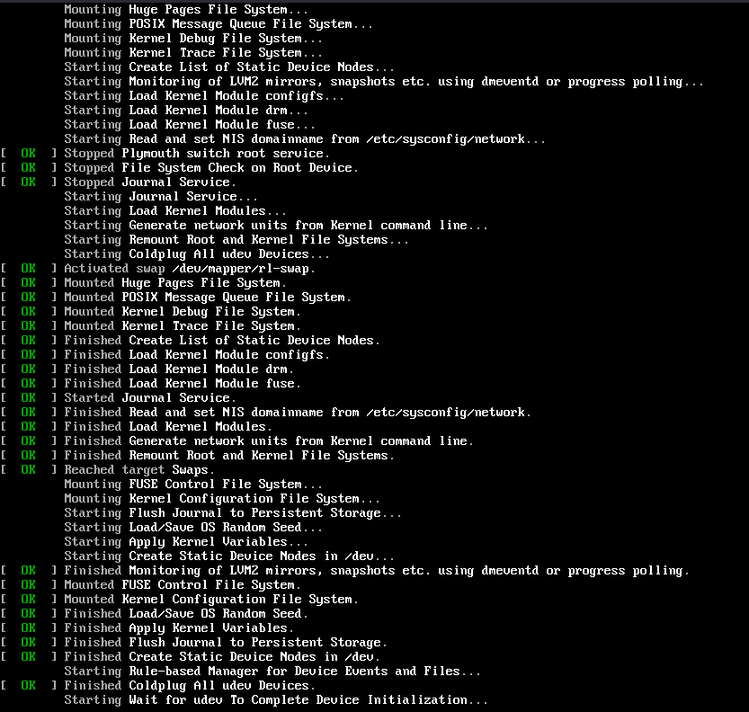{#fig:007 width=70%}

Во врем яперезагрузки системы мы не увидели меню GRUB. Чтобы это исправить в файле /etc/default/grub удаляем из строки указания параметров запуска ядра системы GRUB_CMDLINE_LINUX
параметры rhgb и quiet, которые отвечают за показ графической заставки при запуске системы (для дистрибутивов, основанных на Red Hat), скрывая процесс загрузки от пользователя (рис. [-@fig:008]), (рис. [-@fig:009]), (рис. [-@fig:010])

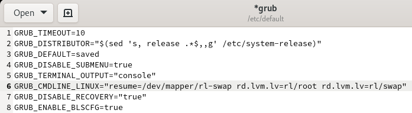{#fig:008 width=70%}

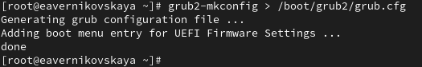{#fig:009 width=70%}

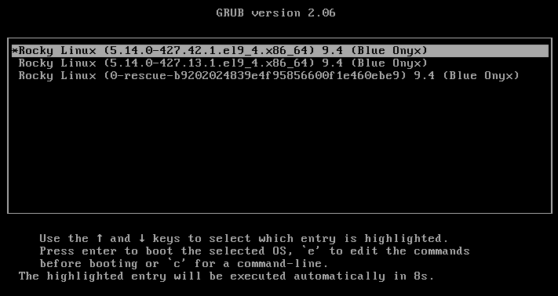{#fig:010 width=70%}

## Устранения неполадок

Перезагружаем систему. Как только появляется меню GRUB, выбираем строку с текущей версией ядра в меню и нажимаем *e* для редактирования (рис. [-@fig:011])

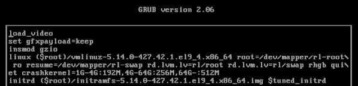{#fig:011 width=70%}

Прокручиваем вниз до строки, начинающейся с linux ($root)/vmlinuz-. Эта строка
загружает ядро системы. В конце этой строки вводим *systemd.unit=rescue.target* и удаляем опции rhgb и quit из этой строки. systemd.unit=rescue.target - режим восстановления (рис. [-@fig:012])

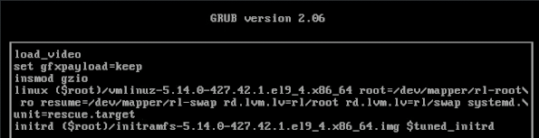{#fig:012 width=70%}

Для продолжения загрузки нажимаем *ctrl+x*. После этого вводим пароль пользователя root при появлении запроса (рис. [-@fig:013])

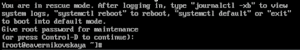{#fig:013 width=70%}

Посмотрим список всех файлов модулей, которые загружены в настоящее время: *systemctl list-units*
Мы видим, что загружена базовая системная среда (рис. [-@fig:014]), (рис. [-@fig:015])

{#fig:014 width=70%}

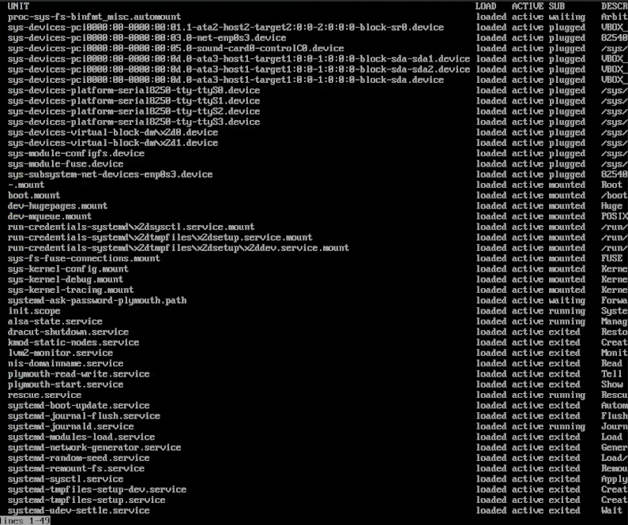{#fig:015 width=70%}

Посмотрим задействованные переменные среды оболочки: *systemctl show-environment* (рис. [-@fig:016])

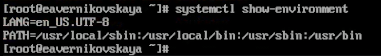{#fig:016 width=70%}

После перезагружаем систему, используя команду *systemctl reboot* (рис. [-@fig:017])

{#fig:017 width=70%}

Снова открываем меню GRUB в режиме редактора. В конце строки, загружающей ядро, вводим *systemd.unit=emergency.target* и удаляем опции rhgb и quit из этой строки. systemd.unit=emergency.target - загружается минимальное количество системных единиц (рис. [-@fig:018]), (рис. [-@fig:019])

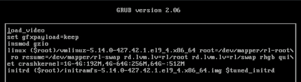{#fig:018 width=70%}

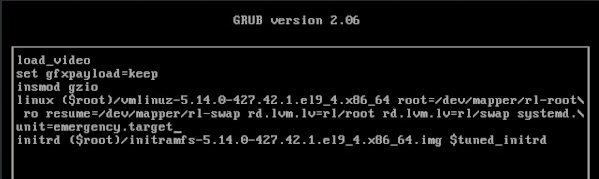{#fig:019 width=70%}

Снова вводим пароль пользователя root. После успешного входа в систему смотрим список всех загруженных файлов модулей: *systemctl list-units*. Количество загружаемых файлов модулей уменьшилось до минимума (рис. [-@fig:020]), (рис. [-@fig:021]), (рис. [-@fig:022])

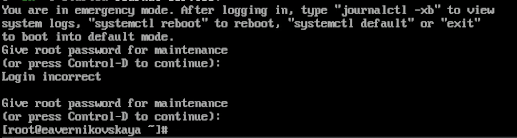{#fig:020 width=70%}

{#fig:021 width=70%}

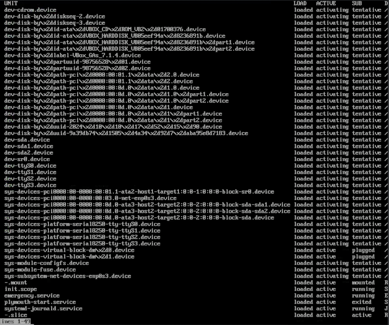{#fig:022 width=70%}

После снова перезагружаем систему (рис. [-@fig:023])

{#fig:023 width=70%}

## Сброс пароля root

Единственный способ сбросить пароль root — загрузить систему в минимальном режиме, который позволяет войти в систему без ввода пароля. Для этого снова открываем меню GRUB в режиме редактирования. В конце строки, загружающей ядро, введите *rd.break* и удаляем опции rhgb и quit из этой строки. rd.break - останавливает процедуру загрузки на этапе initramfs (этот параметр
полезен, если у нас нет пароля root) (рис. [-@fig:024]), (рис. [-@fig:025])

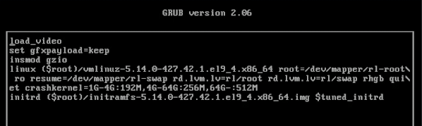{#fig:024 width=70%}

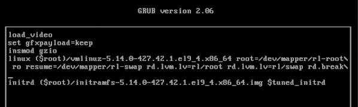{#fig:025 width=70%}

Этап загрузки системы остановится в момент загрузки initramfs, непосредственно перед монтированием корневой файловой системы в каталоге / (рис. [-@fig:026])

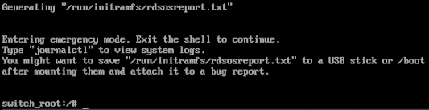{#fig:026 width=70%}

Чтобы получить доступ к системному образу для чтения и записи, набираем *mount -o remount,rw /sysroot* (рис. [-@fig:027])

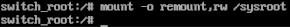{#fig:027 width=70%}

Сделаем содержимое каталога /sysimage новым корневым каталогом, набрав *chroot /sysroot* (рис. [-@fig:028])

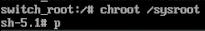{#fig:028 width=70%}

Теперь мы можем ввести команду задания пароля: *passwd*. Установим новый пароль для пользователя root (рис. [-@fig:029])

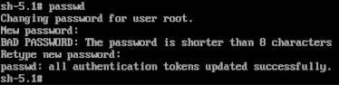{#fig:029 width=70%}

Поскольку на этом очень раннем этапе загрузки SELinux ещё не активирован, то тип контекста SELinux для файла /etc/shadow будет испорчен. Если мы перезагрузимся в этот момент, то никто не сможет войти в систему. Поэтому мы должны убедиться, что тип контекста установлен правильно. Чтобы сделать это, на этом этапе мы загружаем политику SELinux с помощью команды *load_policy -i* (рис. [-@fig:030])

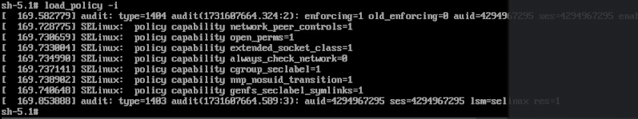{#fig:030 width=70%}

Теперь мы можем вручную установить правильный тип контекста для /etc/shadow. Для этого вводим *chcon -t shadow_t /etc/shadow* (рис. [-@fig:031])

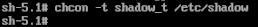{#fig:031 width=70%}

Посел перезагрузим операционную систему с помощью *reboot -f*. Опция -f (--force) означает принудительную немедленную остановку, выключение или перезагрузку. При указании один раз это приводит к немедленному, но чистому завершению работы системным менеджером. Если указано дважды, это приводит к немедленному завершению работы без обращения к системному менеджеру (рис. [-@fig:032])

{#fig:032 width=70%}

Теперь заходим в учётную запись пользователя root, с помощью нового пароля. У нас получилось! Всё хорошо! (рис. [-@fig:033])

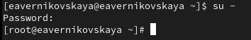{#fig:033 width=70%}

# Контрольные вопросы + ответы

1. Какой файл конфигурации следует изменить для применения общих изменений в GRUB2?

/etc/default/grub (рис. [-@fig:034])

{#fig:034 width=70%}

2. Как называется конфигурационный файл GRUB2, в котором вы применяете изменения для GRUB2?

/boot/grub2/grub.cfg (рис. [-@fig:035])

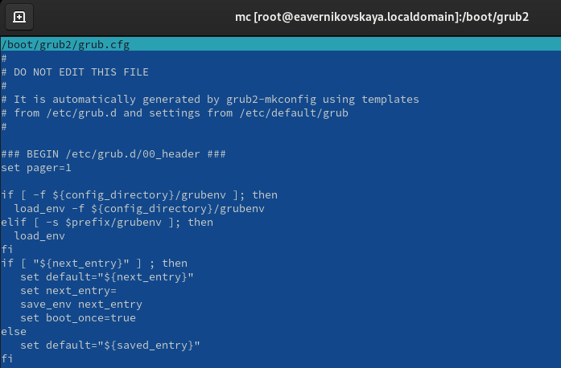{#fig:035 width=70%}

3. После внесения изменений в конфигурацию GRUB2, какую команду вы должны выполнить, чтобы изменения сохранились и воспринялись при загрузке системы?

Записать изменения в GRUB2, введя в командной строке *grub2-mkconfig > /boot/grub2/grub.cfg* или *grub2-mkconfig -o /boot/grub2/grub.cfg* (рис. [-@fig:036])

{#fig:036 width=70%}

# Выводы

В ходе выполнения лабораторной работы мы получили навыки работы с загрузчиком системы GRUB2

# Список литературы

1. Лаборатораня работа №11 [Электронный ресурс] URL: https://esystem.rudn.ru/pluginfile.php/2400735/mod_resource/content/4/012-boot.pdf
