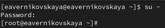
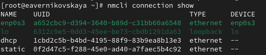

---
## Front matter
lang: ru-RU
title: Лабораторная работа №12
subtitle: Основы администрирования операционных систем
author:
  - Верниковская Е. А., НПИбд-01-23
institute:
  - Российский университет дружбы народов, Москва, Россия
date: 19 ноября 2024

## i18n babel
babel-lang: russian
babel-otherlangs: english

## Formatting pdf
toc: false
toc-title: Содержание
slide_level: 2
aspectratio: 169
section-titles: true
theme: metropolis
header-includes:
 - \metroset{progressbar=frametitle,sectionpage=progressbar,numbering=fraction}
 - '\makeatletter'
 - '\beamer@ignorenonframefalse'
 - '\makeatother'
 
## Fonts
mainfont: PT Serif
romanfont: PT Serif
sansfont: PT Sans
monofont: PT Mono
mainfontoptions: Ligatures=TeX
romanfontoptions: Ligatures=TeX
sansfontoptions: Ligatures=TeX,Scale=MatchLowercase
monofontoptions: Scale=MatchLowercase,Scale=0.9
---

# Вводная часть

## Цель работы

Получить навыки настройки сетевых параметров системы.

## Задание

1. Продемонстрировать навыки использования утилиты ip 
2. Продемонстрировать навыки использования утилиты nmcli

# Выполнение лабораторной работы

## Проверка конфигурации сети

Запускаем терминала и получаем полномочия суперпользователя, используя *su -* (рис. 1)

{#fig:001 width=70%}

## Проверка конфигурации сети

Выведим на экран информацию о существующих сетевых подключениях, а также статистику о количестве отправленных пакетов и связанных с ними сообщениях об ошибках: *ip -s link* (рис. 2)

{#fig:002 width=70%}

## Проверка конфигурации сети

Выведим на экран информацию о текущих маршрутах: *ip route show* (рис. 3)

{#fig:003 width=70%}

## Проверка конфигурации сети

Выведим на экран информацию о текущих назначениях адресов для сетевых интерфейсов на устройстве:
*ip addr show* (рис. 4)

{#fig:004 width=70%}

## Проверка конфигурации сети

Далее используем команду ping для проверки правильности подключения к Интернету. Например, для отправки четырёх пакетов на IP-адрес 8.8.8.8 введём *ping -c 4 8.8.8.8* (рис. 5)

{#fig:005 width=70%}

## Проверка конфигурации сети

Добавим дополнительный адрес к нашему интерфейсу: *ip addr add 10.0.0.10/24 dev yourdevicename*
Здесь *yourdevicename* — название интерфейса, которому добавляется IP-адрес. В нашем случаем это enp0s3 (рис. 6)

{#fig:006 width=70%}

## Проверка конфигурации сети

Проверим, что адрес добавился: *ip addr show* (рис. 7)

{#fig:007 width=70%}

## Проверка конфигурации сети

Теперь сравним вывод информации от утилиты *ip* и от команды *ifconfig* (рис. 8), (рис. 9)

{#fig:008 width=70%}

## Проверка конфигурации сети

{#fig:009 width=70%}

## Проверка конфигурации сети

Выведим на экран список всех прослушиваемых системой портов UDP и TCP: *ss -tul* (рис. 10)

{#fig:010 width=70%}

## Управление сетевыми подключениями с помощью nmcli

Выведим на экран информацию о текущих соединениях: *nmcli connection show* (рис. 11)

{#fig:011 width=70%}

## Управление сетевыми подключениями с помощью nmcli

Добавим Ethernet-соединение с именем dhcp к интерфейсу: *nmcli connection add con-name "dhcp" type ethernet ifname ifname*. Здесь вместо *ifname* должно быть указано название интерфейса. В нашем случае это enp0s3 (рис. 12)

{#fig:012 width=70%}

## Управление сетевыми подключениями с помощью nmcli

Теперь добавим к этому же интерфейсу Ethernet-соединение с именем static, статическим
IPv4-адресом адаптера и статическим адресом шлюза: *nmcli connection add con-name "static" ifname ifname autoconnect no type ethernet ip4 10.0.0.10/24 gw4 10.0.0.1 ifname ifname* (рис. 13)

{#fig:013 width=70%}

## Управление сетевыми подключениями с помощью nmcli

Снова выведим информацию о текущих соединениях: *nmcli connection show* (рис. 14)

{#fig:014 width=70%}

## Управление сетевыми подключениями с помощью nmcli

Переключимся на статическое соединение: *nmcli connection up "static"* (рис. 15)

{#fig:015 width=70%}

## Управление сетевыми подключениями с помощью nmcli

Проверим успешность переключения при помощи *nmcli connection show* и *ip addr* (рис. 16), (рис. 17)

{#fig:016 width=70%}

## Управление сетевыми подключениями с помощью nmcli

{#fig:017 width=70%}

## Управление сетевыми подключениями с помощью nmcli

Вернёмся к соединению dhcp: *nmcli connection up "dhcp"* (рис. 18)

{#fig:018 width=70%}

## Управление сетевыми подключениями с помощью nmcli

Снова проверим успешность переключения при помощи *nmcli connection show* и *ip addr* (рис. 19), (рис. 20)

{#fig:019 width=70%}

## Управление сетевыми подключениями с помощью nmcli

{#fig:020 width=70%}

## Изменение параметров соединения с помощью nmcli

Отчлючим автоподключение статического соединения: *nmcli connection modify "static" connection.autoconnect no* (рис. 21)

{#fig:021 width=70%}

## Изменение параметров соединения с помощью nmcli

Добавим DNS-сервер в статическое соединение: *nmcli connection modify "static" ipv4.dns 10.0.0.10*. При добавлении сетевого подключения используется ip4, а при изменении параметров для существующего соединения используется ipv4 (рис. 22)

{#fig:022 width=70%}

## Изменение параметров соединения с помощью nmcli

Добавим второй DNS-сервер: *nmcli connection modify "static" +ipv4.dns 8.8.8.8*. Для добавления второго и последующих элементов для тех же параметров используется знак *+*. Если его проигнорировать, то произойдёт замена, а не добавление элемента (рис. 23)

{#fig:023 width=70%}

## Изменение параметров соединения с помощью nmcli 

Изменим IP-адрес статического соединения: *nmcli connection modify "static" ipv4.addresses 10.0.0.20/24* (рис. 24)

{#fig:024 width=70%}

## Изменение параметров соединения с помощью nmcli

Добавим другой IP-адрес для статического соединения: *nmcli connection modify "static" +ipv4.addresses 10.20.30.40/16* (рис. 25)

{#fig:025 width=70%}

## Изменение параметров соединения с помощью nmcli

После изменения свойств соединения активируем его: *nmcli connection up "static"* (рис. 26)

{#fig:026 width=70%}

## Изменение параметров соединения с помощью nmcli

Проверим успешность переключения при помощи *nmcli con show* и *ip addr* (рис. 27), (рис. 28)

{#fig:027 width=70%}

## Изменение параметров соединения с помощью nmcli

{#fig:028 width=70%}

## Изменение параметров соединения с помощью nmcli

Используя *nmtui* посмотрим настройки сетевых соединений в графическом интерфейсе операционной
системы (рис. 29), (рис. 30), (рис. 31)

{#fig:029 width=70%}

## Изменение параметров соединения с помощью nmcli

{#fig:030 width=30%}

## Изменение параметров соединения с помощью nmcli

{#fig:031 width=35%}

## Изменение параметров соединения с помощью nmcli

Переключимся на первоначальное сетевое соединение: *nmcli connection up "ifname"*. В нашем случае на enp0s3 (рис. 32)

{#fig:032 width=70%}

## Изменение параметров соединения с помощью nmcli

Проверим успешность переключения при помощи *nmcli connection show* и *ip addr* (рис. 33), (рис. 34)

{#fig:033 width=70%}

## Изменение параметров соединения с помощью nmcli

{#fig:034 width=70%}

# Подведение итогов

## Выводы

В ходе выполнения лабораторной работы мы получили навыки настройки сетевых параметров системы

## Список литературы

1. Лаборатораня работа №12 [Электронный ресурс] URL: https://esystem.rudn.ru/pluginfile.php/2400741/mod_resource/content/4/013-network.pdf
