---
## Front matter
title: "Отчёт по лабораторной работе №12"
subtitle: "Дисциплина: Основы администрирования операционных систем"
author: "Верниковская Екатерина Андреевна"

## Generic otions
lang: ru-RU
toc-title: "Содержание"

## Bibliography
bibliography: bib/cite.bib
csl: pandoc/csl/gost-r-7-0-5-2008-numeric.csl

## Pdf output format
toc: true # Table of contents
toc-depth: 2
lof: true # List of figures
lot: true # List of tables
fontsize: 12pt
linestretch: 1.5
papersize: a4
documentclass: scrreprt
## I18n polyglossia
polyglossia-lang:
  name: russian
  options:
	- spelling=modern
	- babelshorthands=true
polyglossia-otherlangs:
  name: english
## I18n babel
babel-lang: russian
babel-otherlangs: english
## Fonts
mainfont: PT Serif
romanfont: PT Serif
sansfont: PT Sans
monofont: PT Mono
mainfontoptions: Ligatures=TeX
romanfontoptions: Ligatures=TeX
sansfontoptions: Ligatures=TeX,Scale=MatchLowercase
monofontoptions: Scale=MatchLowercase,Scale=0.9
## Biblatex
biblatex: true
biblio-style: "gost-numeric"
biblatexoptions:
  - parentracker=true
  - backend=biber
  - hyperref=auto
  - language=auto
  - autolang=other*
  - citestyle=gost-numeric
## Pandoc-crossref LaTeX customization
figureTitle: "Рис."
tableTitle: "Таблица"
listingTitle: "Листинг"
lofTitle: "Список иллюстраций"
lotTitle: "Список таблиц"
lolTitle: "Листинги"
## Misc options
indent: true
header-includes:
  - \usepackage{indentfirst}
  - \usepackage{float} # keep figures where there are in the text
  - \floatplacement{figure}{H} # keep figures where there are in the text
---

# Цель работы

Получить навыки настройки сетевых параметров системы.

# Задание

1. Продемонстрировать навыки использования утилиты ip 
2. Продемонстрировать навыки использования утилиты nmcli

# Выполнение лабораторной работы

## Проверка конфигурации сети

Запускаем терминала и получаем полномочия суперпользователя, используя *su -* (рис. [-@fig:001])

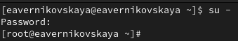{#fig:001 width=70%}

Выведим на экран информацию о существующих сетевых подключениях, а также статистику о количестве отправленных пакетов и связанных с ними сообщениях об ошибках: *ip -s link* (рис. [-@fig:002])

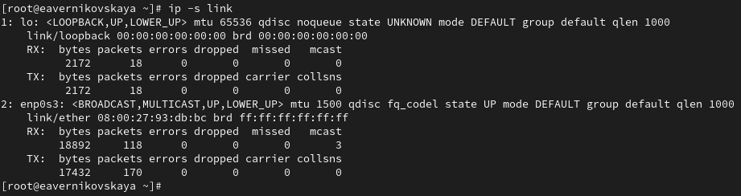{#fig:002 width=70%}

Пояснения к выведенной информации об интерфейсе enp0s3:

1. Тип: Ethernet
2. Состояние: UP (активный)
3. Группы: DEFAULT
4. MTU: 1500
5. MAC-адрес: 08:00:27:93:db:bc (реальный адрес)
6. Статистика: 

- RX (Received):
  + Байты: 18892
  + Пакеты: 118
  + Ошибки: 0
  + Пакеты, потерянные в процессе: 0
  + Мультикаст: 3
- TX (Transmitted):
  + Байты: 17432
  + Пакеты: 170
  + Ошибки: 0
  + Пакеты, потерянные в процессе: 0
  + Коллизии: 0

Выведим на экран информацию о текущих маршрутах: *ip route show* (рис. [-@fig:003])

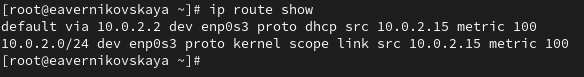{#fig:003 width=70%}

Пояснения к выведенной информации о текущих маршрутах:

1. default via 10.0.2.2 dev enp0s3 proto dhcp src 10.0.2.15 metric 100:

- default: обозначает маршрут по умолчанию, который используется для передачи трафика в сети, если нет более специфического маршрута 
- via 10.0.2.2: указывает на шлюз (gateway), через который осуществляется выход в другие сети
- dev enp0s3: показывает сетевой интерфейс, который используется для этого маршрута (в данном случае — enp0s3)
- proto dhcp: маршрут был добавлен динамически через протокол DHCP
- src 10.0.2.15: указывает IP-адрес источника (адрес вашего устройства), который будет использоваться при исходящем трафике через этот маршрут
- metric 100: определяет приоритет маршрута. Чем меньше значение метрики, тем выше приоритет маршрута

2. 10.0.2.0/24 dev enp0s3 proto kernel scope link src 10.0.2.15 metric 100:

- 10.0.2.0/24: это маршрут для локальной подсети с диапазоном адресов от 10.0.2.0 до 10.0.2.255 (маска подсети — /24)
- dev enp0s3: указывает, что подсеть доступна через интерфейс enp0s3
- proto kernel: маршрут был добавлен ядром операционной системы автоматически, при конфигурировании интерфейса
- scope link: определяет, что маршрут доступен только через этот интерфейс (локально)
- src 10.0.2.15: показывает IP-адрес устройства в этой подсети
- metric 100: метрика маршрута (приоритет)

Выведим на экран информацию о текущих назначениях адресов для сетевых интерфейсов на устройстве:
*ip addr show* (рис. [-@fig:004])

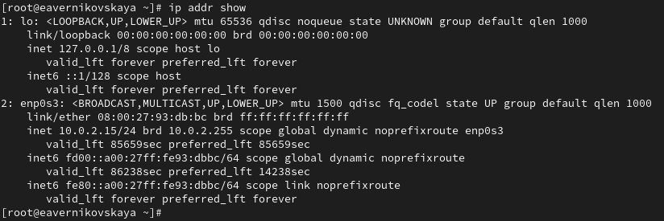{#fig:004 width=70%}

Пояснения к выведенной информации о текущих назначениях адресов для сетевых интерфейсов на устройстве:

1. Состояние интерфейса: Указано как BROADCAST,MULTICAST,UP,LOWER_UP, что означает, что интерфейс активен, способен к широковещательной и мультикастовой передаче и успешно работает
2. Максимальный размер передаваемого пакета (MTU): В данном случае MTU равен 1500, что является стандартным значением для Ethernet интерфейсов
3. MAC-адрес: 08:00:27:93:db:bc, который уникален для данного сетевого адаптера
4. IPv4-адрес: 10.0.2.15, что является частью подсети. Адрес указывает на то, что устройство может взаимодействовать в локальной сети
5. Сетевой префикс: 15, обозначающий, что сеть поддерживает 10.0.0.0/15 (это означает, что в этой сети может быть 2048 адресов)
6. Широковещательная адрес: 10.0.2.255, используемый для отправки данных всем устройствам в пределах подсети
7. Настройки маршрутизации: Указание noprefixroute говорит о том, что для данного адреса не установлены маршрутные префиксы
8. Название сетевого адаптера: enp0s3
9. IPv4-адрес устройства: 10.0.2.15

Далее используем команду ping для проверки правильности подключения к Интернету. Например, для отправки четырёх пакетов на IP-адрес 8.8.8.8 введём *ping -c 4 8.8.8.8* (рис. [-@fig:005])

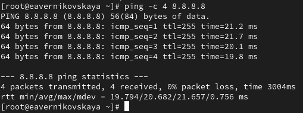{#fig:005 width=70%}

Добавим дополнительный адрес к нашему интерфейсу: *ip addr add 10.0.0.10/24 dev yourdevicename*
Здесь *yourdevicename* — название интерфейса, которому добавляется IP-адрес. В нашем случаем это enp0s3 (рис. [-@fig:006])

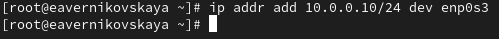{#fig:006 width=70%}

Проверим, что адрес добавился: *ip addr show* (рис. [-@fig:007])

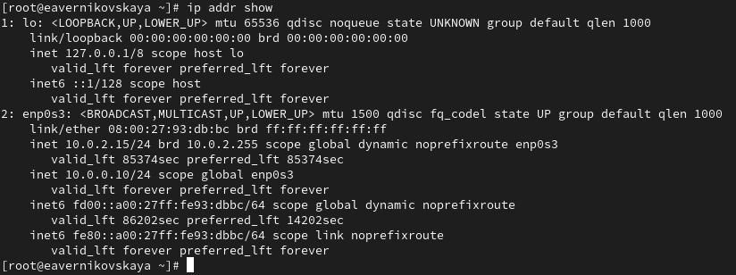{#fig:007 width=70%}

Теперь сравним вывод информации от утилиты *ip* и от команды *ifconfig* (рис. [-@fig:008]), (рис. [-@fig:009])

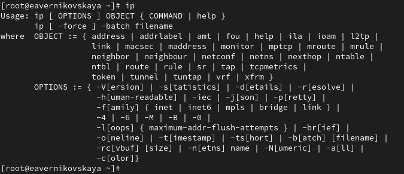{#fig:008 width=70%}

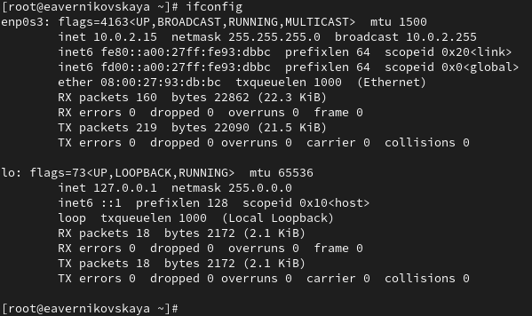{#fig:009 width=70%}

Сравнение: 

1. Команда ip:
- Используется для получения инструкций по использованию и расширенной функциональности
- Применяется для управления сетевым стеком более комплексно и детально
- Поддерживает как IPv4, так и IPv6, и предоставляет больше информации о взгляде на состояние всей сети
2. Команда ifconfig:
- Регулярно используется для быстрого доступа к основным данным о сетевых интерфейсах
- Выводит подробные статистические данные и состояние интерфейсов, но предоставляет меньше информации по сравнению с ip
- В основном используется для простых операций и поддерживается данными о сетевых интерфейсах без дополнительных параметров

Выведим на экран список всех прослушиваемых системой портов UDP и TCP: *ss -tul* (рис. [-@fig:010])

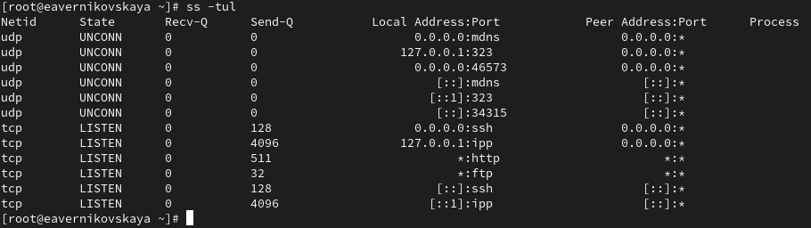{#fig:010 width=70%}

## Управление сетевыми подключениями с помощью nmcli

Выведим на экран информацию о текущих соединениях: *nmcli connection show* (рис. [-@fig:011])

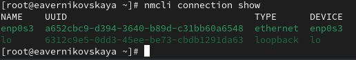{#fig:011 width=70%}

Добавим Ethernet-соединение с именем dhcp к интерфейсу: *nmcli connection add con-name "dhcp" type ethernet ifname ifname*. Здесь вместо *ifname* должно быть указано название интерфейса. В нашем случае это enp0s3 (рис. [-@fig:012])

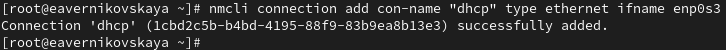{#fig:012 width=70%}

Теперь добавим к этому же интерфейсу Ethernet-соединение с именем static, статическим
IPv4-адресом адаптера и статическим адресом шлюза: *nmcli connection add con-name "static" ifname ifname autoconnect no type ethernet ip4 10.0.0.10/24 gw4 10.0.0.1 ifname ifname* (рис. [-@fig:013])

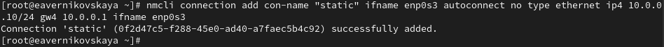{#fig:013 width=70%}

Снова выведим информацию о текущих соединениях: *nmcli connection show* (рис. [-@fig:014])

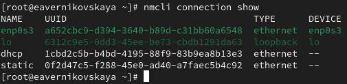{#fig:014 width=70%}

Переключимся на статическое соединение: *nmcli connection up "static"* (рис. [-@fig:015])

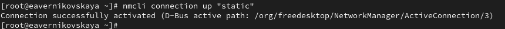{#fig:015 width=70%}

Проверим успешность переключения при помощи *nmcli connection show* и *ip addr* (рис. [-@fig:016]), (рис. [-@fig:017])

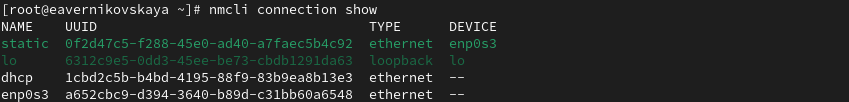{#fig:016 width=70%}

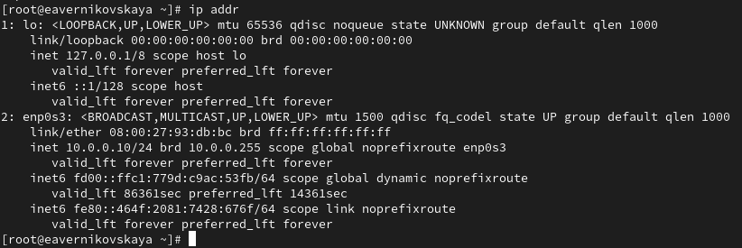{#fig:017 width=70%}

Вернёмся к соединению dhcp: *nmcli connection up "dhcp"* (рис. [-@fig:018])

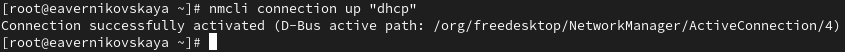{#fig:018 width=70%}

Снова проверим успешность переключения при помощи *nmcli connection show* и *ip addr* (рис. [-@fig:019]), (рис. [-@fig:020])

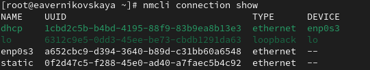{#fig:019 width=70%}

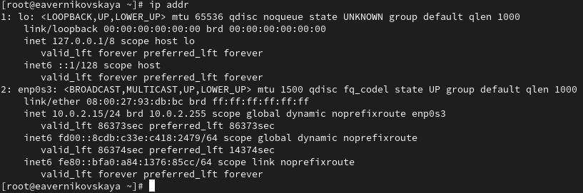{#fig:020 width=70%}

## Изменение параметров соединения с помощью nmcli

Отчлючим автоподключение статического соединения: *nmcli connection modify "static" connection.autoconnect no* (рис. [-@fig:021])

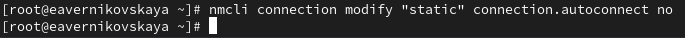{#fig:021 width=70%}

Добавим DNS-сервер в статическое соединение: *nmcli connection modify "static" ipv4.dns 10.0.0.10*. При добавлении сетевого подключения используется ip4, а при изменении параметров для существующего соединения используется ipv4 (рис. [-@fig:022])

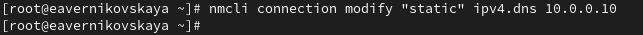{#fig:022 width=70%}

Добавим второй DNS-сервер: *nmcli connection modify "static" +ipv4.dns 8.8.8.8*. Для добавления второго и последующих элементов для тех же параметров используется знак *+*. Если его проигнорировать, то произойдёт замена, а не добавление элемента (рис. [-@fig:023])

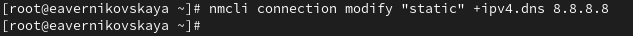{#fig:023 width=70%} 

Изменим IP-адрес статического соединения: *nmcli connection modify "static" ipv4.addresses 10.0.0.20/24* (рис. [-@fig:024])

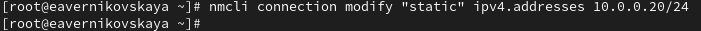{#fig:024 width=70%}

Добавим другой IP-адрес для статического соединения: *nmcli connection modify "static" +ipv4.addresses 10.20.30.40/16* (рис. [-@fig:025])

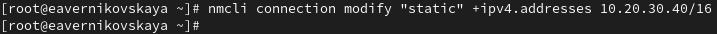{#fig:025 width=70%}

После изменения свойств соединения активируем его: *nmcli connection up "static"* (рис. [-@fig:026])

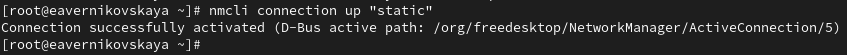{#fig:026 width=70%}

Проверим успешность переключения при помощи *nmcli con show* и *ip addr* (рис. [-@fig:027]), (рис. [-@fig:028])

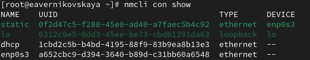{#fig:027 width=70%}

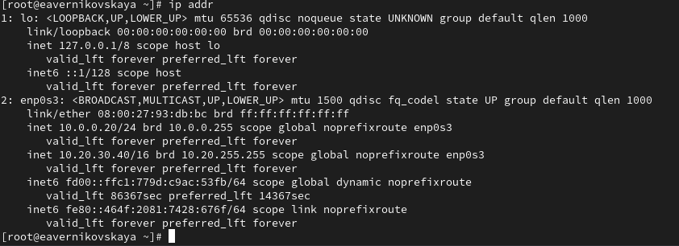{#fig:028 width=70%}

Используя *nmtui* посмотрим настройки сетевых соединений в графическом интерфейсе операционной
системы ([-@fig:029]), ([-@fig:030]), ([-@fig:031])

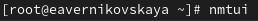{#fig:029 width=70%}

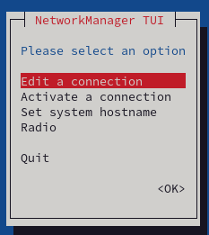{#fig:030 width=70%}

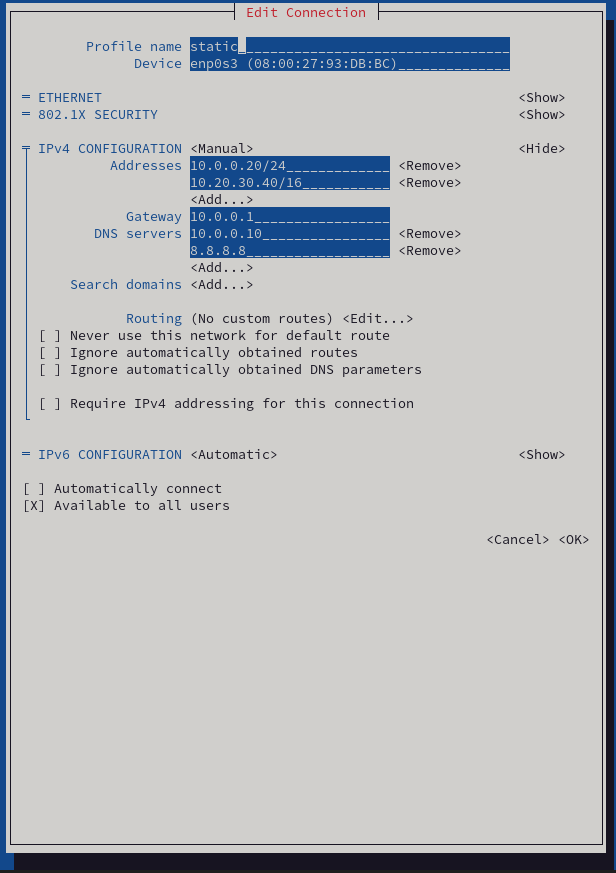{#fig:031 width=70%}

Переключимся на первоначальное сетевое соединение: *nmcli connection up "ifname"*. В нашем случае на enp0s3 ([-@fig:032])

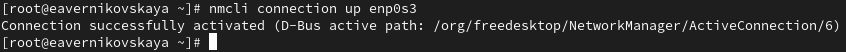{#fig:032 width=70%}

Проверим успешность переключения при помощи *nmcli connection show* и *ip addr* (рис. [-@fig:033]), (рис. [-@fig:034])

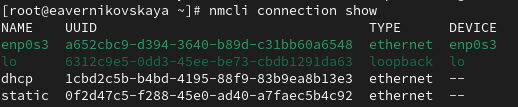{#fig:033 width=70%}

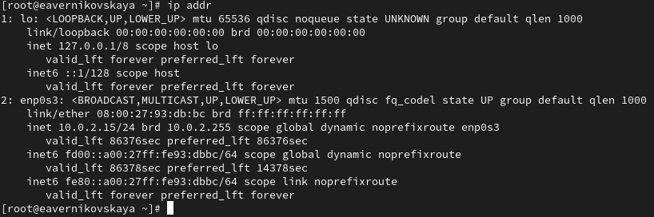{#fig:034 width=70%}

# Контрольные вопросы + ответы

1. Какая команда отображает только статус соединения, но не IP-адрес?

ip link или netstat (рис. [-@fig:035]), (рис. [-@fig:036])

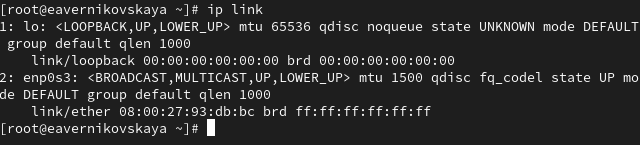{#fig:035 width=70%}

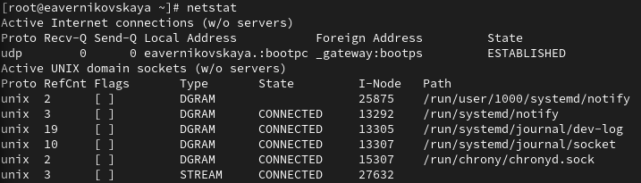{#fig:036 width=70%}

2. Какая служба управляет сетью в ОС типа RHEL?

NetworkManager

3. Какой файл содержит имя узла (устройства) в ОС типа RHEL?

файл /etc/hosts – список всех хостов (рис. [-@fig:037])  
файл /etc/hostname – имя хоста локального устройства (рис. [-@fig:038])

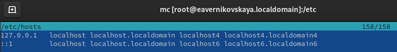{#fig:037 width=70%}

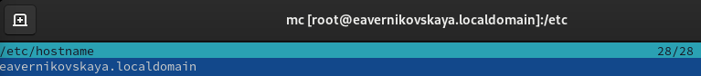{#fig:038 width=70%}

4. Какая команда позволяет вам задать имя узла (устройства)?

hostnamectl set-hostname

5. Какой конфигурационный файл можно изменить для включения разрешения имён для конкретного IP-адреса?

/etc/hosts

6. Какая команда показывает текущую конфигурацию маршрутизации?

ip route show (рис. [-@fig:039])

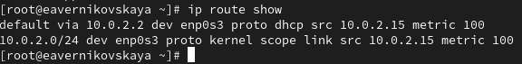{#fig:039 width=70%}

7. Как проверить текущий статус службы NetworkManager?

systemctl status NetworkManager (рис. [-@fig:039])

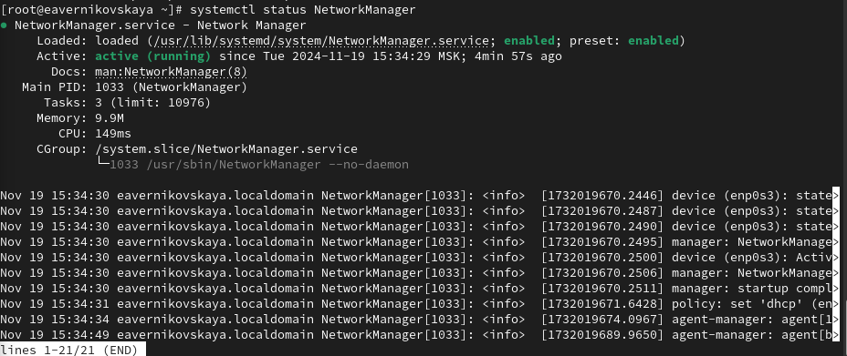{#fig:040 width=70%}

8. Какая команда позволяет вам изменить текущий IP-адрес и шлюз по умолчанию для вашего сетевого соединения?

- *nmcli con mod имя соединения ipv4.addresses "текущий ip,новый ip" gw4 новый ip* - изменить текущий ip адрес и шлюз
- *nmcli con mod имя соединения ipv4.addresses "текущий ip,новый ip"* - изменить текущий ip адрес
- *route add default GW новый ip название интерфейса* — изменить шлюз по умолчанию

# Выводы

В ходе выполнения лабораторной работы мы получили навыки настройки сетевых параметров системы

# Список литературы

1. Лаборатораня работа №12 [Электронный ресурс] URL: https://esystem.rudn.ru/pluginfile.php/2400741/mod_resource/content/4/013-network.pdf
