---
## Front matter
lang: ru-RU
title: Лабораторная работа №13
subtitle: Основы администрирования операционных систем
author:
  - Верниковская Е. А., НПИбд-01-23
institute:
  - Российский университет дружбы народов, Москва, Россия
date: 29 ноября 2024

## i18n babel
babel-lang: russian
babel-otherlangs: english

## Formatting pdf
toc: false
toc-title: Содержание
slide_level: 2
aspectratio: 169
section-titles: true
theme: metropolis
header-includes:
 - \metroset{progressbar=frametitle,sectionpage=progressbar,numbering=fraction}
 - '\makeatletter'
 - '\beamer@ignorenonframefalse'
 - '\makeatother'
 
## Fonts
mainfont: PT Serif
romanfont: PT Serif
sansfont: PT Sans
monofont: PT Mono
mainfontoptions: Ligatures=TeX
romanfontoptions: Ligatures=TeX
sansfontoptions: Ligatures=TeX,Scale=MatchLowercase
monofontoptions: Scale=MatchLowercase,Scale=0.9
---

# Вводная часть

## Цель работы

Получить навыки настройки пакетного фильтра в Linux.

## Задание

1. Используя firewall-cmd:
 - определить текущую зону по умолчанию
 - определить доступные для настройки зоны
 - определить службы, включённые в текущую зону
 - добавить сервер VNC в конфигурацию брандмауэра
2. Используя firewall-config:
 - добавить службы http и ssh в зону public
 - добавить порт 2022 протокола UDP в зону public
 - добавить службу ftp
3. Выполнить задание для самостоятельной работы

# Выполнение лабораторной работы

## Управление брандмауэром с помощью firewall-cmd

Запускаем терминала и получаем полномочия суперпользователя, используя *su -* (рис. 1)

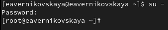{#fig:001 width=70%}

## Управление брандмауэром с помощью firewall-cmd

Определим текущую зону по умолчанию, введя: *firewall-cmd --get-default-zone* (рис. 2)

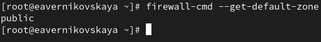{#fig:002 width=70%}

## Управление брандмауэром с помощью firewall-cmd

Определим доступные зоны, введя: *firewall-cmd --get-zones* (рис. 3)

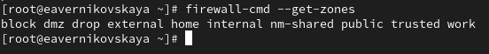{#fig:003 width=70%}

## Управление брандмауэром с помощью firewall-cmd

Посмотрим службы, доступные на нашем компьютере, используя *firewall-cmd --get-services* (рис. 4)

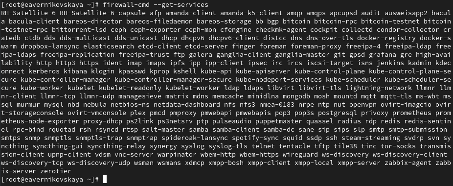{#fig:004 width=70%}

## Управление брандмауэром с помощью firewall-cmd 

Определим доступные службы в текущей зоне: *firewall-cmd --list-services* (рис. 5)

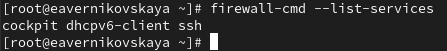{#fig:005 width=70%} 

## Управление брандмауэром с помощью firewall-cmd

Сравним результаты вывода информации при использованиии команд *firewall-cmd --list-all* и *firewall-cmd --list-all --zone=public*. Результат одинаковый, так как в настоящее время зона public является активной зоной по умолчанию (рис. 6), (рис. 7)

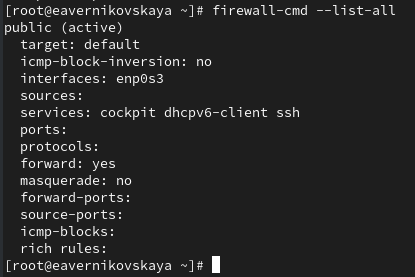{#fig:006 width=40%} 

## Управление брандмауэром с помощью firewall-cmd

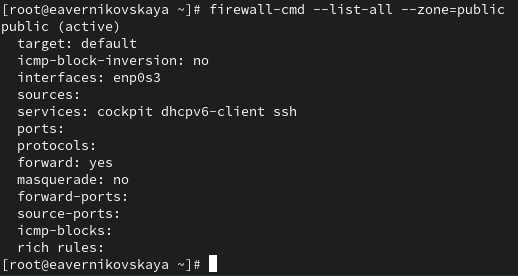{#fig:007 width=70%}

## Управление брандмауэром с помощью firewall-cmd 

Добавим сервер VNC в конфигурацию брандмауэра: *firewall-cmd --add-service=vnc-server* (рис. 8)

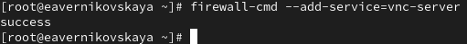{#fig:008 width=70%} 

## Управление брандмауэром с помощью firewall-cmd

Проверим, добавился ли vnc-server в конфигурацию: *firewall-cmd --list-all* (рис. 9)

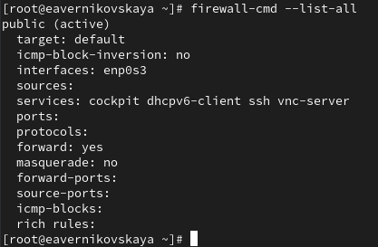{#fig:009 width=60%} 

## Управление брандмауэром с помощью firewall-cmd

Перезапустим службу firewalld: *systemctl restart firewalld* (рис. 10)

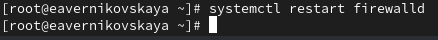{#fig:010 width=70%} 

## Управление брандмауэром с помощью firewall-cmd

Проверим, есть ли vnc-server в конфигурации: *firewall-cmd --list-all*. Его нет, так как служба vnc-server не постоянная (рис. 11)

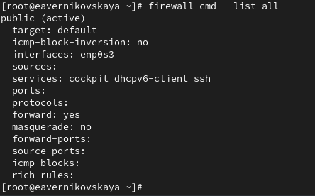{#fig:011 width=50%} 

## Управление брандмауэром с помощью firewall-cmd

Добавим службу vnc-server ещё раз, но на этот раз сделаем её постоянной, используя команду *firewall-cmd --add-service=vnc-server --permanent* (рис. 12)

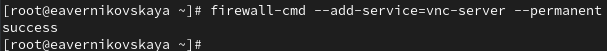{#fig:012 width=70%} 

## Управление брандмауэром с помощью firewall-cmd

Проверим наличие vnc-server в конфигурации: *firewall-cmd --list-all*. Мы увидим, что VNC-сервер не указан. Службы, которые были добавлены в конфигурацию на диске, автоматически не добавляются в конфигурацию времени выполнения (рис. 13)

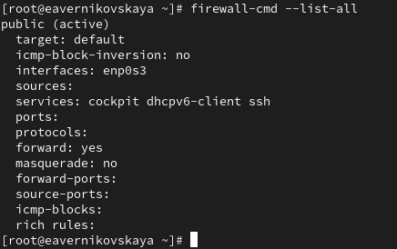{#fig:013 width=50%}

## Управление брандмауэром с помощью firewall-cmd

Перезагрузим конфигурацию firewalld и посмотрим конфигурацию времени выполнения: *firewall-cmd --reload* и *firewall-cmd --list-all* (рис. 14), (рис. 15)

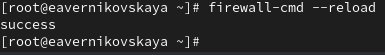{#fig:014 width=70%}

## Управление брандмауэром с помощью firewall-cmd

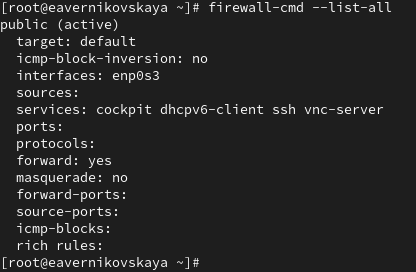{#fig:015 width=70%}

## Управление брандмауэром с помощью firewall-cmd

Добавим в конфигурацию межсетевого экрана порт 2022 протокола TCP: *firewall-cmd --add-port=2022/tcp --permanent* (рис. 16)

{#fig:016 width=70%}

## Управление брандмауэром с помощью firewall-cmd

Затем снова перезагрузим конфигурацию firewalld: *firewall-cmd --reload* (рис. 17)

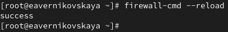{#fig:017 width=70%}

## Управление брандмауэром с помощью firewall-cmd

И проверим, что порт добавлен в конфигурацию: *firewall-cmd --list-all* (рис. 18)

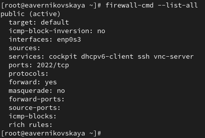{#fig:018 width=60%}

## Управление брандмауэром с помощью firewall-config

Открываем терминал и под учётной записью нашего пользователя запускаем интерфейс GUI firewall-config: *firewall-config*. Служба отсутствует, и система предлагает нам её установить. Также при запуске вводим пароль пользователя с полномочиями управления этой службой (рис. 19), (рис. 20), (рис. 21)

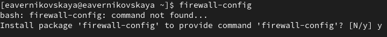{#fig:019 width=70%}

## Управление брандмауэром с помощью firewall-config

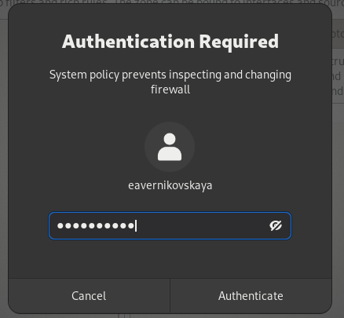{#fig:020 width=50%}

## Управление брандмауэром с помощью firewall-config

{#fig:021 width=50%}

## Управление брандмауэром с помощью firewall-config

Нажимаем выпадающее меню рядом с параметром Configuration. Открываем раскрывающийся список и выбираем Permanent. Это позволит сделать постоянными все изменения, которые мы вносим при конфигурировании (рис. 22)

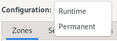{#fig:022 width=70%}

## Управление брандмауэром с помощью firewall-config

Выбираем зону public и отмечаем службы http, https и ftp, чтобы включить их (рис. 23)

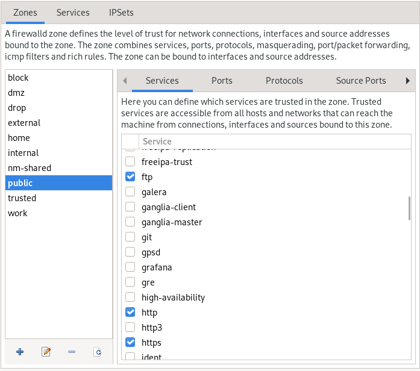{#fig:023 width=40%} 

## Управление брандмауэром с помощью firewall-config

Выбираем вкладку Ports и на этой вкладке нажимаем Add. Вводим порт 2022 и протокол udp, нажимаем ОК, чтобы добавить их в список (рис. 24)

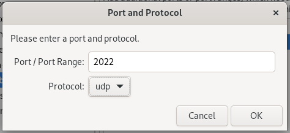{#fig:024 width=70%} 

## Управление брандмауэром с помощью firewall-config

Закрываем утилиту firewall-config. В окне терминала вводим *firewall-cmd --list-all*. Изменения, которые мы только что внесли, ещё не вступили в силу. Это связано с тем, что мы настроили их как постоянные изменения, а не как изменения времени выполнения (рис. 25)

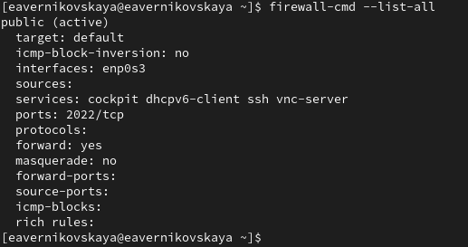{#fig:025 width=60%} 

## Управление брандмауэром с помощью firewall-config

Перезагрузим конфигурацию firewall-cmd: *firewall-cmd --reload* (рис. 26)

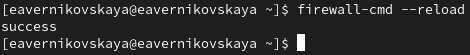{#fig:026 width=70%}  

## Управление брандмауэром с помощью firewall-config

Снова проверяем список доступных сервисов. Мы видим, что изменения вступили в силу (рис. 27)

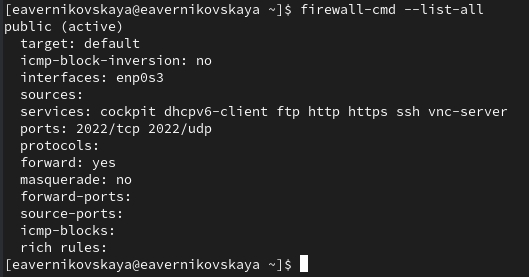{#fig:027 width=70%} 

## Самостоятельная работа

1. Надо создать конфигурацию межсетевого экрана, которая позволяет получить доступ
к следующим службам:

- telnet
- imap
- pop3
- smtp

2. Сделать это как в командной строке (для службы telnet), так и в графическом интерфейсе (для служб imap, pop3, smtp)

3. Убедиться, что конфигурация является постоянной и будет активирована после перезагрузки компьютера

## Самостоятельная работа

Сделаем службу telnet постоянной в командной строке: *firewall-cmd --add-service=telnet --permanent* (рис. 28)

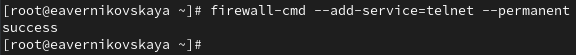{#fig:028 width=70%} 

## Самостоятельная работа

Открываем интерфейс GUI firewall-config: *firewall-config* (рис. 29)

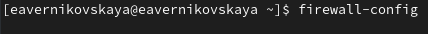{#fig:029 width=70%}

## Самостоятельная работа

Далее нажимаем выпадающее меню рядом с параметром Configuration. Открываем раскрывающийся список и выбираем Permanent. Выбираем зону public и отмечаем службы  imap, pop3 и smtp, чтобы включить их (рис. 30)

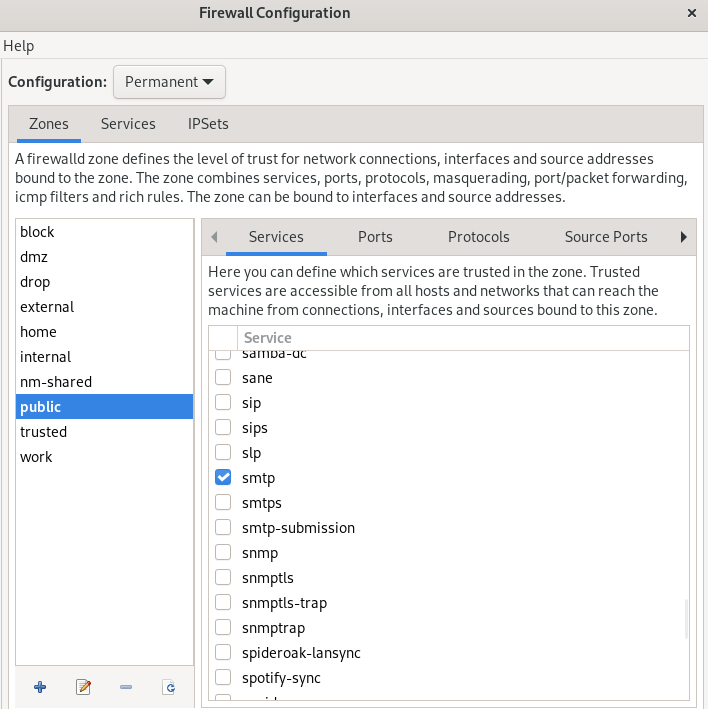{#fig:030 width=30%}

## Самостоятельная работа

Перезагружаем конфигурацию firewall-cmd и проверсяем, что изменения были применены (рис. 31), (рис. 32)

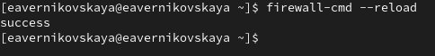{#fig:031 width=70%}

## Самостоятельная работа

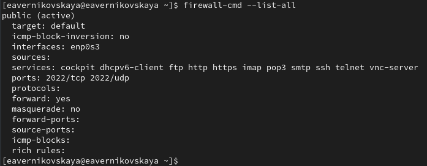{#fig:032 width=70%}

## Самостоятельная работа

Далее убедимся, что конфигурация является постоянной и будет активирована после перезагрузки компьютера (рис. 33), (рис. 34)

{#fig:033 width=70%}

## Самостоятельная работа

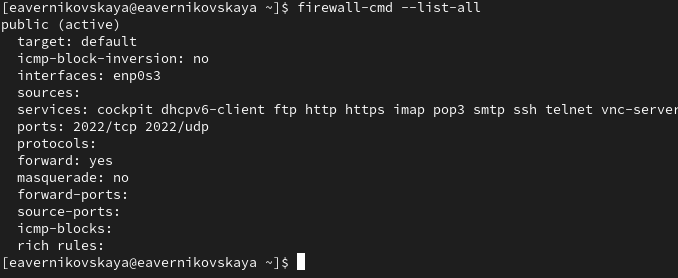{#fig:034 width=70%}

# Подведение итогов

## Выводы

В ходе выполнения лабораторной работы мы получили навыки настройки пакетного фильтра в Linux

## Список литературы

1. Лаборатораня работа №13 [Электронный ресурс] URL: https://esystem.rudn.ru/pluginfile.php/2400747/mod_resource/content/4/014-firewall.pdf
