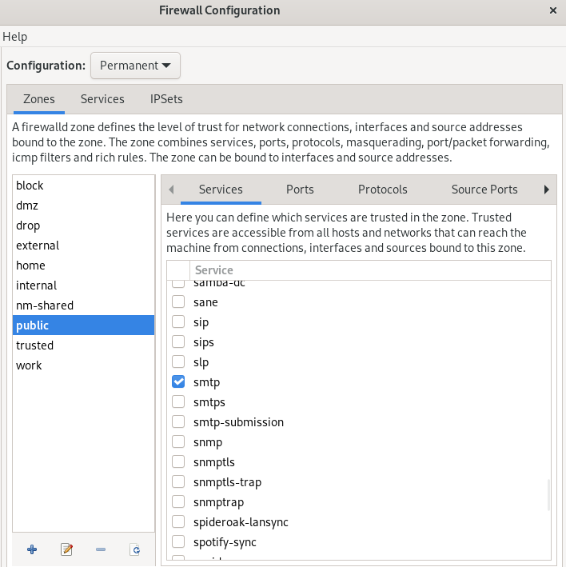

---
## Front matter
title: "Отчёт по лабораторной работе №13"
subtitle: "Дисциплина: Основы администрирования операционных систем"
author: "Верниковская Екатерина Андреевна"

## Generic otions
lang: ru-RU
toc-title: "Содержание"

## Bibliography
bibliography: bib/cite.bib
csl: pandoc/csl/gost-r-7-0-5-2008-numeric.csl

## Pdf output format
toc: true # Table of contents
toc-depth: 2
lof: true # List of figures
lot: true # List of tables
fontsize: 12pt
linestretch: 1.5
papersize: a4
documentclass: scrreprt
## I18n polyglossia
polyglossia-lang:
  name: russian
  options:
	- spelling=modern
	- babelshorthands=true
polyglossia-otherlangs:
  name: english
## I18n babel
babel-lang: russian
babel-otherlangs: english
## Fonts
mainfont: PT Serif
romanfont: PT Serif
sansfont: PT Sans
monofont: PT Mono
mainfontoptions: Ligatures=TeX
romanfontoptions: Ligatures=TeX
sansfontoptions: Ligatures=TeX,Scale=MatchLowercase
monofontoptions: Scale=MatchLowercase,Scale=0.9
## Biblatex
biblatex: true
biblio-style: "gost-numeric"
biblatexoptions:
  - parentracker=true
  - backend=biber
  - hyperref=auto
  - language=auto
  - autolang=other*
  - citestyle=gost-numeric
## Pandoc-crossref LaTeX customization
figureTitle: "Рис."
tableTitle: "Таблица"
listingTitle: "Листинг"
lofTitle: "Список иллюстраций"
lotTitle: "Список таблиц"
lolTitle: "Листинги"
## Misc options
indent: true
header-includes:
  - \usepackage{indentfirst}
  - \usepackage{float} # keep figures where there are in the text
  - \floatplacement{figure}{H} # keep figures where there are in the text
---

# Цель работы

Получить навыки настройки пакетного фильтра в Linux.

# Задание

1. Используя firewall-cmd:
 - определить текущую зону по умолчанию
 - определить доступные для настройки зоны
 - определить службы, включённые в текущую зону
 - добавить сервер VNC в конфигурацию брандмауэра
2. Используя firewall-config:
 - добавить службы http и ssh в зону public
 - добавить порт 2022 протокола UDP в зону public
 - добавить службу ftp
3. Выполнить задание для самостоятельной работы

# Выполнение лабораторной работы

## Управление брандмауэром с помощью firewall-cmd

Запускаем терминала и получаем полномочия суперпользователя, используя *su -* (рис. [-@fig:001])

{#fig:001 width=70%}

Определим текущую зону по умолчанию, введя: *firewall-cmd --get-default-zone* (рис. [-@fig:002])

{#fig:002 width=70%}

Определим доступные зоны, введя: *firewall-cmd --get-zones* (рис. [-@fig:003])

{#fig:003 width=70%}

Посмотрим службы, доступные на нашем компьютере, используя *firewall-cmd --get-services* (рис. [-@fig:004])

{#fig:004 width=70%} 

Определим доступные службы в текущей зоне: *firewall-cmd --list-services* (рис. [-@fig:005])

{#fig:005 width=70%} 

Сравним результаты вывода информации при использованиии команд *firewall-cmd --list-all* и *firewall-cmd --list-all --zone=public*. Результат одинаковый, так как в настоящее время зона public является активной зоной по умолчанию (рис. [-@fig:006]), (рис. [-@fig:007])

{#fig:006 width=70%} 

{#fig:007 width=70%} 

Добавим сервер VNC в конфигурацию брандмауэра: *firewall-cmd --add-service=vnc-server* (рис. [-@fig:008])

{#fig:008 width=70%} 

Проверим, добавился ли vnc-server в конфигурацию: *firewall-cmd --list-all* (рис. [-@fig:009])

{#fig:009 width=70%} 

Перезапустим службу firewalld: *systemctl restart firewalld* (рис. [-@fig:010])

{#fig:010 width=70%} 

Проверим, есть ли vnc-server в конфигурации: *firewall-cmd --list-all*. Его нет, так как служба vnc-server не постоянная (рис. [-@fig:011])

{#fig:011 width=70%} 

Добавим службу vnc-server ещё раз, но на этот раз сделаем её постоянной, используя команду *firewall-cmd --add-service=vnc-server --permanent* (рис. [-@fig:012])

{#fig:012 width=70%} 

Проверим наличие vnc-server в конфигурации: *firewall-cmd --list-all*. Мы увидим, что VNC-сервер не указан. Службы, которые были добавлены в конфигурацию на диске, автоматически не добавляются в конфигурацию времени выполнения (рис. [-@fig:013])

{#fig:013 width=70%}

Перезагрузим конфигурацию firewalld и посмотрим конфигурацию времени выполнения: *firewall-cmd --reload* и *firewall-cmd --list-all* (рис. [-@fig:014]), (рис. [-@fig:015])

{#fig:014 width=70%}

{#fig:015 width=70%}

Добавим в конфигурацию межсетевого экрана порт 2022 протокола TCP: *firewall-cmd --add-port=2022/tcp --permanent* (рис. [-@fig:016])

{#fig:016 width=70%}

Затем снова перезагрузим конфигурацию firewalld: *firewall-cmd --reload* (рис. [-@fig:017])

{#fig:017 width=70%}

И проверим, что порт добавлен в конфигурацию: *firewall-cmd --list-all* (рис. [-@fig:018])

{#fig:018 width=70%}

## Управление брандмауэром с помощью firewall-config

Открываем терминал и под учётной записью нашего пользователя запускаем интерфейс GUI firewall-config: *firewall-config*. Служба отсутствует, и система предлагает нам её установить. Также при запуске вводим пароль пользователя с полномочиями управления этой службой (рис. [-@fig:019]), (рис. [-@fig:020]), (рис. [-@fig:021])

{#fig:019 width=70%}

{#fig:020 width=70%}

{#fig:021 width=70%}

Нажимаем выпадающее меню рядом с параметром Configuration. Открываем раскрывающийся список и выбираем Permanent. Это позволит сделать постоянными все изменения, которые мы вносим при конфигурировании (рис. [-@fig:022])

{#fig:022 width=70%}

Выбираем зону public и отмечаем службы http, https и ftp, чтобы включить их (рис. [-@fig:023])

{#fig:023 width=70%} 

Выбираем вкладку Ports и на этой вкладке нажимаем Add. Вводим порт 2022 и протокол udp, нажимаем ОК, чтобы добавить их в список (рис. [-@fig:024])

{#fig:024 width=70%} 

Закрываем утилиту firewall-config. В окне терминала вводим *firewall-cmd --list-all*. Изменения, которые мы только что внесли, ещё не вступили в силу. Это связано с тем, что мы настроили их как постоянные изменения, а не как изменения времени выполнения (рис. [-@fig:025])

{#fig:025 width=70%} 

Перезагрузим конфигурацию firewall-cmd: *firewall-cmd --reload* (рис. [-@fig:026])

{#fig:026 width=70%}  

Снова проверяем список доступных сервисов. Мы видим, что изменения вступили в силу (рис. [-@fig:027])

{#fig:027 width=70%} 

## Самостоятельная работа

1. Надо создать конфигурацию межсетевого экрана, которая позволяет получить доступ
к следующим службам:

- telnet
- imap
- pop3
- smtp

2. Сделать это как в командной строке (для службы telnet), так и в графическом интерфейсе (для служб imap, pop3, smtp)

3. Убедиться, что конфигурация является постоянной и будет активирована после перезагрузки компьютера

Сделаем службу telnet постоянной в командной строке: *firewall-cmd --add-service=telnet --permanent* (рис. [-@fig:028])

{#fig:028 width=70%} 

Открываем интерфейс GUI firewall-config: *firewall-config* (рис. [-@fig:029])

{#fig:029 width=70%}

Далее нажимаем выпадающее меню рядом с параметром Configuration. Открываем раскрывающийся список и выбираем Permanent. Выбираем зону public и отмечаем службы  imap, pop3 и smtp, чтобы включить их (рис. [-@fig:030])

{#fig:030 width=70%}

Перезагружаем конфигурацию firewall-cmd и проверсяем, что изменения были применены (рис. [-@fig:031]), (рис. [-@fig:032])

{#fig:031 width=70%}

{#fig:032 width=70%}

Далее убедимся, что конфигурация является постоянной и будет активирована после перезагрузки компьютера (рис. [-@fig:033]), (рис. [-@fig:034])

{#fig:033 width=70%}

{#fig:034 width=70%}

# Контрольные вопросы + ответы

1. Какая служба должна быть запущена перед началом работы с менеджером конфигурации брандмауэра firewall-config?

sudo systemctl start firewalld

2. Какая команда позволяет добавить UDP-порт 2355 в конфигурацию брандмауэра в зоне по умолчанию?

firewall-cmd --add-port=2355/udp --permanent

3. Какая команда позволяет показать всю конфигурацию брандмауэра во всех зонах?

firewall-cmd --list-all-zones

4. Какая команда позволяет удалить службу vnc-server из текущей конфигурации брандмауэра?

firewall-cmd --remove-service=vnc-server

5. Какая команда firewall-cmd позволяет активировать новую конфигурацию, добавленную опцией --permanent?

firewall-cmd --reload

6. Какой параметр firewall-cmd позволяет проверить, что новая конфигурация была добавлена в текущую зону и теперь активна?

firewall-cmd --list-all --zone="zone-name"

7. Какая команда позволяет добавить интерфейс eno1 в зону public?

firewall-cmd --zone=public --change-interface=eno1

8. Если добавить новый интерфейс в конфигурацию брандмауэра, пока не указана зона, в какую зону он будет добавлен?

В зону по умолчанию (firewall-cmd --get-default-zone)

# Выводы

В ходе выполнения лабораторной работы мы получили навыки настройки пакетного фильтра в Linux

# Список литературы

1. Лаборатораня работа №13 [Электронный ресурс] URL: https://esystem.rudn.ru/pluginfile.php/2400747/mod_resource/content/4/014-firewall.pdf
