---
## Front matter
lang: ru-RU
title: Лабораторная работа №14
subtitle: Основы администрирования операционных систем
author:
  - Верниковская Е. А., НПИбд-01-23
institute:
  - Российский университет дружбы народов, Москва, Россия
date: 6 декабря 2024

## i18n babel
babel-lang: russian
babel-otherlangs: english

## Formatting pdf
toc: false
toc-title: Содержание
slide_level: 2
aspectratio: 169
section-titles: true
theme: metropolis
header-includes:
 - \metroset{progressbar=frametitle,sectionpage=progressbar,numbering=fraction}
 - '\makeatletter'
 - '\beamer@ignorenonframefalse'
 - '\makeatother'
 
## Fonts
mainfont: PT Serif
romanfont: PT Serif
sansfont: PT Sans
monofont: PT Mono
mainfontoptions: Ligatures=TeX
romanfontoptions: Ligatures=TeX
sansfontoptions: Ligatures=TeX,Scale=MatchLowercase
monofontoptions: Scale=MatchLowercase,Scale=0.9
---

# Вводная часть

## Цель работы

Получить навыки создания разделов на диске и файловых систем. Получить навыки монтирования файловых систем

## Задание

1. Добавить два диска на виртуальной машине
2. Продемонстрировать навыки создания разделов MBR с помощью fdisk
3. Продемонстрировать навыки создания логических разделов с помощью fdisk
4. Продемонстрировать навыки создания раздела подкачки с помощью fdisk
5. Продемонстрировать навыки создания разделов GPT с помощью gdisk
6. Продемонстрировать навыки форматирования файловой системы XFS
7. Продемонстрировать навыки форматирования файловой системы EXT4
8. Продемонстрировать навыки ручного монтирования файловых систем
9. Продемонстрировать навыки монтирования файловых систем с помощью /etc/fstab
10. Выполнить задание для самостоятельной работы

# Выполнение лабораторной работы

## Создание виртуальных носителей

Добавим к нашей виртуальной машине два диска размером 512 МБ. Для этого нажимаем в меню виртуальной машины *Настроить*, выбираем *Носители*. Затем на контроллере SATA нажимаем *Добавить жёсткий диск*. В открывшемся окне нажимаем *Создать образ диска*. Выбираем *VDI*, размер диска *512*, также указываем месторасположение диска и его название (disk1.vdi - для первого или disk2.vdi - для второго). После нажимаем *Создать*. В окне выбора жёсткого диска встаём на обозначение созданного диска и нажимаем *Выбрать*. После этого повторяем указанные выше действия второй раз, чтобы создать второй диск (рис. 1), (рис. 2), (рис. 3), (рис. 4)

## Создание виртуальных носителей

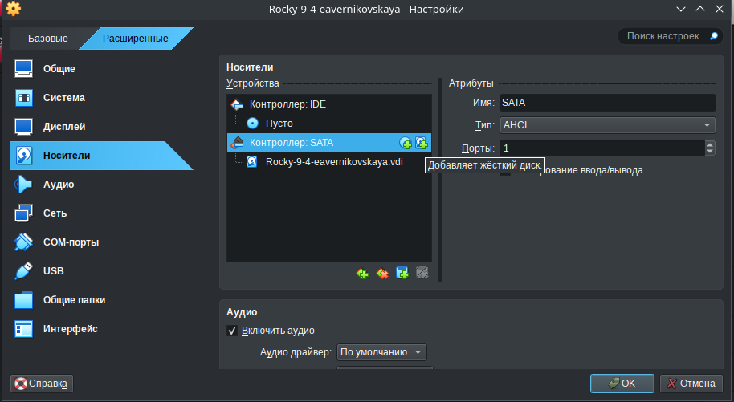{#fig:001 width=70%}

## Создание виртуальных носителей

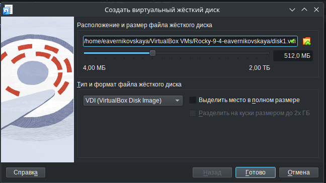{#fig:002 width=70%}

## Создание виртуальных носителей

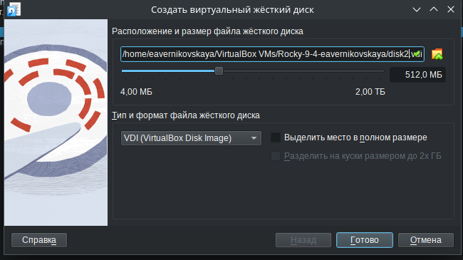{#fig:003 width=70%}

## Создание виртуальных носителей

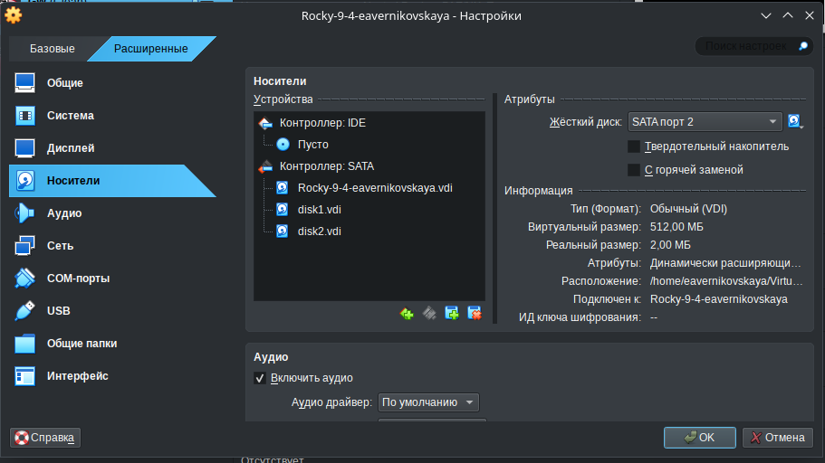{#fig:004 width=70%}

## Создание разделов MBR с помощью fdisk

Далее запускаем нашу виртуальную машину с добавленными дополнительными дисками disk1 и disk2. Запускаем терминала и получаем полномочия суперпользователя, используя *su -* (рис. 5)

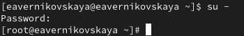{#fig:005 width=70%}

## Создание разделов MBR с помощью fdisk

С помощью *fdisk --list* посмотрим перечень разделов на всех имеющихся в системе устройствах жёстких дисков. В списке отобразилась информация о добавленных дисках размером 512 MiB, в частности название разделов: /dev/sdb и /dev/sdc (рис. 6)

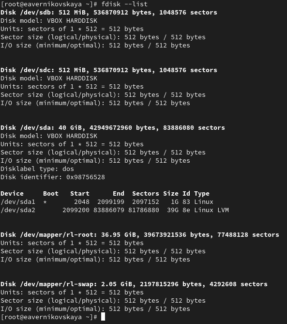{#fig:006 width=20%}

## Создание разделов MBR с помощью fdisk

Сделаем разметку диска /dev/sdb с помощью *fdisk /dev/sdb* (рис. 7)

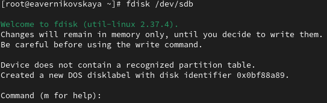{#fig:007 width=70%}

## Создание разделов MBR с помощью fdisk

Введём *m*, чтобы получить справку по командам (рис. 8)

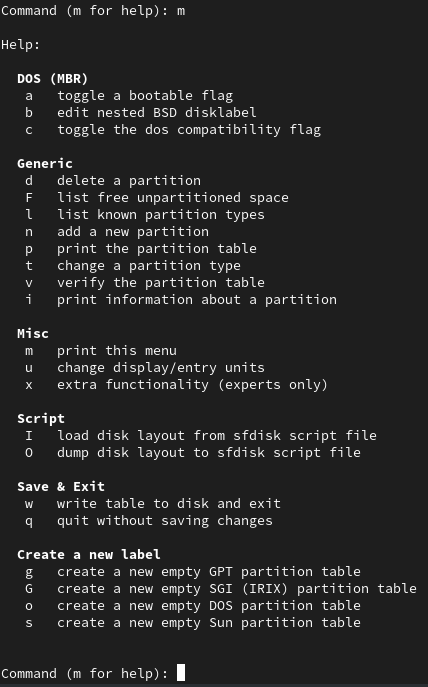{#fig:008 width=20%}

## Создание разделов MBR с помощью fdisk

Нажмём *p*, чтобы просмотреть текущее распределение пространства диска (рис. 9)

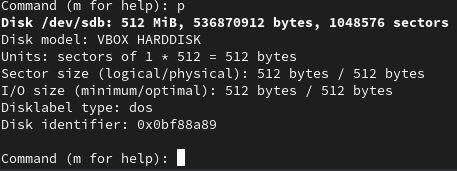{#fig:009 width=70%}

## Создание разделов MBR с помощью fdisk

Введём *n*, чтобы добавить новый раздел. Далее выберем *p*, чтобы создать основной раздел. Применим номер раздела (в данном случае 1), который предлагается. Далее указываем первый сектор на диске, с которого начнётся новый раздел. По умолчанию предлагается первый доступный сектор, нажимаем *Enter* для подтверждения выбора. Далее указываем последний сектор, которым будет завершён раздел. Для этого вводим *+100M* (рис. 10)

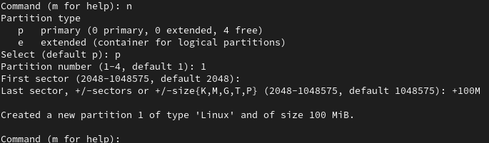{#fig:010 width=70%}

## Создание разделов MBR с помощью fdisk

Далее определяем тип раздела. Для этого вводи *t* и после *83* (рис. 11)

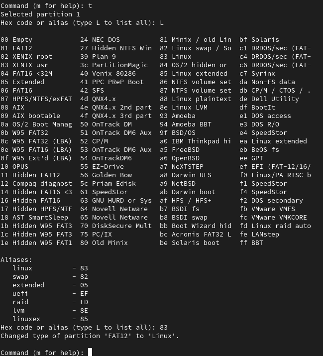{#fig:011 width=30%}

## Создание разделов MBR с помощью fdisk

Нажимаем *w*, чтобы записать изменения на диск и выйти из fdisk (рис. 12)

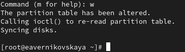{#fig:012 width=70%}

## Создание разделов MBR с помощью fdisk

Сравним выводы команд *fdisk -l /dev/sdb* и *cat /proc/partitions* (рис. 13), (рис. 14)

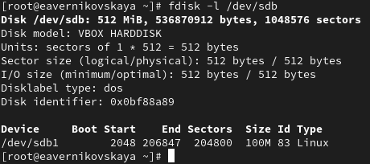{#fig:013 width=70%}

## Создание разделов MBR с помощью fdisk

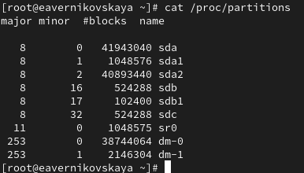{#fig:014 width=70%}

## Создание разделов MBR с помощью fdisk

Запишим изменения в таблицу разделов ядра: *partprobe /dev/sdb* (рис. 15)

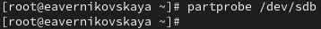{#fig:015 width=70%}

## Создание логических разделов

В терминале с полномочиями администратора запустим *fdisk /dev/sdb* (рис. 16)

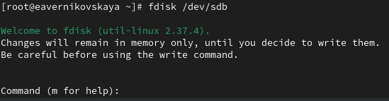{#fig:016 width=70%}

## Создание логических разделов

Введём *n*, чтобы добавить новый раздел (рис. 17)

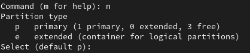{#fig:017 width=70%}

## Создание логических разделов

Введём *e*, чтобы добавить создать расширенный раздел. Далее на всех пунктах нажимаем *Enter* (рис. 18)

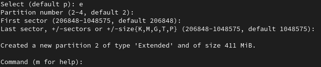{#fig:018 width=70%}

## Создание логических разделов

Теперь, когда расширенный раздел создан, мы можем создать в нём логический раздел. Из интерфейса fdisk снова нажимаем *n*. Утилита сообщит, что нет свободных первичных разделов и по умолчанию предложит добавить логический раздел с номером 5. Нажимаем *Enter*, чтобы принять выбор первого сектора в качестве сектора по умолчанию. На вопрос о последнем секторе вводим *+101M* (рис. 19)

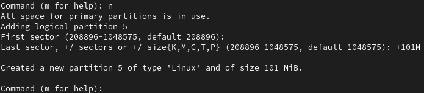{#fig:019 width=70%}

## Создание логических разделов

После создания логического раздела вводим *w*, чтобы записать изменения на диск и выйти из fdisk (рис. 20)

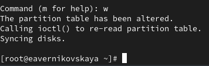{#fig:020 width=70%}

## Создание логических разделов

Чтобы завершить процедуру и обновить таблицу разделов, вводим *partprobe /dev/sdb* (рис. 21)

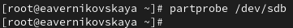{#fig:021 width=70%}

## Создание логических разделов

Посмотрим информацию о добавленных разделах с помощью *cat /proc/partitions* и *fdisk --list /dev/sdb* (рис. 22), (рис. 23)

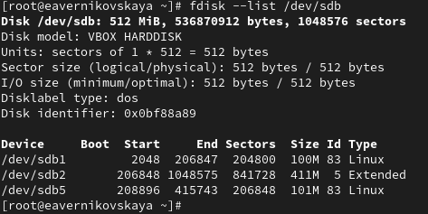{#fig:022 width=70%}

## Создание логических разделов

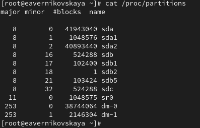{#fig:023 width=70%}

## Создание раздела подкачки

Получаем полномочия администратора и запускаем fdisk: *fdisk /dev/sdb* (рис. 24)

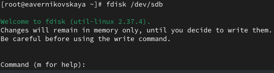{#fig:024 width=70%} 

## Создание раздела подкачки

Нажимем *n*, чтобы добавить новый раздел. Утилита сообщит, что нет свободных первичных разделов и по умолчанию предложит добавить логический раздел с номером раздела 6. Нажимаем *Enter*, чтобы принять первый сектор по умолчанию. На вопрос о последнем секторе вводим *+100M* (рис. 25)

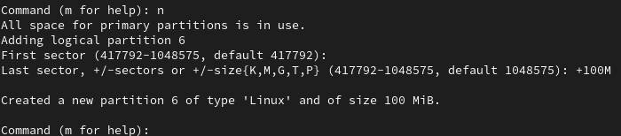{#fig:025 width=70%} 

## Создание раздела подкачки

Далее изменим тип раздела. Для этого нажмём *t*, затем укажем номер партиции, для которой хотим изменить тип (в данном случае это номер 6). Затем введем код типа раздела (в данном случае 82 — раздел подкачки) (рис. 26)

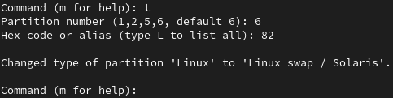{#fig:026 width=70%} 

## Создание раздела подкачки

После создания логического раздела вводим *w*, чтобы записать изменения на диск и выйти из fdisk (рис. 27)

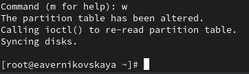{#fig:027 width=70%}

## Создание раздела подкачки

ЧТобы завершить процедуру и обновить таблицу разделов ядра, вводим *partprobe /dev/sdb*. Новый раздел теперь готов к использованию (рис. 28)

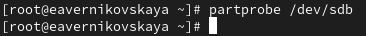{#fig:028 width=70%}

## Создание раздела подкачки

Посмотрим информацию о добавленных разделах: *cat /proc/partitions* и  *fdisk --list /dev/sdb* (рис. 29), (рис. 30)

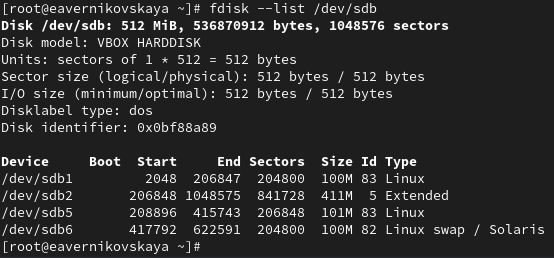{#fig:029 width=70%}

## Создание раздела подкачки

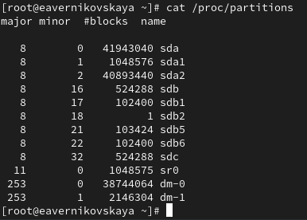{#fig:030 width=60%}

## Создание раздела подкачки

Отформатируем раздел подкачки, используя команду *mkswap /dev/sdb6* (рис. 31) 

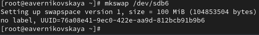{#fig:031 width=70%}

## Создание раздела подкачки

Для включения вновь выделенного пространства подкачки используем *swapon /dev/sdb6* (рис. 32) 

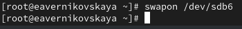{#fig:032 width=70%}

## Создание раздела подкачки

Для просмотра размера пространства подкачки, которое в настоящее время выделено, вводим *free -m* (рис. 33) 

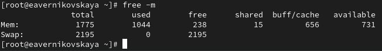{#fig:033 width=70%}

## Создание разделов GPT с помощью gdisk

В терминале с полномочиями администратора с помощью gdisk посмотрим таблицы разделов и разделы на втором добавленном нами ранее диске /dev/sdc: *gdisk -l /dev/sdc* (рис. 34)

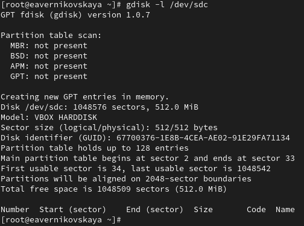{#fig:034 width=40%}

## Создание разделов GPT с помощью gdisk

Создадим раздел с помощью gdisk: *gdisk /dev/sdc* (рис. 35)

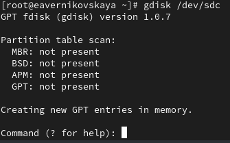{#fig:035 width=60%} 

## Создание разделов GPT с помощью gdisk

Вводим *n*, чтобы добавить новый раздел. Принимаем номер раздела по умолчанию, который предлагается. Теперь нас просят задать первый сектор. По умолчанию будет использоваться первый сектор, доступный на диске, но также можно указать смещение. Нажимаем *Enter*, чтобы принять предлагаемый по умолчанию первый сектор. При запросе последнего сектора используем *+100M*. Далее предлагается установить тип раздела. Нажимаем *Enter*, чтобы принять тип раздела 8300 по умолчанию (рис. 36)

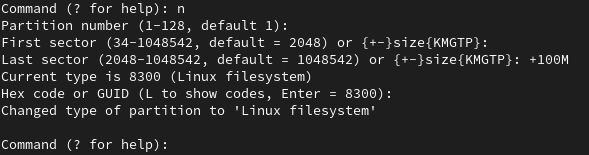{#fig:036 width=70%} 

## Создание разделов GPT с помощью gdisk

Теперь раздел создан (но ещё не записан на диск). Нажимаем *p*, чтобы отобразить разбиение диска (рис. 37)

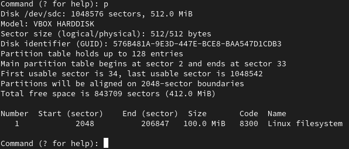{#fig:037 width=70%} 

## Создание разделов GPT с помощью gdisk

Наше текущее разбиение нас устраивает. Нажимаем *w* чтобы записать изменения на диск  (рис. 38)

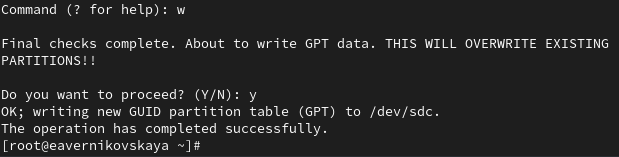{#fig:038 width=70%}

## Создание разделов GPT с помощью gdisk

Обновим таблицу разделов: *partprobe /dev/sdc* (рис. 39)

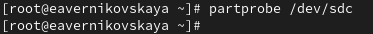{#fig:039 width=70%}

## Создание разделов GPT с помощью gdisk

Посмотрим информацию о добавленных разделах: *cat /proc/partitions* и *gdisk -l /dev/sdc* (рис. 40), (рис. 41)

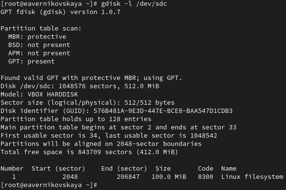{#fig:040 width=50%}

## Создание разделов GPT с помощью gdisk

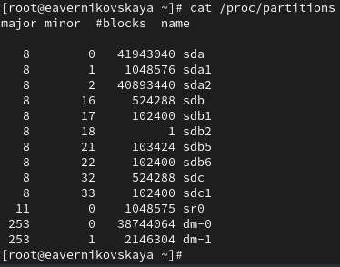{#fig:041 width=60%} 

## Форматирование файловой системы XFS

В терминале с полномочиями администратора для диска dev/sdb1 создадим файловую систему XFS: *mkfs.xfs /dev/sdb1* (рис. 42)

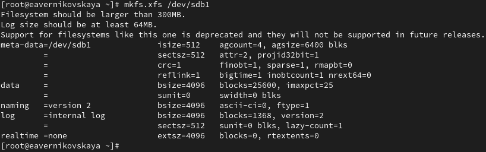{#fig:042 width=70%}

## Форматирование файловой системы XFS

Для установки метки файловой системы в xfsdisk используем команду *xfs_admin -L xfsdisk /dev/sdb1* (рис. 43)

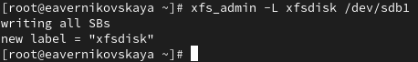{#fig:043 width=70%} 

## Форматирование файловой системы EXT4

В терминале с полномочиями администратора для диска dev/sdb5 создадим файловую систему EXT4: *mkfs.ext4 /dev/sdb5* (рис. 44)

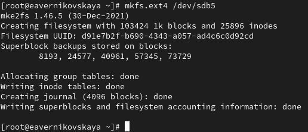{#fig:044 width=70%}

## Форматирование файловой системы EXT4

Для установки метки файловой системы в ext4disk используем команду *tune2fs -L ext4disk /dev/sdb5* (рис. 45)

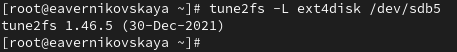{#fig:045 width=70%}  

## Форматирование файловой системы EXT4

Для установки параметров монтирования по умолчанию для файловой системы используем команду *tune2fs -o acl,user_xattr /dev/sdb5* (рис. 46)

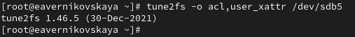{#fig:046 width=70%} 

## Ручное монтирование файловых систем

Получим полномочия администратора. Для создания точки монтирования для раздела введём *mkdir -p /mnt/tmp* (рис. 47)

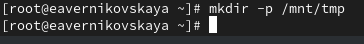{#fig:047 width=70%} 

## Ручное монтирование файловых систем

Чтобы смонтировать файловую систему, используем следующую команду *mount /dev/sdb5 /mnt/tmp* (рис. 48)

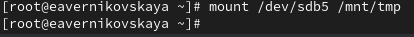{#fig:048 width=70%} 

## Ручное монтирование файловых систем

Для проверки корректности монтирования раздела введём: *mount* (рис. 49)

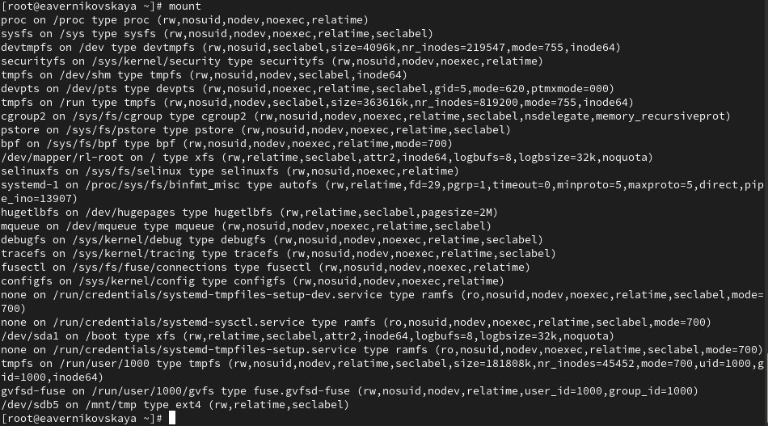{#fig:049 width=70%} 

## Ручное монтирование файловых систем

Чтобы отмонтировать раздел, можно использовать umount либо с именем устройства, либо с именем точки монтирования. Таким образом, обе следующие команды будут работать: *umount /dev/sdb5* или *umount /mnt/tmp* (рис. 50)

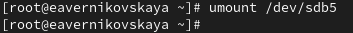{#fig:050 width=70%}

## Ручное монтирование файловых систем

Проверим, что раздел отмонтирован: *mount* (рис. 51)

{#fig:051 width=70%} 

## Монтирование разделов с помощью /etc/fstab

Создайте точку монтирования для раздела XFS /dev/sdb1: *mkdir -p /mnt/data* (рис. 52)

{#fig:052 width=70%} 

## Монтирование разделов с помощью /etc/fstab

Посмотрим информацию об идентификаторах блочных устройств (UUID): *blkid* (рис. 53)

{#fig:053 width=70%} 

## Монтирование разделов с помощью /etc/fstab

Введём *blkid /dev/sdb1* и затем используем мышь, чтобы скопировать значение идентификатора UUID для устройства /dev/sdb1 (рис. 54)

{#fig:054 width=70%} 

## Монтирование разделов с помощью /etc/fstab

Откроем файл /etc/fstab на редактирование и добавим следующую строку: *UUID=значение_идентификатора /mnt/data xfs defaults 1 2* (рис. 55), (рис. 56)

{#fig:055 width=70%} 

## Монтирование разделов с помощью /etc/fstab

{#fig:056 width=70%} 

## Монтирование разделов с помощью /etc/fstab

Следующая команда монтирует всё, что указано в /etc/fstab: *mount -a* (рис. 57)

{#fig:057 width=70%} 

## Монтирование разделов с помощью /etc/fstab

Проверим, что раздел примонтирован правильно: *df -h* (рис. 58)

{#fig:058 width=70%} 

## Самостоятельная работа

Задания: 

1. Добавить две партиции на диск с разбиением GPT. Создать оба раздела размером 100 MiB. Один из этих разделов должен быть настроен как пространство подкачки, другой раздел должен быть отформатирован файловой системой ext4
2. Настроить сервер для автоматического монтирования этих разделов. Установить раздел ext4 на /mnt/data-ext и установить пространство подкачки в качестве области подкачки
3. Перезагрузить систему и убедиться, что всё установлено правильно

## Самостоятельная работа

Создадим первый раздел (рис. 59)

{#fig:059 width=50%} 

## Самостоятельная работа

Отформатируем первый раздел: *mkfs.ext4 /dev/sdc2* (рис. 60)

{#fig:060 width=70%} 

## Самостоятельная работа

Создадим второй раздел (рис. 61)

{#fig:061 width=50%} 

## Самостоятельная работа

Настроим второй раздел как пространство подкачки: *mkswap /dev/sdc3* и *swapon /dev/sdc3*  (рис. 62)

{#fig:062 width=70%} 

## Самостоятельная работа

Создадим точку монтирования для раздела: *mkdir -p /mnt/data-ext* (рис. 63)

{#fig:063 width=70%}

## Самостоятельная работа

Посмотрим информацию об идентификаторах блочных устройств (UUID): *blkid*. И скопируем значение идентификатора UUID для устройства /dev/sdc2 (рис. 64)

{#fig:064 width=70%}

## Самостоятельная работа

Откроем файл /etc/fstab на редактирование и добавим следующую строку: *UUID=значение_идентификатора /mnt/data-ext ext4 defaults 1 2* (рис. 65), (рис. 66)

{#fig:065 width=70%} 

## Самостоятельная работа

{#fig:066 width=70%} 

## Самостоятельная работа

Введём команду *mount -a* (рис. 67)

{#fig:067 width=70%} 

## Самостоятельная работа

Проверим, что раздел примонтирован правильно: *df -h* (рис. 68)

{#fig:068 width=70%} 

## Самостоятельная работа

Далее перезагрузим ОС и проверим, что всё установлено правильно (рис. 69)

{#fig:069 width=60%} 

# Подведение итогов

## Выводы

В ходе выполнения лабораторной работы мы получили навыки создания разделов на диске и файловых систем. Также получили навыки монтирования файловых систем

## Список литературы

1. Лаборатораня работа №14 [Электронный ресурс] URL: https://esystem.rudn.ru/pluginfile.php/2400753/mod_resource/content/4/015-partition.pdf
