---
## Front matter
title: "Отчёт по лабораторной работе №14"
subtitle: "Дисциплина: Основы администрирования операционных систем"
author: "Верниковская Екатерина Андреевна"

## Generic otions
lang: ru-RU
toc-title: "Содержание"

## Bibliography
bibliography: bib/cite.bib
csl: pandoc/csl/gost-r-7-0-5-2008-numeric.csl

## Pdf output format
toc: true # Table of contents
toc-depth: 2
lof: true # List of figures
lot: true # List of tables
fontsize: 12pt
linestretch: 1.5
papersize: a4
documentclass: scrreprt
## I18n polyglossia
polyglossia-lang:
  name: russian
  options:
	- spelling=modern
	- babelshorthands=true
polyglossia-otherlangs:
  name: english
## I18n babel
babel-lang: russian
babel-otherlangs: english
## Fonts
mainfont: PT Serif
romanfont: PT Serif
sansfont: PT Sans
monofont: PT Mono
mainfontoptions: Ligatures=TeX
romanfontoptions: Ligatures=TeX
sansfontoptions: Ligatures=TeX,Scale=MatchLowercase
monofontoptions: Scale=MatchLowercase,Scale=0.9
## Biblatex
biblatex: true
biblio-style: "gost-numeric"
biblatexoptions:
  - parentracker=true
  - backend=biber
  - hyperref=auto
  - language=auto
  - autolang=other*
  - citestyle=gost-numeric
## Pandoc-crossref LaTeX customization
figureTitle: "Рис."
tableTitle: "Таблица"
listingTitle: "Листинг"
lofTitle: "Список иллюстраций"
lotTitle: "Список таблиц"
lolTitle: "Листинги"
## Misc options
indent: true
header-includes:
  - \usepackage{indentfirst}
  - \usepackage{float} # keep figures where there are in the text
  - \floatplacement{figure}{H} # keep figures where there are in the text
---

# Цель работы

Получить навыки создания разделов на диске и файловых систем. Получить навыки монтирования файловых систем.

# Задание

1. Добавить два диска на виртуальной машине
2. Продемонстрировать навыки создания разделов MBR с помощью fdisk
3. Продемонстрировать навыки создания логических разделов с помощью fdisk
4. Продемонстрировать навыки создания раздела подкачки с помощью fdisk
5. Продемонстрировать навыки создания разделов GPT с помощью gdisk
6. Продемонстрировать навыки форматирования файловой системы XFS
7. Продемонстрировать навыки форматирования файловой системы EXT4
8. Продемонстрировать навыки ручного монтирования файловых систем
9. Продемонстрировать навыки монтирования файловых систем с помощью /etc/fstab
10. Выполнить задание для самостоятельной работы

# Выполнение лабораторной работы

## Создание виртуальных носителей

Добавим к нашей виртуальной машине два диска размером 512 МБ. Для этого нажимаем в меню виртуальной машины *Настроить*, выбираем *Носители*. Затем на контроллере SATA нажимаем *Добавить жёсткий диск*. В открывшемся окне нажимаем *Создать образ диска*. Выбираем *VDI*, размер диска *512*, также указываем месторасположение диска и его название (disk1.vdi - для первого или disk2.vdi - для второго). После нажимаем *Создать*. В окне выбора жёсткого диска встаём на обозначение созданного диска и нажимаем *Выбрать*. После этого повторяем указанные выше действия второй раз, чтобы создать второй диск (рис. [-@fig:001]), (рис. [-@fig:002]), (рис. [-@fig:003]), (рис. [-@fig:004])

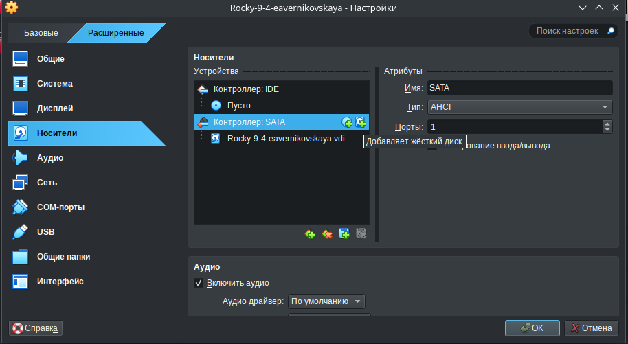{#fig:001 width=70%}

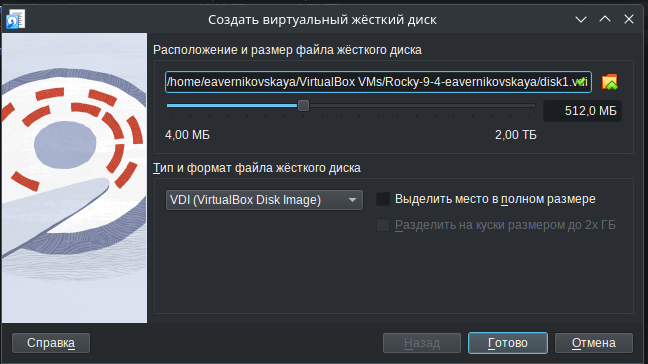{#fig:002 width=70%}

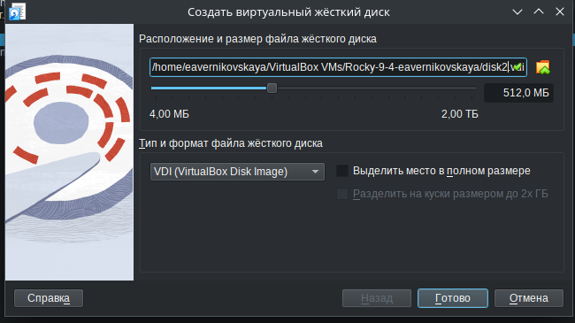{#fig:003 width=70%}

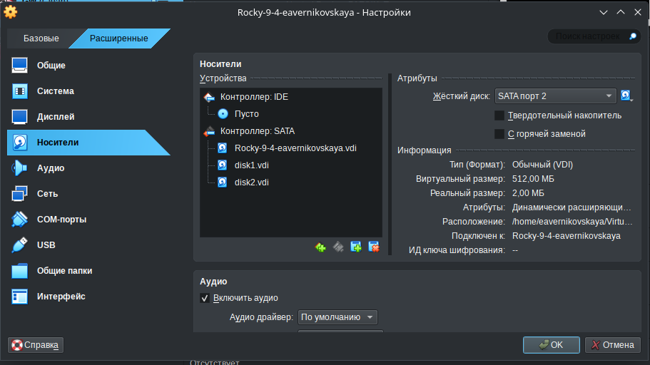{#fig:004 width=70%}

## Создание разделов MBR с помощью fdisk

Далее запускаем нашу виртуальную машину с добавленными дополнительными дисками disk1 и disk2. Запускаем терминала и получаем полномочия суперпользователя, используя *su -* (рис. [-@fig:005])

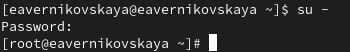{#fig:005 width=70%}

С помощью *fdisk --list* посмотрим перечень разделов на всех имеющихся в системе устройствах жёстких дисков. В списке отобразилась информация о добавленных дисках размером 512 MiB, в частности название разделов: /dev/sdb и /dev/sdc (рис. [-@fig:006])

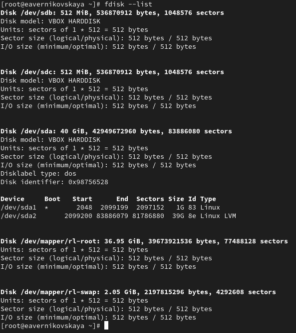{#fig:006 width=70%}

Сделаем разметку диска /dev/sdb с помощью *fdisk /dev/sdb* (рис. [-@fig:007])

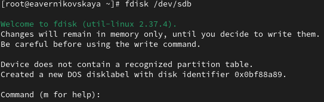{#fig:007 width=70%}

Введём *m*, чтобы получить справку по командам (рис. [-@fig:008])

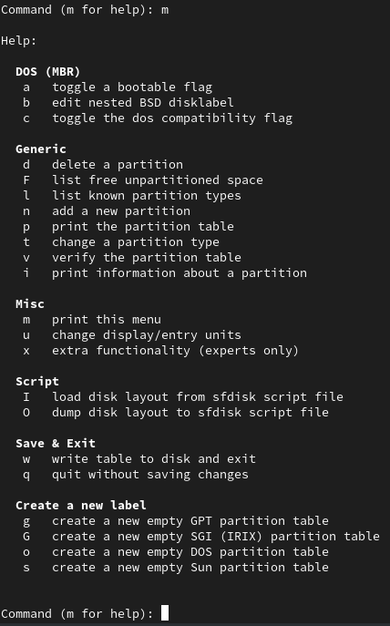{#fig:008 width=70%}

Нажмём *p*, чтобы просмотреть текущее распределение пространства диска (рис. [-@fig:009])

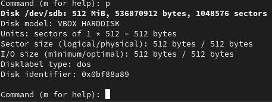{#fig:009 width=70%}

Введём *n*, чтобы добавить новый раздел. Далее выберем *p*, чтобы создать основной раздел. Применим номер раздела (в данном случае 1), который предлагается. Далее указываем первый сектор на диске, с которого начнётся новый раздел. По умолчанию предлагается первый доступный сектор, нажимаем *Enter* для подтверждения выбора. Далее указываем последний сектор, которым будет завершён раздел. Для этого вводим *+100M* (рис. [-@fig:010])

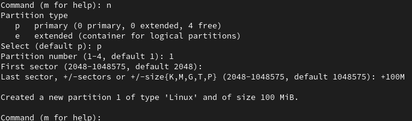{#fig:010 width=70%}

Далее определяем тип раздела. Для этого вводи *t* и после *83* (рис. [-@fig:011])

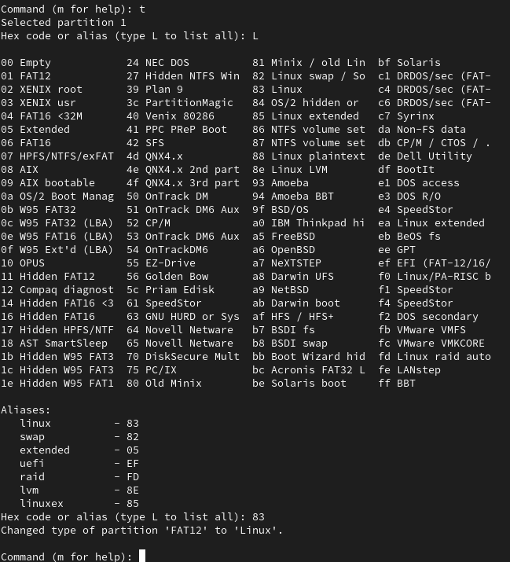{#fig:011 width=70%}

Нажимаем *w*, чтобы записать изменения на диск и выйти из fdisk (рис. [-@fig:012])

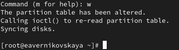{#fig:012 width=70%}

Сравним выводы команд *fdisk -l /dev/sdb* и *cat /proc/partitions* (рис. [-@fig:013]), (рис. [-@fig:014])

Вывод команды *fdisk -l /dev/sdb*:

1. Размер диска: Указан общий размер диска 512 MiB (536870912 байт)
2. Модель устройства: Указано, что это диск VBox HARDDISK
3. Секторы: Общее количество секторов — 1048576
4. Системный раздел: Присутствует информация о разделах, включая информацию о sdb1 — данном разделе, его начальный и конечный секторы, объем (100M) и тип (Linux)
5. Таблица разделов: Присутствие информации о типе таблицы разделов (в данном случае, dos)

Вывод команды *cat /proc/partitions*: 

1. Размеры и блоки: Здесь отображается информация о всех устройствах и их разделах в системе, в том числе sdb
2. Выделение другим устройствам: В выводе есть другие устройства (sda, sdc и виртуальные устройства dm-*), показывая общее состояние блоков устройства
3. Отсутствие деталей: Вывод не содержит такой же детальной информации о разделе, как в fdisk, например, нет информации о типе файловой системы или состоянии нагрузки
4. Параметры: Показан только общий объем блока для каждого устройства без детальной информации о разметке
 
Основные различия:

- Уровень детализации: fdisk предоставляет более подробную информацию о каждом разделе, включая размер, тип и структуру таблицы разделов. В то время как /proc/partitions показывает более общую информацию, включая размеры, но без указания на типы разметки или файловую систему
- Ограниченность вывода: fdisk ограничен рассматриваемым устройством (в данном случае sdb), тогда как /proc/partitions предоставляет информацию обо всех устройствах и их разделах в системе
- Информация о таблице разделов: fdisk сообщает о типе таблицы разделов (например, dos), чего нет в выводе /proc/partitions

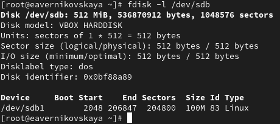{#fig:013 width=70%}

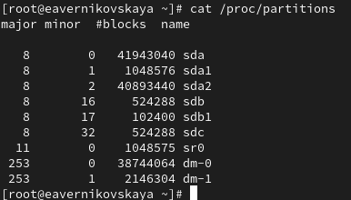{#fig:014 width=70%}

Запишим изменения в таблицу разделов ядра: *partprobe /dev/sdb* (рис. [-@fig:015])

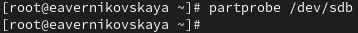{#fig:015 width=70%}

## Создание логических разделов

В терминале с полномочиями администратора запустим *fdisk /dev/sdb* (рис. [-@fig:016])

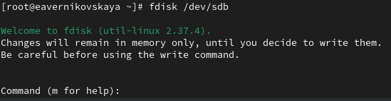{#fig:016 width=70%}

Введём *n*, чтобы добавить новый раздел (рис. [-@fig:017])

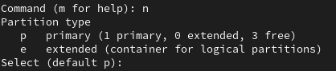{#fig:017 width=70%}

Введём *e*, чтобы добавить создать расширенный раздел. Далее на всех пунктах нажимаем *Enter* (рис. [-@fig:018])

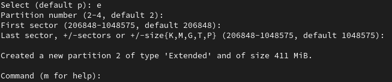{#fig:018 width=70%}

Теперь, когда расширенный раздел создан, мы можем создать в нём логический раздел. Из интерфейса fdisk снова нажимаем *n*. Утилита сообщит, что нет свободных первичных разделов и по умолчанию предложит добавить логический раздел с номером 5. Нажимаем *Enter*, чтобы принять выбор первого сектора в качестве сектора по умолчанию. На вопрос о последнем секторе вводим *+101M* (рис. [-@fig:019])

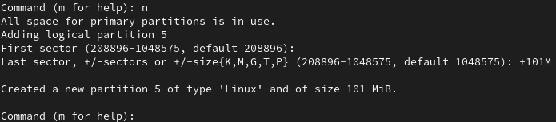{#fig:019 width=70%}

После создания логического раздела вводим *w*, чтобы записать изменения на диск и выйти из fdisk (рис. [-@fig:020])

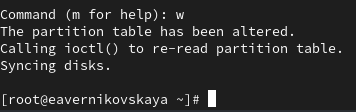{#fig:020 width=70%}

Чтобы завершить процедуру и обновить таблицу разделов, вводим *partprobe /dev/sdb* (рис. [-@fig:021])

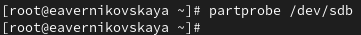{#fig:021 width=70%}

Посмотрим информацию о добавленных разделах с помощью *cat /proc/partitions* и *fdisk --list /dev/sdb* (рис. [-@fig:022]), (рис. [-@fig:023])

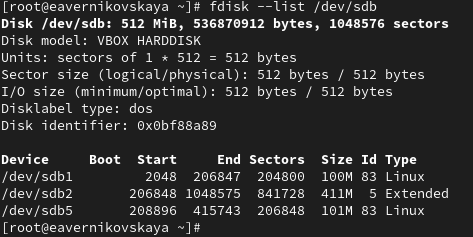{#fig:022 width=70%}

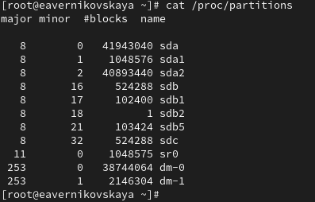{#fig:023 width=70%}

## Создание раздела подкачки

Получаем полномочия администратора и запускаем fdisk: *fdisk /dev/sdb* (рис. [-@fig:024])

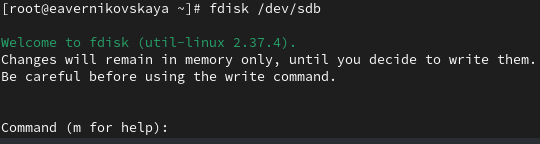{#fig:024 width=70%} 

Нажимем *n*, чтобы добавить новый раздел. Утилита сообщит, что нет свободных первичных разделов и по умолчанию предложит добавить логический раздел с номером раздела 6. Нажимаем *Enter*, чтобы принять первый сектор по умолчанию. На вопрос о последнем секторе вводим *+100M* (рис. [-@fig:025])

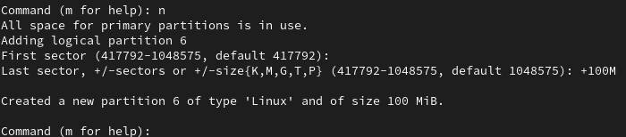{#fig:025 width=70%} 

Далее изменим тип раздела. Для этого нажмём *t*, затем укажем номер партиции, для которой хотим изменить тип (в данном случае это номер 6). Затем введем код типа раздела (в данном случае 82 — раздел подкачки) (рис. [-@fig:026])

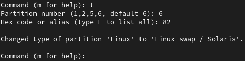{#fig:026 width=70%} 

После создания логического раздела вводим *w*, чтобы записать изменения на диск и выйти из fdisk (рис. [-@fig:027])

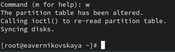{#fig:027 width=70%}

ЧТобы завершить процедуру и обновить таблицу разделов ядра, вводим *partprobe /dev/sdb*. Новый раздел теперь готов к использованию (рис. [-@fig:028])

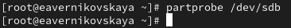{#fig:028 width=70%}

Посмотрим информацию о добавленных разделах: *cat /proc/partitions* и  *fdisk --list /dev/sdb* (рис. [-@fig:029]), (рис. [-@fig:030])

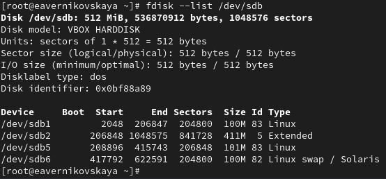{#fig:029 width=70%}

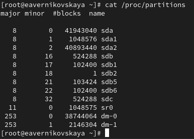{#fig:030 width=70%}

Отформатируем раздел подкачки, используя команду *mkswap /dev/sdb6* (рис. [-@fig:031]) 

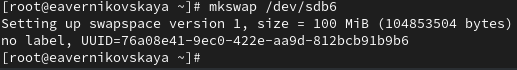{#fig:031 width=70%}

Для включения вновь выделенного пространства подкачки используем *swapon /dev/sdb6* (рис. [-@fig:032]) 

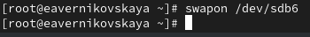{#fig:032 width=70%}

Для просмотра размера пространства подкачки, которое в настоящее время выделено, вводим *free -m* (рис. [-@fig:033]) 

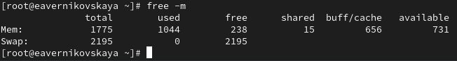{#fig:033 width=70%}

## Создание разделов GPT с помощью gdisk

В терминале с полномочиями администратора с помощью gdisk посмотрим таблицы разделов и разделы на втором добавленном нами ранее диске /dev/sdc: *gdisk -l /dev/sdc* (рис. [-@fig:034])

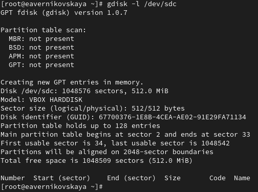{#fig:034 width=70%}

Создадим раздел с помощью gdisk: *gdisk /dev/sdc* (рис. [-@fig:035])

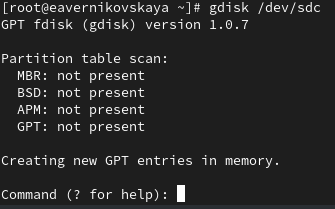{#fig:035 width=70%} 

Вводим *n*, чтобы добавить новый раздел. Принимаем номер раздела по умолчанию, который предлагается. Теперь нас просят задать первый сектор. По умолчанию будет использоваться первый сектор, доступный на диске, но также можно указать смещение. Нажимаем *Enter*, чтобы принять предлагаемый по умолчанию первый сектор. При запросе последнего сектора используем *+100M*. Далее предлагается установить тип раздела. Нажимаем *Enter*, чтобы принять тип раздела 8300 по умолчанию (рис. [-@fig:036])

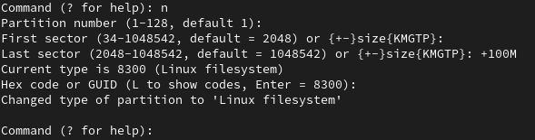{#fig:036 width=70%} 

Теперь раздел создан (но ещё не записан на диск). Нажимаем *p*, чтобы отобразить разбиение диска (рис. [-@fig:037])

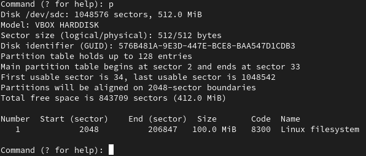{#fig:037 width=70%} 

Наше текущее разбиение нас устраивает. Нажимаем *w* чтобы записать изменения на диск  (рис. [-@fig:038])

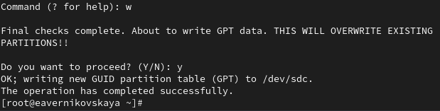{#fig:038 width=70%}

Обновим таблицу разделов: *partprobe /dev/sdc* (рис. [-@fig:039])

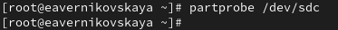{#fig:039 width=70%}

Посмотрим информацию о добавленных разделах: *cat /proc/partitions* и *gdisk -l /dev/sdc* (рис. [-@fig:040]), (рис. [-@fig:041])

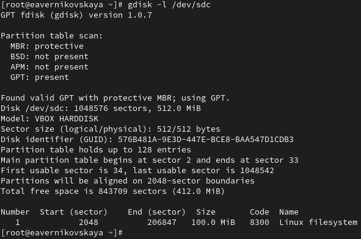{#fig:040 width=70%}

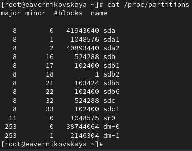{#fig:041 width=70%} 

## Форматирование файловой системы XFS

В терминале с полномочиями администратора для диска dev/sdb1 создадим файловую систему XFS: *mkfs.xfs /dev/sdb1* (рис. [-@fig:042])

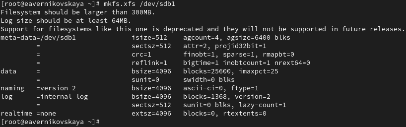{#fig:042 width=70%}

Для установки метки файловой системы в xfsdisk используем команду *xfs_admin -L xfsdisk /dev/sdb1* (рис. [-@fig:043])

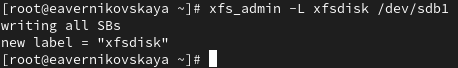{#fig:043 width=70%} 

## Форматирование файловой системы EXT4

В терминале с полномочиями администратора для диска dev/sdb5 создадим файловую систему EXT4: *mkfs.ext4 /dev/sdb5* (рис. [-@fig:044])

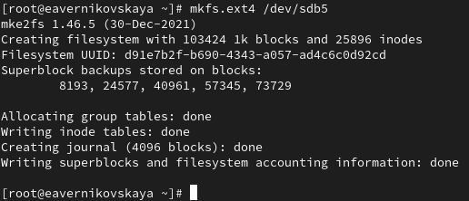{#fig:044 width=70%}

Для установки метки файловой системы в ext4disk используем команду *tune2fs -L ext4disk /dev/sdb5* (рис. [-@fig:045])

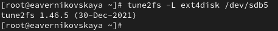{#fig:045 width=70%}  

Для установки параметров монтирования по умолчанию для файловой системы используем команду *tune2fs -o acl,user_xattr /dev/sdb5* (рис. [-@fig:046])

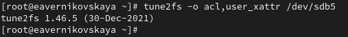{#fig:046 width=70%} 

## Ручное монтирование файловых систем

Получим полномочия администратора. Для создания точки монтирования для раздела введём *mkdir -p /mnt/tmp* (рис. [-@fig:047])

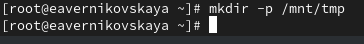{#fig:047 width=70%} 

Чтобы смонтировать файловую систему, используем следующую команду *mount /dev/sdb5 /mnt/tmp* (рис. [-@fig:048])

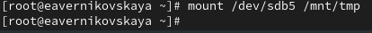{#fig:048 width=70%} 

Для проверки корректности монтирования раздела введём: *mount* (рис. [-@fig:049])

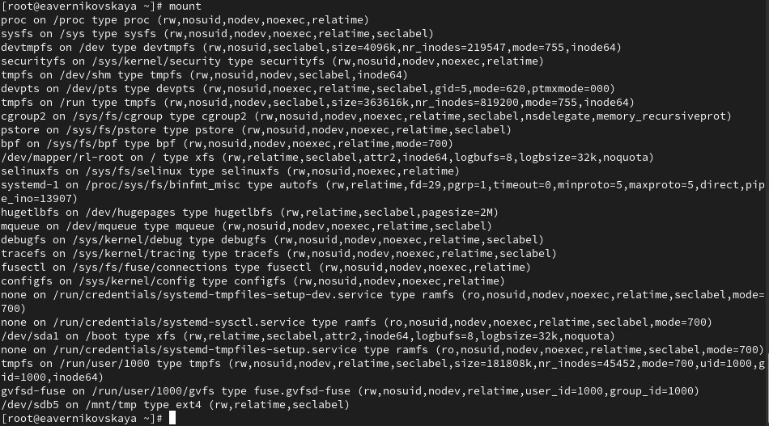{#fig:049 width=70%} 

Чтобы отмонтировать раздел, можно использовать umount либо с именем устройства, либо с именем точки монтирования. Таким образом, обе следующие команды будут работать: *umount /dev/sdb5* или *umount /mnt/tmp* (рис. [-@fig:050])

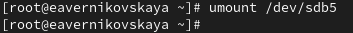{#fig:050 width=70%}

Проверим, что раздел отмонтирован: *mount* (рис. [-@fig:051])

{#fig:051 width=70%} 

## Монтирование разделов с помощью /etc/fstab

Создайте точку монтирования для раздела XFS /dev/sdb1: *mkdir -p /mnt/data* (рис. [-@fig:052])

{#fig:052 width=70%} 

Посмотрим информацию об идентификаторах блочных устройств (UUID): *blkid* (рис. [-@fig:053])

{#fig:053 width=70%} 

Введём *blkid /dev/sdb1* и затем используем мышь, чтобы скопировать значение идентификатора UUID для устройства /dev/sdb1 (рис. [-@fig:054])

{#fig:054 width=70%} 

Откроем файл /etc/fstab на редактирование и добавим следующую строку: *UUID=значение_идентификатора /mnt/data xfs defaults 1 2* (рис. [-@fig:055]), (рис. [-@fig:056])

{#fig:055 width=70%} 

{#fig:056 width=70%} 

Следующая команда монтирует всё, что указано в /etc/fstab: *mount -a* (рис. [-@fig:057])

{#fig:057 width=70%} 

Проверим, что раздел примонтирован правильно: *df -h* (рис. [-@fig:058])

{#fig:058 width=70%} 

## Самостоятельная работа

Задания: 

1. Добавить две партиции на диск с разбиением GPT. Создать оба раздела размером 100 MiB. Один из этих разделов должен быть настроен как пространство подкачки, другой раздел должен быть отформатирован файловой системой ext4
2. Настроить сервер для автоматического монтирования этих разделов. Установить раздел ext4 на /mnt/data-ext и установить пространство подкачки в качестве области подкачки
3. Перезагрузить систему и убедиться, что всё установлено правильно

Создадим первый раздел (рис. [-@fig:059])

{#fig:059 width=70%} 

Отформатируем первый раздел: *mkfs.ext4 /dev/sdc2* (рис. [-@fig:060])

{#fig:060 width=70%} 

Создадим второй раздел (рис. [-@fig:061])

{#fig:061 width=70%} 

Настроим второй раздел как пространство подкачки: *mkswap /dev/sdc3* и *swapon /dev/sdc3*  (рис. [-@fig:062])

{#fig:062 width=70%} 

Создадим точку монтирования для раздела: *mkdir -p /mnt/data-ext* (рис. [-@fig:063])

{#fig:063 width=70%}

Посмотрим информацию об идентификаторах блочных устройств (UUID): *blkid*. И скопируем значение идентификатора UUID для устройства /dev/sdc2 (рис. [-@fig:064])

{#fig:064 width=70%}

Откроем файл /etc/fstab на редактирование и добавим следующую строку: *UUID=значение_идентификатора /mnt/data-ext ext4 defaults 1 2* (рис. [-@fig:065]), (рис. [-@fig:066])

{#fig:065 width=70%} 

{#fig:066 width=70%} 

Введём команду *mount -a* (рис. [-@fig:067])

{#fig:067 width=70%} 

Проверим, что раздел примонтирован правильно: *df -h* (рис. [-@fig:068])

{#fig:068 width=70%} 

Далее перезагрузим ОС и проверим, что всё установлено правильно (рис. [-@fig:069])

{#fig:069 width=70%} 

# Контрольные вопросы + ответы

1. Какой инструмент используется для создания разделов GUID?

gdisk

2. Какой инструмент применяется для создания разделов MBR?

fdisk

3. Какой файл используется для автоматического монтирования разделов во время загрузки?

/etc/fstab

4. Какой вариант монтирования целесообразно выбрать, если необходимо, чтобы файловая система не была автоматически примонтирована во время загрузки?

mount /dev/sdb5/mnt/tmp

5. Какая команда позволяет форматировать раздел с типом 82 с соответствующей файловой системой?

t

6. Вы только что добавили несколько разделов для автоматического монтирования при загрузке. Как можно безопасно проверить, будет ли это работать без реальной перезагрузки?

df -h

7. Какая файловая система создаётся, если вы используете команду mkfs без какой-либо спецификации файловой системы?

swap

8. Как форматировать раздел EXT4?

mkfs.ext4 /dev/sdb"number"
tune2fs -L ext4disk /dev/sdb"number"
tune2fs -o acl,user_xattar /dev/sdb"number"

9. Как найти UUID для всех устройств на компьютере?

blkid

# Выводы

В ходе выполнения лабораторной работы мы получили навыки создания разделов на диске и файловых систем. Также получили навыки монтирования файловых систем

# Список литературы

1. Лаборатораня работа №14 [Электронный ресурс] URL: https://esystem.rudn.ru/pluginfile.php/2400753/mod_resource/content/4/015-partition.pdf
