---
## Front matter
lang: ru-RU
title: Лабораторная работа №15
subtitle: Основы администрирования операционных систем
author:
  - Верниковская Е. А., НПИбд-01-23
institute:
  - Российский университет дружбы народов, Москва, Россия
date: 14 декабря 2024

## i18n babel
babel-lang: russian
babel-otherlangs: english

## Formatting pdf
toc: false
toc-title: Содержание
slide_level: 2
aspectratio: 169
section-titles: true
theme: metropolis
header-includes:
 - \metroset{progressbar=frametitle,sectionpage=progressbar,numbering=fraction}
 - '\makeatletter'
 - '\beamer@ignorenonframefalse'
 - '\makeatother'
 
## Fonts
mainfont: PT Serif
romanfont: PT Serif
sansfont: PT Sans
monofont: PT Mono
mainfontoptions: Ligatures=TeX
romanfontoptions: Ligatures=TeX
sansfontoptions: Ligatures=TeX,Scale=MatchLowercase
monofontoptions: Scale=MatchLowercase,Scale=0.9
---

# Вводная часть

## Цель работы

Получить навыки управления логическими томами.

## Задание

1. Продемонстрировать навыки создания физических томов на LVM
2. Продемонстрировать навыки создания группы томов и логических томов на LVM
3. Продемонстрировать навыки изменения размера логических томов на LVM
4. Выполнить задание для самостоятельной работы

# Выполнение лабораторной работы

## Создание физического тома

Запускаем терминала и получаем полномочия суперпользователя, используя *su -* (рис. 1)

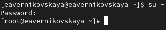{#fig:001 width=70%}

## Создание физического тома

В файле /etc/fstab закомментируем строки автомонтирования /mnt/data и /mnt/data-ext (рис. 2), (рис. 3)

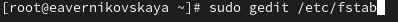{#fig:002 width=70%}

## Создание физического тома

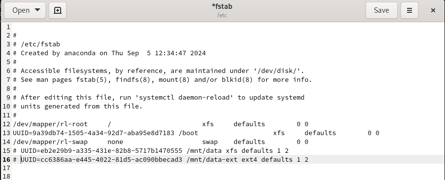{#fig:003 width=70%}

## Создание физического тома

Отмонтируем /mnt/data и /mnt/data-ext: *umount /mnt/data* и *umount /mnt/data-ext* (рис. 4)

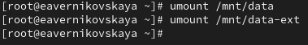{#fig:004 width=70%}

## Создание физического тома

С помощью команды *mount* без параметров убедимся, что диски /dev/sdb и /dev/sdc не подмонтированы (рис. 5)

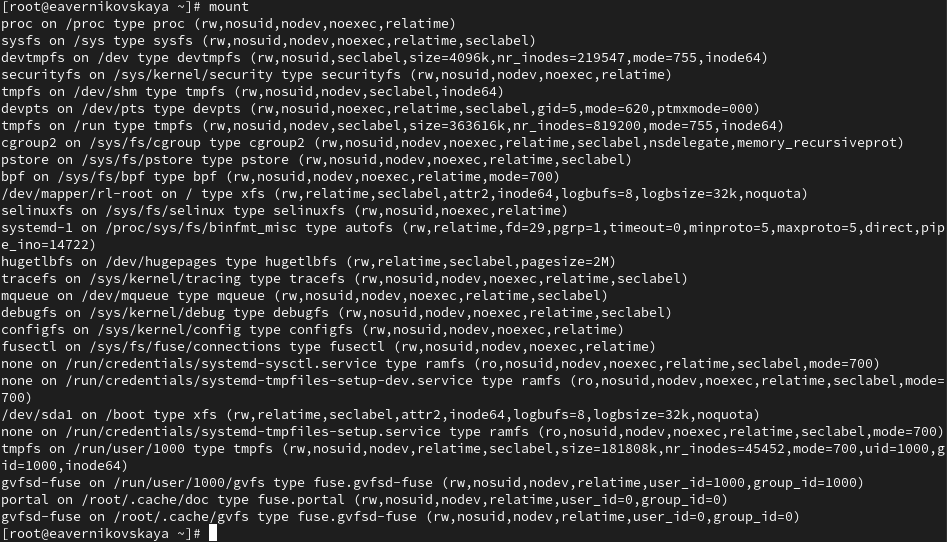{#fig:005 width=60%}

## Создание физического тома

С помощью fdisk сделаем новую разметку для /dev/sdb и /dev/sdc, удалив ранее созданные партиции:

- В терминале с полномочиями администратора вводим *fdisk /dev/sdb*
- Вводим *p* для просмотра текущей разметки дискового пространства. Затем для удаления всех имеющихся партиций на диске достаточно создаём новую пустую таблицу DOS-партиции, используя команду *o*. Убедимся, что партиции удалены, введя *p*. Сохраним изменения, введя *w*.

(рис. 6)

## Создание физического тома

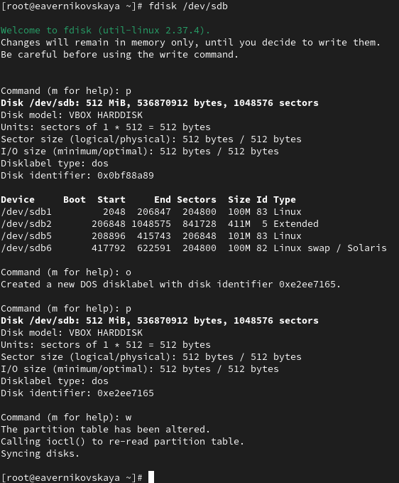{#fig:006 width=40%}

## Создание физического тома

Записываем изменения в таблицу разделов ядра: *partprobe /dev/sdb* (рис. 7)

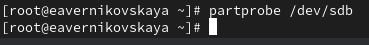{#fig:007 width=70%}

## Создание физического тома

Посмотрим информацию о разделах: *cat /proc/partitions* и *fdisk --list /dev/sdb* (рис. 8), (рис. 9)

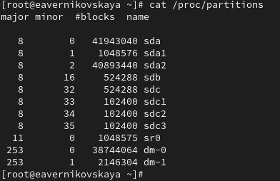{#fig:008 width=60%}

## Создание физического тома

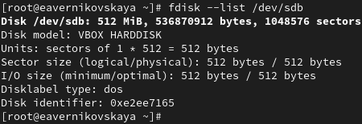{#fig:009 width=70%}

## Создание физического тома

В терминале с полномочиями администратора с помощью fdisk создадим основной раздел с типом LVM:

- Вводим *fdisk /dev/sdb*
- Вводим *n*, чтобы создать новый раздел. Выбираем *p*, чтобы сделать его основным разделом, и используем номер раздела, который предлагается по умолчанию. Если мы используем чистое устройство, это будет номер раздела 1.
- Нажимаем *Enter* при запросе для первого сектора и введите *+100M*, чтобы выбрать последний сектор.

## Создание физического тома

- Вернувшись в приглашение fdisk, вводим *t*, чтобы изменить тип раздела. Поскольку существует только один раздел, fdisk не спрашивает, какой раздел использовать.
– Программа запрашивает тип раздела, который мы хотим использовать. Выбираем *8e*. Затем нажимаем *w*, чтобы записать изменения на диск и выйти из fdisk.

(рис. 10)

## Создание физического тома

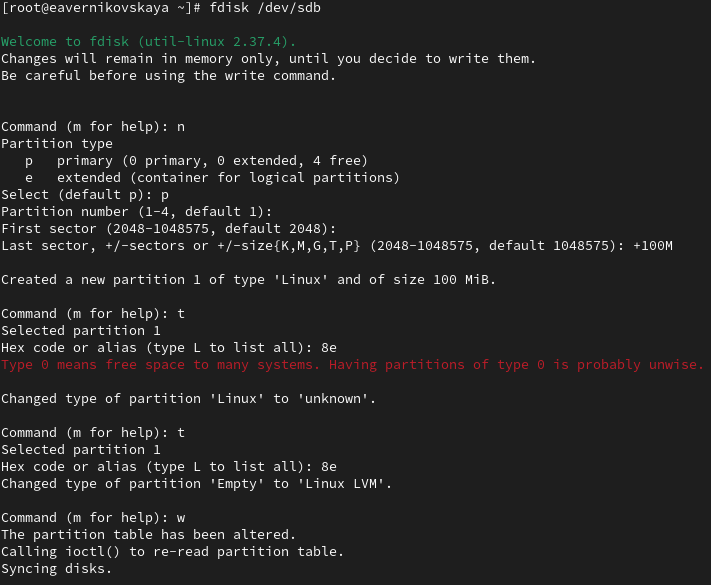{#fig:010 width=50%}

## Создание физического тома

Далее обновляем таблицу разделов: *partprobe /dev/sdb* (рис. 11)

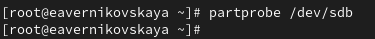{#fig:011 width=70%}

## Создание физического тома

Теперь, когда раздел был создан, мы должны указать его как физический том LVM. Для
этого вводим: *pvcreate /dev/sdb1* (рис. 12)

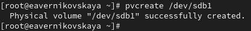{#fig:012 width=70%}

## Создание физического тома

Теперь вводим *pvs*, чтобы убедиться, что физический том создан успешно (рис. 13)

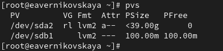{#fig:013 width=70%}

## Создание группы томов и логических томов

Создадим группу томов с присвоенным ей физическим томом: *vgcreate vgdata /dev/sdb1* и убедимся, что группа томов была создана успешно: *vgs* (рис. 14), (рис. 15)

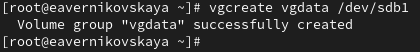{#fig:014 width=70%}

## Создание группы томов и логических томов

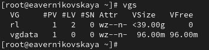{#fig:015 width=70%}

## Создание группы томов и логических томов

Затем вводим снова *pvs*. Теперь эта команда показывает имя физических томов с именами групп томов, которым они назначены (рис. 16)

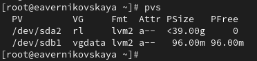{#fig:016 width=70%}

## Создание группы томов и логических томов

Вводим *lvcreate -n lvdata -l 50%FREE vgdata*. Это создаст логический том LVM с именем lvdata, который будет использовать 50% доступного дискового пространства в группе томов vgdata (рис. 17)

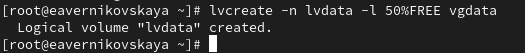{#fig:017 width=70%}

## Создание группы томов и логических томов

Для проверки успешного добавления тома вводим *lvs* (рис. 18)

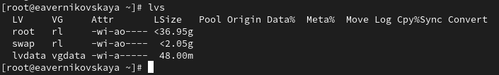{#fig:018 width=70%}

## Создание группы томов и логических томов

На этом этапе мы готовы создать файловую систему поверх логического тома. Для этого вводим *mkfs.ext4 /dev/vgdata/lvdata* (рис. 19)

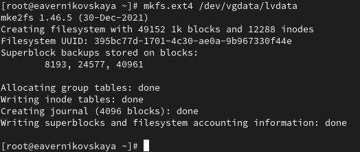{#fig:019 width=70%}

## Создание группы томов и логических томов

Далее создаём папку, на которую можно смонтировать том: *mkdir -p /mnt/data* (рис. 20)

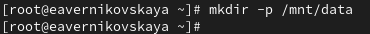{#fig:020 width=70%}

## Создание группы томов и логических томов

После добавляем следующую строку в /etc/fstab: */dev/vgdata/lvdata /mnt/data ext4 defaults 1 2* (рис. 21), (рис. 22)

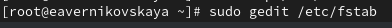{#fig:021 width=70%}

## Создание группы томов и логических томов

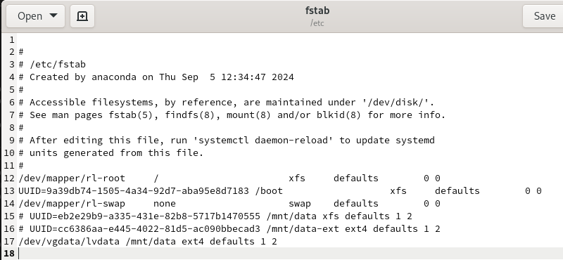{#fig:022 width=70%}

## Создание группы томов и логических томов

Проверим, монтируется ли файловая система: *mount -a* и *mount | grep /mnt* (рис. 23)

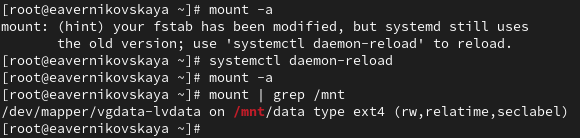{#fig:023 width=70%}

## Изменение размера логических томов

В терминале с полномочиями администратора вводим *pvs* и *vgs*, чтобы отобразить текущую конфигурацию физических томов и группы томов (рис. 24)

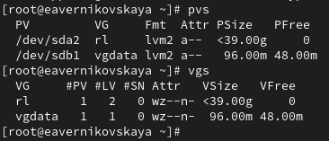{#fig:024 width=70%}

## Изменение размера логических томов

С помощью fdisk добавим раздел /dev/sdb2 размером 100М. Зададим тип раздела 8e. После обновляем таблицу разделов: *partprobe /dev/sdb* (рис. 25), (рис. 26)

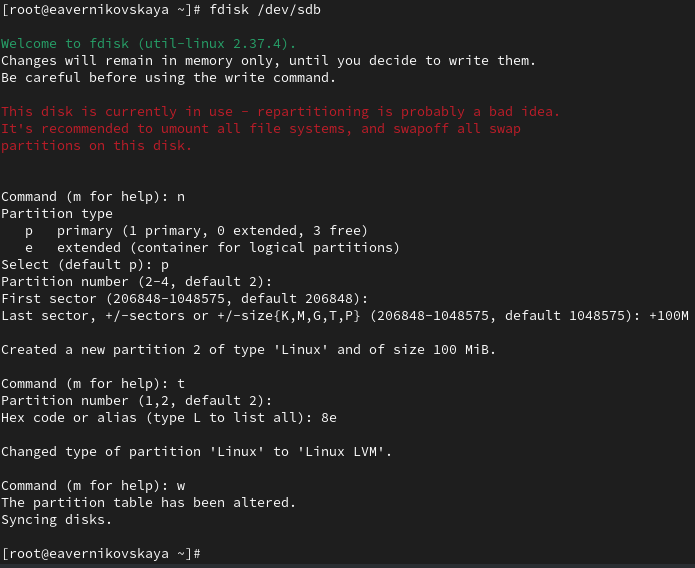{#fig:025 width=40%}

## Изменение размера логических томов

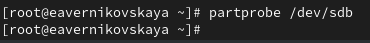{#fig:026 width=70%}

## Изменение размера логических томов

Создадим физический том: *pvcreate /dev/sdb2* (рис. 27)

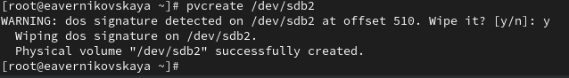{#fig:027 width=70%}

## Изменение размера логических томов

Расширяем vgdata: *vgextend vgdata /dev/sdb2* (рис. 28)

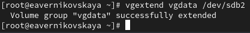{#fig:028 width=70%}

## Изменение размера логических томов

Проверим, что размер доступной группы томов увеличен: *vgs* (рис. 29)

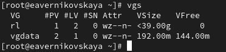{#fig:029 width=70%}

## Изменение размера логических томов

Проверим текущий размер логического тома lvdata: *lvs* (рис. 30)

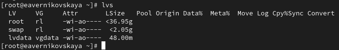{#fig:030 width=70%}

## Изменение размера логических томов

Проверим текущий размер файловой системы на lvdata: *df -h* (рис. 31)

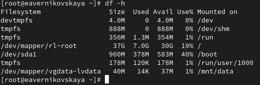{#fig:031 width=70%}

## Изменение размера логических томов

Увеличим lvdata на 50% оставшегося доступного дискового пространства в группе томов: *lvextend -r -l +50%FREE /dev/vgdata/lvdata* (рис. 32)

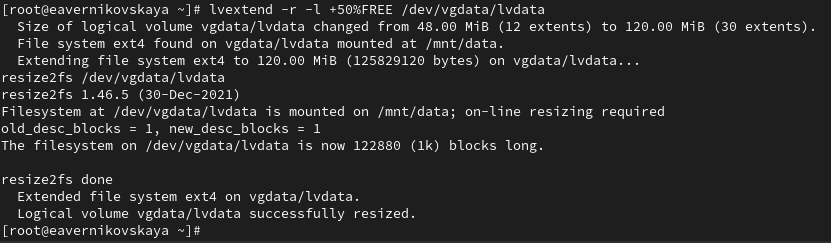{#fig:032 width=70%}

## Изменение размера логических томов

Убедимся, что добавленное дисковое пространство стало доступным: *lvs* и *df -h* (рис. 33)

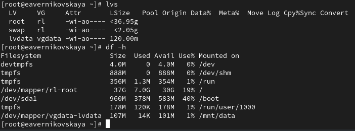{#fig:033 width=70%}

## Изменение размера логических томов

Уменьшим размер lvdata на 50 МБ: *lvreduce -r -L -50M /dev/vgdata/lvdata* (рис. 34)

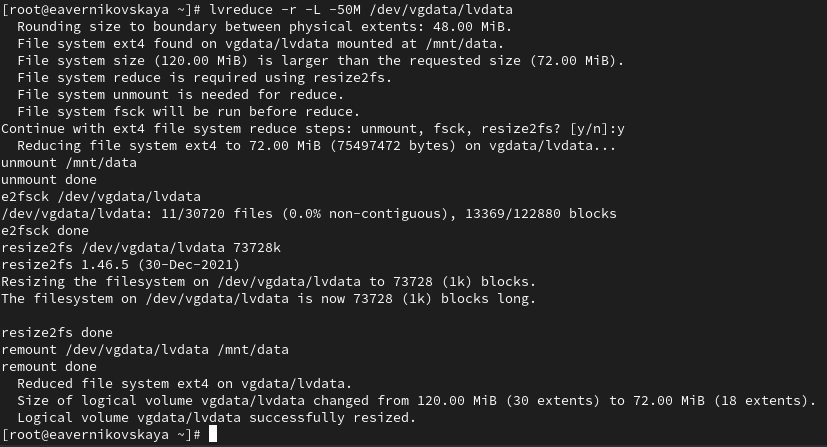{#fig:034 width=70%}

## Изменение размера логических томов

Убедимся в успешном изменении дискового пространства: *lvs* и  *df -h* (рис. 35)

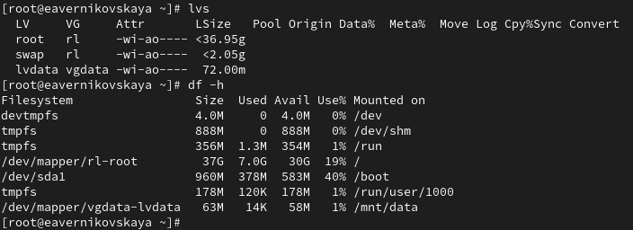{#fig:035 width=70%}

## Самостоятельная работа

Задания: 

1. Создание логический том lvgroup размером 200 МБ. Отформатировать его в файловой системе XFS и смонтировать его постоянно на /mnt/groups. Перезагрузить виртуальную машину, чтобы убедиться, что устройство подключается.
2. После перезагрузки добавить ещё 150 МБ к тому lvgroup. Убедиться, что размер файловой системы также изменится при изменении размера тома.
3. Убедиться, что расширение тома выполнено успешно.

## Самостоятельная работа

С помощью fdisk создадим логический том lvgroup размером 200 МБ (рис. 36), (рис. 37)

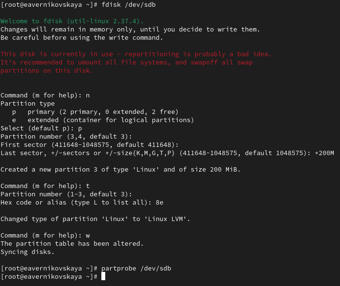{#fig:036 width=40%} 

## Самостоятельная работа

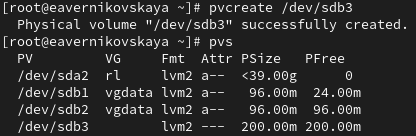{#fig:037 width=70%} 

## Самостоятельная работа

Создаём группу томов с присвоенным ей физическим томом: *vgcreate vggroup /dev/sdb3* (рис.38)

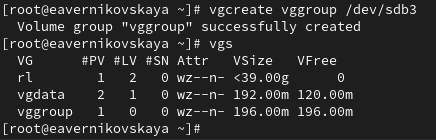{#fig:038 width=70%} 

## Самостоятельная работа

Введём *lvcreate -n lvgroup -l 50%FREE vggroup*. Это создаст логический том LVM с именем lvgroup, который будет использовать 50% доступного дискового пространства в группе томов vggroup (рис. 39)

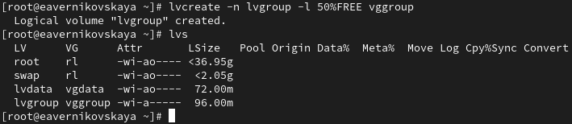{#fig:039 width=70%} 

## Самостоятельная работа

Теперь создаём файловую систему поверх логического тома. Для этого вводим *mkfs.xfs /dev/vggroup/lvgroup* (рис. 40)

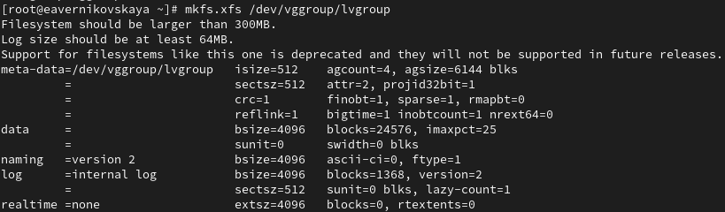{#fig:040 width=70%} 

## Самостоятельная работа

Создаём папку, на которую можно смонтировать том, вводим *mkdir -p /mnt/groups* (рис. 41)

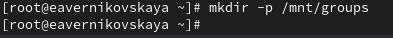{#fig:041 width=70%}

## Самостоятельная работа

После добавляем следующую строку в /etc/fstab: */dev/vggroup/lvgroup /mnt/groups xfs defaults 1 2* (рис. 42), (рис. 43)

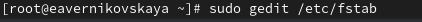{#fig:042 width=70%}

## Самостоятельная работа

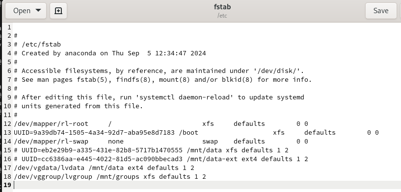{#fig:043 width=70%}

## Самостоятельная работа

Проверим, монтируется ли файловая система: *mount -a* и *mount | grep /mnt* (рис. 44)

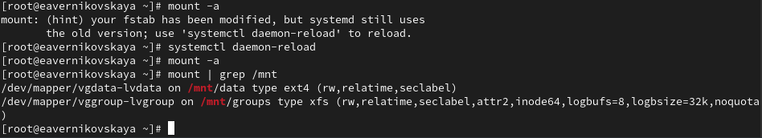{#fig:044 width=70%}

## Самостоятельная работа

Перезагрузим ОС и проверим, что устройство подключается (рис. 45), (рис. 46)

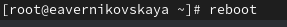{#fig:045 width=70%}

## Самостоятельная работа

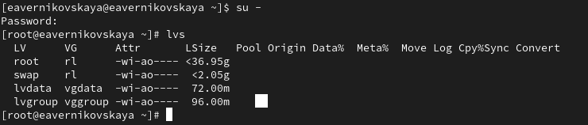{#fig:046 width=70%}

## Самостоятельная работа

Увеличим lvgroup на 150M: *lvextend -r -L +150M /dev/vggroup/lvgroup* и проверим изменения (рис. 47)

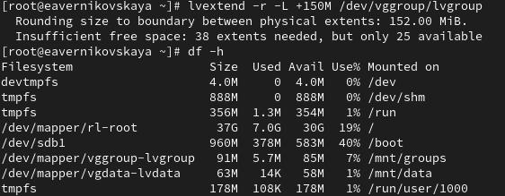{#fig:047 width=70%}

# Подведение итогов

## Выводы

В ходе выполнения лабораторной работы мы получили навыки управления логическими томами.

## Список литературы

1. Лаборатораня работа №15 [Электронный ресурс] URL: https://esystem.rudn.ru/pluginfile.php/2400759/mod_resource/content/4/016-lvm.pdf
