---
## Front matter
title: "Отчёт по лабораторной работе №15"
subtitle: "Дисциплина: Основы администрирования операционных систем"
author: "Верниковская Екатерина Андреевна"

## Generic otions
lang: ru-RU
toc-title: "Содержание"

## Bibliography
bibliography: bib/cite.bib
csl: pandoc/csl/gost-r-7-0-5-2008-numeric.csl

## Pdf output format
toc: true # Table of contents
toc-depth: 2
lof: true # List of figures
lot: true # List of tables
fontsize: 12pt
linestretch: 1.5
papersize: a4
documentclass: scrreprt
## I18n polyglossia
polyglossia-lang:
  name: russian
  options:
	- spelling=modern
	- babelshorthands=true
polyglossia-otherlangs:
  name: english
## I18n babel
babel-lang: russian
babel-otherlangs: english
## Fonts
mainfont: PT Serif
romanfont: PT Serif
sansfont: PT Sans
monofont: PT Mono
mainfontoptions: Ligatures=TeX
romanfontoptions: Ligatures=TeX
sansfontoptions: Ligatures=TeX,Scale=MatchLowercase
monofontoptions: Scale=MatchLowercase,Scale=0.9
## Biblatex
biblatex: true
biblio-style: "gost-numeric"
biblatexoptions:
  - parentracker=true
  - backend=biber
  - hyperref=auto
  - language=auto
  - autolang=other*
  - citestyle=gost-numeric
## Pandoc-crossref LaTeX customization
figureTitle: "Рис."
tableTitle: "Таблица"
listingTitle: "Листинг"
lofTitle: "Список иллюстраций"
lotTitle: "Список таблиц"
lolTitle: "Листинги"
## Misc options
indent: true
header-includes:
  - \usepackage{indentfirst}
  - \usepackage{float} # keep figures where there are in the text
  - \floatplacement{figure}{H} # keep figures where there are in the text
---

# Цель работы

Получить навыки управления логическими томами.

# Задание

1. Продемонстрировать навыки создания физических томов на LVM
2. Продемонстрировать навыки создания группы томов и логических томов на LVM
3. Продемонстрировать навыки изменения размера логических томов на LVM
4. Выполнить задание для самостоятельной работы

# Выполнение лабораторной работы

## Создание физического тома

Запускаем терминала и получаем полномочия суперпользователя, используя *su -* (рис. [-@fig:001])

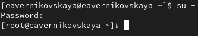{#fig:001 width=70%}

В файле /etc/fstab закомментируем строки автомонтирования /mnt/data и /mnt/data-ext (рис. [-@fig:002]), (рис. [-@fig:003])

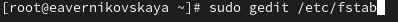{#fig:002 width=70%}

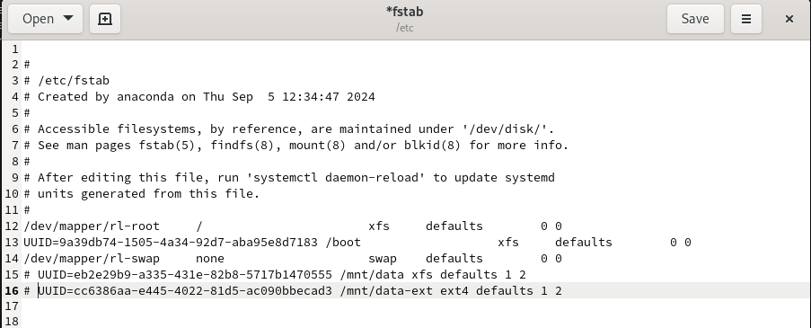{#fig:003 width=70%}

Отмонтируем /mnt/data и /mnt/data-ext: *umount /mnt/data* и *umount /mnt/data-ext* (рис. [-@fig:004])

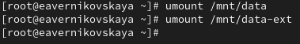{#fig:004 width=70%}

С помощью команды *mount* без параметров убедимся, что диски /dev/sdb и /dev/sdc не подмонтированы (рис. [-@fig:005])

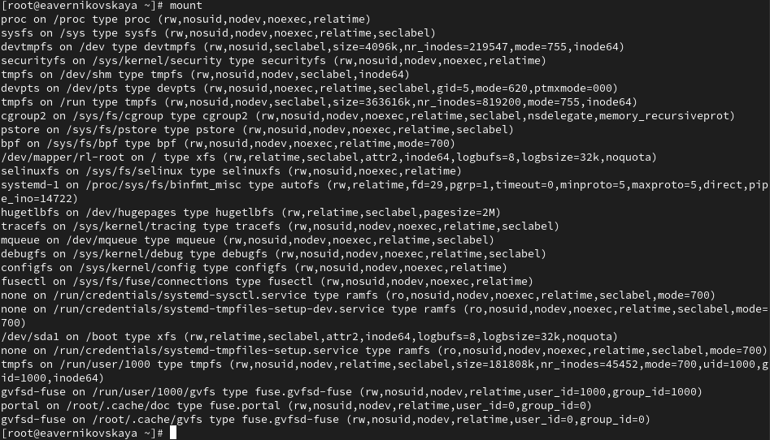{#fig:005 width=70%}

С помощью fdisk сделаем новую разметку для /dev/sdb и /dev/sdc, удалив ранее созданные партиции:

- В терминале с полномочиями администратора вводим *fdisk /dev/sdb*
- Вводим *p* для просмотра текущей разметки дискового пространства. Затем для удаления всех имеющихся партиций на диске достаточно создаём новую пустую таблицу DOS-партиции, используя команду *o*. Убедимся, что партиции удалены, введя *p*. Сохраним изменения, введя *w*.

(рис. [-@fig:006])

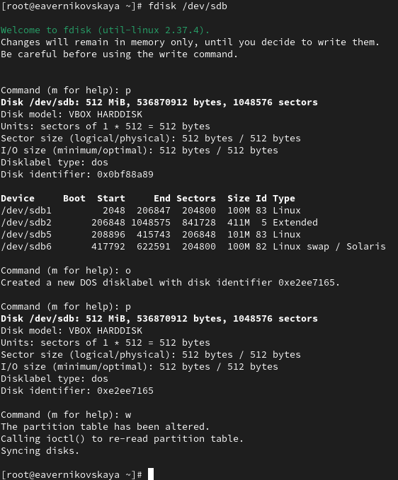{#fig:006 width=70%}

Записываем изменения в таблицу разделов ядра: *partprobe /dev/sdb* (рис. [-@fig:007])

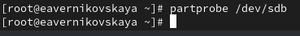{#fig:007 width=70%}

Посмотрим информацию о разделах: *cat /proc/partitions* и *fdisk --list /dev/sdb* (рис. [-@fig:008]), (рис. [-@fig:009])

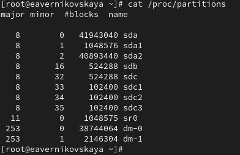{#fig:008 width=70%}

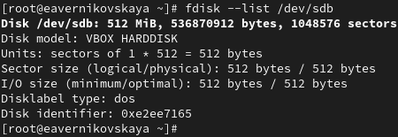{#fig:009 width=70%}

В терминале с полномочиями администратора с помощью fdisk создадим основной раздел с типом LVM:

- Вводим *fdisk /dev/sdb*
- Вводим *n*, чтобы создать новый раздел. Выбираем *p*, чтобы сделать его основным разделом, и используем номер раздела, который предлагается по умолчанию. Если мы используем чистое устройство, это будет номер раздела 1.
- Нажимаем *Enter* при запросе для первого сектора и введите *+100M*, чтобы выбрать последний сектор.
- Вернувшись в приглашение fdisk, вводим *t*, чтобы изменить тип раздела. Поскольку существует только один раздел, fdisk не спрашивает, какой раздел использовать.
– Программа запрашивает тип раздела, который мы хотим использовать. Выбираем *8e*. Затем нажимаем *w*, чтобы записать изменения на диск и выйти из fdisk.

(рис. [-@fig:010])

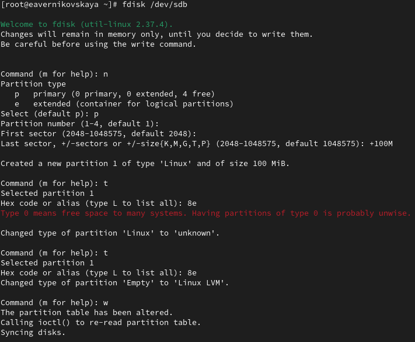{#fig:010 width=70%}

Далее обновляем таблицу разделов: *partprobe /dev/sdb* (рис. [-@fig:011])

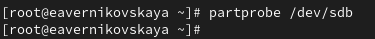{#fig:011 width=70%}

Теперь, когда раздел был создан, мы должны указать его как физический том LVM. Для
этого вводим: *pvcreate /dev/sdb1* (рис. [-@fig:012])

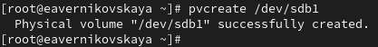{#fig:012 width=70%}

Теперь вводим *pvs*, чтобы убедиться, что физический том создан успешно (рис. [-@fig:013])

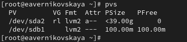{#fig:013 width=70%}

## Создание группы томов и логических томов

Создадим группу томов с присвоенным ей физическим томом: *vgcreate vgdata /dev/sdb1* и убедимся, что группа томов была создана успешно: *vgs* (рис. [-@fig:014]), (рис. [-@fig:015])

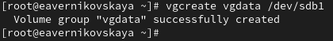{#fig:014 width=70%}

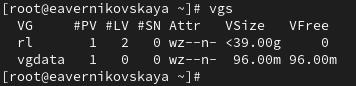{#fig:015 width=70%}

Затем вводим снова *pvs*. Теперь эта команда показывает имя физических томов с именами групп томов, которым они назначены (рис. [-@fig:016])

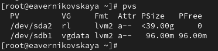{#fig:016 width=70%}

Вводим *lvcreate -n lvdata -l 50%FREE vgdata*. Это создаст логический том LVM с именем lvdata, который будет использовать 50% доступного дискового пространства в группе томов vgdata (рис. [-@fig:017])

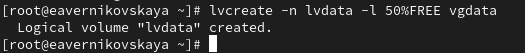{#fig:017 width=70%}

Для проверки успешного добавления тома вводим *lvs* (рис. [-@fig:018])

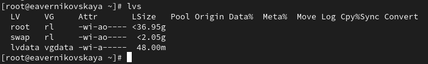{#fig:018 width=70%}

На этом этапе мы готовы создать файловую систему поверх логического тома. Для этого вводим *mkfs.ext4 /dev/vgdata/lvdata* (рис. [-@fig:019])

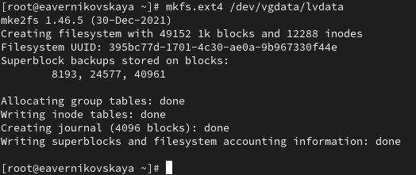{#fig:019 width=70%}

Далее создаём папку, на которую можно смонтировать том: *mkdir -p /mnt/data* (рис. [-@fig:020])

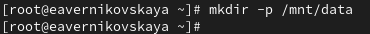{#fig:020 width=70%}

После добавляем следующую строку в /etc/fstab: */dev/vgdata/lvdata /mnt/data ext4 defaults 1 2* (рис. [-@fig:021]), (рис. [-@fig:022])

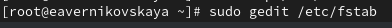{#fig:021 width=70%}

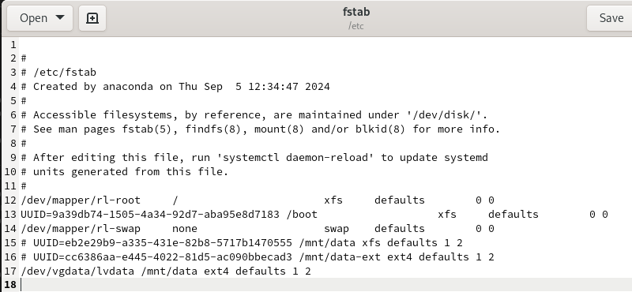{#fig:022 width=70%}

Проверим, монтируется ли файловая система: *mount -a* и *mount | grep /mnt* (рис. [-@fig:023])

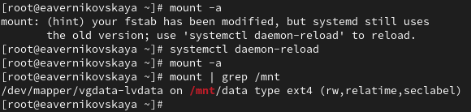{#fig:023 width=70%}

## Изменение размера логических томов

В терминале с полномочиями администратора вводим *pvs* и *vgs*, чтобы отобразить текущую конфигурацию физических томов и группы томов (рис. [-@fig:024])

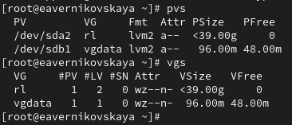{#fig:024 width=70%}

С помощью fdisk добавим раздел /dev/sdb2 размером 100М. Зададим тип раздела 8e. После обновляем таблицу разделов: *partprobe /dev/sdb* (рис. [-@fig:025]), (рис. [-@fig:026])

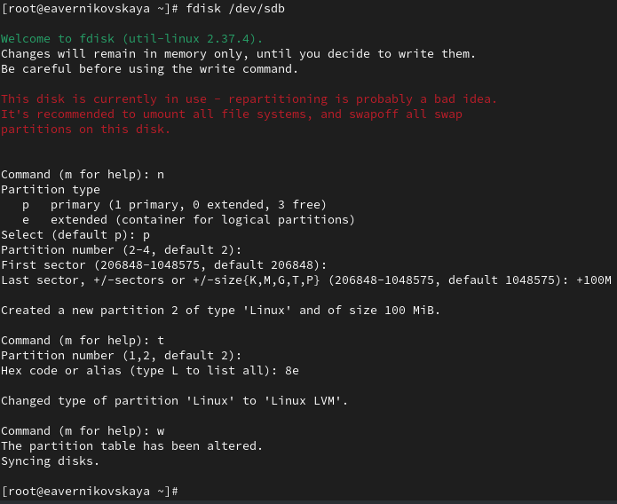{#fig:025 width=70%}

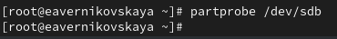{#fig:026 width=70%}

Создадим физический том: *pvcreate /dev/sdb2* (рис. [-@fig:027])

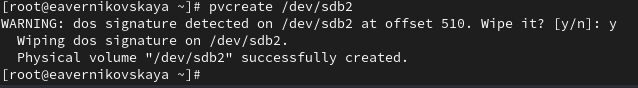{#fig:027 width=70%}

Расширяем vgdata: *vgextend vgdata /dev/sdb2* (рис. [-@fig:028])

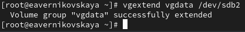{#fig:028 width=70%}

Проверим, что размер доступной группы томов увеличен: *vgs* (рис. [-@fig:029])

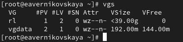{#fig:029 width=70%}

Проверим текущий размер логического тома lvdata: *lvs* (рис. [-@fig:030])

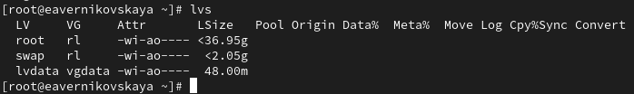{#fig:030 width=70%}

Проверим текущий размер файловой системы на lvdata: *df -h* (рис. [-@fig:031])

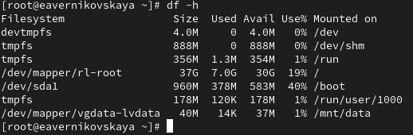{#fig:031 width=70%}

Увеличим lvdata на 50% оставшегося доступного дискового пространства в группе томов: *lvextend -r -l +50%FREE /dev/vgdata/lvdata* (рис. [-@fig:032])

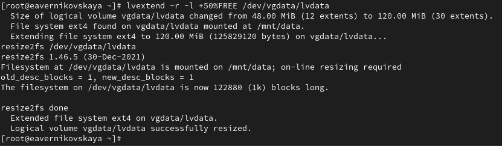{#fig:032 width=70%}

Убедимся, что добавленное дисковое пространство стало доступным: *lvs* и *df -h* (рис. [-@fig:033])

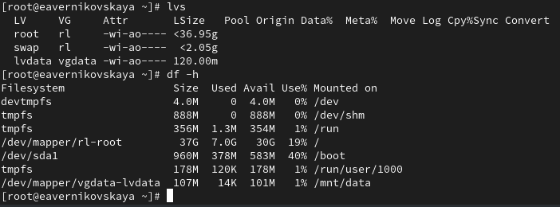{#fig:033 width=70%}

Уменьшим размер lvdata на 50 МБ: *lvreduce -r -L -50M /dev/vgdata/lvdata* (рис. [-@fig:034])

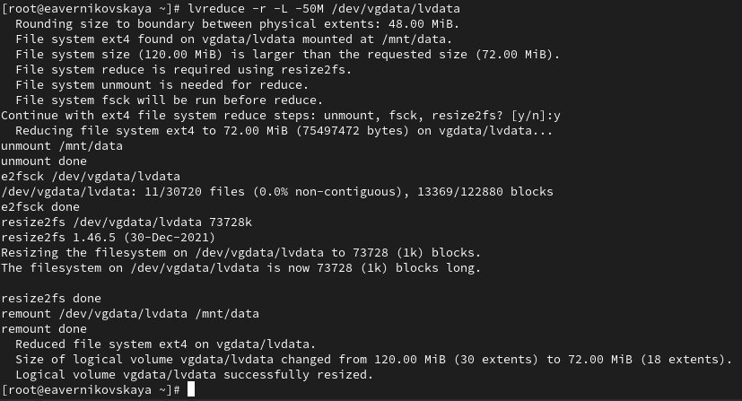{#fig:034 width=70%}

Убедимся в успешном изменении дискового пространства: *lvs* и  *df -h* (рис. [-@fig:035])

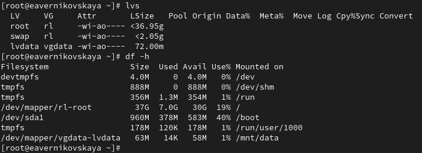{#fig:035 width=70%}

## Самостоятельная работа

Задания: 

1. Создание логический том lvgroup размером 200 МБ. Отформатировать его в файловой системе XFS и смонтировать его постоянно на /mnt/groups. Перезагрузить виртуальную машину, чтобы убедиться, что устройство подключается.
2. После перезагрузки добавить ещё 150 МБ к тому lvgroup. Убедиться, что размер файловой системы также изменится при изменении размера тома.
3. Убедиться, что расширение тома выполнено успешно.

С помощью fdisk создадим логический том lvgroup размером 200 МБ (рис. [-@fig:036]), (рис. [-@fig:037])

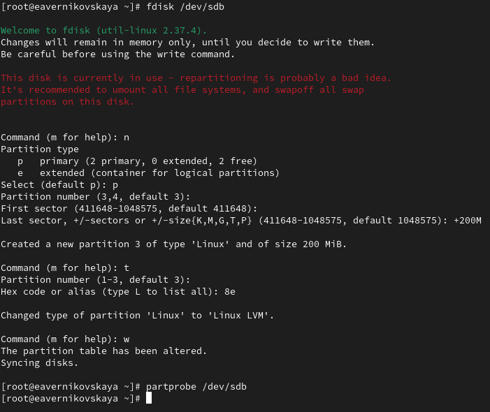{#fig:036 width=70%} 

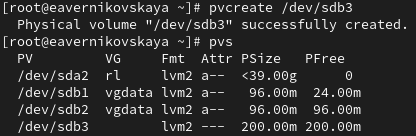{#fig:037 width=70%} 

Создаём группу томов с присвоенным ей физическим томом: *vgcreate vggroup /dev/sdb3* (рис. [-@fig:038])

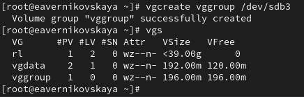{#fig:038 width=70%} 

Введём *lvcreate -n lvgroup -l 50%FREE vggroup*. Это создаст логический том LVM с именем lvgroup, который будет использовать 50% доступного дискового пространства в группе томов vggroup (рис. [-@fig:039])

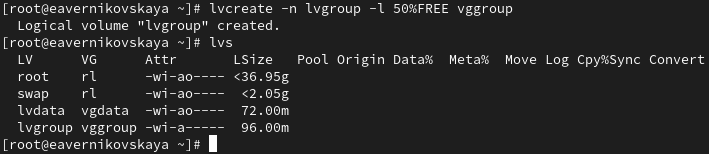{#fig:039 width=70%} 

Теперь создаём файловую систему поверх логического тома. Для этого вводим *mkfs.xfs /dev/vggroup/lvgroup* (рис. [-@fig:040])

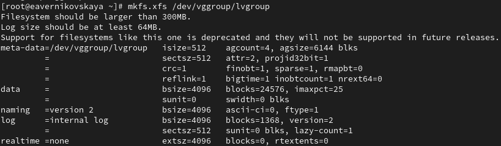{#fig:040 width=70%} 

Создаём папку, на которую можно смонтировать том, вводим *mkdir -p /mnt/groups* (рис. [-@fig:041])

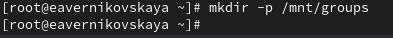{#fig:041 width=70%}

После добавляем следующую строку в /etc/fstab: */dev/vggroup/lvgroup /mnt/groups xfs defaults 1 2* (рис. [-@fig:042]), (рис. [-@fig:043])

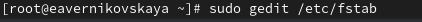{#fig:042 width=70%}

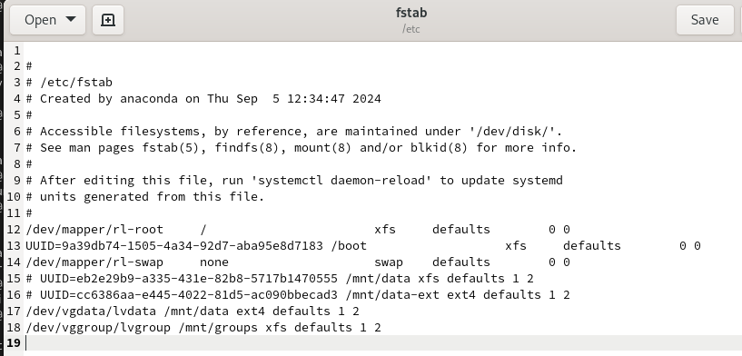{#fig:043 width=70%}

Проверим, монтируется ли файловая система: *mount -a* и *mount | grep /mnt* (рис. [-@fig:044])

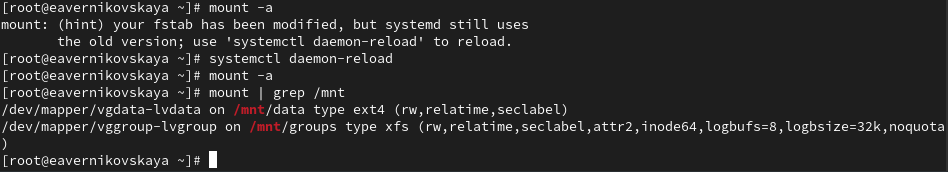{#fig:044 width=70%}

Перезагрузим ОС и проверим, что устройство подключается (рис. [-@fig:045]), (рис. [-@fig:046])

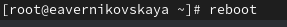{#fig:045 width=70%}

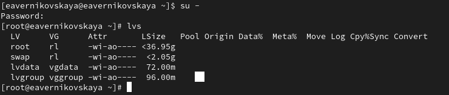{#fig:046 width=70%}

Увеличим lvgroup на 150M: *lvextend -r -L +150M /dev/vggroup/lvgroup* и проверим изменения (рис. [-@fig:047])

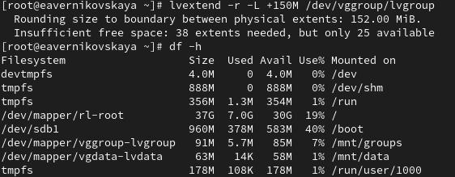{#fig:047 width=70%}

# Контрольные вопросы + ответы

1. Какой тип раздела используется в разделе GUID для работы с LVM?

GPT

2. Какой командой можно создать группу томов с именем vggroup, которая содержит физическое устройство /dev/sdb3 и использует физический экстент 4 MiB?

vgcreate vggroup /dev/sdb3

3. Какая команда показывает краткую сводку физических томов в вашей системе, а также группу томов, к которой они принадлежат?

pvs

4. Что вам нужно сделать, чтобы добавить весь жёсткий диск /dev/sdd в группу томов группы?

vgextend vggroup /dev/sdd

5. Какая команда позволяет вам создать логический том lvvol1 с размером 6 MiB?

vcreate -n lvvol1 -l vggroup

6. Какая команда позволяет вам добавить 100 МБ в логический том lvvol1, если предположить, что дисковое пространство доступно в группе томов?

lvextend -r -L +100M lvvol1

7. Каков первый шаг, чтобы добавить ещё 200 МБ дискового пространства в логический том, если требуемое дисковое пространство недоступно в группе томов?

Создать раздел на 200Мб с помощью fdisk

8. Какую опцию нужно использовать с командой lvextend, чтобы также изменить размер файловой системы?

-r

9. Как посмотреть, какие логические тома доступны?

lvs

10. Какую команду нужно использовать для проверки целостности файловой системы на /dev/vgdata/lvdata?

fsck /dev/vgdata/lvdata

# Выводы

В ходе выполнения лабораторной работы мы получили навыки управления логическими томами.

# Список литературы

1. Лаборатораня работа №15 [Электронный ресурс] URL: https://esystem.rudn.ru/pluginfile.php/2400759/mod_resource/content/4/016-lvm.pdf
