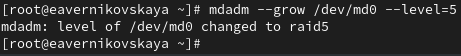
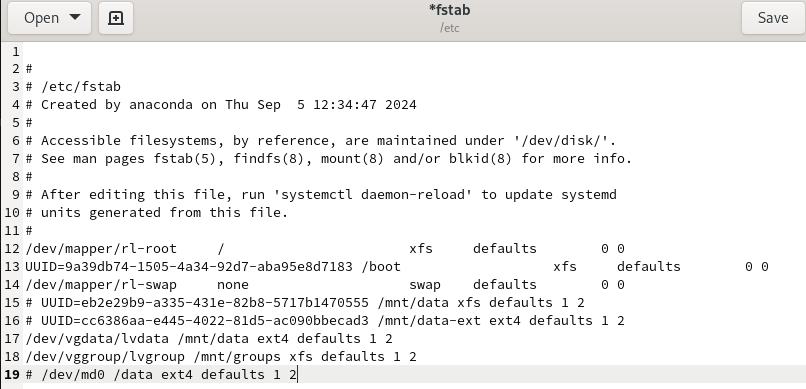

---
## Front matter
lang: ru-RU
title: Лабораторная работа №16
subtitle: Основы администрирования операционных систем
author:
  - Верниковская Е. А., НПИбд-01-23
institute:
  - Российский университет дружбы народов, Москва, Россия
date: 21 декабря 2024

## i18n babel
babel-lang: russian
babel-otherlangs: english

## Formatting pdf
toc: false
toc-title: Содержание
slide_level: 2
aspectratio: 169
section-titles: true
theme: metropolis
header-includes:
 - \metroset{progressbar=frametitle,sectionpage=progressbar,numbering=fraction}
 - '\makeatletter'
 - '\beamer@ignorenonframefalse'
 - '\makeatother'
 
## Fonts
mainfont: PT Serif
romanfont: PT Serif
sansfont: PT Sans
monofont: PT Mono
mainfontoptions: Ligatures=TeX
romanfontoptions: Ligatures=TeX
sansfontoptions: Ligatures=TeX,Scale=MatchLowercase
monofontoptions: Scale=MatchLowercase,Scale=0.9
---

# Вводная часть

## Цель работы

Освоить работу с RAID-массивами при помощи утилиты mdadm.

## Задание

1. Добавить три диска на виртуальную машину (объёмом от 512 MiB каждый). При помощи sfdisk создать на каждом из дисков по одной партиции, задав тип раздела для RAID 
2. Создать массив RAID 1 из двух дисков, смонтировать его. Эмитировать сбой одного из дисков массива, удалить искусственно выведенный из строя диск, добавить в массив работающий диск
3. Создать массив RAID 1 из двух дисков, смонтировать его. Добавить к массиву третий диск. Эмитировать сбой одного из дисков массива. Проанализировать состояние массива, указать различия по сравнению с предыдущим случаем
4. Создать массив RAID 1 из двух дисков, смонтировать его. Добавить к массиву третий диск. Изменить тип массива с RAID1 на RAID5, изменить число дисков в массиве с 2 на 3. Проанализировать состояние массива, указать различия по сравнению с предыдущим случаем

# Выполнение лабораторной работы

## Создание виртуальных носителей

Добавляем к нашей виртуальной машине к контроллеру SATA три диска размером 512 MiB (рис. 1)

{#fig:001 width=60%}

## Создание виртуальных носителей

Запускаем терминала и получаем полномочия суперпользователя, используя *su -* (рис. 2)

{#fig:002 width=70%}

## Создание виртуальных носителей

Проверим наличие созданных нами на предыдущем этапе дисков: *fdisk -l | grep /dev/sd*. В системе добавленные диски отображаются как /dev/sdd, /dev/sde, /dev/sdf (рис. 3)

{#fig:003 width=60%}

## Создание виртуальных носителей

Создадим на каждом из дисков раздел: *sfdisk /dev/sdd <<EOF*, *sfdisk /dev/sde <<EOF* и *sfdisk /dev/sdf <<EOF* (рис. 4), (рис. 5), (рис. 6)

{#fig:004 width=50%}

## Создание виртуальных носителей

{#fig:005 width=50%}

## Создание виртуальных носителей

{#fig:006 width=50%}

## Создание виртуальных носителей

Проверим текущий тип созданных разделов: *sfdisk --print-id /dev/sdd 1*, *sfdisk --print-id /dev/sde 1* и *sfdisk --print-id /dev/sdf 1*. Созданные нами разделы на дисках имеют тип 83 (Linux) (рис. 7)

{#fig:007 width=70%}

## Создание виртуальных носителей

Посмотрим, какие типы партиций, относящиеся к RAID, можно задать: *sfdisk -T | grep -i raid* (рис. 8)

{#fig:008 width=70%} 

## Создание виртуальных носителей

Установим тип разделов в Linux raid autodetect: *sfdisk --change-id /dev/sdd 1 fd*, *sfdisk --change-id /dev/sde 1 fd* и  *sfdisk --change-id /dev/sdf 1 fd* (рис. 9)

{#fig:009 width=50%} 

## Создание виртуальных носителей

Посмотрим состояние дисков: *sfdisk -l /dev/sdd*, *sfdisk -l /dev/sde* и  *sfdisk -l /dev/sdf*. Тип разделов изменился на Linux raid autodetect (рис. 10)

{#fig:010 width=30%} 

## Создание виртуальных носителей

При помощи утилиты *mdadm* создадим массив RAID 1 из двух дисков: *mdadm --create --verbose /dev/md0 --level=1 --raid-devices=2 /dev/sdd1 /dev/sde1* (рис. 11)

{#fig:011 width=70%}

## Создание виртуальных носителей

Проверим состояние массива RAID, используя команды *cat /proc/mdstat*, *mdadm --query /dev/md0* и  *mdadm --detail /dev/md0* (рис. 12)

{#fig:012 width=50%}

## Создание виртуальных носителей

Создадим файловую систему на RAID: *mkfs.ext4 /dev/md0* (рис. 13)

{#fig:013 width=70%} 

## Создание виртуальных носителей

Подмонтируем RAID: *mkdir /data* и *mount /dev/md0 /data* (рис. 14)

{#fig:014 width=70%} 

## Создание виртуальных носителей

Далее для автомонтирования добавим запись в /etc/fstab: */dev/md0 /data ext4 defaults 1 2* (рис. 15), (рис. 16)

{#fig:015 width=70%} 

## Создание виртуальных носителей

{#fig:016 width=70%} 

## Создание виртуальных носителей

Сымитируем сбой одного из дисков: *mdadm /dev/md0 --fail /dev/sde1* (рис. 17)

{#fig:017 width=70%} 

## Создание виртуальных носителей

Удалим сбойный диск: *mdadm /dev/md0 --remove /dev/sde1* (рис. 18)

{#fig:018 width=70%}

## Создание виртуальных носителей

Заменим диск в массиве: *mdadm /dev/md0 --add /dev/sdf1* (рис. 19)

{#fig:019 width=70%}

## Создание виртуальных носителей

Посмотрим состояние массива (рис. 20)

{#fig:020 width=50%}

## Создание виртуальных носителей

Удалим массив и очистим метаданные: *umount /dev/md0*, *mdadm --stop /dev/md0*, *mdadm --zero-superblock /dev/sdd1*, *mdadm --zero-superblock /dev/sde1* и *mdadm --zero-superblock /dev/sdf1* (рис. 21)

{#fig:021 width=70%} 

## RAID-массив с горячим резервом (hotspare)

Создадим массив RAID 1 из двух дисков: *mdadm --create --verbose /dev/md0 --level=1 --raid-devices=2 /dev/sdd1 /dev/sde1* (рис. 22)

{#fig:022 width=70%} 

## RAID-массив с горячим резервом (hotspare)

Добавим третий диск: *mdadm --add /dev/md0 /dev/sdf1* (рис. 23)

{#fig:023 width=70%} 

## RAID-массив с горячим резервом (hotspare)

Подмонтируем /dev/md0 *mount /dev/md0* (рис. 24)

{#fig:024 width=70%} 

## RAID-массив с горячим резервом (hotspare)

Проверим состояние массива (рис. 25)

{#fig:025 width=50%} 

## RAID-массив с горячим резервом (hotspare)

Сымитируем сбой одного из дисков: *mdadm /dev/md0 --fail /dev/sde1* (рис. 26)

{#fig:026 width=70%} 

## RAID-массив с горячим резервом (hotspare)

Проверим состояние массива: *mdadm --detail /dev/md0* (рис. 27)

{#fig:027 width=50%}

## RAID-массив с горячим резервом (hotspare)

Удалим массив и очистим метаданные (рис. 28)

{#fig:028 width=70%} 

## Преобразование массива RAID 1 в RAID 5

Создайте массив RAID 1 из двух дисков: *mdadm --create --verbose /dev/md0 --level=1 --raid-devices=2 /dev/sdd1 /dev/sde1* (рис. 29)

{#fig:029 width=70%}

## Преобразование массива RAID 1 в RAID 5 

Добавим третий диск: *mdadm --add /dev/md0 /dev/sdf1* (рис. 30)

{#fig:030 width=70%} 

## Преобразование массива RAID 1 в RAID 5

Подмонтируем /dev/md0 (рис. 31)

{#fig:031 width=70%} 

## Преобразование массива RAID 1 в RAID 5

Проверим  состояние массива (рис. 32)

{#fig:032 width=50%}

## Преобразование массива RAID 1 в RAID 5

Измените тип массива RAID: *mdadm --grow /dev/md0 --level=5* (рис. 33)

{#fig:033 width=70%}

## Преобразование массива RAID 1 в RAID 5

Проверим состояние массива (рис. 34)

{#fig:034 width=50%}

## Преобразование массива RAID 1 в RAID 5

Изменим количество дисков в массиве RAID 5: *mdadm --grow /dev/md0 --raid-devices 3* (рис. 35)

{#fig:035 width=70%}

## Преобразование массива RAID 1 в RAID 5

Проверим состояние массива (рис. 36)

{#fig:036 width=50%}

## Преобразование массива RAID 1 в RAID 5

Удалим массив и очистим метаданные (рис. 37)

{#fig:037 width=70%} 

## Преобразование массива RAID 1 в RAID 5

Закомментируем запись в /etc/fstab: */dev/md0 /data ext4 defaults 1 2* (рис. 38), (рис. 39)

{#fig:038 width=70%} 

## Преобразование массива RAID 1 в RAID 5

{#fig:039 width=70%}  

# Подведение итогов

## Выводы

В ходе выполнения лабораторной работы мы освоили работу с RAID-массивами при помощи утилиты mdadm

sdsdkjsds

## Список литературы

1. Лаборатораня работа №16 [Электронный ресурс] URL: https://esystem.rudn.ru/pluginfile.php/2400765/mod_resource/content/4/017-mdadm_raid.pdf
