---
## Front matter
title: "Отчёт по лабораторной работе №16"
subtitle: "Дисциплина: Основы администрирования операционных систем"
author: "Верниковская Екатерина Андреевна"

## Generic otions
lang: ru-RU
toc-title: "Содержание"

## Bibliography
bibliography: bib/cite.bib
csl: pandoc/csl/gost-r-7-0-5-2008-numeric.csl

## Pdf output format
toc: true # Table of contents
toc-depth: 2
lof: true # List of figures
lot: true # List of tables
fontsize: 12pt
linestretch: 1.5
papersize: a4
documentclass: scrreprt
## I18n polyglossia
polyglossia-lang:
  name: russian
  options:
	- spelling=modern
	- babelshorthands=true
polyglossia-otherlangs:
  name: english
## I18n babel
babel-lang: russian
babel-otherlangs: english
## Fonts
mainfont: PT Serif
romanfont: PT Serif
sansfont: PT Sans
monofont: PT Mono
mainfontoptions: Ligatures=TeX
romanfontoptions: Ligatures=TeX
sansfontoptions: Ligatures=TeX,Scale=MatchLowercase
monofontoptions: Scale=MatchLowercase,Scale=0.9
## Biblatex
biblatex: true
biblio-style: "gost-numeric"
biblatexoptions:
  - parentracker=true
  - backend=biber
  - hyperref=auto
  - language=auto
  - autolang=other*
  - citestyle=gost-numeric
## Pandoc-crossref LaTeX customization
figureTitle: "Рис."
tableTitle: "Таблица"
listingTitle: "Листинг"
lofTitle: "Список иллюстраций"
lotTitle: "Список таблиц"
lolTitle: "Листинги"
## Misc options
indent: true
header-includes:
  - \usepackage{indentfirst}
  - \usepackage{float} # keep figures where there are in the text
  - \floatplacement{figure}{H} # keep figures where there are in the text
---

# Цель работы

Освоить работу с RAID-массивами при помощи утилиты mdadm.

# Задание

1. Добавить три диска на виртуальную машину (объёмом от 512 MiB каждый). При помощи sfdisk создать на каждом из дисков по одной партиции, задав тип раздела для RAID 
2. Создать массив RAID 1 из двух дисков, смонтировать его. Эмитировать сбой одного из дисков массива, удалить искусственно выведенный из строя диск, добавить в массив работающий диск
3. Создать массив RAID 1 из двух дисков, смонтировать его. Добавить к массиву третий диск. Эмитировать сбой одного из дисков массива. Проанализировать состояние массива, указать различия по сравнению с предыдущим случаем
4. Создать массив RAID 1 из двух дисков, смонтировать его. Добавить к массиву третий диск. Изменить тип массива с RAID1 на RAID5, изменить число дисков в массиве с 2 на 3. Проанализировать состояние массива, указать различия по сравнению с предыдущим случаем

# Выполнение лабораторной работы

## Создание виртуальных носителей

Добавляем к нашей виртуальной машине к контроллеру SATA три диска размером 512 MiB (рис. [-@fig:001])

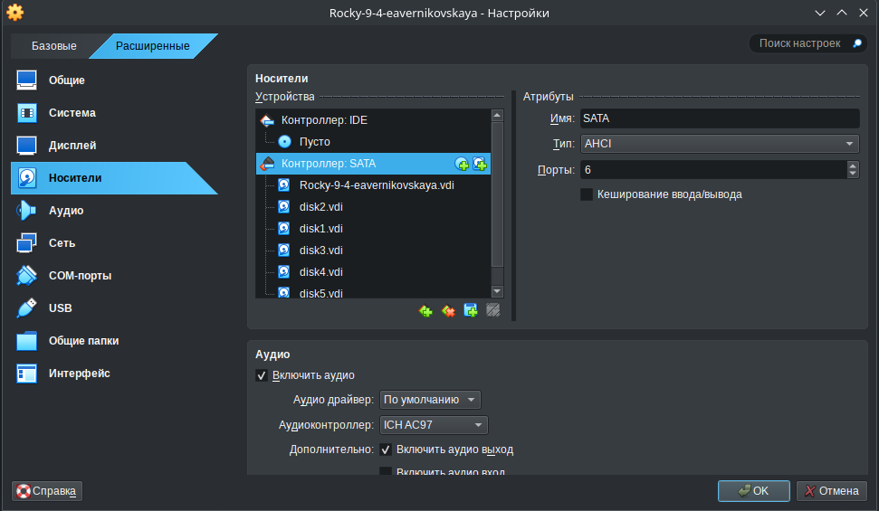{#fig:001 width=70%}

Запускаем терминала и получаем полномочия суперпользователя, используя *su -* (рис. [-@fig:002])

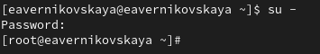{#fig:002 width=70%}

Проверим наличие созданных нами на предыдущем этапе дисков: *fdisk -l | grep /dev/sd*. В системе добавленные диски отображаются как /dev/sdd, /dev/sde, /dev/sdf (рис. [-@fig:003])

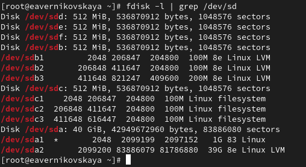{#fig:003 width=70%}

Создадим на каждом из дисков раздел: *sfdisk /dev/sdd <<EOF*, *sfdisk /dev/sde <<EOF* и *sfdisk /dev/sdf <<EOF* (рис. [-@fig:004]), (рис. [-@fig:005]), (рис. [-@fig:006])

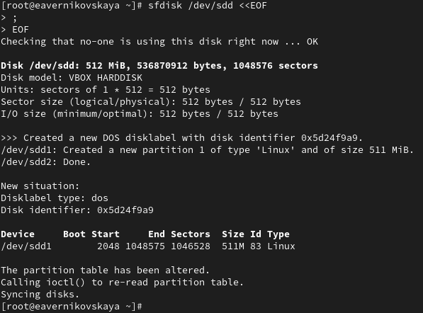{#fig:004 width=70%}

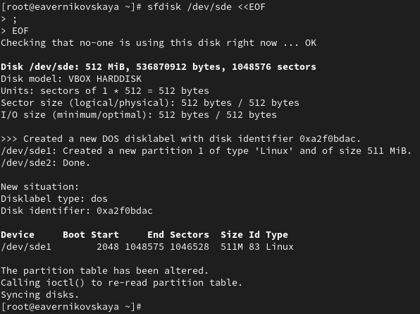{#fig:005 width=70%}

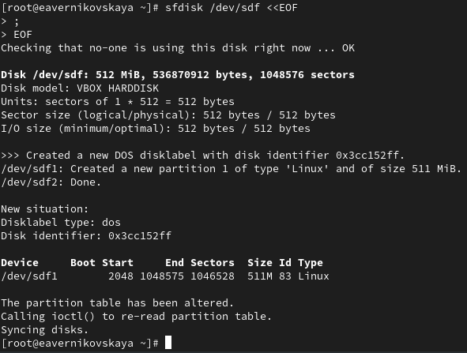{#fig:006 width=70%}

Проверим текущий тип созданных разделов: *sfdisk --print-id /dev/sdd 1*, *sfdisk --print-id /dev/sde 1* и *sfdisk --print-id /dev/sdf 1*. Созданные нами разделы на дисках имеют тип 83 (Linux) (рис. [-@fig:007])

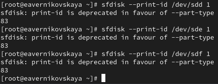{#fig:007 width=70%}

Посмотрим, какие типы партиций, относящиеся к RAID, можно задать: *sfdisk -T | grep -i raid* (рис. [-@fig:008])

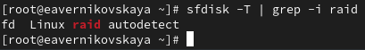{#fig:008 width=70%} 

Установим тип разделов в Linux raid autodetect: *sfdisk --change-id /dev/sdd 1 fd*, *sfdisk --change-id /dev/sde 1 fd* и  *sfdisk --change-id /dev/sdf 1 fd* (рис. [-@fig:009])

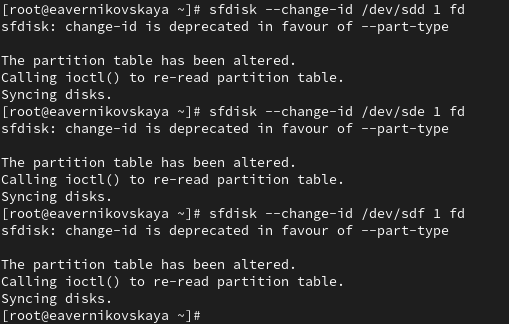{#fig:009 width=70%} 

Посмотрим состояние дисков: *sfdisk -l /dev/sdd*, *sfdisk -l /dev/sde* и  *sfdisk -l /dev/sdf*. Тип разделов изменился на Linux raid autodetect (рис. [-@fig:010])

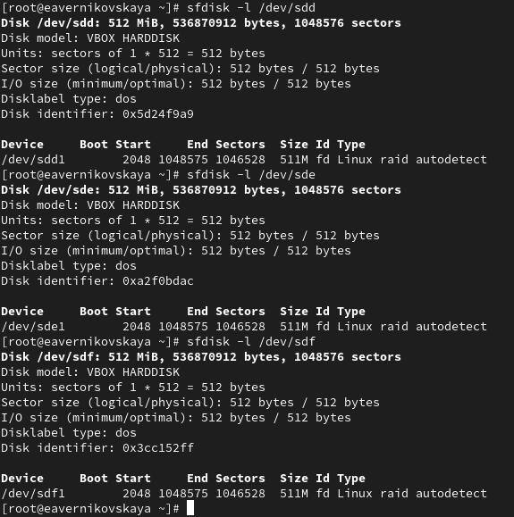{#fig:010 width=70%} 

При помощи утилиты *mdadm* создадим массив RAID 1 из двух дисков: *mdadm --create --verbose /dev/md0 --level=1 --raid-devices=2 /dev/sdd1 /dev/sde1* (рис. [-@fig:011])

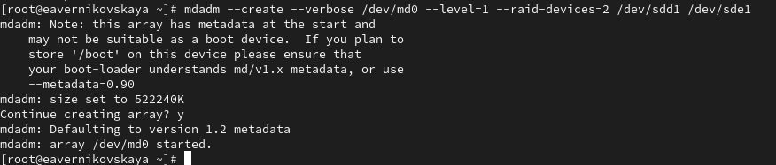{#fig:011 width=70%}

Проверим состояние массива RAID, используя команды *cat /proc/mdstat*, *mdadm --query /dev/md0* и  *mdadm --detail /dev/md0* (рис. [-@fig:012])

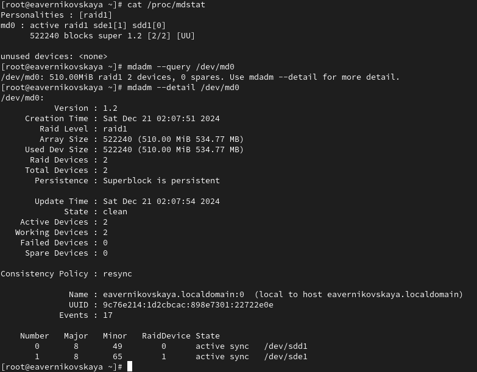{#fig:012 width=70%}

Описание состояния массива:

- Тип массива: RAID 1, состоящий из двух устройств (/dev/sdd1 и /dev/sdel)
- Размер массива: 510.00 MiB, доступно 534.77 MiB
- Статус: Массив находится в чистом состоянии (State = clean), все данные синхронизированы
- Активные устройства: 2 (оба устройства находятся в состоянии синхронизации)
- Проблемы с устройствами: Нет (0 Failed devices)

Создадим файловую систему на RAID: *mkfs.ext4 /dev/md0* (рис. [-@fig:013])

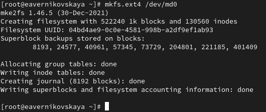{#fig:013 width=70%} 

Подмонтируем RAID: *mkdir /data* и *mount /dev/md0 /data* (рис. [-@fig:014])

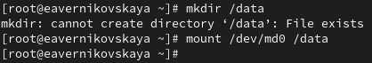{#fig:014 width=70%} 

Далее для автомонтирования добавим запись в /etc/fstab: */dev/md0 /data ext4 defaults 1 2* (рис. [-@fig:015]), (рис. [-@fig:016])

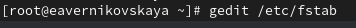{#fig:015 width=70%} 

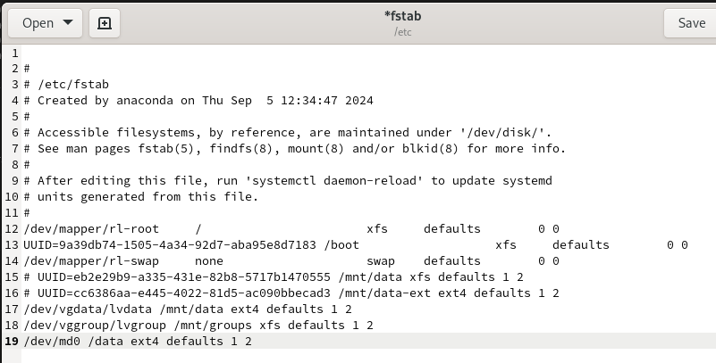{#fig:016 width=70%} 

Сымитируем сбой одного из дисков: *mdadm /dev/md0 --fail /dev/sde1* (рис. [-@fig:017])

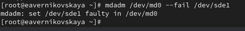{#fig:017 width=70%} 

Удалим сбойный диск: *mdadm /dev/md0 --remove /dev/sde1* (рис. [-@fig:018])

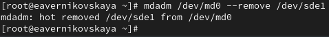{#fig:018 width=70%}

Заменим диск в массиве: *mdadm /dev/md0 --add /dev/sdf1* (рис. [-@fig:019])

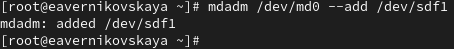{#fig:019 width=70%}

Посмотрим состояние массива (рис. [-@fig:020])

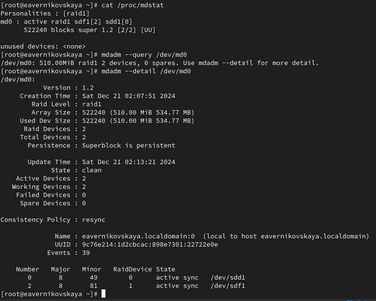{#fig:020 width=70%}

Описание состояния массива:

- Тип массива: RAID 1 с двумя активными устройствами (/dev/sdd1 и /dev/sdf1)
- Размер массива: 510.00 MiB (534.77 MB)
- Статус: Массив находится в чистом состоянии (State = clean), что означает, что все данные синхронизированы и корректны
- Активные устройства: 2, оба находятся в состоянии синхронизации
- Работающие устройства: 2
- Неисправные устройства: 0 (все устройства работают корректно)

Удалим массив и очистим метаданные: *umount /dev/md0*, *mdadm --stop /dev/md0*, *mdadm --zero-superblock /dev/sdd1*, *mdadm --zero-superblock /dev/sde1* и *mdadm --zero-superblock /dev/sdf1* (рис. [-@fig:021])

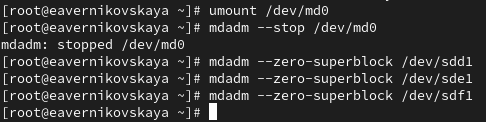{#fig:021 width=70%} 

## RAID-массив с горячим резервом (hotspare)

Создадим массив RAID 1 из двух дисков: *mdadm --create --verbose /dev/md0 --level=1 --raid-devices=2 /dev/sdd1 /dev/sde1* (рис. [-@fig:022])

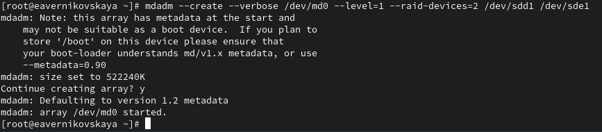{#fig:022 width=70%} 

Добавим третий диск: *mdadm --add /dev/md0 /dev/sdf1* (рис. [-@fig:023])

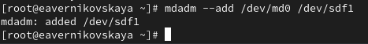{#fig:023 width=70%} 

Подмонтируем /dev/md0 *mount /dev/md0* (рис. [-@fig:024])

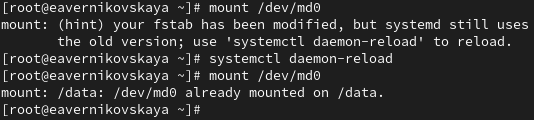{#fig:024 width=70%} 

Проверим состояние массива (рис. [-@fig:025])

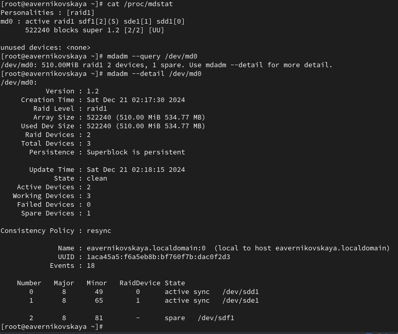{#fig:025 width=70%} 

Описание состояния массива:

- Тип массива: RAID 1 с двумя активными устройствами (/dev/sdd1 и /dev/sdel), одно запасное устройство (/dev/sdf1)
- Размер массива: 510.00 MiB (534.77 MB)
- Статус: Массив находится в чистом состоянии (State = clean), все данные синхронизированы
- Активные устройства: 2, оба в состоянии синхронизации
- Работающие устройства: 2
- Неисправные устройства: 0
- Запасные устройства: 1 (/dev/sdf1)

Сымитируем сбой одного из дисков: *mdadm /dev/md0 --fail /dev/sde1* (рис. [-@fig:026])

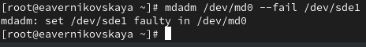{#fig:026 width=70%} 

Проверим состояние массива: *mdadm --detail /dev/md0* (рис. [-@fig:027])

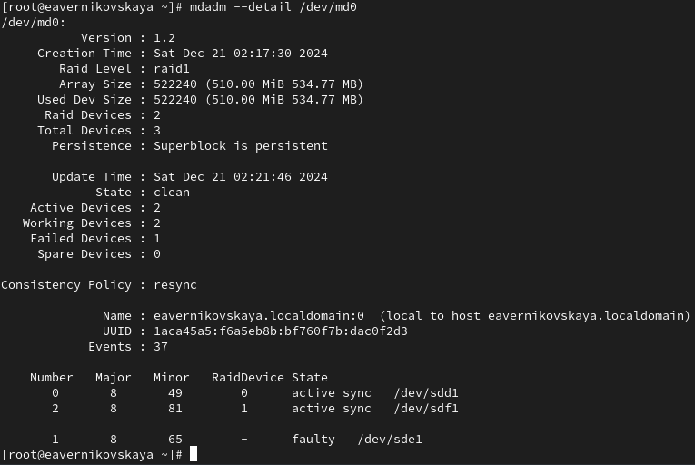{#fig:027 width=70%}

Описание состояния массива:

- Тип массива: RAID 1, состоящий из двух активных устройств (/dev/sdd1 и /dev/sdf1) и одного устройства с ошибкой (/dev/sdel)
- Размер массива: 510.00 MiB (534.77 MB)
- Статус: Массив находится в чистом состоянии (State = clean), однако одно устройство (/dev/sdel) имеет статус "faulty"
- Активные устройства: 2, оба находятся в состоянии синхронизации
- Работающие устройства: 2
- Неисправные устройства: 1 (устройство /dev/sdel)
- Запасные устройства: 0

Удалим массив и очистим метаданные (рис. [-@fig:028])

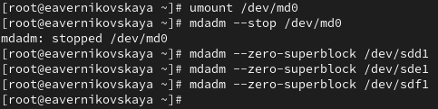{#fig:028 width=70%} 

## Преобразование массива RAID 1 в RAID 5

Создайте массив RAID 1 из двух дисков: *mdadm --create --verbose /dev/md0 --level=1 --raid-devices=2 /dev/sdd1 /dev/sde1* (рис. [-@fig:029])

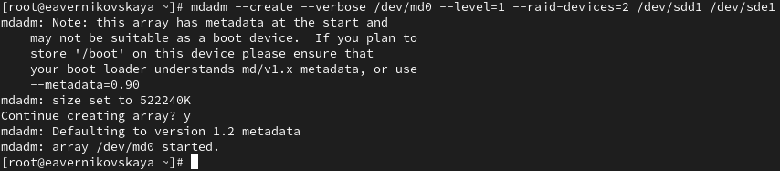{#fig:029 width=70%} 

Добавим третий диск: *mdadm --add /dev/md0 /dev/sdf1* (рис. [-@fig:030])

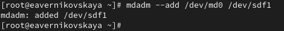{#fig:030 width=70%} 

Подмонтируем /dev/md0 (рис. [-@fig:031])

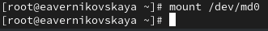{#fig:031 width=70%} 

Проверим  состояние массива (рис. [-@fig:032])

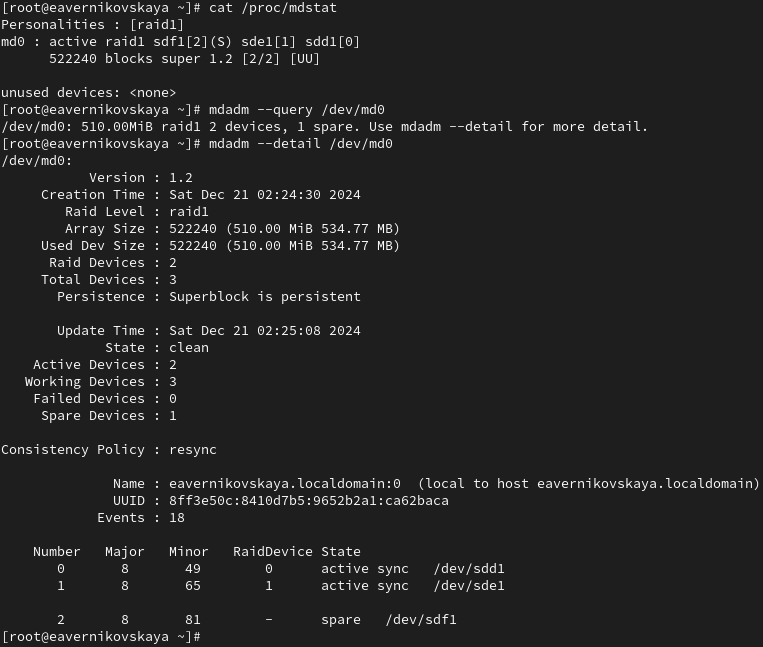{#fig:032 width=70%}

Описание состояния массива:

- Тип массива: RAID 1, содержащий два активных устройства (/dev/sdd1 и /dev/sdel) и одно запасное устройство (/dev/sdf1)
- Размер массива: 510.00 MiB (534.77 MB)
- Статус: Массив находится в чистом состоянии (State = clean), что свидетельствует о том, что данные синхронизированы
- Активные устройства: 2, оба в состоянии синхронизации
- Работающие устройства: 2
- Неисправные устройства: 0
- Запасные устройства: 1 (устройство /dev/sdf1)

Измените тип массива RAID: *mdadm --grow /dev/md0 --level=5* (рис. [-@fig:033])

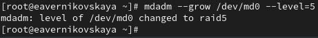{#fig:033 width=70%}

Проверим состояние массива (рис. [-@fig:034])

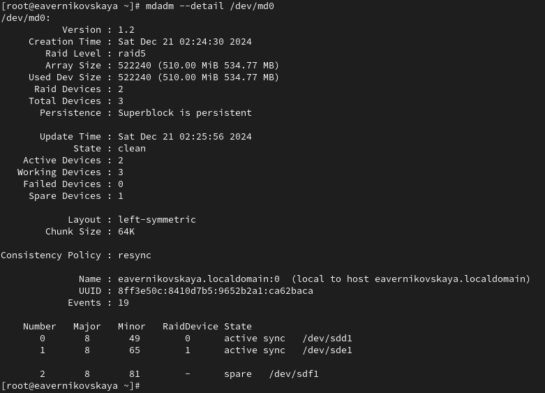{#fig:034 width=70%}

Описание состояния массива:

- Тип массива: RAID 5, состоящий из двух активных устройств (/dev/sdd1 и /dev/sdel) и одного запасного устройства (/dev/sdf1)
- Размер массива: 510.00 MiB (534.77 MB)
- Статус: Массив находится в чистом состоянии (State = clean), что означает, что данные полностью синхронизированы
- Активные устройства: 2, оба в состоянии синхронизации
- Работающие устройства: 3 (включая запасное устройство)
- Неисправные устройства: 0
- Запасные устройства: 1 (/dev/sdf1)

Изменим количество дисков в массиве RAID 5: *mdadm --grow /dev/md0 --raid-devices 3* (рис. [-@fig:035])

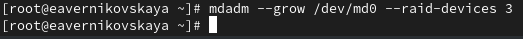{#fig:035 width=70%}

Проверим состояние массива (рис. [-@fig:036])

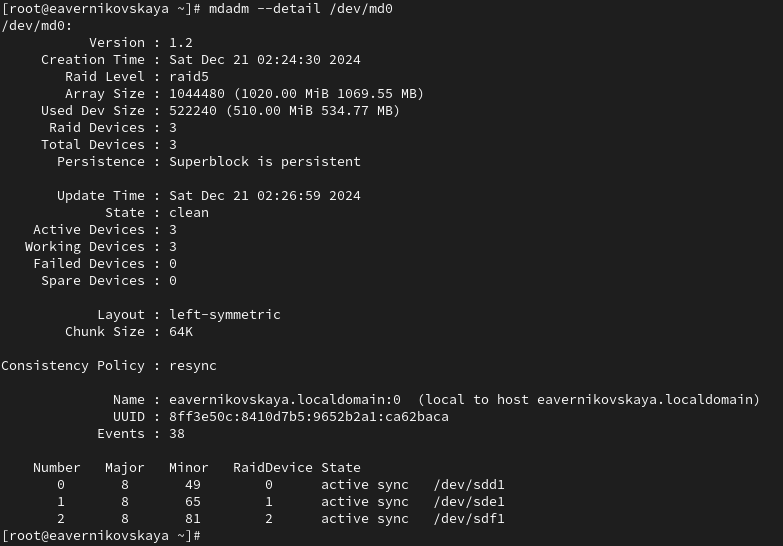{#fig:036 width=70%}

Описание состояния массива:

- Тип массива: RAID 5, состоящий из трех активных устройств (/dev/sdd1, /dev/sdel и /dev/sdf1)
- Размер массива: 1020.00 MiB (1069.55 MB)
- Статус: Массив находится в чистом состоянии (State = clean), что означает, что все данные синхронизированы
- Активные устройства: 3, все находятся в состоянии синхронизации
- Работающие устройства: 3
- Неисправные устройства: 0
- Запасные устройства: 0

Удалим массив и очистим метаданные (рис. [-@fig:037])

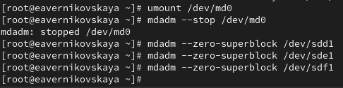{#fig:037 width=70%} 

Закомментируем запись в /etc/fstab: */dev/md0 /data ext4 defaults 1 2* (рис. [-@fig:038]), (рис. [-@fig:039])

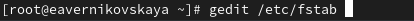{#fig:038 width=70%} 

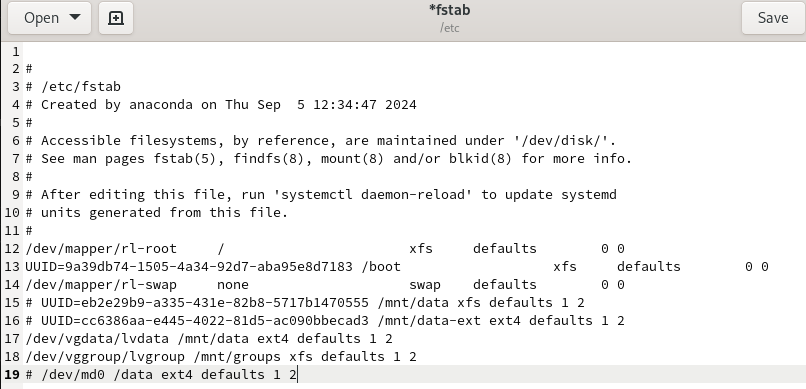{#fig:039 width=70%}  

# Контрольные вопросы + ответы

1. Приведите определение RAID.

Аббревиатура RAID расшифровывается как Redundant Array of Inexpensive Disks (избыточный массив недорогих дисков) или Redundant Array of Independent Disks (избыточный массив независимых дисков)

2. Какие типы RAID-массивов существуют на сегодняшний день?

Основные спецификации RAID-массивов:

- RAID 0 (striping). Чередование. Высокая скорость, но не обеспечивается отказоустойчивость. Поэтому фактически не считается RAID
- RAID 1. Зеркалирование. Каждый диск представляет собой полную копию другого. Минимальное количество дисков — 2
- RAID 2. Использует коды Хемминга для контроля чётности. Минимальное количество дисков — 7
- RAID 3. Один из дисков используется для хранения блоков чётности, остальные — для хранения данных. Данные разбиваются на байты
- RAID 4. Аналогичен RAID 3, но данные при этом разбиваются на блоки (stripes)
- RAID 5. Блоки данных и контрольные суммы записываются на все диски циклично. Для хранения контрольных сумм используется объём одного диска. Минимальное количество дисков при использовании RAID 5 равно трём
- RAID 6. Аналогичен RAID 5. Для хранения контрольных сумм используется объём двух дисков. Основан на кодах Рида–Соломона. Минимальное количество дисков — четыре
- RAID 10. Массив RAID 1, составленный из массивов RAID 0
- RAID 50, RAID 60. Аналог RAID 10, составленного из массивов RAID 5 и RAID 6 соответственно

3. Охарактеризуйте RAID 0, RAID 1, RAID 5, RAID 6, опишите алгоритм работы, назначение, приведите примеры применения.

*RAID 0 (Striping)*

Описание: RAID 0 разбивает данные на "полосы" (stripes) и распределяет их по всем дискам массива. Это позволяет достичь высокой производительности при записи и чтении

Алгоритм работы:

- Данные разбиваются на блоки фиксированного размера (например, 64K) и записываются поочередно на все диски
- Если массив состоит из 4 дисков, то первый блок записывается на первый диск, второй на второй диск и так далее, начиная с первого после достижения конца массива

Назначение: Максимизация производительности и скорости доступа к данным

Примеры применения:

- Игровые компьютеры и рабочие станции, где важна высокая скорость чтения/записи
- Обработчики мультимедийных данных, например, видеоредакторы

*RAID 1 (Mirroring)*

Описание: RAID 1 создает зеркальную копию данных на двух или более дисках. Каждое записанное значение дублируется на всех дисках массива

Алгоритм работы:

- Все данные, записанные на один диск, также записываются на другой диск
- При чтении данные могут считываться с любого из дисков, что увеличивает скорость

Назначение: Обеспечение надежности и защиты данных с минимальными затратами на производительность

Примеры применения:

- Серверы, где критична доступность данных, такие как файловые и веб-серверы
- Дата-центры и системы резервного копирования, где исчезновение данных недопустимо

*RAID 5 (Striped with Parity)*

Описание: RAID 5 использует чередование с распределением контрольной суммы (parity) для защиты данных. Данные и контрольные суммы распределяются по всем дискам, что позволяет восстанавливать данные в случае отказа одного диска

Алгоритм работы:

- Данные разбиваются на блоки и записываются по кругу среди всех дисков
- Для каждого набора данных создается контрольная сумма, которая сохраняется на отдельном диске
- Если диск выходит из строя, данные могут быть восстановлены с использованием контрольной суммы и оставшихся дисков

Назначение: Обеспечение хорошего баланса между производительностью, емкостью и надежностью

Примеры применения:

- Системы хранения данных, где важно и быстрое чтение, и уровень защиты данных, например, в базах данных и файл-серверах

*RAID 6 (Striped with Double Parity)*

Описание: RAID 6 похож на RAID 5, но использует две контрольные суммы для повышения надежности. Это позволяет маскировать сбой сразу двух дисков

Алгоритм работы:

- Данные записываются по тому же принципу, что и в RAID 5, с добавлением второй контрольной суммы, которая также распределяется по дискам
- Таким образом, если два диска выйдут из строя, данные все еще могут быть восстановлены

Назначение: Обеспечение высокой степени надежности даже при отказе нескольких дисков

Примеры применения:

- Важные системы, требующие высокой доступности и защиты данных, такие как банки, компании, работающие с большими данными, и критично важные серверы

# Выводы

В ходе выполнения лабораторной работы мы освоили работу с RAID-массивами при помощи утилиты mdadm

ddfdfkdjfkd

# Список литературы

1. Лаборатораня работа №16 [Электронный ресурс] URL: https://esystem.rudn.ru/pluginfile.php/2400765/mod_resource/content/4/017-mdadm_raid.pdf
