---
## Front matter
lang: ru-RU
title: Доклад
subtitle: Система Syslog и журналы событий в Linux 
author:
  - Верниковская Е. А., НПИбд-01-23
institute:
  - Российский университет дружбы народов, Москва, Россия
date: 21 октября 2024

## i18n babel
babel-lang: russian
babel-otherlangs: english

## Formatting pdf
fontsize: 1pt
toc: false
toc-title: Содержание
slide_level: 2
aspectratio: 169
section-titles: true
theme: metropolis
header-includes:
 - \metroset{progressbar=frametitle,sectionpage=progressbar,numbering=fraction}
 - '\makeatletter'
 - '\beamer@ignorenonframefalse'
 - '\makeatother'

## Fonts
mainfont: PT Serif
romanfont: PT Serif
sansfont: PT Sans
monofont: PT Mono
mainfontoptions: Ligatures=TeX
romanfontoptions: Ligatures=TeX
sansfontoptions: Ligatures=TeX,Scale=MatchLowercase
monofontoptions: Scale=MatchLowercase,Scale=0.9
---

## Докладчик

:::::::::::::: {.columns align=center}
::: {.column width="70%"}

  * Верниковская Екатерина Андреевна
  * Студентка
  * Российский университет дружбы народов
  * [1132236136@pfur.ru](mailto:1132236136@pfur.ru)

:::
::: {.column width="30%"}

:::
::::::::::::::

## Вводная часть 

:::::::::::::: {.columns align=top}
::: {.column width="60%"}
**Актуальность темы и проблема:**
  
  
  cистема Syslog и журналы событий в Linux играют ключевую роль в обеспечении безопасности, мониторинга и диагностики систем. В условиях растущей киберугрозы и возрастающей сложности IT-инфраструктур необходимость в эффективном управлении логами становится особенно актуальной. Syslog позволяет централизованно собирать, хранить и анализировать события, что значительно упрощает администрирование и повышает уровень безопасности
  
:::
::: {.column width="30%"}
**Объект и предмет исследования:**
  
  
  система Syslog и журналы событий в Linux
  
:::
::::::::::::::

## Вводная часть 

:::::::::::::: {.columns align=top}
::: {.column width="30%"}
**Цель:**
  
  
  цель данного доклада - рассмотреть основные принципы работы системы Syslog и функционирование журналов событий в операционной системе Linux
  
:::
::: {.column width="30%"}
**Задачи исследования:**
  
  
  изучить архитектуру системы Syslog и типы журналов событий в Linux
  
:::
::: {.column width="20%"}
**Материалы и методы и инструменты исследования:**
  
  
  интернет-ресурсы, аналитика и практические навыки работы на своей операционной системе Linux (Ubuntu)
:::
::::::::::::::

## Введение

:::::::::::::: {.columns align=top}
::: {.column width="50%"}

В процессе своей работы система отслеживает и сохраняет важные события в файлы журналов, которые помогают в исправлении ошибок и отладке. Эти файлы могут занимать много места, что иногда связано с ошибками системы или некорректной настройкой. Работа с журналами событий — важная задача системного администратора, от которой зависит качество работы системы и её надежность.

:::
::: {.column width="50%"}

:::
::::::::::::::

## Что такое Syslog и зачем он нужен?

:::::::::::::: {.columns align=top}
::: {.column width="40%"}

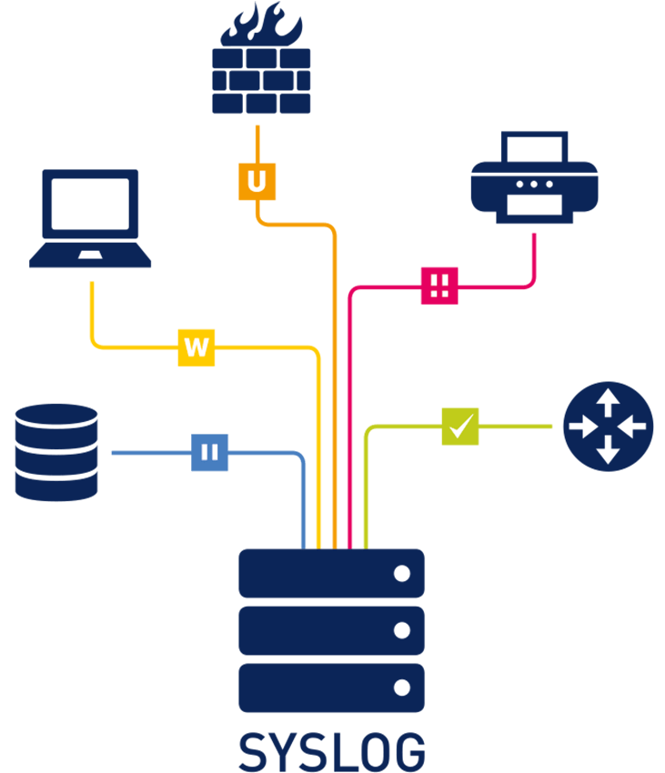

:::
::: {.column width="60%"}

**Syslog (от англ. system log — системный журнал)** — это стандартная система журналирования в операционных системах, включая Linux, регистрирующая события в системе. Позволяет собирать, сохранять и передавать сообщения, генерируемые программами, службами и ядром операционной системы. Помога-
ет администратору отслеживать события, состояния системных служб и выявлять проблемы, возникающие в процессе работы системы.

:::
::::::::::::::

## История и развитие Syslog

:::::::::::::: {.columns align=top}
::: {.column width="65%"}

Syslog был разработан в 1980 году Эриком Оллманом (Eric Allman) как часть проекта Sendmail, и использовался первоначально только для Sendmail. Зарекомендовав себя как стабильное и удобное решение, Syslog был использован и в других приложениях, став стандартом ведения журналов в системах UNIX и
GNU/Linux. Позднее появились реализации и под другие операционные системы.

:::
::: {.column width="35%"}

:::
::::::::::::::

## Протоколы Syslog

Протокол syslog определяет стандарт передачи сообщений журнала между клиентами syslog (отправителями) и серверами syslog (получателями).

:::::::::::::: {.columns align=top}
::: {.column width="50%"}

- UDP (User Datagram Protocol) — это протокол без установления соедине-
ния

:::
::: {.column width="50%"}

- TCP (Transmission Control Protocol) — это протокол, ориентированный
на соединение

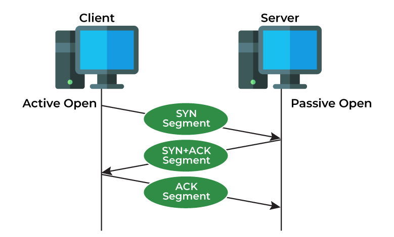

:::
::::::::::::::

## Клиенты и серверы Syslog. Принцип работы Syslog

:::::::::::::: {.columns align=top}
::: {.column width="30%"}

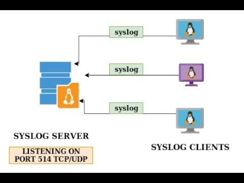

:::
::: {.column width="40%"}

Syslog работает на основе клиент-серверной архитектуры. Клиент syslog отвечает за генерацию сообщений журнала и отправку их на сервер syslog. Сервер syslog получает и сохраняет эти сообщения журнала, делая их доступными для анализа, мониторинга и устранения неполадок.

:::
::: {.column width="20%"}

Принцип работы:

1. Генерация журнала
2. Пересылка журнала
3. Прием журнала
4. Хранение журналов
5. Анализ журнала

:::
::::::::::::::

## Архитектура Syslog

Архитектура Syslog может включать несколько клиентов, которые отправляют логи на центральный сервер (коллектор). Эта базовая конфигурация подходит для небольших инфраструктур. При увеличении числа клиентов или для обеспечения безопасности и отказоустойчивости целесообразно использовать релейную архитектуру. Релей (или релей-агент) выступает промежуточным узлом между клиентами и центральным сервером, куда отправляются логи.

:::::::::::::: {.columns align=top}
::: {.column width="30%"}

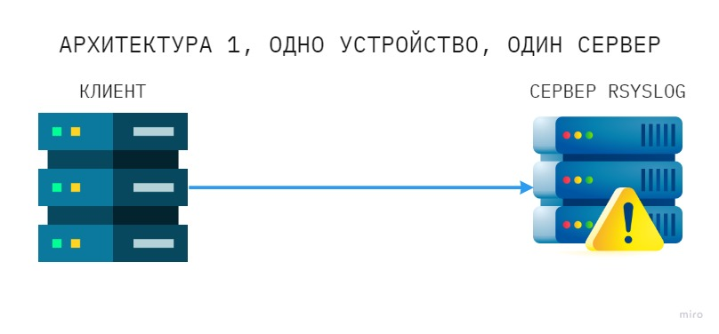

:::
::: {.column width="30%"}

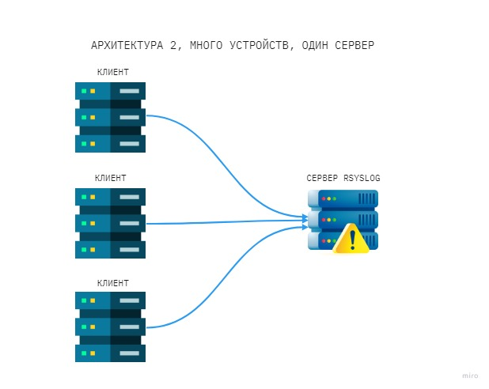

:::
::: {.column width="30%"}

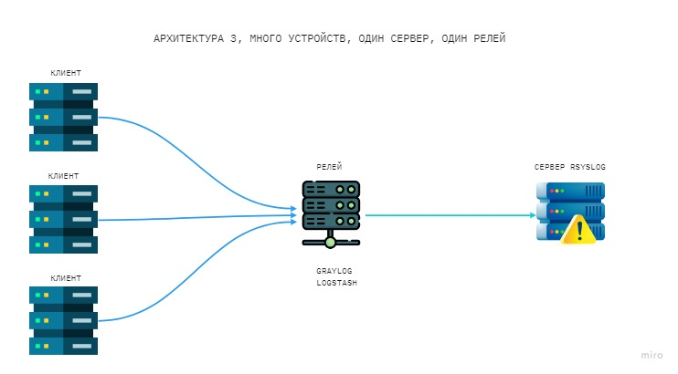

:::
::::::::::::::

## Формат сообщений Syslog

Сообщения syslog следуют определенному формату, который включает несколько компонентов:

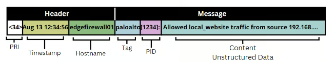

:::::::::::::: {.columns align=center}
::: {.column width="30%"}

*Часть PRI:* там описываются уровни приоритета сообщения. PRI вычисляется по формуле: **PRI = facility * 8 + severity**

:::
::: {.column width="30%"}

*Часть HEADER:* состоит из двух полей – TIMESTAMP и HOSTNAME

:::
::: {.column width="30%"}

*Часть MSG:* содержит информацию о произошедшем событии. Делится на поле TAG и поле CONTENT
  
:::
::::::::::::::

## Формат сообщений Syslog

**Коды объектов (Facility):**

- 0 (kern): Сообщения ядра
- 1 (user): Сообщения, сгенерированные в пространстве пользователя
- 2 (mail): Сообщения, связанные с электронной почтой
- 3 (daemon): Сообщения системного демона
- 4 (auth): Сообщения аутентификации и авторизации
- 5 (syslog): Сообщения, генерируемые самим процессом syslog
- 6 (lpr): Сообщения подсистемы строчного принтера
- 7 (news): Сообщения подсистемы сетевых новостей и т.д

## Формат сообщений Syslog

**Уровни серьёзности (Severity):**

- 0 (Emergency): система не пригодна для использования
- 1 (Alert): необходимо немедленно принять меры
- 2 (Critical): критические условия
- 3 (Error): ошибочные состояния
- 4 (Warning): предупреждающие условия
- 5 (Notice): нормальные, но существенные условия
- 6 (Informational): информационные сообщения
- 7 (Debug): сообщения уровня отладки

## Журналы событий в Linux

:::::::::::::: {.columns align=center}
::: {.column width="30%"}

Все файлы журналов, можно отнести к одной из следующих категорий:

- приложения
- события
- службы
- системный

:::
::: {.column width="70%"}

В Linux существует несколько основных типов журналов событий:

- /var/log/messages или /var/log/syslog
- /var/log/dmesg или /var/log/kern.log
- /var/log/secure
- /var/log/boot.log
- /var/log/maillog
- /var/log/samba
- /var/log/sssd
- /var/log/cups
- /var/log/httpd/
- /var/log/faillog
  
:::
::::::::::::::

## Настройка и использование Syslog

Для настройки Syslog используется файл конфигурации /etc/rsyslog.conf или /etc/syslogd.conf

:::::::::::::: {.columns align=center}
::: {.column width="40%"}

Основные параметры настройки:

- Уровни важности (emerg, alert, crit, err, warning, notice, info, debug)
- Типы сообщений (auth, cron, daemon, mail, user, kern)

:::
::: {.column width="60%"}

Можно настроить локальное и удалённое логирование, а также фильтры и маршрутизацию.

- Фильтрация по уровню сообщений
- Фильтрация по программе
- Маршрутизация на основе тегов
 
:::
::::::::::::::

## Инструменты для работы с журналами. Rsyslog и Syslog-ng

:::::::::::::: {.columns align=center}
::: {.column width="50%"}

В настоящее время для эффективного управления и анализа журналов используются различные инструменты. Два наиболее популярных решения — Rsyslog и Syslog-ng. Они обеспечивают сбор, обработку и отправку системных сообщений, но имеют некоторые ключевые отличия в функциональности и возможностях настройки.

:::
::: {.column width="50%"}

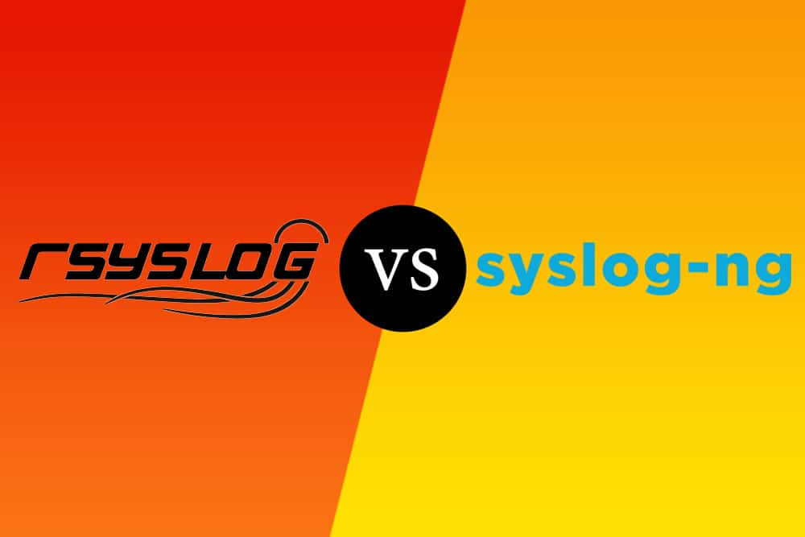
  
:::
::::::::::::::

## Команды для анализа журналов

Для анализа и управления журналами в Linux можно использовать несколько
команд:

- tail: Используется для просмотра последних строк файла журнала.
- grep: Позволяет искать строки, содержащие определенные слова или шаб-
лоны.
- less: Удобный просмотрщик файлов, позволяющий прокручивать и искать
текст.
- cat: Отображает содержимое файла целиком.
- awk и sed: Мощные инструменты для обработки текстовых данных.

## Настройка Syslog на серверах (Linux)

:::::::::::::: {.columns align=center}
::: {.column width="30%"}

Установим Rsyslog (на большинстве дистрибутивов Linux Rsyslog установлен по умолчанию)

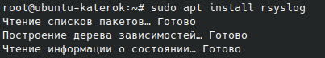

:::
::: {.column width="70%"}

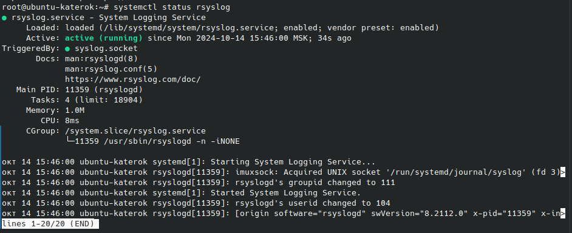
  
:::
::::::::::::::

## Настройка Syslog на серверах (Linux)

:::::::::::::: {.columns align=center}
::: {.column width="50%"}

Проверим, существуют ли какие-то файлы куда записываются логи. Мы видим, что таких файлов не существует.

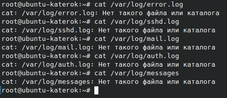

:::
::: {.column width="50%"}

Отредактиркем файл /etc/rsyslog.conf для определения того, какие логи и куда направлять.

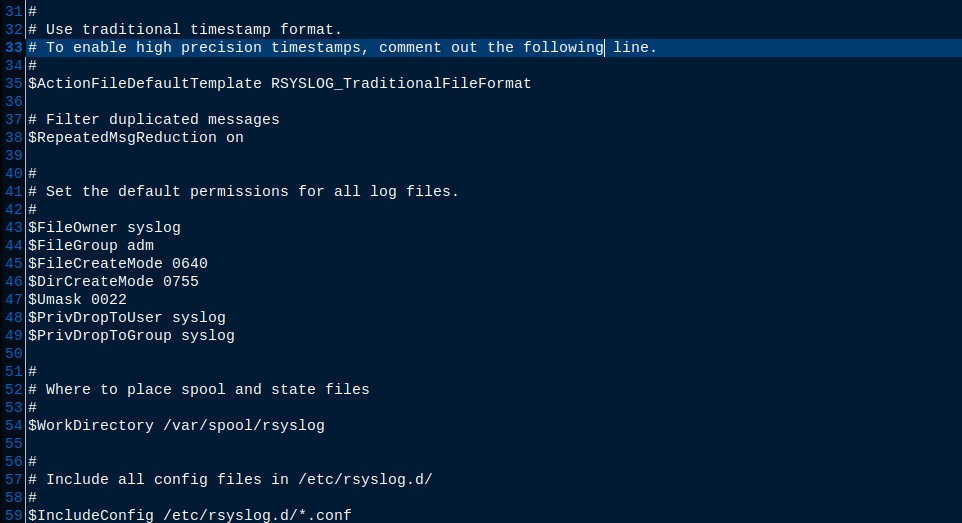
  
:::
:::::::::::::

## Настройка Syslog на серверах (Linux)

**1. Удалённое логирование**

:::::::::::::: {.columns align=center}
::: {.column width="50%"}

- На сервере-получателе: Добавляем строки, чтобы настроить rsyslog принимать удалённые
логи

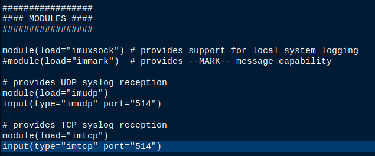

:::
::: {.column width="50%"}

- На сервере-отправителе: Добавляем строки для настройки отправки логов на удалённый сервер
логи

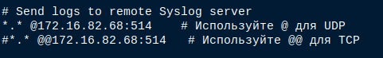

:::
::::::::::::::

## Настройка Syslog на серверах (Linux)

:::::::::::::: {.columns align=center}
::: {.column width="50%"}

**2. Фильтрация по программе:**

Добавим правило, которое перенаправляет все логи, полученные от процесса sshd (сервер SSH) в отдельный файл /var/log/ssh.log:

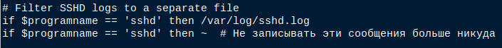

:::
::: {.column width="50%"}

**3. Маршрутизация на основе тегов:**

Настроим фильтр для сортировки логов и их записи в соответствующие файлы. Например, пусть все сообщения с уровнем серьёзности “error” будут записываться в отдельный файл /var/log/error.log. Для этого добавим строки:

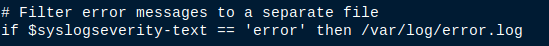

:::
::::::::::::::

## Настройка Syslog на серверах (Linux)

**4. Фильтрация по уровню сообщений:**

И наконец добавим правила, которые перенаправляют логи разных системных служб в отдельные файлы:

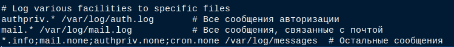

## Настройка Syslog на серверах (Linux)

:::::::::::::: {.columns align=center}
::: {.column width="30%"}

После внесения изменений файла /etc/rsyslog.conf обязательно надо перезапустить службу rsyslog

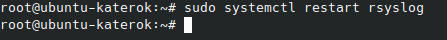

:::
::: {.column width="70%"}

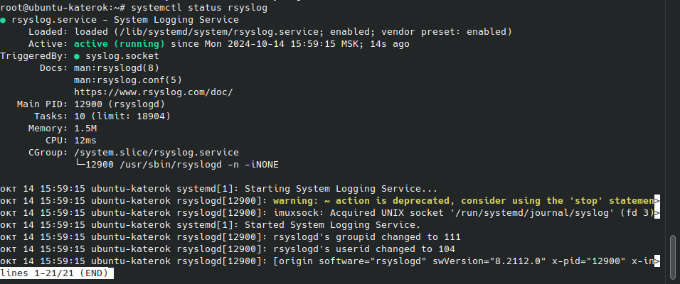
  
:::
::::::::::::::

## Проверка настроек Syslog

Проверим, работают ли настройки Syslog. Для этого сначала создадим тестовое сообщение об ошибке с помощью logger. Теперь мы видим, что создался файл /var/log/error.log куда записываются все сообщения с уровнем серьёзности “error”

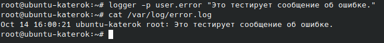

## Проверка настроек Syslog

:::::::::::::: {.columns align=center}
::: {.column width="50%"}

Проверим файл /var/log/sshd.log. Для этого выполним событие, которое будет записано в логи sshd

:::
::: {.column width="50%"}

После мы видим, что создался файл /var/log/sshd.log, в который записываются все логи, полученные от процесса sshd (сервер SSH)

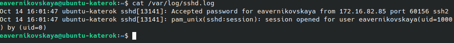
  
:::
::::::::::::::

## Проверка настроек Syslog

Далее проверяем всё остальное

:::::::::::::: {.columns align=center}
::: {.column width="50%"}

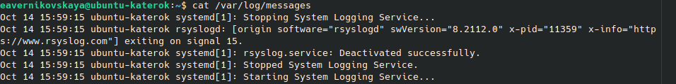

:::
::: {.column width="50%"}

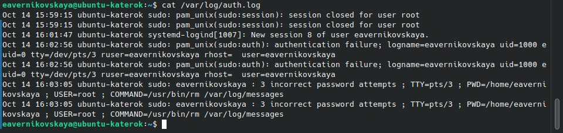
  
:::
::::::::::::::

## Проверка настроек Syslog

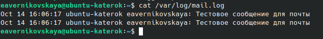

## Практические примеры поиска ошибок и предупреждений

После настройки Syslog, важно уметь анализировать журналы для нахожде-
ния ошибок и предупреждений. Найдём с помощью grep ошибки и предупре-
ждения

:::::::::::::: {.columns align=top}
::: {.column width="50%"}

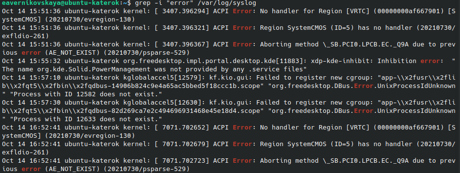

:::
::: {.column width="50%"}

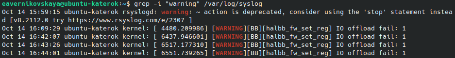

:::
::::::::::::::

## Вывод

:::::::::::::: {.columns align=center}
::: {.column width="70%"}

Syslog — ключевой инструмент для централизованного сбора и анализа системных событий в Linux и других ОС. Его гибкая архитектура поддерживает как локальное, так и удаленное логирование, что упрощает мониторинг в распределенных системах. Использование таких инструментов, как rsyslog и syslog-ng, позволяет настраивать фильтрацию и маршрутизацию логов. Правильная конфигурация Syslog важна для обеспечения безопасности и производительности, что помогает администраторам отслеживать события, выявлять угрозы и устранять сбои.

:::
::: {.column width="30%"}

  
:::
:::::::::::::

## Список литературы{.unnumbered}

1. Система Syslog и журналы логов в Linux. ИТ Проффи, 2023. [Электронный ресурс] URL: https://itproffi.ru/sistema-syslog-i-zhurnaly-logov-v-linux/
2. synergix. Контора пишет - syslog. unix.uz, 2010. [Электронный ресурс] URL: https://unix.uz/articles/tuning/131-kontora-pishet-syslog.html
3. Differences between TCP and UDP. GeeksforGeeks, 2024. [Электронный ресурс] URL: https://www.geeksforgeeks.org/differences-between-tcp-and-udp/
4. What is syslog? sumo logic. [Электронный ресурс] URL: https://www.sumologic.com/syslog/
5. cryptoparty. Syslog : Полное руководство. 2022. [Электронный ресурс] URL: https://itsecforu.ru/
6. Syslog. sematext. [Электронный ресурс] URL: https://sematext.com/glossary/syslog/
7. Просмотр и настройка логов Linux на Ubuntu, Debian и CentOS. beget. [Электронный ресурс] URL: https://beget.com/ru/kb/how-to/vps/prosmotr-i-nastrojka-logov-linux-na-ubuntu-debian-i-centos

