---
## Front matter
title: "Доклад"
subtitle: "Система Syslog и журналы событий в Linux"
author: "Верниковская Екатерина Андреевна"

## Generic otions
lang: ru-RU
toc-title: "Содержание"

## Bibliography
bibliography: bib/cite.bib
csl: pandoc/csl/gost-r-7-0-5-2008-numeric.csl

## Pdf output format
toc: true # Table of contents
toc-depth: 2
lof: true # List of figures
lot: true # List of tables
fontsize: 12pt
linestretch: 1.5
papersize: a4
documentclass: scrreprt
## I18n polyglossia
polyglossia-lang:
  name: russian
  options:
	- spelling=modern
	- babelshorthands=true
polyglossia-otherlangs:
  name: english
## I18n babel
babel-lang: russian
babel-otherlangs: english
## Fonts
mainfont: PT Serif
romanfont: PT Serif
sansfont: PT Sans
monofont: PT Mono
mainfontoptions: Ligatures=TeX
romanfontoptions: Ligatures=TeX
sansfontoptions: Ligatures=TeX,Scale=MatchLowercase
monofontoptions: Scale=MatchLowercase,Scale=0.9
## Biblatex
biblatex: true
biblio-style: "gost-numeric"
biblatexoptions:
  - parentracker=true
  - backend=biber
  - hyperref=auto
  - language=auto
  - autolang=other*
  - citestyle=gost-numeric
## Pandoc-crossref LaTeX customization
figureTitle: "Рис."
tableTitle: "Таблица"
listingTitle: "Листинг"
lofTitle: "Список иллюстраций"
lotTitle: "Список таблиц"
lolTitle: "Листинги"
## Misc options
indent: true
header-includes:
  - \usepackage{indentfirst}
  - \usepackage{float} # keep figures where there are in the text
  - \floatplacement{figure}{H} # keep figures where there are in the text
---

# Вводная часть

**Актуальность темы и проблема:** cистема Syslog и журналы событий в Linux играют ключевую роль в обеспечении безопасности, мониторинга и диагностики систем. В условиях растущей киберугрозы и возрастающей сложности IT-инфраструктур необходимость в эффективном управлении логами становится особенно актуальной. Syslog позволяет централизованно собирать, хранить и анализировать события, что значительно упрощает администрирование и повышает уровень безопасности

**Объект и предмет исследования:** система Syslog и журналы событий в Linux 

**Цель:** цель данного доклада - рассмотреть основные принципы работы системы Syslog и функционирование журналов событий в операционной системе Linux

**Задачи исследования:** изучить архитектуру системы Syslog и типы журналов событий в Linux

**Материалы и методы и инструменты исследования:** интернет-ресурсы, аналитика и практические навыки работы на своей операционной системе Linux (Ubuntu)

# Введение

В процессе своей работы система отслеживает и сохраняет в специальные файлы некоторые события, которые она считает важными или просто нужными для использования в целях исправления и отладки ошибок, сбойных конфигураций и т.д. Файлы, в которых хранятся эти события называются файлами журналов или файлами регистрации. Нередко файлы регистрации занимают слишком много дискового пространства, что может свидетельствовать как о неисправности системы, ошибках конфигураций, так и о просто неправильной настройке демонов регистрации событий, которые отслеживают и собирают всё подряд. Таким образом работа с системой регистрации событий — важная составляющая в работе любого системного администратора, от которой всецело зависит качество обслуживания систем и как следствие — их надёжность и долговечность. [@itproffi] 

## Что такое Syslog и зачем он нужен?

**Syslog (от англ. system log — системный журнал)** — это стандартная система журналирования в операционных системах, включая Linux, регистрирующая события в системе. Позволяет собирать, сохранять и передавать сообщения, генерируемые программами, службами и ядром операционной системы. Помогает администратору отслеживать события, состояния системных служб и выявлять проблемы, возникающие в процессе работы системы.

## История и развитие Syslog

Syslog был разработан в 1980 году Эриком Оллманом (Eric Allman) как часть проекта Sendmail, и использовался первоначально только для Sendmail. Зарекомендовав себя как стабильное и удобное решение, Syslog был использован и в других приложениях, став стандартом ведения журналов в системах UNIX и GNU/Linux. Позднее появились реализации и под другие операционные системы. [@unix.uz]

- 1980-е годы: Syslog сначала использовался только в Sendmail, но вскоре его стабильность и удобство привлекли внимание разработчиков других приложений. Это привело к тому, что он стал стандартом в UNIX-системах для журналирования событий.

- 1990-е годы: Расширение применения Syslog привело к появлению различных реализаций и дополнений, таких как BSD Syslog и другие, что обеспечило поддержку нескольких форматов и уровней логирования.

- 2000-е годы и далее: Syslog продолжал развиваться. Появились версии, соответствующие современным требованиям, включая поддержку сетевого журналирования, новые протоколы (например, RFC 5424) и улучшенные функции безопасности. Современные реализации Syslog поддерживают структурированные данные, что позволяет более точно интерпретировать логи.

Таким образом, Syslog трансформировался из простого механизма журналирования в мощный инструмент для мониторинга и диагностики в различных операционных системах, включая Linux, Windows и другие платформы.

# Система Syslog

## Протоколы Syslog

Протокол syslog определяет стандарт передачи сообщений журнала между клиентами syslog (отправителями) и серверами syslog (получателями). Он определяет формат и структуру сообщений журнала, а также методы их передачи по сети. [@geeksforgeeks]

- **UDP (User Datagram Protocol)** — это протокол без установления соединения, который обеспечивает более высокую производительность, но не гарантирует надежную доставку сообщений журнала. Он обычно используется для syslog из-за своей простоты и эффективности, особенно в средах с высоким трафиком. Реализации syslog в Linux часто используют UDP из-за своей скорости.

- **TCP (Transmission Control Protocol)** — это протокол, ориентированный на соединение, который обеспечивает надежную доставку сообщений журнала путем установления постоянного соединения между клиентом и сервером. Хотя он может быть медленнее UDP, он обеспечивает дополнительную надежность и поддерживает такие функции, как подтверждение и повторная передача сообщений. 

Протокол syslog работает на стандартизированных номерах портов:

- UDP syslog обычно использует порт syslog 514
- TCP syslog обычно использует порт 601 (официально назначенный) или иногда порт 514 (из соображений совместимости)


Важно отметить, что хотя сам протокол syslog стандартизирован, различные реализации (такие как syslogd, rsyslog и syslog-ng) могут вносить дополнительные функции или изменения в форматы сообщений и механизмы передачи.

## Клиенты и серверы Syslog

Syslog работает на основе клиент-серверной архитектуры. Клиент syslog  отвечает за генерацию сообщений журнала и отправку их на сервер syslog. Сервер syslog получает и сохраняет эти сообщения журнала, делая их доступными для анализа, мониторинга и устранения неполадок. [@sumologic]

1. Серверы Syslog

Сервер syslog, также известный как syslog-приемник или syslog-демон, представляет собой централизованную систему управления журналами, которая получает и хранит сообщения журнала из различных источников (syslog-клиентов). Его основные функции включают:

- Прием сообщений по протоколам UDP или TCP
- Фильтрация и маршрутизация сообщений логов в соответствии с установленными правилами
- Хранение логов в файлах для дальнейшего анализа
- Возможность передачи логов на другие серверы для централизации данных (например, для SIEM)
- Поддержка различных форматов выводимых логов для интеграции с другими системами

2. Клиенты Syslog

Клиент syslog, также известный как отправитель syslog или агент syslog, — это программный компонент или приложение, которое генерирует сообщения журнала и отправляет их на назначенный сервер syslog. Клиенты syslog могут быть найдены в различных системах и устройствах, таких как:

- Операционные системы (Linux, Windows, Unix)
- Сетевые устройства (маршрутизаторы, коммутаторы, брандмауэры)
- Приложения и сервисы (веб-серверы, базы данных, облачные сервисы)

Основные функции клиента syslog включают в себя:

- Генерация сообщений логов (например, информации об ошибках, предупреждениях или событиях)
- Отправка сообщений на сервер через протоколы TCP или UDP
- Настройка уровня важности логов (например, отладочные сообщения, предупреждения, ошибки и т.д.)

## Архитектура Syslog

Архитектура Syslog может включать несколько клиентов, формирующих логи, которые по умолчанию отправляют свои сообщения напрямую на центральный коллектор (сервер Syslog). Это базовая конфигурация, которая подходит для небольших инфраструктур. Однако, когда количество клиентов увеличивается, или когда необходимо обеспечить дополнительный уровень безопасности и отказоустойчивости, следует рассмотреть архитектуру с релеями. [@itsecforu]

**Релей (или релей-агент)** в системе логирования Syslog — это компонент, который выступает в качестве промежуточного узла между клиентами, генерирующими логи, и центральным сервером, куда эти логи отправляются.

Основные функции релея:

- *Сбор логов:* Релей принимает логи от нескольких клиентов, что позволяет централизованно управлять данными
- *Агрегация:* Он может объединять сообщения от разных клиентов, уменьшая количество отправок к серверу
- *Кэширование:* Если центральный сервер недоступен, релей может временно сохранять логи и отправлять их после восстановления соединения
- *Безопасность:* Релеи могут использовать шифрование для безопасной передачи логов
- *Гибкая маршрутизация:* Они могут направлять логи на разные серверы в зависимости от их типа или уровня важности

Примеры архитектур:

1. Один клиент и один сервер

Самая простая конфигурация, подходящая для небольших систем, где один логирующий клиент отправляет сообщения прямо на сервер.

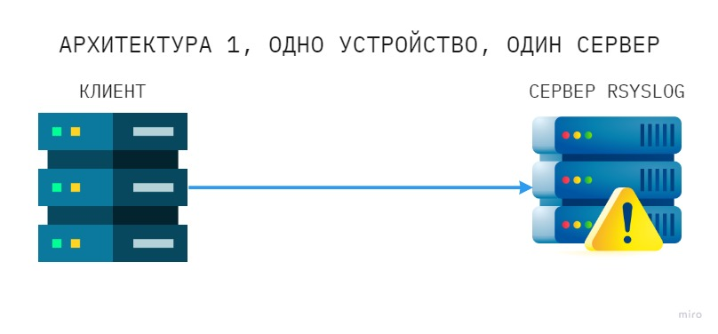

2. Много клиентов и один сервер

Увеличивает масштабируемость и позволяет централизованно накапливать логи от нескольких источников, но может быть уязвима к сбоям.

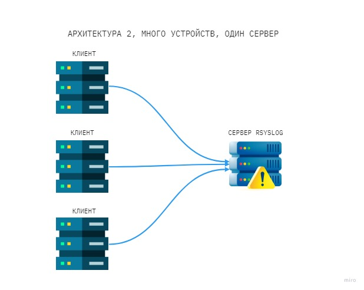

3. Много клиентов, один релей, один сервер

Релей действует как промежуточный узел, собирая логи от множества клиентов и отправляя их на сервер. Это обеспечивает отказоустойчивость, распределение нагрузки и централизованное управление.

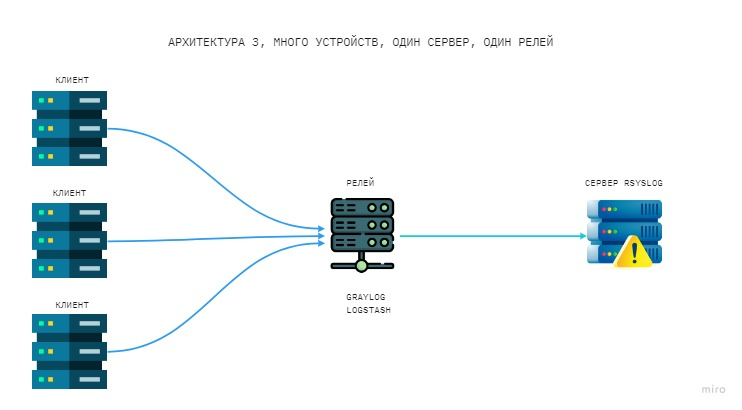

## Принцип работы Syslog

1. Генерация журнала

Приложения, системы и устройства генерируют сообщения журнала на основе предопределенных событий или условий. Эти сообщения журнала обычно включают такие сведения, как дата и время, источник сообщения журнала и описательное сообщение. Формат syslog помогает стандартизировать эти сообщения, упрощая их интерпретацию. [@sematext]

2. Пересылка журнала

Клиент syslog пересылает сообщения журнала на назначенный сервер syslog, используя протокол syslog. Протокол syslog поддерживает как UDP, так и TCP для передачи сообщений, причем TCP обеспечивает надежную доставку, но потенциально более медленную производительность, чем UDP. 

3. Прием журнала

Сервер syslog прослушивает определенный порт (обычно порт 514 для UDP или порт 601 для TCP) и получает сообщения журнала от нескольких клиентов syslog. Правильная настройка порта syslog имеет решающее значение для обеспечения получения сообщений журнала без проблем.

4. Хранение журналов 

Сервер syslog сохраняет полученные сообщения журнала в файле журнала или базе данных, в зависимости от конфигурации и требований сервера. Такие инструменты, как rsyslog и syslog-ng, предлагают расширенные возможности для хранения и обработки журналов, поддерживая как традиционные файлы журналов, так и более сложные бэкэнды хранения.

5. Анализ журнала 

Системные администраторы, аналитики безопасности и автоматизированные инструменты могут получать доступ и анализировать централизованные данные журнала, хранящиеся на сервере syslog, чтобы получать информацию, выявлять проблемы и контролировать поведение системы и приложений. Анализаторы syslog и визуальные серверы syslog могут помочь в визуализации и понимании данных журнала.

## Формат сообщений Syslog

Сообщения syslog следуют определенному формату, который включает несколько компонентов, что упрощает определение источника, серьезности и другой важной информации о зарегистрированном событии. Понимание структуры сообщений syslog имеет решающее значение для эффективного анализа журнала и устранения неполадок. 

Формат syslog делится на три части:

1. *Часть PRI:* в которой подробно описываются уровни приоритета сообщения (от отладочного сообщения до экстренного), а также уровни средств (mail, auth, core);

PRI вычисляется по формуле: **PRI = facility * 8 + severity**

**Facility (коды объектов/категории)** - используются для категоризации источника или типа сообщения журнала и принимают значерия от 0 до 23. Они помогают идентифицировать программное обеспечение или компонент, сгенерировавший запись журнала. Обычные коды объектов syslog включают:

\begin{table}[H]
\centering
\caption{Коды объектов Syslog и их описание}
\label{table:syslog-facility}
\begin{tabular}{|c|c|p{8cm}|}
\hline
\textbf{Код объекта} & \textbf{Ключевое слово} & \textbf{Описание} \\ \hline
0           & kern           & Сообщения ядра \\ \hline
1           & user           & Сообщения, сгенерированные в пространстве пользователя \\ \hline
2           & mail           & Сообщения, связанные с электронной почтой \\ \hline
3           & daemon         & Сообщения системного демона \\ \hline
4           & auth           & Сообщения аутентификации и авторизации \\ \hline
5           & syslog         & Сообщения, генерируемые самим процессом syslog \\ \hline
6           & lpr            & Сообщения подсистемы строчного принтера \\ \hline
7           & news           & Сообщения подсистемы сетевых новостей \\ \hline
8           & uucp           & Сообщения, созданные устаревшей системой UUCP \\ \hline
9           & cron           & Сообщения, генерируемые службой crond \\ \hline
10          & authpriv       & Сообщения аутентификации и авторизации \\ \hline
11          & ftp            & FTP-демон \\ \hline
12          & ntp            & Подсистема NTP \\ \hline
13          & security       & Аудит журнала \\ \hline
14          & console        & Оповещение журнала \\ \hline
15          & solaris-cron   & Планирование демона \\ \hline
16-23       & local0-local7  & Сообщения, генерируемые службами, которые настроены из локальных объектов \\ \hline
\end{tabular}
\end{table}

**Severity (приоритеты/серьёзность)** - сообщениям syslog назначается уровень серьезности syslog, указывающий важность или срочность зарегистрированного события. Уровни серьезности, варьирующиеся от 0 (Emergency) до 7 (Debug):

\begin{table}[H]
\centering
\caption{Уровни серьезности в Syslog}
\label{table:syslog-severity}
\begin{tabular}{|c|c|c|p{8cm}|}
\hline
\textbf{Значение} & \textbf{Серьёзность} & \textbf{Ключевое слово} & \textbf{Описание} \\ \hline
0           & Emergency     & emerg          & система не пригодна для использования \\ \hline
1           & Alert         & alert          & необходимо немедленно принять меры    \\ \hline
2           & Critical      & crit           & критические условия                   \\ \hline
3           & Error         & err            & ошибочные состояния                   \\ \hline
4           & Warning       & warning        & предупреждающие условия               \\ \hline
5           & Notice        & notice         & нормальные, но существенные условия   \\ \hline
6           & Informational & info           & информационные сообщения              \\ \hline
7           & Debug         & debug          & сообщения уровня отладки              \\ \hline
\end{tabular}
\end{table}

2. *Часть HEADER:* состоит из двух полей – *TIMESTAMP* (время, обычно в формате "Feb 6 18:45:01". Согласно RFC 3164, может записываться в формате времени ISO 8601: "2017-02-06T18:45:01.519832+03:00" с большей точностью и с учётом используемой временной зоны) и *HOSTNAME* (имя хоста, сгенерировавшего сообщение);
3. *Часть MSG:* эта часть содержит фактическую информацию о произошедшем событии. Она также делится на поле *TAG* (содержит имя программы, сгенерировавшей сообщение) и поле *CONTENT*

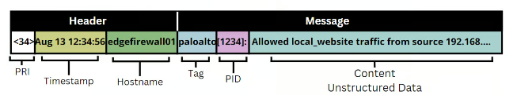

# Журналы событий в Linux

В системах на базе Unix/Linux важное место при администрировании занимает отслеживание системных событий (и в частности возникновение возможных ошибок в процессе настройки каких-то служб) через ведение log-файлов процессов системы. Журналирование системных событий заключается в фиксировании с помощью сокета syslog в лог-файлах сообщений об ошибках и сообщений о состоянии работы практически всех процессов системы. Все файлы журналов, можно отнести к одной из следующих категорий:

- приложения (журналы, генерируемые конкретными приложениями, фиксирующие их работу, ошибки, предупреждения и другую активность)
- события (журналы, фиксирующие конкретные события системы, такие как вход в систему, изменения прав доступа и другие действия, которые могут влиять на безопасность и производительность)
- службы (журналы, относящиеся к работе системных служб или демонов, фиксирующие их активность, состояния и ошибки)
- системный (общие системные журналы, описывающие состояние системы и взаимодействие её компонентов)

## Основные журналы событий в Linux

Большинство же лог файлов содержится в директории **/var/log**. В Linux существует несколько основных типов журналов событий: 

- */var/log/messages или /var/log/syslog* — общий файл журнала, в который записывается большинство сообщений системы с момента запуска системы (наиболее часто используемый файл журнала)
- */var/log/dmesg или /var/log/kern.log* — журнал сообщений ядра системы
- */var/log/secure* — журнал сообщений, связанных с аутентификацией в системе
- */var/log/boot.log* — журнал сообщений, связанных с запуском системы
- */var/log/audit/audit.log* — журнал сообщений аудита (например, в него записываются сообщения SELinux)
- */var/log/maillog* — журналы сообщений, связанных с почтовой службой
- */var/log/samba* — журналы сообщений службы samba (samba по умолчанию не управляется через rsyslogd);
- */var/log/sssd* — журналы сообщений службы sssd
-  */var/log/cups* — журналы службы печати cups
- */var/log/httpd/* — каталог с журналами веб-службы Apache (Apache записывает сообщения в эти файлы напрямую, а не через rsyslog)
- */var/log/faillog* — неудачные попытки входа

# Настройка и использование Syslog

Настройка Syslog позволяет эффективно управлять журналированием событий в системе. Основным компонентом для этого является файл конфигурации, где указываются правила фильтрации и маршрутизации сообщений. [@beget]

## Конфигурация Syslog
 
Для настройки Syslog используется файл конфигурации, который может находиться в одном из следующих путей: 

- Для rsyslog: /etc/rsyslog.conf
- Для syslogd: /etc/syslogd.conf

и /etc/syslog.conf для более старых версий

В этом файле описываются правила и фильтры, определяющие, какие события записывать в лог-файлы, куда их отправлять и как обрабатывать.

## Основные параметры настройки

Основные параметры настройки Syslog, особенно в контексте rsyslog, включают в себя несколько ключевых элементов, которые позволяют гибко управлять логированием в системе.

В файле конфигурации можно настроить следующие параметры: 

1. Уровни важности:

- *emerg:* экстренные ситуации, система не может функционировать
- *alert:* необходимо немедленное вмешательство
- *crit:* критические ошибки
- *err:* ошибки
- *warning:* предупреждения
- *notice:* сообщения, которые не являются ошибками, но требуют внимания
- *info:* информационные сообщения
- *debug:* отладочная информация

2. Типы сообщений:

- *auth:* сообщения аутентификации.
- *cron:* сообщения планировщика задач.
- *daemon:* системные демоны.
- *mail:* почтовые службы.
- *user:* пользовательские программы.
- *kern:* сообщения ядра операционной системы.

## Настройка локального и удаленного логирования

Логирование является одной из ключевых операций в системном администрировании, позволяя отслеживать события, производить аудит и устранять неполадки. В современных системах важно не только локальное логирование, но и централизованное удаленное логирование, которое облегчает анализ данных и способствует повышению безопасности.

Локальное логирование подразумевает, что сообщения о событиях сохраняются непосредственно на сервере. Для этого чаще всего используется системный демон, такой как rsyslog или syslog-ng.

Удаленное логирование обеспечивает централизованное хранение логов с нескольких серверов, что упрощает их анализ и ведение учета. На стороне удаленного сервера необходимо убедиться в том, что он настроен на прием логов, добавив соответствующие записи в rsyslog.conf.

## Настройки фильтров и маршрутизации

Фильтрация и маршрутизация логов — это ключевые аспекты эффективного управления журналами в системах логирования, таких как Rsyslog и Syslog-ng. Настройка фильтров и маршрутизации позволяет системным администраторам контролировать, какие сообщения записываются, куда они отправляются и как обрабатываются.

Фильтрация — это процесс отбора только тех сообщений, которые соответствуют определённым критериям, позволяющий избегать хранения ненужных или маловажных логов.

Маршрутизация — это процесс отправки выбранных логов в определенные файлы или на удалённые серверы, в зависимости от заданных правил.

Примеры:

- Фильтрация по уровню сообщений
- Фильтрация по программе
- Маршрутизация на основе тегов

# Инструменты для работы с журналами

В настоящее время для эффективного управления и анализа журналов используются различные инструменты. Два наиболее популярных решения — Rsyslog и Syslog-ng. Они обеспечивают сбор, обработку и отправку системных сообщений, но имеют некоторые ключевые отличия в функциональности и возможностях настройки.

## Rsyslog и Syslog-ng

Rsyslog и Syslog-ng — это два популярных инструмента для управления системными логами, которые предлагают расширенные возможности по сравнению с традиционным syslog.

**Rsyslog** — это стандартный инструмент для ведения логов в большинстве дистрибутивов Linux. Он предлагает простоту настройки и мощные функции для сбора и обработки логов. Среди его ключевых особенностей — поддержка протоколов TCP и UDP, модульная архитектура и возможность фильтрации и маршрутизации сообщений.

- Поддерживает различные модули для обработки логов (например, для работы с базами данных, удаленными серверами и т.д.)
-  Позволяет настраивать фильтрацию и маршрутизацию сообщений
- Поддерживает различные форматы журналов, включая JSON

В то время как Rsyslog отлично подходит для базовых задач по ведению логов, **Syslog-ng** предлагает более широкие возможности для сложных сценариев. Он отличается более гибкой архитектурой и широким спектром дополнительных функций, таких как поддержка различных источников данных и продвинутая фильтрация сообщений. Эти возможности делают Syslog-ng идеальным выбором для более сложных и многогранных окружений.

- Обеспечивает более гибкую архитектуру, позволяя интегрировать данные из различных источников (например, базы данных, сетевые устройства)
- Поддерживает работу с протоколами TLS для безопасной передачи логов
- Предлагает расширенные функции фильтрации и форматирования сообщений

## Команды для анализа журналов

После настройки инструментов для сбора логов, следующем важным шагом становится их анализ. Для этого существует множество команд, которые позволяют фильтровать, обрабатывать и анализировать сообщения из журналов. Для анализа и управления журналами в Linux можно использовать несколько команд:

- *tail:* Используется для просмотра последних строк файла журнала.
- *grep:* Позволяет искать строки, содержащие определенные слова или шаблоны.
- *less:* Удобный просмотрщик файлов, позволяющий прокручивать и искать текст.
- *cat:* Отображает содержимое файла целиком.
- *awk и sed:* Мощные инструменты для обработки текстовых данных.

# Практическое применение и анализ журналов

Настроим syslog на Linux(Ubuntu 22.04).

## Настройка Syslog на серверах (Linux)

Установим Rsyslog (на большинстве дистрибутивов Linux Rsyslog установлен по умолчанию). 

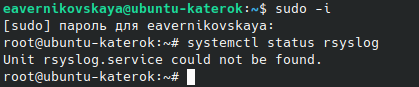

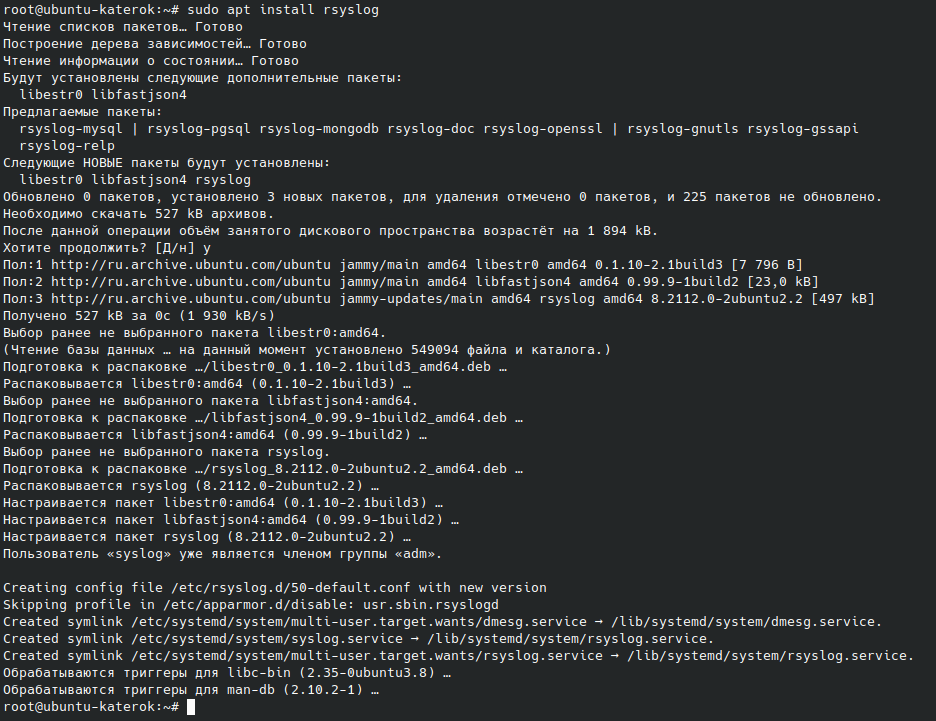

Проверим статус службы и убедимся, что она запущена.

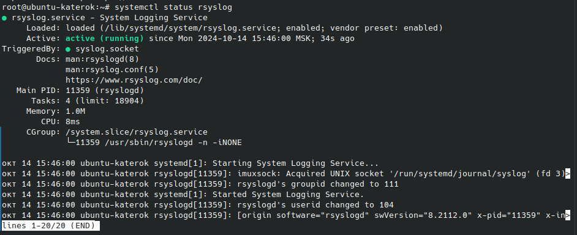

Проверим, существуют ли какие-то файлы куда записываются логи.

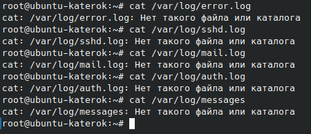

Мы видим, что таких файлов не существует. Далее отредактиркем файл */etc/rsyslog.conf* для определения того, какие логи и куда направлять.

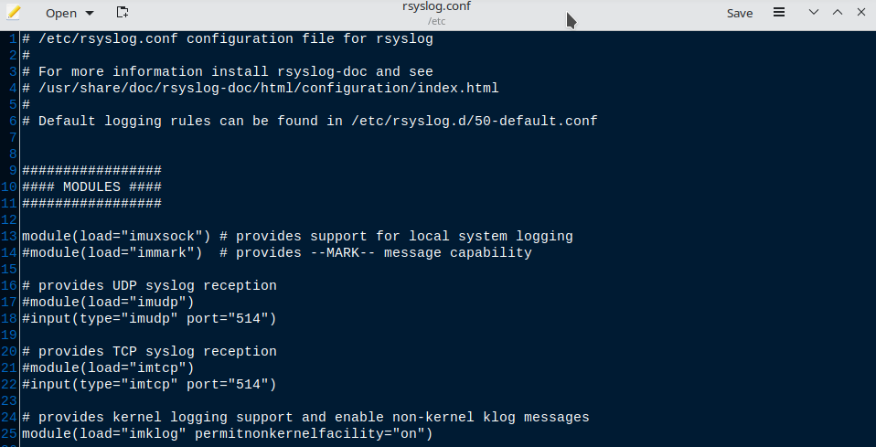

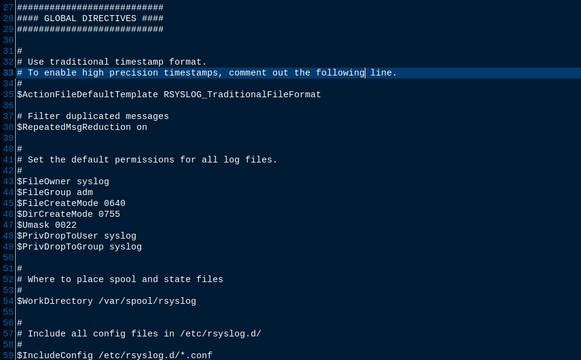

1. Удалённое логирование:
 
- На сервере-получателе:

Добавляем следующие строки, чтобы настроить rsyslog принимать удалённые логи:

```
module(load="imudp")  # Для UDP
input(type="imudp" port="514")
module(load="imtcp")  # Для TCP
input(type="imtcp" port="514")
```

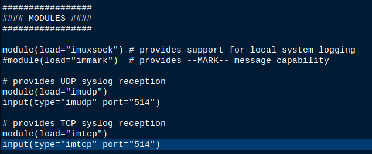

- На сервере-отправителе:

Добавляем строки для настройки отправки логов на удалённый сервер:

```
*.* @remote-server-ip:514  # Для UDP
*.* @@remote-server-ip:514  # Для TCP
```

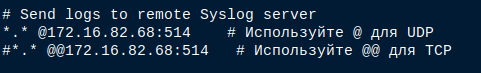

2. Фильтрация по программе:

Добавим правило, которое перенаправляет все логи, полученные от процесса sshd (сервер SSH) в отдельный файл */var/log/ssh.log*:

```
if $programname == 'sshd' then /var/log/secure
if $programname == 'sshd' then ~ 
```

- if $programname == 'sshd': это условие, которое определяет, какие лог-события будут затронуты правилом
  * $programname - это переменная rsyslog, содержащая имя процесса, который генерирует лог-событие. Условие проверяет, равно ли имя процесса 'sshd'
- then /var/log/ssh.log: это действие, выполняемое в случае выполнения условия. Лог-события, удовлетворяющие условию, будут записаны в файл /var/log/ssh.log
- then ~ : это действие останавливает дальнейшую обработку лог-событий, удовлетворяющих условию. После записи в /var/log/ssh.log эти события больше не будут обрабатываться другими правилами в rsyslog.conf

Таким образом это правило гарантирует, что все логи от SSH-сервера будут собраны в отдельном файле, упрощая их анализ и отслеживание.

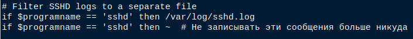

3. Маршрутизация на основе тегов:

Настроим фильтр для сортировки логов и их записи в соответствующие файлы. Например, пусть все сообщения с уровнем серьёзности "error" будут записываться в отдельный файл */var/log/error.log*. Для этого добавим строки:

```
if $syslogseverity-text == 'error' then /var/log/error.log
```

- if $syslogseverity-text == 'error': это условие, которое определяет, какие лог-события будут затронуты правилом
  * $syslogseverity-text - это переменная rsyslog, содержащая текстовое описание уровня серьезности лог-события
  * Условие проверяет, равно ли значение переменной 'error'.
- then /var/log/error.log: это действие, выполняемое при выполнении условия. Лог-события, удовлетворяющие условию (имеющие уровень серьезности "error"), будут записаны в файл /var/log/error.log

Это позволяет централизованно собирать все сообщения об ошибках в отдельный файл, упрощая анализ и отслеживание проблем.

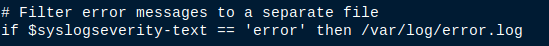

4. Фильтрация по уровню сообщений:

И наконец добавим правила, которые перенаправляют логи разных системных служб в отдельные файлы:

```
# Log various facilities to specific files 
authpriv.* /var/log/auth.log       # Все сообщения авторизации 
mail.* /var/log/mail.log           # Все сообщения, связанные с почтой 
*.info;mail.none;authpriv.none;cron.none /var/log/messages  # Остальные сообщения
```

- authpriv.* /var/log/auth.log: это правило перенаправляет все сообщения, относящиеся к авторизации (facility authpriv), в файл /var/log/auth.log
  * authpriv.*: соответствует всем лог-событиям, относящимся к authpriv
  * /var/log/auth.log: путь к файлу, куда будут записаны события
- mail.* /var/log/mail.log: это правило перенаправляет все сообщения, связанные с почтой (facility mail), в файл /var/log/mail.log 
  * mail.*: соответствует всем лог-событиям, относящимся к mail
  * /var/log/mail.log: путь к файлу, куда будут записаны события
- *.info;mail.none;authpriv.none;cron.none /var/log/messages: это правило перенаправляет все сообщения с уровнем серьезности info и выше, кроме тех, которые относятся к mail, authpriv, cron, в файл /var/log/messages
  * *.info: соответствует всем сообщениям с уровнем серьезности info и выше
  * mail.none: исключает все сообщения, относящиеся к mail
  * authpriv.none: исключает все сообщения, относящиеся к authpriv
  * cron.none: исключает все сообщения, относящиеся к cron
  * /var/log/messages: путь к файлу, куда будут записаны события
 
В итоге, эти правила разделяют логи разных системных служб на отдельные файлы, что облегчает анализ и отслеживание событий.

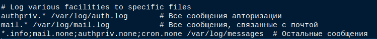

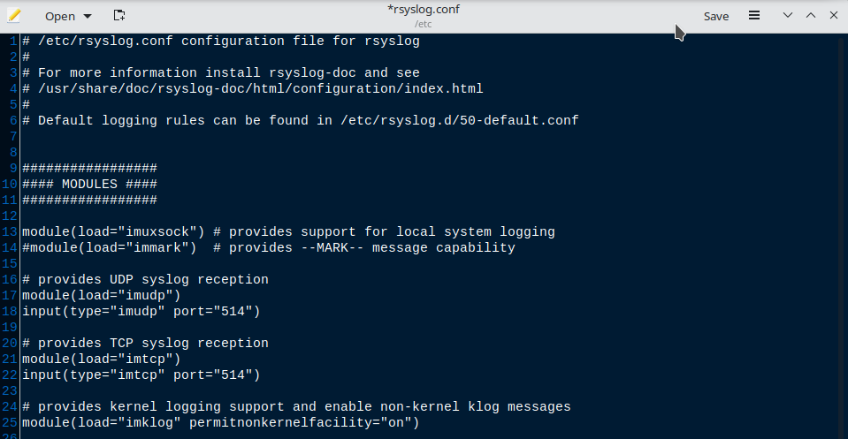

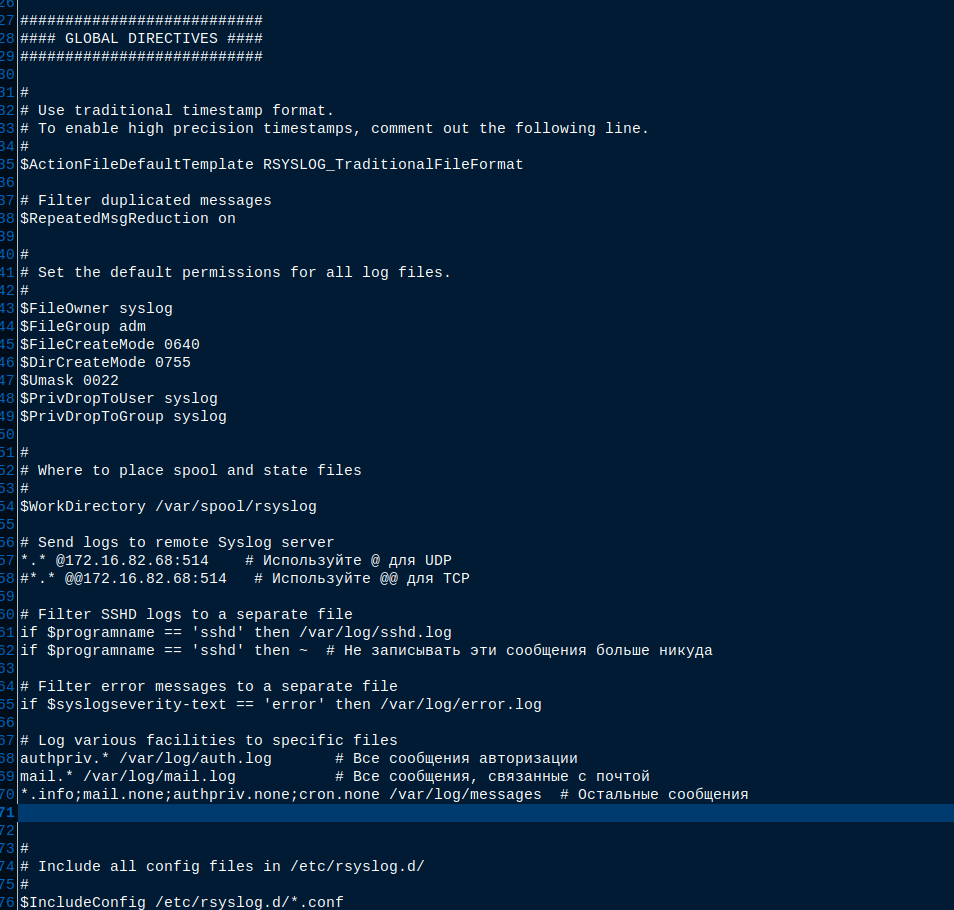

После внесения изменений файла */etc/rsyslog.conf* перезапустим службу rsyslog и снова проверим её статус

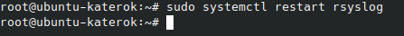

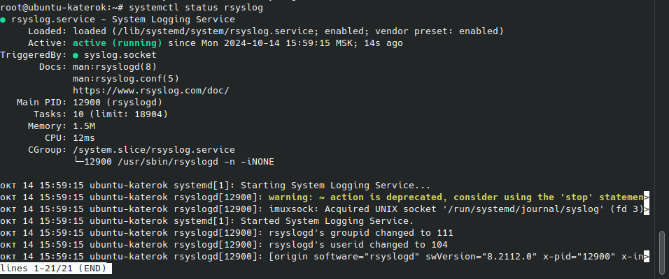

## Проверка настроек Syslog

Проверим, работают ли настройки Syslog. Для этого сначала создадим тестовое сообщение об ошибке с помощью logger. Теперь мы видим, что создался файл */var/log/error.log* куда записываются все сообщения с уровнем серьёзности "error"

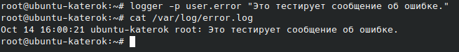

Также проверим файл */var/log/sshd.log*. Для этого выполним событие, которое будет записано в логи sshd. Например, выполним вход на сервер с помощью SSH: ssh наш_пользователь@наш_сервер

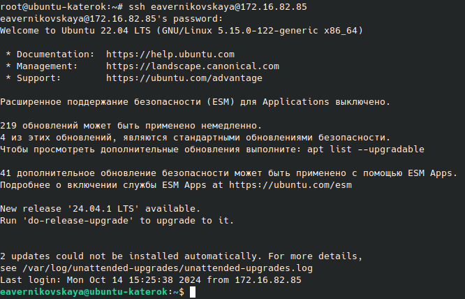

После мы видим, что создался файл */var/log/sshd.log*, в который записываются все логи, полученные от процесса sshd (сервер SSH)


Далее проверяем всё остальное 

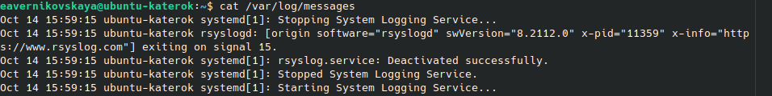

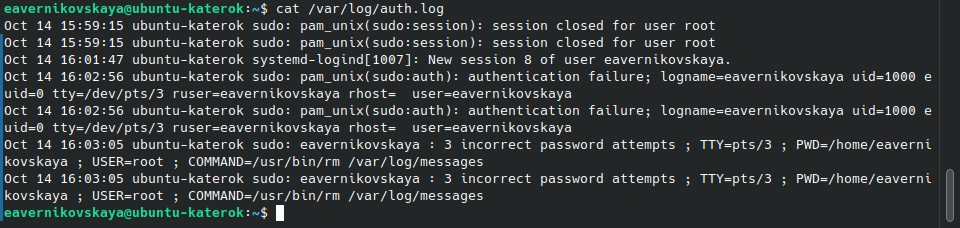

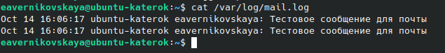

## Практические примеры поиска ошибок и предупреждений

После настройки Syslog, важно уметь анализировать журналы для нахождения ошибок и предупреждений. Найдём с помощью grep ошибки и предупреждения 

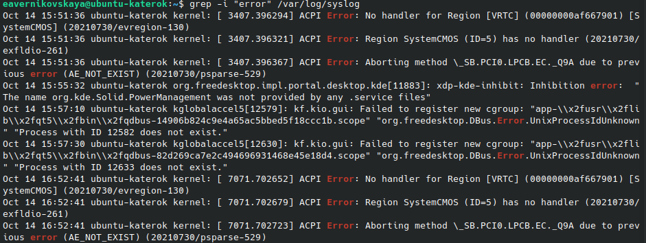

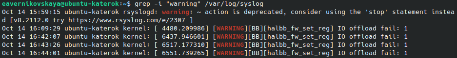

# Выводы

Таким образом, Syslog — это важный инструмент для централизованного сбора, хранения и анализа системных событий в Linux и других операционных системах. Благодаря гибкой архитектуре, он позволяет настраивать как локальное, так и удаленное логирование, что облегчает мониторинг и управление системами в распределенных инфраструктурах. Инструменты, такие как *rsyslog* и *syslog-ng*, предоставляют дополнительные возможности для фильтрации и маршрутизации данных.

Важным аспектом использования Syslog является правильная конфигурация системы для обеспечения безопасности и производительности. Это позволяет администраторам эффективно отслеживать незапланированные события, выявлять угрозы и устранять сбои в работе системы. Настроенная система логирования помогает анализировать состояние серверов, повышая их надежность и оптимизируя работу инфраструктуры.

Кроме того, современные инструменты для анализа логов дают возможность предсказывать возможные сбои и улучшать общую безопасность. Использование Syslog в сочетании с мощными инструментами мониторинга и анализа помогает повысить защищенность инфраструктуры, а также оптимизировать её работу, что делает его незаменимым элементом в современной IT-среде.

# Список литературы{.unnumbered}

::: {#refs}
::: 
